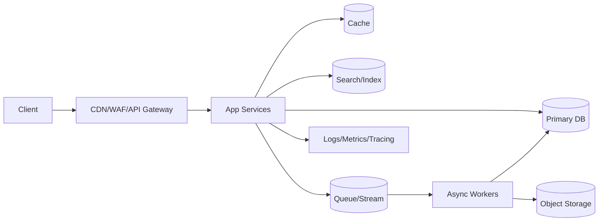

# System Design Cheatsheet (Expert-Level, 80/20 Coverage)

If you internalize this cheatsheet, you’ll cover the majority of real-world system design discussions and interview expectations.

This is not “what is a load balancer” material. This is the stuff that decides whether your system survives its first incident.

---

## 0) The One-Minute Mental Model

System design is **trade-offs under constraints**.

In every design, you are balancing:
- **Correctness** (consistency, integrity, invariants)
- **Latency** (p50 vs p99/p999)
- **Throughput** (QPS, write amplification)
- **Availability** (degradation vs outage)
- **Cost** (compute, storage, bandwidth, operational load)
- **Operability** (deploy, debug, rollback, migrate)

If you can answer these 8 questions, you’re already “senior” in system design:
1. What’s the **SLO** (p99 latency, error rate, availability)?
2. What’s the **peak** (traffic, fanout, burstiness) and **growth curve**?
3. What’s the **data model** (entities + access patterns + invariants)?
4. Where do we need **strong consistency** vs **eventual**?
5. What are the **hot keys / skew / supernodes**?
6. What is the **blast radius** of a dependency failure?
7. What’s the **backpressure strategy**?
8. How do we **migrate** without downtime?

---

## 1) First 10 Minutes: Frame the Problem Like an Architect

### Workload profile (write this down)
- Read/write ratio (e.g., 90/10)
- Data size and growth (GB/day, records/day)
- Access patterns (by user, by time, by geo)
- Latency target (p99, not average)
- Consistency requirements (what must never be wrong?)
- Fanout patterns (celebrity problem, multi-tenant whales)

### “Constraints-first” checklist
- **Regulatory**: PII, retention, deletion, audit
- **Geo**: single-region vs multi-region active/active
- **Failure domains**: zone, region, provider
- **Budget**: infra cost and headcount (operations is expensive)

---

## 2) Core Building Blocks (The Standard Toolkit)

### The canonical shape of modern systems

### A useful classification
- **Serving path**: must meet p99 latency (API + cache + DB reads)
- **Write path**: must preserve invariants (validation + idempotency + durability)
- **Async path**: absorbs burst, isolates failures (queues/streams + workers)
- **Control plane**: config, deploys, migrations, feature flags

---

## 3) Data: Model First, Then Pick Storage

### Data model cheatsheet
Write down:
- Entities: User, Post, Order, Payment, Session
- Relationships: 1:1, 1:N, N:N
- Queries: “get timeline”, “search”, “recent orders”, “by tenant”, “by time range”
- Invariants: “no double charge”, “unique username”, “inventory never negative”

### Storage selection (fast heuristics)
| Need | Usually pick | Why |
|---|---|---|
| Strong transactions + joins | Relational DB | Constraints + indexes + mature tooling |
| Massive scale key lookups | Key-value store | Predictable latency, partition-friendly |
| Time range analytics | Columnar / OLAP | Compression + scans |
| Flexible documents | Document DB | Schema evolution + nested objects |
| Full-text search | Search engine | Inverted index + ranking |
| Large blobs | Object storage | Cheap, scalable, CDN-friendly |
| Events as source of truth | Log/stream + consumers | Replay + decoupling |

### War story rule
If you don’t know your access patterns, **don’t design your sharding key**.

---

## 4) Consistency: Decide What Must Be True

### Think in invariants
Examples:
- Payments: “charge exactly once” (or “at most once + reconciliation”)
- Inventory: “stock never negative”
- Usernames: “unique globally”

### CAP/PACELC (use it correctly)
- Under a partition: choose **Consistency (CP)** or **Availability (AP)**
- Else: choose **Latency (EL)** or **Consistency (EC)**

### Consistency patterns you actually use
| Problem | Pattern | Notes |
|---|---|---|
| Cross-service transaction | Saga | Compensations + idempotency |
| Reliable side effects | Outbox + CDC | Prevents “DB commit but event lost” |
| Ordering | Partition by key | One key → one ordered stream |
| Concurrency control | Optimistic (version) | Most scalable default |
| Duplicate requests | Idempotency key | Mandatory for retries |

**Default stance:** strong consistency only where invariants demand it; eventual consistency everywhere else.

---

## 5) Caching: The Fast Path and the Failure Path

### What caching is really for
- Reduce read load
- Reduce tail latency
- Provide graceful degradation when DB is struggling

### Common cache patterns
| Pattern | When | Risk |
|---|---|---|
| Cache-aside | Default | Stampede on miss |
| Read-through | Platform-controlled | Latency spikes on backend |
| Write-through | Need immediate cache consistency | Higher write latency |
| Write-behind | High write throughput | Data loss if not durable |
| Refresh-ahead | Predictable hot keys | Complexity |

### Cache failure playbook
- **Stampede**: jitter TTL + request coalescing
- **Cold start**: warm top keys, or degrade to stale
- **Stale tolerance**: stale-while-revalidate (serve stale, refresh async)

---

## 6) Scale: Partitioning, Sharding, and Hot Keys

### Sharding key rules
Your sharding key must:
- Match the dominant access pattern
- Avoid hot partitions (skew)
- Be stable over time (or have a re-sharding plan)

### Patterns that fix real problems
| Problem | Fix | Notes |
|---|---|---|
| Hot key / celebrity user | Hybrid fanout | Push for normal, pull for supernodes |
| Tenant whale | Virtual shards | Split one tenant across buckets |
| Time-based hotspot | Hash prefix + time | Or use LSM-friendly stores |
| Uneven load | Consistent hashing | Helps smooth node adds/removes |

### The most common scaling lie
“We’ll just add more shards.”

If your partition key is wrong, you don’t need more shards. You need a **new key** (and a migration plan).

---

## 7) Messaging: Queues vs Streams (Pick the Right Weapon)

### Decision guide
| You need | Use | Why |
|---|---|---|
| Background jobs | Queue | Simple work distribution |
| Event history + replay | Stream/log | Reprocess + time travel |
| Exactly-once illusion | Stream + idempotent consumers | Operationally realistic |
| Ordering per key | Stream partitioning | Deterministic order |

### Reliability patterns
- **Retries with backoff** (bounded)
- **DLQ** (dead-letter queue) for poison pills
- **Idempotent consumers** (must)
- **Deduplication** (idempotency key or content hash)

---

## 8) Resilience: Design for Partial Failure

### The Big 6 resilience patterns
1. **Timeouts** (always) — no unbounded waits
2. **Retries** (carefully) — with jitter + budgets
3. **Circuit breaker** — stop cascading failures
4. **Bulkheads** — isolate tenants/endpoints/dependencies
5. **Load shedding** — degrade gracefully, protect core
6. **Backpressure** — push work back when overloaded

### Retry math (why people get this wrong)
Retries increase traffic during incidents. If you retry everything, you can DDoS your own dependencies.

Rules:
- Retry only **idempotent** operations or with idempotency keys
- Retry only on **transient** failures (timeouts, 429, 503)
- Use **retry budgets** per service

---

## 9) Latency: p99 Is the Product

### Tail latency compounds
If a request calls N dependencies sequentially, the probability of hitting a tail event rises quickly.

Practical fixes:
- Parallelize fanout calls
- Use hedged requests for critical reads
- Add fallbacks (partial UI/data)
- Precompute when it’s cheaper than computing on read

### Network bottlenecks people discover too late
- Connection churn (ephemeral ports, TIME_WAIT)
- TLS handshakes (terminate smartly)
- Cross-zone chatter (expensive + slow)

---

## 10) Observability: Debuggability Is a Feature

### The “triad”
- **Metrics**: low-cardinality aggregates (SLOs)
- **Logs**: high-cardinality details
- **Traces**: causality across services

### Golden signals (start here)
- Latency (p50/p95/p99)
- Traffic (QPS)
- Errors (rate + types)
- Saturation (CPU, memory, queue depth, thread pools)

### Cardinality warning
Never put unbounded IDs (user_id, request_id, email) into metric labels.

---

## 11) Security & Abuse (Often the Real Bottleneck)

Minimum viable security for “internet-facing” systems:
- AuthN/AuthZ (token validation, scopes)
- Rate limiting + WAF
- Input validation + payload limits
- Secrets management
- Audit logs for sensitive actions

Abuse patterns to plan for:
- Credential stuffing
- Scraping and bot traffic
- Multi-tenant noisy neighbor attacks

---

## 12) Migrations: The Part That Separates Theory from Reality

### Safe schema changes (boring but crucial)
- Expand → backfill → switch reads → switch writes → contract
- Dual writes only with reconciliation and end-to-end idempotency

### Data migration playbook
- Backfill in small batches
- Verify with checksums / sampling
- Feature-flag the cutover
- Keep rollback path

---

## 13) A Compact “Design Interview” Script (Repeatable)

1. Requirements + SLOs
2. APIs + core entities
3. High-level architecture
4. Data model + storage choice
5. Consistency + failure modes
6. Scaling strategy (shards, caches, async)
7. Observability + ops + migrations

If you can do this smoothly, you will look like someone who has shipped production systems.

---

## 14) The 20 Red Flags (Expert Smell Test)

- “We’ll add retries” (without idempotency)
- “We’ll shard later” (no plan)
- “We store files in the DB” (without a reason)
- “We use exactly-once” (without defining it)
- “We’ll use microservices for scale” (without a latency plan)
- “We’ll do active-active” (without conflict resolution)
- “Metrics per user” (cardinality explosion)
- “No backpressure needed” (death spiral incoming)

---

## Optional: Your Personal Mastery Loop

To go from “knows patterns” to “expert”:
1. Pick a system (feed, payments, chat, search).
2. Write its invariants.
3. List failure modes.
4. Add mitigations (timeouts, idempotency, backpressure).
5. Design migrations.

That’s how you build real instincts.

