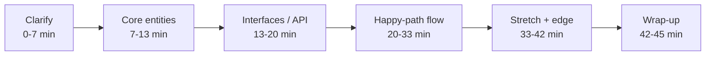
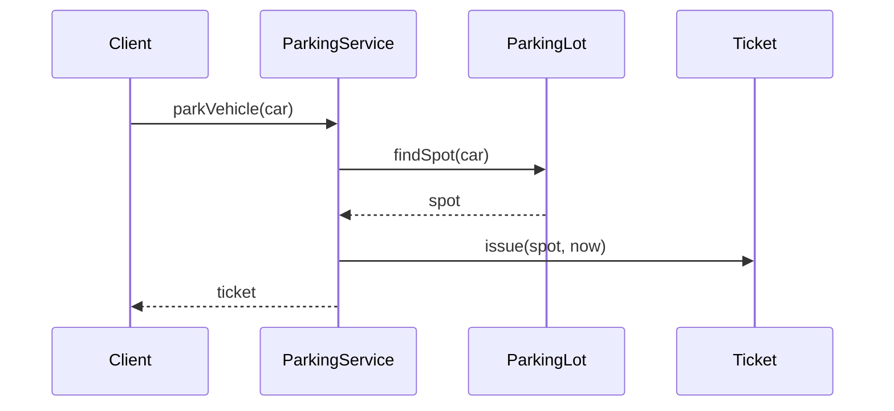

# The 45-Minute LLD Framework

> This article is self-contained. It gives you one framework you can run on **any** low-level design (LLD) problem, on the clock, without freezing, rabbit-holing, or drowning in class diagrams.

If you are already strong at system design, LLD feels deceptively easy and then quietly fails you. The trap is not that LLD is harder — it is that the **scoring rubric is different**. In HLD you are rewarded for breadth, trade-offs, and back-of-envelope math. In LLD you are rewarded for **modeling a small domain cleanly, making behavior explicit, and evolving the design under pressure**. People who "know all the patterns" still fail because they spend 20 minutes drawing a class diagram nobody asked for, or they get nerd-sniped by an algorithm, or they never actually made the objects *do* anything.

This framework fixes that. It is a **time-boxed pipeline**. Each stage has an output artifact and a hard exit time. When the clock hits the boundary, you ship what you have and move on.

---

## The one-sentence mental model

> **LLD is: pick the smallest set of objects that make the core use case work, give each a single clear responsibility, and show them collaborating on the happy path — then let the interviewer stretch it.**

Everything below serves that sentence. If an activity does not move you toward "objects collaborating on the core use case," it is a rabbit hole. Cut it.

---

## The pipeline at a glance



Notice: **only 6 minutes** on the class model, **13 minutes** on making it actually work. Most failing candidates invert this ratio.

---

## Before you start: calibrate the format (30 seconds)

Not every "LLD round" wants the same deliverable. Spend 30 seconds establishing which of three modes you're in, because it changes your time budget:

- **Design-only (whiteboard/talk).** The 45-minute budget below applies as-is: model, interfaces, flows, extensions.
- **Design + code skeleton.** The interviewer wants runnable-looking classes/methods for the core. Compress clarify/entities to ~15 minutes and reserve ~20+ for typing the key classes and one flow. Don't gold-plate the model; the code is the artifact being scored.
- **Full implementation (often 60–90 min).** Design fast (~15 min), then implement and test the core use case. Here, working code with a couple of unit tests beats a broader design.

Ask directly: "Do you want a design and interfaces, a code skeleton, or a working implementation?" A past-staff engineer who keeps "failing LLD" is sometimes failing because they delivered a talk-through design in a round that wanted code, or vice-versa. Match the deliverable first; then run the stages, stretching or compressing to fit.

---

## Stage 1 — Clarify and scope (0–7 min)

**Output: a written list of 3–5 in-scope use cases and an explicit out-of-scope list.**

This stage is where you kill the rabbit hole *before* it starts. LLD prompts are intentionally vague ("Design a parking lot"). Your first job is not to design — it is to **shrink the problem to something you can finish in 40 minutes**.

Ask targeted questions, then write the answers where the interviewer can see them:

- "What is the **one flow** you most want me to nail?" (Park a car? Compute a fare? Handle full lot?)
- "Is this a single instance/process, or distributed?" (This decides whether concurrency and persistence matter at all.)
- "Should I focus on the **domain model and behavior**, or also on storage/APIs?"
- "Are there variants I should design for extensibility, or one concrete case?"

Then commit out loud:

> "I'll focus on parking/un-parking and fare calculation for a single-process system. I'll design so payment strategy is pluggable, but I won't implement real payment. I'm treating persistence as out of scope unless you want it. Good?"

**Why this wins:** you have now (a) shown judgment, (b) gotten the interviewer to agree to a *finishable* scope, and (c) created a fence you can point back to every time you feel the urge to over-build. When later you think "should I model 14 vehicle types?" — you check the fence. It says no.

---

## Stage 2 — Core entities (7–13 min)

**Output: 5–9 named objects, each with a one-line responsibility. No inheritance trees yet. No methods yet.**

Do **not** start from "what inherits from what." Finding inheritance relationships is slow and error-prone, and it is not what the interviewer is scoring. Start from **responsibilities**:

1. Underline the **nouns** in your scoped use cases → candidate entities.
2. For each, write **one sentence**: "owns X, is responsible for Y."
3. Delete any entity whose responsibility duplicates another. Merge ruthlessly.

Example (parking lot): `ParkingLot` (owns levels, entry/exit), `ParkingSpot` (holds at most one vehicle, knows its type), `Vehicle` (type + plate), `Ticket` (issued at entry, holds spot + timestamps), `FareStrategy` (computes cost), `ParkingService` (orchestrates the flow). Six objects. Done.

Say the responsibilities out loud as you write them. A crisp responsibility list is the single strongest signal of "this person can design." Prefer **composition** ("ParkingLot *has* Levels") over inheritance; only reach for an inheritance/`interface` when you have two concrete variants that must be used interchangeably (e.g., `FareStrategy`).

---

## Stage 3 — Interfaces / public API (13–20 min)

**Output: the method signatures the outside world calls, plus the 1–2 key polymorphic interfaces.**

This is the stage most people skip, and skipping it is why their design "has no spine." Define the **entry points** first — the handful of methods that represent the use case:

```text
Ticket   parkVehicle(Vehicle v)
Receipt  unparkVehicle(Ticket t)
```

Then define the **one or two interfaces where behavior varies**, because that is where design patterns legitimately live:

```text
interface FareStrategy { Money calculate(Ticket t) }
interface SpotAssignmentStrategy { Optional<ParkingSpot> assign(Vehicle v) }
```

Now you have a *spine*: an API to satisfy and clear seams for variation. Everything else is filling in. This also gives the interviewer an obvious place to push ("what if fares change on weekends?") — and you can answer "new `FareStrategy`, no other code changes."

---

## Stage 4 — Happy-path flow (20–33 min)

**Output: the primary use case executed end-to-end, object by object, ideally as a small sequence diagram.**

This is the **highest-scoring stage** and the one candidates starve. Take your single most important use case and **walk the objects calling each other**. Keep the diagram tiny — 4 to 6 participants:



While you walk it, **narrate the decisions**: where state changes, where you'd guard against a race, what happens if `findSpot` returns empty. This is where you demonstrate that your objects actually *do* something. A design that runs the happy path beats a beautiful static class diagram every time.

If you have time, walk the **second** most important flow (un-park + fare). Two working flows is a strong pass.

---

## Stage 5 — Stretch and edges (33–42 min)

**Output: you absorb 1–2 curveballs the interviewer throws, and name the edge cases you're consciously deferring.**

By now the interviewer will start pushing: "What if two cars race for the last spot?" "Add electric charging spots." "Make fares tiered." Your framework already prepared you:

- **New behavior variant** → new implementation of an existing interface (`FareStrategy`, `SpotAssignmentStrategy`). Show it, don't rebuild.
- **Concurrency** → identify the one contended resource (spot assignment), pick a mechanism (per-level lock, atomic claim, or optimistic check-and-set), state the trade-off, move on. Do **not** derail into a lock-free masterpiece.
- **Edge cases** → *name* them ("lost ticket, lot full, vehicle too big, clock skew on fare"). Naming them scores almost as well as handling them, and costs seconds.

The skill here is **bounded responses**. Give a crisp answer, tie it back to the model, and hand control back. Watch the interviewer — if they nod and change topic, stop talking.

---

## Stage 6 — Wrap-up (42–45 min)

**Output: a 60-second summary of the model, the extension points, and what you'd do next.**

> "So: six core objects, `ParkingService` orchestrates, variation lives behind `FareStrategy` and `SpotAssignmentStrategy`, concurrency is handled at spot-claim. If I had more time I'd add persistence and a real payment flow, and I'd unit-test the fare edge cases."

This leaves the interviewer with a clean mental snapshot to write in their notes. Their notes are your score.

---

## The three failure modes this framework prevents

1. **Rabbit-holing.** The scope fence (Stage 1) and the clock give you a reason to stop. When you feel the pull, say "I'll keep this simple and note it's swappable," and move.
2. **Algorithm obsession.** LLD almost never needs a clever algorithm. If you catch yourself optimizing a data structure, downgrade it to the dumbest thing that works, hide it behind an interface, and return to object collaboration.
3. **Misreading the ask.** Stage 1 forces the interviewer to tell you what they want. You are no longer guessing.

---

## A pocket version (memorize this)

- **0–7** Clarify → written scope + out-of-scope.
- **7–13** Entities → 5–9 objects, one-line responsibility each, composition first.
- **13–20** API → entry-point methods + 1–2 varying interfaces.
- **20–33** Happy path → objects collaborating, narrate, tiny sequence diagram.
- **33–42** Stretch → new interface impls, one concurrency call, name the edges.
- **42–45** Wrap → model + seams + next steps.

Run this on every LLD problem. It is boring on purpose. Boring finishes on time; clever runs out of clock.
