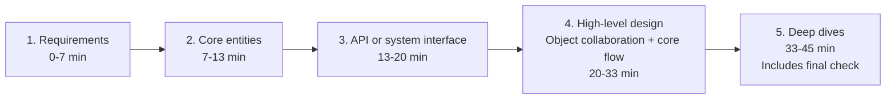
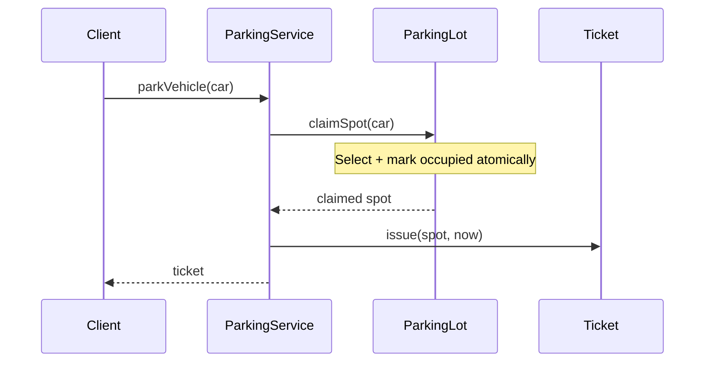

# The 45-Minute LLD Framework

> This article is self-contained. It applies the shared five-stage delivery outline to low-level design (LLD), so you can work on the clock without freezing, rabbit-holing, or drowning in class diagrams.

This is the repository's LLD adaptation of [Hello Interview's system-design delivery framework](https://www.hellointerview.com/learn/system-design/in-a-hurry/delivery), as organized in the [shared interview template](interview-template.html). The LLD examples and time budgets here are local coaching, not timing or object-design prescriptions from that source.

If you are already strong at system design, LLD feels deceptively easy and then quietly fails you. The trap is not that LLD is harder — it is that the **scoring rubric is different**. In HLD you are rewarded for breadth, trade-offs, and back-of-envelope math. In LLD you are rewarded for **modeling a small domain cleanly, making behavior explicit, and evolving the design under pressure**. People who "know all the patterns" still fail because they spend 20 minutes drawing a class diagram nobody asked for, or they get nerd-sniped by an algorithm, or they never actually made the objects *do* anything.

Use the same **five delivery stages** for system design and LLD: Requirements, Core entities, API or system interface, High-level design, and Deep dives. Each produces an artifact. Time-box the work locally and move on when the agreed budget runs out; the stage names stay the same even when the deliverable or interview length changes.

---

## The one-sentence mental model

> **LLD is: pick the smallest set of objects that make the core use case work, give each a single clear responsibility, and show them collaborating on the happy path — then let the interviewer stretch it.**

Everything below serves that sentence. If an activity does not move you toward "objects collaborating on the core use case," it is a rabbit hole. Cut it.

---

<a id="the-pipeline-at-a-glance"></a>

## The five stages at a glance

The times below are an **illustrative local 45-minute budget**, not source-prescribed guidance. The final check belongs inside Deep dives, not a sixth stage.



Notice: **only 6 minutes** on the class model, **13 minutes** on making it actually work. Most failing candidates invert this ratio.

---

## Before you start: calibrate the format (30 seconds)

Not every "LLD round" wants the same deliverable. Spend about 30 seconds establishing which of three modes you're in, because it changes your time budget. These are local planning examples, not additional delivery stages:

- **Design-only (whiteboard/talk).** Use the illustrative 45-minute budget below: requirements, entities, interfaces, object collaboration, and deep dives.
- **Design + code skeleton.** The interviewer wants runnable-looking classes/methods for the core. Budget requirements/entities at ~15 minutes and reserve ~20+ for typing the key classes and one flow. Don't gold-plate the model; the code is the artifact being scored.
- **Full implementation (often 60–90 min).** Design fast (~15 min), then implement and test the core use case. Here, working code with a couple of unit tests beats a broader design.

Ask directly: "Do you want a design and interfaces, a code skeleton, or a working implementation?" A past-staff engineer who keeps "failing LLD" is sometimes failing because they delivered a talk-through design in a round that wanted code, or vice-versa. Match the deliverable first; then run the stages, stretching or compressing to fit.

---

<a id="stage-1--clarify-and-scope-07-min"></a>

## Stage 1 — Requirements

**Illustrative local budget: 0–7 min.** [Template: Requirements](interview-template.html#requirements).

**Output: functional requirements, nonfunctional requirements, and an explicit out-of-scope list.**

This stage is where you kill the rabbit hole *before* it starts. LLD prompts are intentionally vague ("Design a parking lot"). Your first job is not to design — it is to **shrink the problem to something you can finish in 40 minutes**.

Ask targeted questions, then write the answers where the interviewer can see them:

- "What is the **one flow** you most want me to nail?" (Park a car? Compute a fare? Handle full lot?)
- "Is this single-process or distributed, and can calls overlap?" (Single-process does not mean single-threaded; confirm persistence needs separately.)
- "Should I focus on the **domain model and behavior**, or also on storage/APIs?"
- "Are there variants I should design for extensibility, or one concrete case?"

### Functional requirements

Write 3–5 concrete, testable use cases. For a parking lot: park a compatible vehicle, issue a ticket, and unpark with a calculated fare. Pick the primary flow with the interviewer.

### Nonfunctional requirements

State the constraints that change the model: in-memory or persistent state, thread-safety, capacity, and correctness guarantees. For this example, assume a single process with concurrent entry calls; a spot must never belong to two active tickets. Do not invent distributed infrastructure unless it is in scope.

### Out of scope

List the tempting features you will not implement: a real payment gateway, reservations, and durable storage in this example. Then commit out loud:

> "I'll focus on parking/un-parking and fare calculation for a single-process system with concurrent entry calls. Fare calculation will be pluggable, but I won't implement real payment. I'm treating persistence as out of scope unless you want it. Good?"

**Why this wins:** you have now (a) shown judgment, (b) gotten the interviewer to agree to a *finishable* scope, and (c) created a fence you can point back to every time you feel the urge to over-build. When later you think "should I model 14 vehicle types?" — you check the fence. It says no.

---

<a id="stage-2--core-entities-713-min"></a>

## Stage 2 — Core entities

**Illustrative local budget: 7–13 min.** [Template: Core entities](interview-template.html#core-entities).

**Output: 5–9 named objects, each with a one-line responsibility. No inheritance trees yet. No methods yet.**

Do **not** start from "what inherits from what." Finding inheritance relationships is slow and error-prone, and it is not what the interviewer is scoring. Start from **responsibilities**:

1. Underline the **nouns** in your scoped use cases → candidate entities.
2. For each, write **one sentence**: "owns X, is responsible for Y."
3. Delete any entity whose responsibility duplicates another. Merge ruthlessly.

Example (parking lot): `ParkingLot` (owns levels, entry/exit), `ParkingSpot` (holds at most one vehicle, knows its type), `Vehicle` (type + plate), `Ticket` (issued at entry, holds spot + timestamps), `FareStrategy` (computes cost), `ParkingService` (orchestrates the flow). Six objects. Done.

Say the responsibilities out loud as you write them. A crisp responsibility list is the single strongest signal of "this person can design." Prefer **composition** ("ParkingLot *has* Levels") over inheritance; only reach for an inheritance/`interface` when you have two concrete variants that must be used interchangeably (e.g., `FareStrategy`).

---

<a id="stage-3--interfaces--public-api-1320-min"></a>

## Stage 3 — API or system interface

**Illustrative local budget: 13–20 min.** [Template: API or system interface](interview-template.html#api).

**Output: the method signatures the outside world calls, plus the 1–2 key polymorphic interfaces.**

This is the stage most people skip, and skipping it is why their design "has no spine." Define the **entry points** first — the handful of methods that represent the use case:

```text
Ticket   parkVehicle(Vehicle v)
Receipt  unparkVehicle(Ticket t)
```

Then define the **one or two interfaces where behavior varies**, because that is where design patterns legitimately live:

```text
interface FareStrategy { Money calculate(Ticket t) }
interface SpotAssignmentStrategy { Optional<ParkingSpot> assign(Vehicle v) }
```

Now you have a *spine*: an API to satisfy and clear seams for variation. Everything else is filling in. This also gives the interviewer an obvious place to push ("what if fares change on weekends?") — and you can answer "new `FareStrategy`, no other code changes."

**Optional, unnumbered Data flow:** add this only when a processing pipeline needs an explicit account of how data is transformed between input and output. Ordinary LLD method calls belong in the object-collaboration walkthrough in Stage 4; they do not require another delivery stage.

---

<a id="stage-4--happy-path-flow-2033-min"></a>

## Stage 4 — High-level design

**Illustrative local budget: 20–33 min.** [Template: High-level design](interview-template.html#high-level-design).

**Output: the primary use case executed end-to-end, object by object, ideally as a small sequence diagram.**

For LLD, **High-level design means object collaboration and a working core flow**, not a distributed-infrastructure diagram. Show the orchestrator, state owners, and their calls; keep databases, queues, and network topology out unless requirements demand them.

This is the **highest-scoring stage** and the one candidates starve. Take your single most important use case and **walk the objects calling each other**. Keep the diagram tiny — 4 to 6 participants:



While you walk it, **narrate the decisions**: where state changes, where you'd guard against a race, what happens if `claimSpot` returns empty. The assignment strategy selects a candidate; the lot owns the protected claim. This is where you demonstrate that your objects actually *do* something. A design that runs the happy path beats a beautiful static class diagram every time.

If you have time, walk the **second** most important flow (un-park + fare). Two working flows is a strong pass.

---

<a id="stage-5--stretch-and-edges-3342-min"></a>

## Stage 5 — Deep dives

**Illustrative local budget: 33–45 min**, with 33–42 for selected details and 42–45 for the final check. [Template: Deep dives](interview-template.html#deep-dives).

**Output: justified trade-offs, bounded follow-up changes, concurrency and failure behavior, test expectations, and a final check against requirements.**

By now the interviewer will start pushing: "What if two cars race for the last spot?" "Add electric charging spots." "Make fares tiered." Your framework already prepared you:

- **New behavior variant** → new implementation of an existing interface (`FareStrategy`, `SpotAssignmentStrategy`). Show it, don't rebuild.
- **Concurrency** → identify the one contended resource (spot assignment), pick a mechanism (per-level lock, atomic claim, or optimistic check-and-set), state the trade-off, move on. Do **not** derail into a lock-free masterpiece.
- **Edge cases** → name them ("lost ticket, lot full, vehicle too big, clock skew on fare"), then explain the important failure behavior. Explicitly defer the rest.
- **Tests** → state expected outcomes: lot-full rejects entry without issuing a ticket; invalid tickets cannot free a spot; concurrent last-spot claims produce exactly one success. Test the agreed requirements, not just the happy path.

The skill here is **bounded responses**. Give a crisp answer, tie it back to the model, and hand control back. Watch the interviewer — if they nod and change topic, stop talking.

<a id="final-check"></a>

### Final check

**Output: a concise summary of requirement coverage, the model, extension points, and what remains deferred.** Use the last 3 minutes of this local budget to check functional and nonfunctional requirements and summarize; this is part of Deep dives.

> "So: parking, unparking, and fare calculation are covered. Six core objects, `ParkingService` orchestrates, variation lives behind `FareStrategy` and `SpotAssignmentStrategy`, and concurrent entry is guarded at spot-claim. We identified tests for lot-full, invalid tickets, and last-spot races. Persistence and real payment remain out of scope; fare edge-case tests would be next."

This leaves the interviewer with a clean mental snapshot to write in their notes. Their notes are your score.

---

## The three failure modes this framework prevents

1. **Rabbit-holing.** The scope fence (Stage 1) and the clock give you a reason to stop. When you feel the pull, say "I'll keep this simple and note it's swappable," and move.
2. **Algorithm obsession.** LLD almost never needs a clever algorithm. If you catch yourself optimizing a data structure, downgrade it to the dumbest thing that works, hide it behind an interface, and return to object collaboration.
3. **Misreading the ask.** Stage 1 forces the interviewer to tell you what they want. You are no longer guessing.

---

## A worked example

Prompt: **"Design a parking lot."** Here is what the five-stage outline sounds like with the illustrative local budget, not a separate framework.

**1. Requirements (0–7 min).** "Functionally, I'll cover park, unpark, ticket, and fare calculation. Nonfunctional constraints: a single process with concurrent calls, no double claims, and in-memory state. I'll keep payment gateway, reservations, and persistence out. Vehicle size matters; EV charging is a follow-up if time allows."

**2. Core entities (7–13 min).** Write six responsibilities: `ParkingLot` owns levels and capacity, `ParkingSpot` holds one vehicle, `Vehicle` carries plate/type, `Ticket` records spot and entry time, `FareStrategy` computes charge, `ParkingService` orchestrates the two flows. Stop there; no `Car extends Vehicle` debate.

**3. API or system interface (13–20 min).**

```text
Ticket parkVehicle(Vehicle vehicle) throws LotFull
Receipt unparkVehicle(Ticket ticket)

interface FareStrategy { Money calculate(Ticket ticket); }
interface SpotAssignmentStrategy { Optional<ParkingSpot> assign(Vehicle vehicle); }
```

**4. High-level design (20–33 min).** Walk `parkVehicle`: service asks the lot to select and claim a spot using its assignment strategy, issues a ticket, returns it. Then walk `unparkVehicle`: service validates the ticket, asks `FareStrategy` for the amount, releases the spot, returns a receipt. These are object collaborations, not infrastructure components.

**5. Deep dives (33–45 min).** "Two cars racing for the last spot means the claim operation is the contended resource; I would protect it with a per-level lock or atomic spot claim. Weekend pricing is a new `FareStrategy`. EV charging is either a spot attribute or a new spot filter, depending on whether it changes behavior." Use 33–42 for these trade-offs and tests of lot-full, invalid tickets, and concurrent claims.

Within Deep dives, **final check (42–45 min):** "The core use cases and no-double-claim constraint are covered. The design has one orchestrator, small domain objects, and two variation seams: fare calculation and spot assignment. Persistence and payments remain deferred; next I would implement the tests we outlined."

That is enough. The point is not that this is the only parking-lot design; it is that every minute produced a scoreable artifact.

---

## Further reading

- [Design Patterns](https://refactoring.guru/design-patterns) — useful catalog for naming seams like Strategy without over-explaining them.
- [Refactoring](https://refactoring.guru/refactoring) — helps you recognize when an interview model is becoming bloated or coupled.
- [SOLID](https://en.wikipedia.org/wiki/SOLID) — quick vocabulary for single responsibility, dependency inversion, and open/closed follow-ups.
- *A Philosophy of Software Design* — John Ousterhout — reinforces the idea of narrow interfaces and deep modules.
- *Effective Java* — Joshua Bloch — practical API-design instincts that translate well to LLD skeletons.

---

## A pocket version (memorize this)

The same five stages, with illustrative local timings:

1. **Requirements (0–7)** → functional, nonfunctional, and out of scope.
2. **Core entities (7–13)** → 5–9 objects, one-line responsibility each, composition first.
3. **API or system interface (13–20)** → entry-point methods + 1–2 varying interfaces.
4. **High-level design (20–33)** → objects collaborating on a working core flow, narrated with a tiny sequence diagram.
5. **Deep dives (33–45)** → trade-offs, extensions, concurrency, edges, and tests; finish with a final check of requirements, seams, and next steps in the last 3 minutes.

Run this on every LLD problem. It is boring on purpose. Boring finishes on time; clever runs out of clock.
