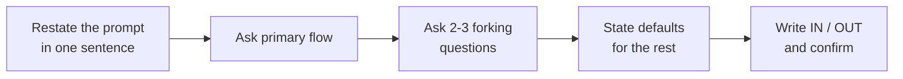

# Clarifying Requirements and Scoping an LLD Problem

> Self-contained. This article is about the first 7 minutes of an LLD interview — the minutes that decide whether you finish or drown.

Most LLD failures are decided before any class is drawn. The prompt is deliberately underspecified ("design a ride-hailing system"), and the candidate either (a) starts modeling immediately and builds the wrong thing, or (b) asks vague questions that produce vague answers and still builds the wrong thing. If you have failed LLD despite being strong at system design, this stage is very likely your leak. In HLD, ambiguity invites breadth and you get rewarded for exploring. In LLD, ambiguity is a **trap**: every extra "what if" you invent is 5 minutes you will not have for the model.

The goal of clarification is not to understand the problem fully. It is to **carve out a version of the problem you can finish cleanly in 40 minutes, and get the interviewer to agree to it in writing.**

---

## The scope-fence: your single most important artifact

Before modeling anything, produce two lists on the board:

```text
IN SCOPE
- <core use case 1>
- <core use case 2>
- <maybe a third>

OUT OF SCOPE (explicit)
- <the tempting thing you are deliberately NOT doing>
- <the other tempting thing>
```

This "fence" does three jobs:

1. **It commits the interviewer.** Once they nod at your IN/OUT lists, they have told you what to build. You are no longer guessing what they want.
2. **It gives you a stop sign.** Every time you feel the pull to add a feature, you glance at the OUT list. If it's there, you stop. The fence does your willpower for you.
3. **It signals seniority.** Ruthless scoping is exactly what staff engineers do on real projects. Interviewers read it as maturity.

---

## Ask questions that change the design, skip questions that don't

Junior candidates ask trivia ("what language?"). Strong candidates ask questions whose answers **fork the design**. Prioritize these four categories:

- **The primary flow.** "If you could only see me nail one use case, which is it?" This single question prevents you from building the wrong thing. Interviewers almost always have a specific flow in mind.
- **Single-process vs distributed.** This one answer decides whether concurrency, persistence, and network failure are even on the table. Getting it wrong wastes 15 minutes. Default to single-process unless told otherwise, and *say* you're defaulting.
- **Model depth vs breadth.** "Do you want a deep model of the core with pluggable extensions, or coverage of many features shallowly?" Almost always they want depth on the core.
- **Scale sensitivity.** "Roughly how many X? Enough that data-structure choice matters, or is correctness the focus?" This tells you whether to care about the algorithm at all (usually you shouldn't).

If a question's answer wouldn't change a single class or method, don't ask it. It burns clock and reads as stalling.

---

## The 90-second clarification script

You do not have time for a 10-minute Q&A. Run this in ~90 seconds, then move:



Concretely:

> "So we're designing a food-delivery order system. I'll assume the core flow you care about is *place an order and track it to delivery* — is that right? I'll treat it as a single service, correctness over scale, with agent-assignment pluggable. Payments and the search/recommendation side I'll leave out of scope. Here's my IN/OUT list — anything you'd move?"

Notice you **proposed** the answers instead of interrogating. Proposing defaults is faster, shows judgment, and lets the interviewer correct you cheaply. Open-ended questioning ("what should I consider?") pushes the work back onto them and reads as uncertainty.

---

## Turn requirements into a checklist you can design against

Once the fence is set, convert the IN-scope items into concrete, testable statements. Vague requirements breed vague models.

- Vague: "users can split expenses."
- Concrete: "a user adds an expense to a group; it can be split equally, by exact amounts, or by percentage; the system tracks who owes whom."

The concrete version already hints at the model (`Expense`, `Group`, a split *strategy*) — good requirements pull the design out of you. Write 3–5 of these and treat them as your acceptance criteria. In the wrap-up, you'll check off which ones you covered; that closes the loop and reads as rigor.

---

## Explicitly park the tempting rabbit holes

Every classic LLD problem has a "shiny" sub-problem that eats candidates alive. Name it and park it **out loud** so the interviewer knows you see it and chose not to chase it:

- Parking lot → "I won't build a real payment gateway; fare is a pluggable strategy."
- Splitwise → "Debt simplification (min cash flow) is a nice-to-have graph problem; I'll note it and only do it if we have time."
- Chess → "Full move legality, castling, and check detection are out; I'll model the board and one piece's moves."
- Rate limiter → "Distributed coordination is out; I'll design the single-node algorithm cleanly."

Parking a rabbit hole is a *positive* signal. It says: "I recognize the deep problem, I'm scoping it deliberately, and I'm protecting our 45 minutes." That is the exact judgment the interview is testing.

---

## When the interviewer expands scope mid-interview

They will. "Okay, now make pricing dynamic." This is not a failure of your scoping — it's the interviewer *using* your design as a platform to probe extensibility. The move is:

1. Acknowledge it's a new requirement, not something you missed.
2. Point to the seam you already built ("this is a new `PricingStrategy`").
3. If there's no seam, introduce one in one sentence rather than rewriting.

A tight initial scope is what *lets* you absorb expansions gracefully. Candidates who tried to build everything up front have no slack left when the real curveball arrives.

---

## A worked example

Prompt: **"Design a rate limiter."** A weak opening is "I'll use token bucket" and then disappearing into counters. A stronger opening fences the problem first:

> **Candidate:** "What is the primary flow: deciding whether a request is allowed for a key?"
>
> **Interviewer:** "Yes, `allow(userId)` is enough."
>
> **Candidate:** "Single process or distributed across nodes?"
>
> **Interviewer:** "Start single process."
>
> **Candidate:** "Should the algorithm be fixed, or should I leave room for fixed-window vs token-bucket?"
>
> **Interviewer:** "Leave room; token bucket is fine as the first implementation."
>
> **Candidate:** "Do you care about persistence or restart behavior?"
>
> **Interviewer:** "No."
>
> **Candidate:** "Any need for per-endpoint rules, or one rule per key?"
>
> **Interviewer:** "One rule per key."

Now write the fence:

```text
IN SCOPE
- allow(key): returns allowed/denied for a request
- single-process correctness
- one pluggable limiting algorithm, first implementation token bucket

OUT OF SCOPE
- distributed coordination
- persistent counters
- per-endpoint policy management
- real HTTP middleware
```

Scope sentence: **"I'll design a single-node rate limiter with a narrow `allow(key)` API and a pluggable algorithm seam; distributed coordination and persistence are out unless you pull them in later."**

Notice the win: the algorithm is no longer the whole interview. It is one implementation behind the seam, and the rest of the design can proceed.

---

## Further reading

- [SOLID](https://en.wikipedia.org/wiki/SOLID) — especially useful for turning scope into single-responsibility classes and dependency-inverted seams.
- [Martin Fowler bliki](https://martinfowler.com/bliki/) — design vocabulary for talking about boundaries, abstractions, and trade-offs crisply.
- [Refactoring](https://refactoring.guru/refactoring) — useful when a scope fence reveals that a proposed model is doing too much.
- *Clean Code* — Robert C. Martin — practical guidance for small, intention-revealing names and functions.

---

## The failure this prevents, restated

If your past LLD interviews went sideways because you "got stuck in a rabbit hole" or "couldn't tell what the interviewer wanted," it is almost never a modeling-skill problem. It is that you skipped the fence. Spend the first 7 minutes making the problem small and explicit, get a nod, and every later decision gets easier because you already know the target.
