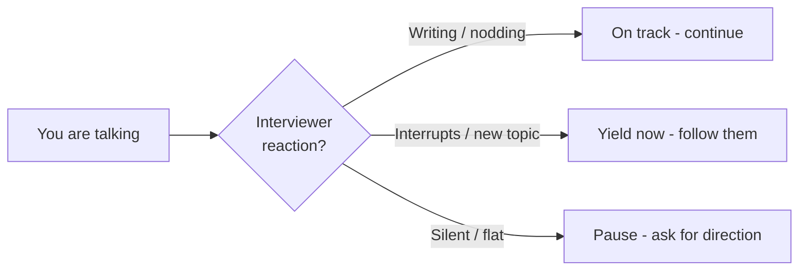

# Reading the Interviewer

> Self-contained. This article is about the meta-skill that decides most LLD outcomes: understanding what the interviewer is *actually* asking for, moment to moment, so you spend your 45 minutes on what they're scoring.

A recurring reason strong engineers fail LLD is not "I couldn't design it" — it's "I designed the wrong thing, in the wrong depth, at the wrong time." The interviewer is giving you a near-constant stream of signals about what they want. If you can read those signals, you stop guessing and start steering. This is a learnable skill, and it separates a clear pass from a "leaning no."

---

## The interviewer has a rubric. Reverse-engineer it.

Every LLD interviewer is filling in a mental (often literal) scorecard. It usually has a small number of dimensions:

- **Requirement handling** — did you scope and clarify?
- **Modeling** — clean objects, single responsibilities, right abstractions?
- **Extensibility** — can the design absorb change without a rewrite?
- **Correctness** — does the core flow actually work; did you handle key edges?
- **Communication** — did you think aloud, take input, stay organized?

Your job is to give them a checkmark on each. When you're unsure what to do next, ask: *which empty box am I filling right now?* If you can't answer, you're probably rabbit-holing on a box that's already checked.

---

## Decode the question behind the question

LLD prompts are coded language. Learn the translation table:

| They say | They usually mean | Your move |
|---|---|---|
| "What if we also need to support X?" | *Show me your extension point.* | Point to an existing interface / add a seam. |
| "How would you store this?" | *Show me the data model / data structure.* | Name the structure, state its key property, move on. |
| "Walk me through what happens when…" | *Prove the objects actually collaborate.* | Trace the flow object-by-object. |
| "Two users do this at once…" | *Do you see the concurrency point?* | Identify the one contended resource, pick a mechanism. |
| "Can you draw the classes?" | *I want to see structure, not more talk.* | Sketch a SMALL class diagram, keep narrating. |
| Long silence after you finish a flow | *I'm satisfied; stop or move on.* | Summarize and offer the next flow — don't keep polishing. |

The single most common misread: treating "how would you store this?" as an invitation to optimize a data structure for 15 minutes. They wanted one sentence ("a hashmap keyed by id, O(1) lookup") and for you to move on.

---

## Watch behavior, not just words

The words are only half the signal. Calibrate to what the interviewer *does*:

- **They start typing / writing.** You said something scoreable. Keep that thread; don't undercut it by rambling.
- **They interrupt with a new topic.** You've spent enough on the current one. Yield immediately — do not finish your sentence about the thing they just moved past.
- **They go quiet and stop reacting.** You're likely in a rabbit hole. Pause and ask: "Is this the right level of detail, or should I move to the flow?"
- **They repeat or rephrase a question.** Your last answer missed. Don't repeat it louder — reframe. They're pointing at something you're not seeing.
- **They say 'sure, that works, but…'** The 'but' is the whole message. Everything before it was politeness.

---

## Steering: make the interviewer co-drive

You are allowed — encouraged — to check your heading instead of guessing. Cheap, high-value phrases:

- "I can go deeper on the concurrency here, or move on to the fare flow — which is more useful?"
- "Do you want me to code this method out, or is the interface enough?"
- "I'm treating persistence as out of scope — flag me if you want it in."

These turn a monologue into a collaboration. They also protect you: if you were about to rabbit-hole, the interviewer redirects you *before* you burn the time. Candidates who never check in are the ones who look up at minute 40 and realize they built the wrong thing.

Do this at **natural checkpoints** — after finishing the entity list, after the happy path — not every 30 seconds (that reads as needy). Two or three well-placed checks across 45 minutes is the sweet spot.

---

## Match their depth, then adjust

Interviewers signal desired depth by how they phrase things. "Just sketch the classes" wants breadth; "walk me through exactly what happens when the payment fails" wants depth on one path. Give them the depth they asked for, then read the reaction:

- If you go shallow and they ask "and then?" — they want more depth. Zoom in.
- If you go deep and they say "okay, sure" flatly and glance at the clock — pull up. Summarize and move.

The mistake is picking a depth based on *your* comfort (usually: diving deep into the part you find interesting) instead of *their* signal. The interesting part to you is often a box they've already checked.

---

## When you genuinely don't understand the ask

Sometimes the question is just unclear. Don't fake it and don't freeze. Reflect it back concretely:

> "When you say 'handle notifications reliably,' do you mean retries on failure, or ordering guarantees, or both? I want to design the right thing."

Naming the interpretations shows you understand the *space* even if you don't yet know which one they want — and it's far stronger than a confident answer to the wrong question. The failure mode "I couldn't understand what they were asking" is almost always fixable by reflecting the ambiguity back instead of guessing.

---

## A worked example

Suppose you are designing an LRU cache. The interviewer gives one of these follow-ups:

| Interviewer prompt | What they are likely grading | Adjust like this |
|---|---|---|
| "What if two threads call `get` and `put` at the same time?" | Concurrency and invariant awareness. | Name the invariant: map and list must stay consistent. Guard the combined update with one lock or a clearer concurrency boundary; do not dive into lock-free lists. |
| "Now support TTL as well as LRU." | Extensibility and separation of policy. | Say TTL is a second eviction/expiry policy seam, not a rewrite of storage. Decide whether eviction is composed (`LruPolicy` + `ExpiryPolicy`) or one combined `EvictionPolicy`. |
| "Can you walk through `get(k)`?" | Object collaboration and correctness. | Stop adding classes. Trace: lookup node in map, if missing return empty, otherwise move node to head and return value. Mention the state mutation. |

The same base design can pass or fail depending on whether you hear the signal. A concurrency prompt wants the race and the protected invariant. An extensibility prompt wants the seam. A walk-through prompt wants behavior, not another abstraction.

The senior move is to answer the axis they opened, then hand control back: "That covers the thread-safety story at the cache boundary; should I go deeper there or continue with TTL?"

---

## Further reading

- [Design Patterns](https://refactoring.guru/design-patterns) — useful for recognizing when a follow-up is asking for Strategy, State, Observer, or Command.
- [Martin Fowler bliki](https://martinfowler.com/bliki/) — vocabulary for naming design moves without turning the interview into a lecture.
- [SOLID](https://en.wikipedia.org/wiki/SOLID) — helps translate interviewer nudges into responsibility and dependency questions.
- *A Philosophy of Software Design* — John Ousterhout — reinforces listening for complexity and keeping interfaces narrow.

---

## The one-line summary

The interviewer is telling you what to do the entire time — through their questions, their typing, their silences, and their 'buts'. Your job is less to *have* the perfect design and more to *converge* on the design they're scoring. Read the signals, check your heading at the joints, and match their depth. Do that and the same modeling ability that felt like it "failed" before will suddenly read as a clear pass.
