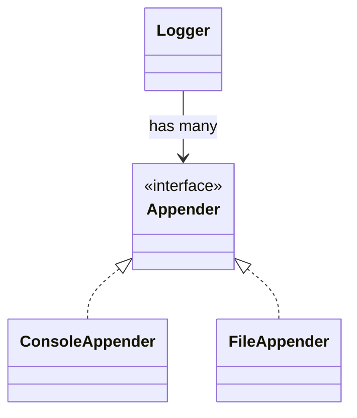
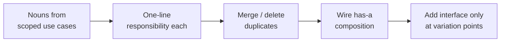

# Modeling Entities Without Heavy OOP

> Self-contained. This article attacks a specific failure: spending the interview hunting for inheritance hierarchies and "is-a" relationships, running out of time, and producing a class diagram that looks academic but doesn't *do* anything.

Classic OOD advice tells you to find the nouns, build an inheritance taxonomy, and draw the class diagram. On the clock, this is a trap. Figuring out the "correct" class hierarchy is slow, it's contentious (reasonable engineers disagree for 10 minutes about whether `Truck` extends `Vehicle`), and — critically — **the interviewer is not scoring your taxonomy**. They're scoring whether your objects have clear responsibilities and collaborate to make the use case work. This article gives you a faster path to the same (better) model.

---

## Start from responsibilities, not relationships

The fastest way to a clean model is to ask, for each candidate object, one question: **"What is this thing responsible for?"** One sentence. If you can't write the sentence, the object shouldn't exist. If two objects have the same sentence, merge them.

Do this for the nouns in your scoped use cases and you get a responsibility table in ~5 minutes:

| Object | Responsibility (one line) |
|---|---|
| `Order` | Holds line items and the current order state. |
| `OrderService` | Orchestrates placing/cancelling orders. |
| `Payment` | Represents an attempt to charge for an order. |

Notice what you did *not* do: no "extends," no abstract base classes, no debate about the taxonomy. You went straight to behavior. This is faster and it's what senior engineers actually do — responsibilities first, structure falls out.

---

## Composition over inheritance — as a default, not a dogma

When you *do* need to relate objects, reach for **"has-a" (composition) before "is-a" (inheritance)**. Composition is faster to reason about live and almost always more flexible:

- `Car has-a Engine` beats `ElectricCar extends Car extends Vehicle`.
- `Logger has-a list of Appenders` beats a `FileLogger`/`ConsoleLogger` hierarchy.
- `Piece has-a MovementStrategy` beats a deep `Piece` subclass tree.

Inheritance couples you to a taxonomy you have to get right up front. Composition lets you snap behaviors together and swap them. In an interview, composition also gives the interviewer obvious extension points ("add a new Appender") without you rewriting a hierarchy.

Here inheritance appears in exactly one place — implementing a small interface — which is where it belongs. The `Logger` doesn't grow subclasses; it *composes* appenders.

---

## Use enums where a hierarchy would be overkill

A huge amount of interview time is wasted building subclasses that differ only by a value. `Motorcycle`/`Car`/`Truck` that differ only in size? That's a `VehicleType` enum, not three classes. `Suit` and `Rank` on a playing card? Enums. `LogLevel`? Enum.

Rule of thumb: **if subtypes differ only in data, use an enum or a field. Reach for polymorphism only when subtypes differ in behavior.** A `FareStrategy` that computes differently is worth polymorphism. A `Truck` that's just "bigger" is not. This single heuristic saves you from 80% of gratuitous hierarchies.

---

## Where polymorphism genuinely earns its place

You're not banning inheritance/interfaces — you're spending them wisely. Introduce an interface exactly when **behavior varies and you want it swappable**:

- Pricing that can be flat, hourly, or surge → `PricingStrategy`.
- Split that can be equal, exact, or percentage → `SplitStrategy`.
- A piece that moves differently → `MovementStrategy`.
- A notification channel that's email vs SMS vs push → `Channel`.

These are the seams the interviewer will push on ("now add weekend pricing"), and having them means your answer is "a new class" instead of "let me refactor." That's the payoff: polymorphism placed at the *variation points* buys you extensibility exactly where it's tested.

---

## A repeatable 6-minute modeling recipe

1. **List nouns** from your in-scope use cases.
2. **Write one responsibility sentence** per noun. No sentence → cut it.
3. **Merge** objects with overlapping responsibilities; **delete** anemic ones.
4. **Wire composition** ("X has-a Y") for ownership.
5. **Add an interface** only where behavior varies and you want it pluggable.
6. Stop at **5–9 objects**. More than that in the first pass means you're modeling breadth you scoped out.

That's it. No taxonomy hunt, no abstract-base debate. You'll finish with a model that's small, clear, and — because you led with responsibilities — actually ready to *act* in the flow stage.

---

## Keep objects honest: a couple of guardrails

- **One reason to change.** If an object's responsibility sentence contains "and," consider splitting it. `OrderService` that "places orders and charges cards and sends email" is three objects.
- **Tell, don't ask.** Prefer `spot.release()` over `if (spot.isOccupied()) spot.setOccupied(false)`. Behavior belongs with the data it touches. This keeps logic from leaking into a god-service.
- **No anemic bag-of-getters.** If every object is just fields with getters and all logic sits in one service, you've written procedural code in a costume. Push behavior onto the objects that own the data.

You can mention these principles by name in one line each; you don't need to lecture. Applying them quietly is what makes the model read as "clean" without you spending words defending it.

---

## Why this beats the class-diagram-first approach in an interview

- It's **faster** — responsibilities take seconds; taxonomies take minutes of debate.
- It's **more correct** — composition avoids the brittle hierarchies juniors over-build.
- It's **more extensible** — interfaces at variation points absorb the interviewer's curveballs.
- It leaves you **time to make objects do things** — which is the stage that actually scores.

If your past LLD interviews turned into slow, stalling searches for "the right relationships," flip your order of operations: responsibilities first, composition to wire them, polymorphism only at the seams. You'll produce a better model in half the time and have minutes left over for the part the interviewer really cares about — watching your objects work.
