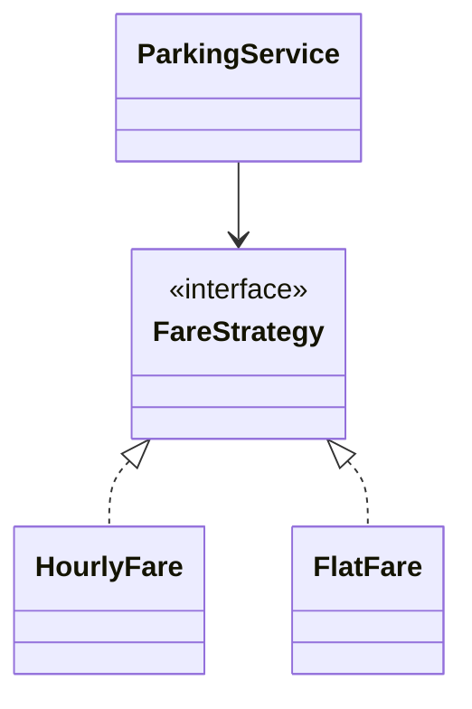
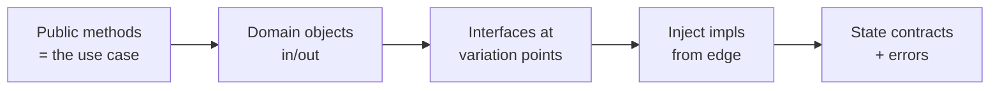

# Designing Clean Interfaces and APIs

> Self-contained. This article is about the stage most candidates skip and later regret: defining the method signatures and interfaces that give your design a *spine* before you start filling in bodies.

A common LLD failure looks like this: the candidate has a nice box-and-line class diagram, but when asked "so how does a client actually park a car?" they fumble, because they never defined the entry points. Their design has anatomy but no spine — nothing that says "this is what the system *does*." Defining the API first fixes this. It anchors every later decision, gives the interviewer something concrete to push on, and makes your objects' purpose obvious.

---

## Two kinds of interface, both matter

"Interface" is overloaded. In LLD you're designing two distinct things, and you need both:

1. **The public API** — the handful of methods the outside world calls to use your system. `parkVehicle(v)`, `placeOrder(cart)`, `allow(key)`. This is your system's *purpose*, expressed as verbs.
2. **The polymorphic seams** — the internal interfaces where behavior varies and you want it swappable. `FareStrategy`, `Channel`, `EvictionPolicy`. This is where extensibility lives.

Define the public API first (it anchors the whole design), then the seams (they anchor the follow-ups). Everything else is implementation you can fill in during the flow stage.

---

## Design the public API from the use case, verbs first

Take your primary in-scope use case and ask: *what would a client call to do this?* Write the signatures before any class bodies:

```text
Ticket   parkVehicle(Vehicle v)          // may throw LotFull
Receipt  exitVehicle(Ticket t)

OrderId  placeOrder(Cart c)
void     cancelOrder(OrderId id)
```

Good public methods share a few traits:

- **They read like the use case.** A non-author should guess what `placeOrder(cart)` does. If a method needs a paragraph to explain, the abstraction is wrong.
- **They take and return domain objects, not primitives soup.** `park(Vehicle)` beats `park(String plate, int type, boolean isEv)`. Objects keep signatures stable as requirements grow.
- **They return something meaningful.** A `Ticket` or `Receipt` you can act on beats `void`. Return values are where the next step of the flow hangs.
- **They make failure explicit.** Name the exceptions/error results (`LotFull`, `InsufficientFunds`). Interviewers probe error paths; pre-declaring them shows you thought about them.

State the signatures out loud as a contract: "the client calls `parkVehicle` and gets back a `Ticket`, or a `LotFull` if we're full." That sentence alone tells the interviewer your design *does* something.

---

## Put interfaces at variation points, and only there

The internal seams are where design patterns legitimately live. The test for "should this be an interface?" is simple: **will there be more than one way to do this, and might it change?** If yes, extract an interface. If no, a concrete class is fine — don't abstract speculatively.



Keep these interfaces **narrow** — ideally one method (`calculate(ticket)`, `allow(key)`, `evict()`). A one-method interface is trivial to implement, trivial to reason about, and trivial for the interviewer to extend in a follow-up. Fat interfaces (five unrelated methods) force every implementer to stub things and signal muddled responsibility. When in doubt, split.

---

## Program to the interface, inject the implementation

Have your orchestrator depend on the *interface*, and pass the concrete implementation in from outside (constructor injection). This is the difference between "extensible" and "extensible on paper":

```text
class ParkingService(FareStrategy fare, SpotAssignment assign) { ... }
```

Now "add weekend pricing" is `new ParkingService(new WeekendFare(), ...)` — zero edits to the service. Say this explicitly: "because the service depends on the `FareStrategy` interface, a new pricing rule is a new class I inject; nothing inside the service changes." That single sentence demonstrates the Open/Closed principle in action without you having to lecture about SOLID.

Avoid the anti-pattern of the service `new`-ing its own strategies internally — that hard-wires the choice and defeats the seam. Inject from the edge.

---

## Make the contract precise: pre/post conditions and errors

An interface is a promise. Spend one line making the promise clear:

- **What must be true to call it?** (`park` requires a non-null vehicle.)
- **What's guaranteed after?** (`park` returns a valid ticket *or* throws; it never returns null.)
- **What are the failure modes?** (`LotFull` when no spot fits.)

You don't write formal specs on a whiteboard, but *saying* "this returns a ticket or throws, never null" pre-empts a whole class of "what if it fails?" questions and shows you think in contracts. Prefer exceptions or explicit result types over returning `null`/sentinel values — null returns are where interview bugs hide.

---

## A quick checklist for your API stage



- Public methods named as verbs that mirror the use case.
- Parameters and returns are domain objects, not primitive grab-bags.
- One narrow interface per variation point; one method each where possible.
- Orchestrator depends on interfaces; concrete impls injected in.
- Contracts and failure modes stated in a sentence each.

---

## Why the spine pays off

- **The happy-path stage gets easy.** With signatures defined, the flow is just calling the methods you already declared — you're not inventing them under pressure.
- **Follow-ups become one-liners.** Every "what if X changes?" maps to "new implementation of interface Y."
- **The interviewer sees intent.** An API says *what the system is for* far more clearly than a class diagram does.

If your past designs felt like a pile of classes that never quite came together, it's usually because they had no spine. Define the public API from the use case, place narrow interfaces at the variation points, inject the implementations, and your design suddenly has a backbone that everything else hangs from.
