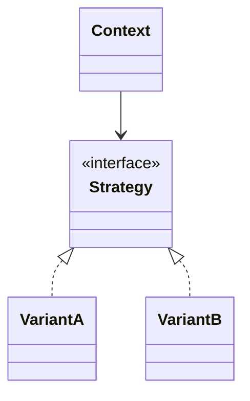
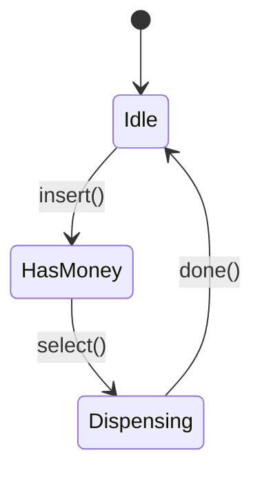

# Practical Design-Pattern Selection for LLD

> Self-contained. This article is a working engineer's guide to the *small* set of design patterns that actually earn their keep in LLD interviews — when to reach for each, and how to avoid the "pattern for pattern's sake" smell that senior interviewers punish.

You do not need all 23 Gang-of-Four patterns. In practice, LLD interviews revolve around a handful, and the skill being tested is **recognizing the variation point and naming the right pattern in one breath** — not reciting UML. Just as damaging as knowing no patterns is over-applying them: wrapping everything in a factory-of-factories reads as junior. This article gives you the short list and the trigger for each.

---

## The mental trigger: patterns solve *variation* and *lifecycle*

Almost every pattern you'll actually use answers one of two questions:

1. **"This behavior varies — how do I make it swappable?"** → Strategy, Factory, Observer, Decorator.
2. **"This object moves through states with different rules — how do I model that?"** → State, and its cousin Command (for reversible actions).

When you feel a pattern *might* fit, name which question you're answering. If you can't, you probably don't need a pattern — a plain class or a field is enough.

---

## The five patterns that carry LLD interviews

### 1. Strategy — pluggable behavior (the workhorse)

**Trigger:** an algorithm or policy that has multiple interchangeable variants. Pricing, splitting, eviction, scheduling, matching, routing.

**Why it dominates LLD:** interviewers *love* asking "now make it do X differently." If that behavior is behind a Strategy interface, your answer is "a new implementation" — the strongest possible response. This is the pattern to reach for first.



**Say it like:** "Fare varies, so I'll put it behind a `FareStrategy` interface; hourly, flat, and surge are implementations I inject."

### 2. State — objects with a lifecycle and per-state rules

**Trigger:** an object whose allowed actions depend on what state it's in. Vending machine, ATM session, order/booking/trip lifecycle, elevator, TCP-like protocols.

**Why it matters:** it replaces a swamp of `if (status == X)` checks scattered everywhere with each state owning its own transitions. Interviewers specifically probe illegal transitions ("what if they pay twice?"); the State pattern makes your answer clean.



**Say it like:** "The order is a state machine — `Created → PaymentPending → Confirmed`, with `Cancelled` reachable from the first two — so illegal transitions are rejected by the state, not by scattered ifs."

### 3. Observer — one event, many reactions

**Trigger:** something happens and an unknown/growing set of parties must react. Notifications, pub-sub, UI updates, "notify all subscribers when a new video is uploaded."

**Why it matters:** it decouples the publisher from the subscribers. Adding a new reaction is adding a subscriber, not editing the publisher.

**Say it like:** "Subscribers register with the topic; on publish the broker fans out to each — new subscriber types don't touch the publisher."

### 4. Factory (simple factory / factory method) — centralize creation

**Trigger:** object creation is non-trivial or depends on a type/config, and you want callers to not `new` concretes directly. Creating the right `Channel` from a config, the right `Piece` from a symbol.

**Why it matters (and the caution):** it keeps `new ConcreteThing()` out of business logic, which pairs naturally with Strategy. But don't build abstract-factory cathedrals for two types — a simple factory method is usually enough. Over-factoring is a classic junior tell.

**Say it like:** "A `ChannelFactory` maps a channel type to its implementation, so the service never `new`s a concrete channel."

### 5. Command — reversible / queueable actions

**Trigger:** actions you need to undo, redo, queue, log, or schedule. Text-editor edits, transaction operations, job queues, remote controls.

**Why it matters:** encapsulating an action as an object with `execute()`/`undo()` makes undo/redo a pair of stacks instead of a tangle. It's the canonical answer to "design undo."

**Say it like:** "Each edit is a `Command` with `execute` and `undo`; history is an undo stack and a redo stack."

---

## The supporting cast (use when they fit, don't force them)

- **Singleton** — one shared instance (a config, a connection pool). Useful but *overused*; mention it, note the testability/global-state downside, and prefer dependency injection where you can. Reflexively making everything a singleton is a red flag.
- **Decorator** — layer behavior around an object without subclassing (add buffering/compression to a stream, add-ons to a coffee order). Great when responsibilities stack.
- **Builder** — construct an object with many optional fields step by step (a complex `Pizza`/`Request`). Reach for it when a constructor would have eight parameters.
- **Adapter** — wrap an incompatible external interface to fit yours (a third-party payment SDK behind your `PaymentGateway`). Common when integrating.
- **Memento** — snapshot-and-restore state (an alternative to Command for undo when actions are hard to invert but state is cheap to copy).
- **Composite** — tree of uniform parts (file system: files and folders treated alike).

You won't use most of these in a given interview. Recognize them so that *when* the problem screams for one ("we need undo but the operations aren't easily invertible" → Memento), you can name it instantly.

---

## How to apply a pattern without the "pattern smell"

Interviewers penalize gratuitous patterns as much as missing ones. Guardrails:

- **Earn it.** Introduce a pattern only when you can name the variation/lifecycle it solves *in this problem*. "I'll use Strategy here because pricing has three interchangeable rules" — good. "Let's add a factory" with no reason — bad.
- **Start concrete, refactor to the pattern when the second case appears.** If there's only one pricing rule so far, a method is fine; the moment the interviewer adds a second, *that's* your cue to extract the Strategy. Narrating this ("now that there are two, I'll pull this into a `FareStrategy`") shows judgment better than pre-abstracting.
- **Keep the interface narrow.** One-method interfaces (`calculate`, `execute`, `allow`) are the sign of a well-placed pattern.
- **Don't stack patterns to show off.** A factory that builds strategies decorated by decorators observed by observers is a horror. Use the fewest patterns that make the design clean.

---

## Pattern-to-problem quick map

| Signal in the problem | Reach for |
|---|---|
| "Do this differently / multiple policies" | Strategy |
| "Object has states with different rules" | State |
| "Notify many when something happens" | Observer |
| "Undo / redo / queue / log actions" | Command (or Memento) |
| "Create the right type from config" | Factory |
| "One shared instance" | Singleton (sparingly) |
| "Add behavior in layers" | Decorator |
| "Many optional construction params" | Builder |
| "Wrap an incompatible API" | Adapter |
| "Tree of uniform parts" | Composite |

---

## A worked example

Prompt: **"Design a rate limiter."** A pattern-smelly answer starts with inheritance:

```text
abstract class RateLimiter
  TokenBucketRateLimiter
  FixedWindowRateLimiter
  SlidingWindowRateLimiter
```

That subclasses the whole service even though only one thing varies: the allow/deny algorithm. The service API, key extraction, metrics, and error handling do not need three copies. Prefer Strategy:

```python
from abc import ABC, abstractmethod
import time

class LimitAlgorithm(ABC):
    @abstractmethod
    def allow(self, key: str, now: float) -> bool:
        pass

class RateLimiter:
    def __init__(self, algorithm: LimitAlgorithm):
        self.algorithm = algorithm

    def allow(self, key: str) -> bool:
        return self.algorithm.allow(key, time.time())

class TokenBucket(LimitAlgorithm):
    def allow(self, key: str, now: float) -> bool:
        # Real token accounting is hidden here; the service stays unchanged.
        return True
```

Now your interview answer is precise: "The algorithm varies, so I use Strategy. `RateLimiter` is stable; token bucket and fixed window are implementations." If the interviewer asks for sliding window later, you add `SlidingWindow`, not a new service hierarchy. If they ask for per-user configuration, that may be a factory or repository concern — not a reason to decorate every class with another pattern.

---

## Further reading

- [Design Patterns](https://refactoring.guru/design-patterns) — quick pattern catalog for Strategy, State, Observer, Factory, Command, and supporting patterns.
- [Refactoring](https://refactoring.guru/refactoring) — useful for recognizing over-patterning and extracting patterns only when variation appears.
- [SOLID](https://en.wikipedia.org/wiki/SOLID) — grounding for open/closed and dependency inversion when introducing patterns.
- *Design Patterns* — GoF (Gamma, Helm, Johnson, Vlissides) — the original pattern language.
- *Head First Design Patterns* — Freeman & Robson — approachable practice for choosing patterns by intent.

---

## The bottom line

Master **Strategy, State, Observer, Factory, and Command** cold — they cover the large majority of LLD interviews. Know the supporting cast well enough to name on sight. And treat every pattern as an answer to a specific "how does this vary / how does this change state" question. If you can't state the question, skip the pattern. That discipline — patterns as tools with triggers, not as decoration — is exactly what a senior interviewer is listening for.
