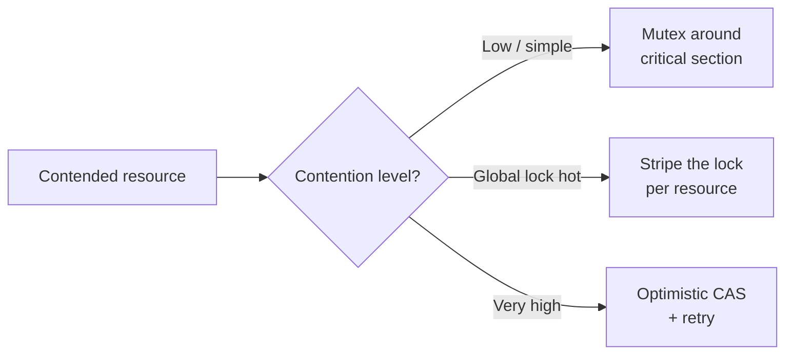
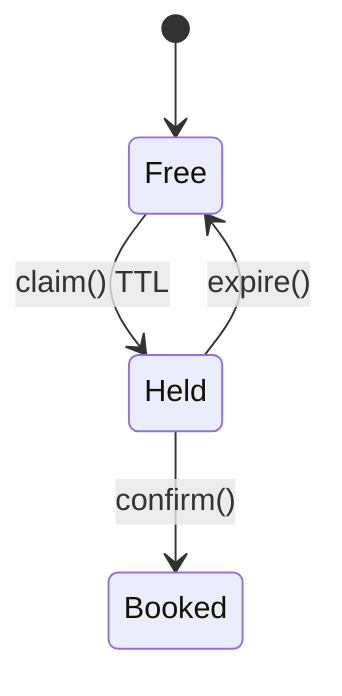
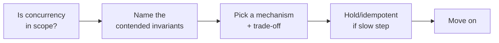

# Concurrency and Thread-Safety in LLD

> Self-contained. This article is about handling the concurrency question in an LLD interview *proportionally* — enough to prove you see the race, without disappearing into a lock-free rabbit hole that eats your remaining time.

Concurrency is where two opposite failures happen. Some candidates ignore it entirely and get dinged for missing an obvious race on the last parking spot. Others hear "what if two users do this at once?" and launch into a 20-minute treatise on memory barriers and lock-free rings, never finishing the design. The senior move is in between: **find the one resource that's actually contended, name a mechanism, state the trade-off, and move on.** This article shows you how to hit that middle reliably.

---

## First, ask whether concurrency is even in scope

Half of concurrency questions evaporate if you clarified scope. If you established "single-process, correctness over scale, one user flow," then concurrency may be genuinely out of scope — and saying so is a valid, senior answer: "For a single-threaded simulator this doesn't arise; if it's multi-threaded, here's the one place it bites." Don't invent concurrency the interviewer didn't ask for. But *do* be ready, because "now two users race" is the single most common LLD follow-up.

---

## The core skill: find the invariant(s) under contention

In most LLD problems there are a small number — often just one, sometimes two or three coupled ones — of **invariants that must stay true under concurrent access**. Your job is to name them and protect exactly those. Train yourself to scan for **shared mutable state that two operations can touch at once**, and ask "what must remain true here?":

| Problem | The contended invariant(s) |
|---|---|
| Parking lot | A spot holds at most one vehicle (two cars, last spot). |
| Movie booking | A seat is booked once — *and* the seat-lock, booking state, and payment callback stay consistent. |
| ATM / bank | The account balance never goes negative / isn't lost-updated (two withdrawals). |
| Ride-hailing | A driver is assigned to at most one trip (two riders, one driver). |
| LRU cache | The map and linked list stay in sync (update together). |
| Rate limiter | The per-key counter/bucket updates atomically. |
| Inventory / vending | Stock count never oversells an item. |

Notice the common shape: a **claim on a limited resource** — a seat, a spot, a driver, a unit of stock, a slot of quota. Often there's a single obvious one; but some problems have **several coupled invariants** (movie booking couples the seat hold, the booking's state transition, and idempotency of the payment webhook). Don't force "there is exactly one" — instead *rank* them and protect each. Point at them explicitly: "The races are here — two threads both see the seat free, and separately the payment callback can fire twice; everything else is read-only or thread-local."

Naming the invariants precisely earns most of the concurrency marks. You've proven you see the races and you've *bounded* them.

---

## Pick a mechanism, and know the trade-off in one line each

Once you've named the invariant, choose how to protect it. Have three tools ready and the one-line trade-off for each:

- **Pessimistic lock (mutex / synchronized block).** Grab a lock around the critical section (find-and-claim). *Simple and obviously correct; can become a contention bottleneck if the lock is coarse.* This is your default first answer.
- **Fine-grained / striped locking.** Lock per-resource or per-shard (a lock per level, per account, per key) instead of one global lock. *Reduces contention; more bookkeeping and risk of deadlock if you take multiple.* Reach for it when the interviewer says "the global lock is a bottleneck."
- **Optimistic / lock-free (compare-and-set, versioning).** Read state + version, compute, and CAS the change; retry if the version moved. *Great throughput under low contention; you must handle the retry/failure path and it's easy to get subtly wrong.* Offer it when contention is high and locks hurt, but don't *lead* with it live.

Say the trade-off out loud: "I'll start with a lock around spot-claim for correctness; if that lock gets hot, I'd stripe it per level; if we needed extreme throughput, an atomic compare-and-set on the spot state with a retry loop." That progression — correct first, optimize on demand — is exactly the judgment being tested.

---

## The claim-then-confirm pattern (holds/reservations)

Many "two users, one resource" problems (seat booking, ride matching) need more than a lock — they need a **temporary hold** because a human step (payment) sits in the middle. The clean model:

1. **Claim** the resource with a short-lived lock/flag → mark it `Held` with a TTL.
2. Do the slow step (payment) *outside* the lock.
3. **Confirm** (`Held → Booked`) or let the hold **expire** back to `Free`.

This avoids holding a lock across a slow payment (which would serialize everyone) while still preventing double-booking. Naming this pattern for booking/matching problems is a strong senior signal. The TTL handles the "user abandons checkout" case for free.

---

## Idempotency and atomic transitions: the quiet wins

Two more concepts that score cheaply when you drop them at the right moment:

- **Idempotent operations.** "Releasing a spot twice, or a retried payment webhook, must not double-apply." Designing `release()`/`confirm()` to be safe on repeat handles retries and at-least-once delivery. Say "I'll make this idempotent so retries are safe."
- **Check-and-act must be atomic.** The bug is almost always a gap between *checking* ("is it free?") and *acting* ("take it"). Whatever mechanism you pick, the check and the act must be inside the same critical section / same CAS. Verbalize this: "The check and the claim happen atomically, otherwise two threads both pass the check."

---

## Deadlock: mention the rule, don't lecture

If your design takes more than one lock (transfer between two accounts, moving stock between slots), name the classic avoidance in one line: **acquire locks in a consistent global order** (e.g., by id). That single sentence covers deadlock without a lecture. If you only ever take one lock at a time, say so — then deadlock can't happen and you can move on.

---

## What NOT to do

- **Don't retrofit concurrency everywhere.** Protect the one contended resource, not every getter. Slapping `synchronized` on every method is a junior tell and kills performance.
- **Don't design a lock-free data structure live** unless explicitly asked. Name that it's possible, note the complexity, and use a lock.
- **Don't confuse "thread-safe" with "correct."** A thread-safe map doesn't make a map+list pair consistent; the *pair* needs one lock. Protect invariants, not individual fields.
- **Don't ignore the slow step inside a lock.** Holding a lock across I/O (payment, network) serializes the system. Claim-then-confirm exists precisely to avoid this.

---

## The proportionate answer, summarized

Find the contended invariant(s) — often one, sometimes a few coupled — protect just those with the simplest mechanism that's correct, state the trade-off and the upgrade path, use claim-then-confirm when a slow step is involved, and make repeatable operations idempotent. Do that in three or four sentences and you've fully satisfied the concurrency dimension — without letting it swallow the design. The candidates who fail here aren't the ones who "didn't know locking"; they're the ones who either missed the race or fell into it and never climbed out.
