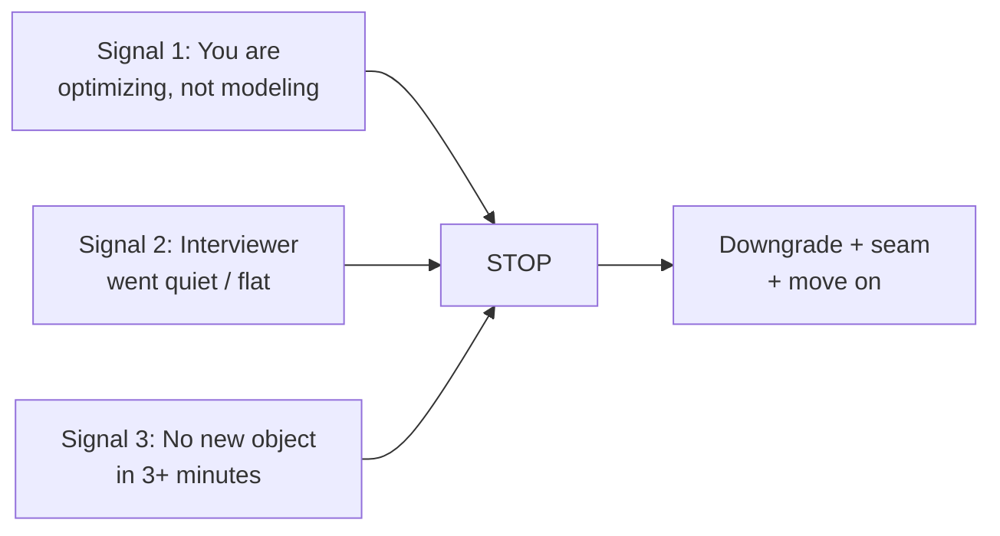

# Avoiding Rabbit Holes and Algorithm Traps

> Self-contained. This article targets the single most common way strong engineers fail LLD: they get pulled into a deep sub-problem — usually an algorithm — and never deliver the design the interviewer was actually scoring.

If you've walked out of an LLD interview thinking "I know I could have designed that, I just ran out of time / got stuck," this is almost certainly your failure mode. It is not a knowledge gap. It's a **prioritization and self-interruption** gap. LLD rewards a complete, clean, working model of a small domain. Rabbit holes trade that away for depth on something nobody asked about. This article is a field guide to spotting the holes and climbing out fast.

---

## Why smart engineers rabbit-hole (and why it's worse for them)

The pull into a rabbit hole is strongest for *good* engineers, for three reasons:

1. **Competence bias.** You're good at algorithms, so when you smell one, your instinct is to *solve it well* — that instinct served you everywhere else. In LLD it's a liability.
2. **Comfort-seeking under stress.** Modeling ambiguity is uncomfortable; a crisp algorithm is comfortable. Under interview stress you drift toward the comfortable thing.
3. **The problem *looks* like it wants it.** "Assign the nearest driver" *sounds* like it wants a spatial index. It doesn't — it wants a `MatchingStrategy` interface with a naive implementation.

The result: you produce a beautiful solution to the wrong question and an incomplete answer to the right one. The interviewer's notes read "got stuck / didn't finish," even though you were "working hard" the whole time.

---

## The classic rabbit holes, by problem

Recognize these on sight — each is a place the design does *not* need you to go deep:

| Problem | The tempting hole | What the interviewer actually wants |
|---|---|---|
| Ride-hailing | Build a quadtree/geohash index | `MatchingStrategy` with "nearest = linear scan for now" |
| Splitwise | Prove min-cash-flow debt simplification | Correct pairwise balances; simplification is optional |
| Elevator | Design an optimal scheduling algorithm | `SchedulingStrategy` with a simple SCAN/nearest-car |
| Chess | Full move legality + check detection | Board model + one piece's moves behind `MoveValidator` |
| Rate limiter | Distributed consensus on counters | Clean single-node token bucket |
| LRU cache | Prove the O(1) invariant formally | map + doubly-linked list, state O(1), move on |
| Vending machine | Optimal coin-change algorithm | Greedy change behind a seam; focus on the state machine |
| Text editor | Rope/gap-buffer implementation | Command pattern for edits + undo/redo stacks |

The through-line: **the "hard algorithm" almost always belongs behind an interface with a naive implementation.** That placement is the senior answer. The algorithm itself is not.

---

## The three-signal early-warning system

You can catch yourself *before* you're 8 minutes deep. Watch for these internal and external signals:

1. **You're optimizing, not modeling.** If your inner monologue is "how do I make this faster/optimal?" rather than "which object owns this?", you've left LLD and entered algorithms. Stop.
2. **The interviewer went quiet.** Engaged interviewers react. Flat silence usually means "this isn't what I'm scoring." Pause and ask.
3. **No new object or method has appeared in 3+ minutes.** LLD progress looks like the model growing. If the model is frozen while you scribble an algorithm, you're in a hole.

Any one of these fires → run the escape maneuver.

---

## The escape maneuver (memorize the sentence)

The way out of a rabbit hole is a single rehearsed move: **downgrade, seam, defer, move.**

> "I'll use the simplest thing that works here — a linear scan / a greedy pick / a hashmap — and hide it behind a `SomethingStrategy` interface so we can swap in a smarter version later. Let me get back to the flow."

That sentence does four things at once:

- **Downgrade** — replace the clever algorithm with the dumbest correct one.
- **Seam** — put it behind an interface so the "smart version" is a clean future swap (this actually *scores*, unlike implementing it).
- **Defer** — explicitly acknowledge the deeper problem so the interviewer knows you see it.
- **Move** — return control to the design.

Rehearse it until it's automatic. In the moment of temptation, you won't reason your way out — you'll fall back on the rehearsed reflex. That's why you practice the exact words.

---

## Pre-commit to the fence so you have something to stop *at*

You can't stop a rabbit hole if you never decided where the edge is. In the first minutes, when you set scope, **explicitly park the shiny sub-problems** ("debt simplification is out unless we have time," "I won't build a real spatial index"). Now when temptation hits, you're not making a hard call under stress — you're honoring a decision you already made calmly. The scope fence is your pre-commitment device. Without it, willpower alone loses.

---

## Let the interviewer *pull* you deep, don't dive on your own

Here's the reframe that fixes most cases: **depth in LLD should be interviewer-pulled, not candidate-pushed.** Your job is to lay out the complete model quickly and *offer* depth: "I've got a naive matcher behind an interface — want me to go deeper on the matching algorithm, or is the model enough?" Now depth happens only if they ask for it, which means you're never deep on something they don't value. Candidates who dive unprompted are gambling their clock on a guess about what the interviewer cares about. Don't gamble — ask.

---

## When the rabbit hole *is* the interview

Occasionally the interviewer genuinely wants the algorithm ("I specifically want you to implement the LRU eviction correctly"). The difference is they'll *tell* you and *stay engaged* while you do it. That's not a rabbit hole — that's the assignment. The escape maneuver still helps: do the focused thing they asked, state its complexity, and then resurface to the broader design. The skill is the same: match depth to demand.

---

## A worked example

Take an LRU cache prompt. The trap is spending 15 minutes proving pointer invariants: which node moves first, whether the tail is evicted before or after the map delete, what happens when capacity is one. Those details matter in implementation, but the LLD interview is first scoring whether you built a usable cache abstraction with the right seam.

The strong version is one sentence plus an interface boundary:

> "I'll implement LRU with a hashmap plus doubly-linked list so `get` and `put` are O(1): the map finds the node, and the list maintains recency by moving touched nodes to the front. I'll hide eviction behind `EvictionPolicy`, start with LRU, and only go into pointer cases if you want implementation detail."

Then move to the design:

- `Cache.get(key)` asks storage for the value and notifies `EvictionPolicy.recordAccess(key)`.
- `Cache.put(key, value)` writes the value; if capacity is exceeded, it asks `EvictionPolicy.evictKey()`.
- `LRUEvictionPolicy` owns the map+list detail; the cache service does not.

If the interviewer says, "Yes, implement LRU," then you go deeper. If they nod, you keep the interview on the service API, failure behavior, concurrency, and follow-ups. The same pattern works for rate limiters: "Token bucket allows bursts up to capacity and refills over time; I'll hide the math behind `RateLimitPolicy` and start single-node." That is enough unless they explicitly pull you into accuracy or distributed counters.

## Further reading

- [Design Patterns](https://refactoring.guru/design-patterns) — useful catalog for naming seams such as Strategy without over-explaining them.
- [Martin Fowler bliki](https://martinfowler.com/bliki/) — concise essays on design trade-offs, refactoring, and when abstractions help.
- *Design Patterns* — GoF — classic reference for Strategy and other patterns that keep hard algorithms behind replaceable boundaries.
- *A Philosophy of Software Design* — John Ousterhout — strong framing for reducing complexity by hiding deep implementation details behind simple interfaces.

---

## The one-paragraph takeaway

Your LLD failures are very likely not modeling failures — they're rabbit-hole failures. Pre-commit a scope fence that parks the shiny sub-problems. Watch three signals (optimizing not modeling, interviewer silence, frozen model). When any fires, run "downgrade, seam, defer, move." Make depth interviewer-pulled, not self-pushed. Do this and the exact competence that used to sink you — your algorithm chops pulling you off course — stays safely in your pocket, available if asked, invisible if not.
