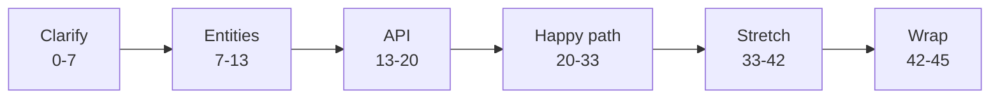
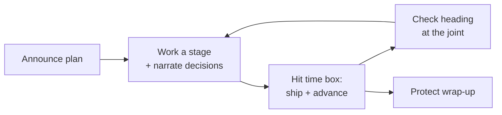

# Time-Boxing and Thinking Aloud

> Self-contained. This article is about the two mechanical skills that quietly decide LLD outcomes: managing the 45-minute clock so you finish, and narrating your thinking so the interviewer can score you.

You can have great instincts and still fail LLD by mismanaging time (running out before the design works) or by going silent (the interviewer can't see your reasoning, so they can't give you credit). Both are fixable with technique, not talent. This article gives you the clock discipline and the narration habits that turn "good engineer, unclear interview" into a clear pass.

---

## Part 1: Time-boxing — finish over perfect

### The budget, and why you announce it

A workable 45-minute budget:

Announce it up front: "I'll spend a few minutes scoping, then the core model and API, then walk the main flow, and leave time for extensions." This does two things: it shows the interviewer you have a plan (senior signal), and it gives them a chance to redirect ("actually, skip scoping, I want to see the concurrency"). Now you're both driving to the same finish line.

### The prime directive: a complete rough design beats a perfect fragment

The most important time rule in LLD: **always have a complete, end-to-end-working design at low resolution before you deepen any part.** Get all six stages to a rough "done," *then* circle back to add detail where the interviewer wants it. Candidates fail by perfecting the entity model for 25 minutes and never reaching a working flow. An interviewer can score a rough-but-complete design; they can't score a beautiful half.

Think of it as **progressive refinement**: pass one gets you a skeleton that works; pass two adds muscle where it matters. Never let pass one stall.

### Hard rules for the clock

- **Time-box each stage and enforce the boundary out loud.** "I've spent my modeling budget; the API's good enough — moving to the flow." Saying it keeps you honest and shows discipline.
- **When a stage overruns, ship what you have.** Leave a TODO ("I'd refine spot-selection later") and advance. You can return if time allows.
- **Glance at the clock at the joints,** not constantly. After entities, after the happy path — quick checks, then re-immerse.
- **Protect the last 3 minutes for wrap-up.** A crisp summary is disproportionately valuable because it's what the interviewer writes in their notes. Never let the clock eat it.
- **If you're behind, cut breadth, not the core.** Drop the third use case, not the working happy path. Depth-on-core beats broad-and-broken.

### Recovering when you've lost track of time

If you look up and it's minute 35 with no working flow, don't panic-code. Say: "Let me make sure we have an end-to-end story." Then narrate the happy path at whatever resolution you can and summarize. A candidate who *recognizes* they're behind and course-corrects reads far better than one who obliviously keeps polishing a corner.

---

## Part 2: Thinking aloud — make your reasoning scoreable

### A note on the "say this out loud" scripts in this playbook

Throughout these articles you'll see example lines to say. Treat them as **the intent and shape of a good sentence, not a script to memorize**. Reciting a polished monologue verbatim sounds robotic and, worse, brittle — the moment the interviewer interrupts, a memorized speech collapses. Internalize the *pattern* ("decision + because + trade-off," "here's the seam, here's the delta") and say it in your own words, differently each time. A staff-level candidate sounds like they're thinking, not performing. If a suggested line doesn't sound like you, rephrase it until it does.

### The interviewer scores what you *say*, not what you think

This is the mental shift: your silent brilliance is invisible. If you consider three options and pick one without a word, the interviewer sees only "he wrote a class." Narrate the *decision*: "I could model vehicle types as subclasses or as an enum; subclasses only differ in size here, so I'll use an enum and save the hierarchy for real behavior differences." Now they see judgment, trade-off awareness, and restraint — three checkmarks — from one sentence.

### Narrate trade-offs, not just conclusions

Weak: "I'll use a hashmap." Strong: "I'll key bookings by id in a hashmap for O(1) lookup; the trade-off is no ordering, which we don't need here." The trade-off clause is where seniority shows. Make a habit of "I'll do X because Y, trading off Z." Even when the choice is obvious to you, voicing the *why* is what earns the mark.

### Externalize your structure so they can follow

- **Say the stage you're entering.** "Now the core objects." "Now let me walk the main flow." This gives the interviewer a map and keeps *you* organized.
- **Write as you talk.** Keep the entity list, API signatures, and diagrams on the board. A visible structure lets the interviewer point ("what about this object?") and keeps you from losing your own thread.
- **Verbalize assumptions the moment you make them.** "I'm assuming single-process." Silent assumptions are where misunderstandings (and lost points) hide.

### Handle silence and thinking pauses gracefully

You don't have to fill every second, but don't go dark for a minute. Signpost your thinking: "Let me think about the concurrency here for a moment." That tells the interviewer you're working, not stuck, and invites them to help if you are. A narrated pause is fine; a silent stall looks like being lost.

### Take the interviewer's input as a gift

When they ask a question or suggest something, *engage with it visibly*: "Good point — if payment fails mid-booking, I need to release the held seats; let me add that to the state machine." Incorporating input out loud shows collaboration and often *is* the hint that saves you. Candidates who defensively brush off questions to protect their plan score badly; the interview is a pair-design, not a solo performance.

---

## Putting both together: the rhythm of a strong LLD hour

The rhythm is: announce the plan → work each stage while narrating decisions and trade-offs → enforce the time box and advance even when imperfect → check heading at the joints → protect the final summary. It feels almost boringly systematic — and that's the point. The systematic candidate finishes with a complete, clearly-reasoned design. The improviser produces a brilliant fragment and an interviewer who couldn't follow it.

---

## The takeaway

Two mechanical habits carry more weight than most people realize. **Time-box to guarantee a complete design before deepening anything**, and **narrate every decision and trade-off so your reasoning is visible and scoreable.** Neither requires more design skill than you already have — they just make the skill you have actually *count* in the room. If past interviews felt like "I knew it but it didn't land," these are almost certainly the missing habits.
