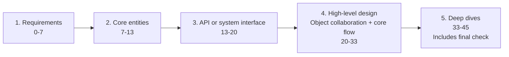
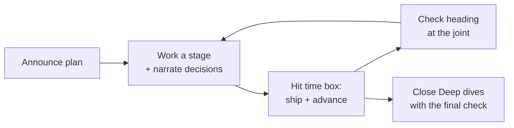

# Time-Boxing and Thinking Aloud

> Self-contained. This article is about the two mechanical skills that quietly decide LLD outcomes: managing the 45-minute clock so you finish, and narrating your thinking so the interviewer can score you.

**Stage-focused coaching, not a separate design framework:** manage time and communication across [1. Requirements](interview-template.html#requirements), [2. Core entities](interview-template.html#core-entities), [3. API or system interface](interview-template.html#api), [4. High-level design](interview-template.html#high-level-design), and [5. Deep dives](interview-template.html#deep-dives). In LLD, High-level design is object collaboration plus a working core flow, not distributed infrastructure.

You can have great instincts and still fail LLD by mismanaging time (running out before the design works) or by going silent (the interviewer can't see your reasoning, so they can't give you credit). Both are fixable with technique, not talent. This article gives you the clock discipline and the narration habits that turn "good engineer, unclear interview" into a clear pass.

---

## Part 1: Time-boxing — finish over perfect

### The budget, and why you announce it

An **illustrative local 45-minute budget**, not timing guidance attributed to Hello Interview:

Within Deep dives, use 33–42 for selected trade-offs, concurrency, follow-ups, and tests; keep 42–45 for the final check. That check is not a sixth stage. Adapt the local budget to the actual interview format.

Announce it up front: "I'll cover requirements, core entities, and the API, then show object collaboration and a working core flow, and leave time for deep dives and a final check." This does two things: it shows the interviewer you have a plan (senior signal), and it gives them a chance to redirect ("keep scoping brief; I want to see the concurrency"). Now you're both driving to the same finish line.

### The prime directive: a complete rough design beats a perfect fragment

The most important time rule in LLD: **always have a complete, end-to-end-working design at low resolution before you deepen any part.** Get Requirements through High-level design to a rough "done," then use Deep dives for the most important detail and a final check. Those are five stages, not a separate flow/stretch/wrap framework. Candidates fail by perfecting the entity model for 25 minutes and never reaching a working flow. An interviewer can score a rough-but-complete design; they can't score a beautiful half.

Think of it as **progressive refinement**: pass one gets you a skeleton that works; pass two adds muscle where it matters. Never let pass one stall.

### Hard rules for the clock

- **Time-box each stage and enforce the boundary out loud.** "The API contracts are clear enough — moving to High-level design to trace the objects." Saying it keeps you honest and shows discipline.
- **When a stage overruns, ship what you have.** Leave a TODO ("I'd refine spot-selection later") and advance. You can return if time allows.
- **Glance at the clock at the joints,** not constantly. After entities, after the happy path — quick checks, then re-immerse.
- **Protect the last 3 minutes for the final check within Deep dives.** Check functional and nonfunctional requirements, summarize key trade-offs, and name deferred work. A crisp summary is valuable because it's what the interviewer writes in their notes. Never let the clock eat it.
- **If you're behind, cut breadth, not the core.** Drop the third use case, not the working happy path. Depth-on-core beats broad-and-broken.

### Recovering when you've lost track of time

If you look up and it's minute 35 with no working flow, don't panic-code. Say: "Let me make sure we have an end-to-end story." Then narrate the happy path at whatever resolution you can and summarize. A candidate who *recognizes* they're behind and course-corrects reads far better than one who obliviously keeps polishing a corner.

---

## Part 2: Thinking aloud — make your reasoning scoreable

### A note on the "say this out loud" scripts in this playbook

Throughout these articles you'll see example lines to say. Treat them as **the intent and shape of a good sentence, not a script to memorize**. Reciting a polished monologue verbatim sounds robotic and, worse, brittle — the moment the interviewer interrupts, a memorized speech collapses. Internalize the *pattern* ("decision + because + trade-off," "here's the seam, here's the delta") and say it in your own words, differently each time. A staff-level candidate sounds like they're thinking, not performing. If a suggested line doesn't sound like you, rephrase it until it does.

### The interviewer scores what you *say*, not what you think

This is the mental shift: your silent brilliance is invisible. If you consider three options and pick one without a word, the interviewer sees only "he wrote a class." Narrate the *decision*: "I could model vehicle types as subclasses or as an enum; subclasses only differ in size here, so I'll use an enum and save the hierarchy for real behavior differences." Now they see judgment, trade-off awareness, and restraint — three checkmarks — from one sentence.

### Narrate trade-offs, not just conclusions

Weak: "I'll use a hashmap." Strong: "I'll key bookings by id in a hashmap for O(1) lookup; the trade-off is no ordering, which we don't need here." The trade-off clause is where seniority shows. Make a habit of "I'll do X because Y, trading off Z." Even when the choice is obvious to you, voicing the *why* is what earns the mark.

### Externalize your structure so they can follow

- **Say the stage you're entering.** "Now Core entities." "Now High-level design: let me walk the objects through the main flow." This gives the interviewer a map and keeps *you* organized.
- **Write as you talk.** Keep the entity list, API signatures, and diagrams on the board. A visible structure lets the interviewer point ("what about this object?") and keeps you from losing your own thread.
- **Verbalize assumptions the moment you make them.** "I'm assuming single-process." Silent assumptions are where misunderstandings (and lost points) hide.

### Handle silence and thinking pauses gracefully

You don't have to fill every second, but don't go dark for a minute. Signpost your thinking: "Let me think about the concurrency here for a moment." That tells the interviewer you're working, not stuck, and invites them to help if you are. A narrated pause is fine; a silent stall looks like being lost.

### Take the interviewer's input as a gift

When they ask a question or suggest something, *engage with it visibly*: "Good point — if payment fails mid-booking, I need to release the held seats; let me add that to the state machine." Incorporating input out loud shows collaboration and often *is* the hint that saves you. Candidates who defensively brush off questions to protect their plan score badly; the interview is a pair-design, not a solo performance.

---

## Putting both together: the rhythm of a strong LLD hour

This is a communication loop within the five delivery stages, not another design outline:

The rhythm is: announce the plan → work each stage while narrating decisions and trade-offs → enforce the time box and advance even when imperfect → check heading at the joints → close Deep dives with the final check. It feels almost boringly systematic — and that's the point. The systematic candidate finishes with a complete, clearly-reasoned design. The improviser produces a brilliant fragment and an interviewer who couldn't follow it.

---

## A worked example

Prompt: "Design a parking lot." You have vehicles, spots, tickets, and the public API. The interviewer asks about concurrent entry at the same level.

A strong think-aloud response is short:

> "I'll keep this bounded: the contended resource is the free spot set for a level, not the entire lot. For correctness I'll use a per-level lock around find-and-claim; that lets two different levels proceed independently, and if it becomes hot we can shard by spot type."

Then you immediately return to the flow:

> "So the entry flow is: `ParkingLot.park(vehicle)` selects a level, the level claims one compatible spot under its lock, then the lot issues a ticket. I won't hold the lock while printing or charging; the protected section is just choosing and marking the spot."

That answer demonstrates judgment because it does four things quickly: it names the race, chooses a mechanism, states the trade-off, and keeps the design moving. It also preserves the clock. You delivered the concurrency follow-up and still have time to show exit, fee calculation, and summary.

If you catch yourself going silent, narrate the pause:

> "Give me ten seconds to choose the lock boundary; I want it narrow enough that level A does not block level B."

Now the interviewer sees active reasoning instead of a stall.

## Further reading

- [SOLID](https://en.wikipedia.org/wiki/SOLID) — vocabulary for explaining design choices and trade-offs quickly.
- [Martin Fowler bliki](https://martinfowler.com/bliki/) — short design essays that model crisp technical narration.
- *Clean Code* — Robert C. Martin — useful for naming, small responsibilities, and making design intent readable.
- *A Philosophy of Software Design* — John Ousterhout — practical framing for reducing complexity while communicating design clearly.

---

## The takeaway

Two mechanical habits carry more weight than most people realize. **Time-box to guarantee a complete design before deepening anything**, and **narrate every decision and trade-off so your reasoning is visible and scoreable.** Neither requires more design skill than you already have — they just make the skill you have actually *count* in the room. If past interviews felt like "I knew it but it didn't land," these are almost certainly the missing habits.
