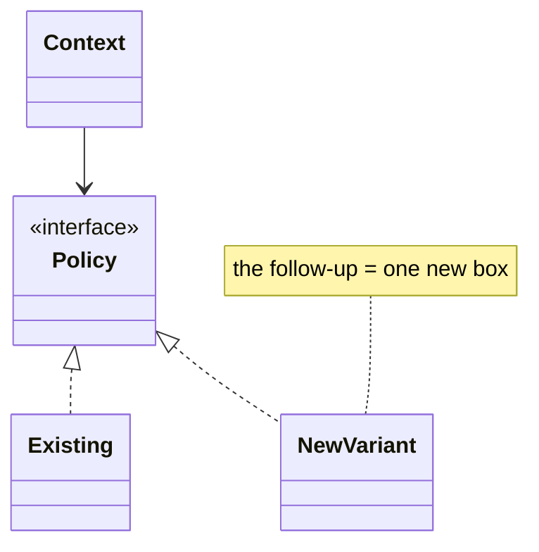

# Handling Follow-ups and Extensibility

> Self-contained. This article is about the back half of the LLD interview — the part where the interviewer stops asking you to design and starts *stretching* what you built. How you absorb those curveballs is often the deciding factor.

The first 20 minutes of an LLD interview are you talking. The last 20 are a conversation, driven by the interviewer throwing new requirements at your design: "now add surge pricing," "what if the seat hold expires," "support a second payment method." These aren't gotchas — they're the *main event*. The interviewer is measuring whether your design can bend without breaking, and whether you can extend it calmly. Candidates who built the right seams sail through; candidates who hard-coded everything start visibly rewriting and sink. This article is how to be the former.

---

## Reframe: follow-ups are the point, not an interruption

A new requirement mid-interview is not a sign you missed something. It's the interviewer *using your design as a platform* to probe extensibility. Internalizing this changes your body language from defensive ("but I already…") to welcoming ("great, let's see if the design handles it"). The best answer to almost every follow-up is short and confident: **"That's a new implementation of an interface I already have"** — or, if you don't have the seam, "let me add one seam here," done in a sentence rather than a refactor.

---

## The extensibility test: every change should be "a new class," not "an edit"

The gold standard your design is aiming for is the **Open/Closed principle**: open for extension, closed for modification. Concretely, when the interviewer adds a variant, you want to *add* code, not *rewrite* it. This is why the framework insists on putting variation behind interfaces early — so that later:

| Follow-up | Weak design | Strong design |
|---|---|---|
| "Add weekend pricing" | edit the fare `if/else` | new `FareStrategy` |
| "Add SMS as well as email" | edit the send method | new `Channel` |
| "Add LFU eviction" | rewrite the cache | new `EvictionPolicy` |
| "Add a new order state" | add flags + scattered ifs | new state in the machine |

If your follow-up answers keep being "I'll add a class here," you're demonstrating exactly what the interview measures. If they keep being "let me rewrite that method," your seams were in the wrong place.

**A caveat, so this doesn't turn into class-proliferation:** "closed for modification" means the *change is localized behind the right seam* — not that every tweak must become a brand-new class. Sometimes the cleanest extension is a new config value, a new enum case handled in one cohesive place, or a parameter on an existing policy. A senior interviewer will push back if you spawn a new `Strategy` subclass for what is really one data-driven rule. The judgment being tested is "where is the seam, and what is the smallest change that respects it" — occasionally that's a new class, occasionally it's an edit in exactly one well-chosen spot.



---

## The categories of follow-up, and the standard move for each

Nearly every LLD curveball falls into one of five buckets. Rehearse the standard response to each:

- **New behavior variant** ("price it differently," "match drivers differently"). → Point to the existing Strategy interface; the variant is a new implementation. If there's no interface yet, *extract one now* in a sentence and note why this is the natural seam.
- **New state or transition** ("what if payment fails after the hold?"). → Add it to the state machine explicitly; show the new transition. Illegal-transition questions are answered by "the state rejects it."
- **Concurrency stretch** ("two users at once"). → Name the one contended resource, pick a lock/CAS, state the trade-off. (Proportionate, not a lock-free thesis.)
- **New entity / relationship** ("now support groups, not just users"). → Add the object with a one-line responsibility and wire it by composition; don't reshuffle the whole model.
- **Scale / persistence stretch** ("what if this is distributed / needs to survive restart?"). → Acknowledge it's a bigger change, identify the seam (a repository/store interface) where persistence plugs in, and describe the delta rather than redesigning live.

Knowing which bucket a question is in tells you the move instantly, so you answer in seconds instead of stalling.

---

## Answer in bounded chunks, then hand back control

The skill that separates senior candidates here is **bounded responses**. A follow-up is an invitation to demonstrate one thing, not to monologue for five minutes. The rhythm:

1. **Restate** the change in one line so you're solving the right thing ("so fares differ on weekends").
2. **Locate** it in your design ("this lives behind `FareStrategy`").
3. **Show the delta** ("a `WeekendFare` implementation; the service is untouched").
4. **Stop and check** ("want me to sketch it, or is that enough?").

That last step is crucial. Watch the interviewer — if they nod and move on, *stop talking*. Over-answering a follow-up burns the time you need for the next one and can drag you into a rabbit hole. Give the tight answer, then yield.

---

## When you *don't* have the seam: extract, don't rewrite

Sometimes the follow-up hits a spot you hard-coded. Don't panic-rewrite. Do this:

> "Right now pricing is inline. To support this cleanly I'll pull it behind a `PricingStrategy` interface — one extraction — and then weekend pricing is just an implementation."

You've turned a design gap into a demonstration of *refactoring toward extensibility*, which is itself a senior signal. Naming the seam and the single extraction beats silently rewriting a method, and it beats pretending the gap isn't there. Interviewers respect "here's the clean way to make this extensible" far more than a defensive scramble.

---

## Don't over-engineer for follow-ups that haven't come

The mirror-image mistake: building seams for *every imaginable* future change up front. That produces a bloated, abstract design and burns your early time. The discipline is **YAGNI with a fast retrofit**: build seams only at the variation points the *problem* clearly implies (pricing usually varies; matching usually varies), and for everything else keep it concrete but *know where you'd cut the seam* if asked. When the follow-up arrives, you extract in one move. This gives you a lean design *and* graceful extension — the best of both. Speculative abstraction is as much a red flag as hard-coding.

---

## Handling the "I don't think that works" pushback

Sometimes the interviewer challenges your design directly ("wouldn't that double-book?"). This is a gift — they're showing you the exact thing they want addressed. Do not get defensive. Engage: "Let me trace it… yes, if two threads hit this between check and claim, it double-books; I'd make the check-and-claim atomic under the seat lock." Fixing a flaw *with* the interviewer, out loud, scores better than a flawless design delivered defensively. The willingness to find and fix your own bug on the fly is a strong senior trait.

---

## A worked example

You designed a parking lot with:

- `FeeCalculator` depending on a `PricingStrategy`
- `Ticket` carrying entry time, exit time, vehicle type, and spot type
- `PaymentService` consuming the amount returned by the calculator

The interviewer asks, "Now weekend pricing is different." The weak answer is to edit `calculateFee()` with `if (day == SATURDAY || day == SUNDAY)`. That works once, then collapses when they ask for holiday pricing, event pricing, or member discounts.

The bounded extensibility answer:

> "That is a new `PricingStrategy`, not a rewrite. `FeeCalculator` already depends on the strategy interface; I'll add `WeekendPricingStrategy` and choose it based on the ticket timestamp or a small strategy selector. The payment flow and ticket model stay unchanged."

Sketch only the delta:

```java
interface PricingStrategy {
    int priceCents(Ticket ticket);
}

final class Ticket {
    private final int durationHours;

    Ticket(int durationHours) {
        this.durationHours = durationHours;
    }

    int durationHours() {
        return durationHours;
    }
}

final class WeekendPricingStrategy implements PricingStrategy {
    private final int centsPerHour;

    WeekendPricingStrategy(int centsPerHour) {
        this.centsPerHour = centsPerHour;
    }

    public int priceCents(Ticket ticket) {
        return ticket.durationHours() * centsPerHour;
    }
}
```

The point is not the pricing constant; the point is the shape of the change: one implementation behind an existing seam, zero edits to the checkout flow. If the follow-up were "add push notifications," the same answer is a `NotificationChannel` adapter. If it were "add LFU eviction," it is a new `EvictionPolicy`. Good seams convert curveballs into additive changes.

## Further reading

- [SOLID](https://en.wikipedia.org/wiki/SOLID) — especially Open/Closed and Dependency Inversion for follow-up-friendly designs.
- [Design Patterns](https://refactoring.guru/design-patterns) — quick reference for Strategy, Adapter, and State as common LLD seams.
- *Design Patterns* — GoF — deeper catalog of the extension patterns interviewers expect you to recognize.
- *Effective Java* — Joshua Bloch — pragmatic guidance on interfaces, composition, and avoiding unnecessary inheritance.

---

## The takeaway

The follow-up phase is where LLD interviews are won or lost, and it rewards *structure you laid earlier*: variation behind narrow interfaces, lifecycle in an explicit state machine, one clear concurrency point. With those in place, every curveball becomes "a new class" or "a new transition" — a few confident sentences, then you hand control back. Categorize the follow-up, show the delta, bound your answer, and stay collaborative when challenged. That composure under stretching is exactly the senior signal the interviewer is hunting for.
