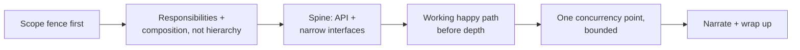

# The LLD Interview Common-Mistakes Checklist

> Self-contained. A fast, scannable list of the mistakes that actually sink LLD interviews for otherwise-strong engineers — each paired with the concrete fix. Read it the night before an interview.

Most LLD failures are not exotic. They're the same dozen mistakes repeated across candidates and problems. If you're strong at system design but keep stumbling in LLD, your leak is almost certainly on this list. Skim it, find the two or three that describe your past interviews, and drill the fixes.

---

## Process mistakes (these sink more candidates than modeling ever does)

**1. Designing before scoping.**
*Symptom:* you start drawing classes in minute one and build the wrong thing.
*Fix:* spend the first 7 minutes writing an explicit IN-scope / OUT-of-scope list and getting the interviewer to nod. Design nothing until the fence is set.

**2. Rabbit-holing into an algorithm.**
*Symptom:* you spend 15 minutes on nearest-driver search, coin change, or debt simplification.
*Fix:* the hard algorithm goes *behind an interface* with a naive implementation. Say "linear scan for now, swappable later," and move. Depth should be interviewer-pulled, not self-pushed.

**3. Never reaching a working flow.**
*Symptom:* beautiful entity model, but you never showed a car actually getting parked.
*Fix:* get a complete rough design end-to-end *before* deepening anything. A complete low-res design beats a perfect fragment. Protect 13+ minutes for walking the happy path.

**4. Going silent.**
*Symptom:* you reason brilliantly in your head; the interviewer sees a quiet person writing.
*Fix:* narrate every decision as a trade-off — "X because Y, trading off Z." The interviewer scores what you *say*, not what you think.

**5. Misreading the ask / not checking heading.**
*Symptom:* you go deep on something the interviewer didn't care about.
*Fix:* at natural joints, ask "deeper here, or move on?" Let their answer steer depth. Read their reactions — silence usually means "wrong level."

**6. Losing the clock.**
*Symptom:* you look up at minute 40 with no summary and half a design.
*Fix:* time-box each stage, enforce boundaries out loud, and reserve the last 3 minutes for a wrap-up. The summary is what they write in their notes.

---

## Modeling mistakes

**7. Hunting for the perfect inheritance hierarchy.**
*Symptom:* 10 minutes debating whether `Truck` extends `Vehicle`.
*Fix:* lead with one-line *responsibilities*, wire with *composition* (has-a), and use *enums* for types that differ only in data. Reach for polymorphism only where behavior varies.

**8. The god object / anemic model.**
*Symptom:* one giant `Service` holds all logic; every other class is a bag of getters.
*Fix:* push behavior onto the object that owns the data (`spot.release()`, not `service.freeSpot(spot)`). One responsibility per class; if the sentence has "and," split it.

**9. Over-engineering with gratuitous patterns.**
*Symptom:* a factory building strategies decorated by decorators, for a two-case problem.
*Fix:* introduce a pattern only when you can name the variation/lifecycle it solves *here*. Start concrete; extract the pattern when the second case appears. Fewest patterns that make it clean.

**10. No spine — a class diagram with no API.**
*Symptom:* boxes and lines, but you fumble "how does a client actually use this?"
*Fix:* define the public methods (verbs mirroring the use case) and 1–2 narrow interfaces at the variation points *before* filling in bodies.

**11. Modeling breadth you scoped out.**
*Symptom:* 15 classes in the first pass covering features you marked out-of-scope.
*Fix:* cap the first pass at 5–9 objects on the core use case. Add more only when a follow-up demands it.

---

## Correctness and detail mistakes

**12. Ignoring the concurrency point.**
*Symptom:* you never mention that two cars can race for the last spot.
*Fix:* find the *one* contended resource (a seat, a spot, a balance, a driver), protect just it, state the mechanism and trade-off. Proportionate — not a lock-free thesis.

**13. Scattered state instead of a state machine.**
*Symptom:* `if (status == PAID && !cancelled && ...)` checks sprinkled everywhere.
*Fix:* model lifecycle as an explicit state machine; each state owns its legal transitions. Illegal transitions are rejected by the state.

**14. Returning null / ignoring failure paths.**
*Symptom:* methods return null on failure; the "what if it fails?" question catches you flat.
*Fix:* name failures as exceptions or explicit result types up front ("returns a ticket or throws LotFull, never null"). Interviewers always probe error paths.

**15. Skipping edge cases entirely.**
*Symptom:* only the happy path exists; lost ticket, empty lot, double-release aren't mentioned.
*Fix:* in the stretch phase, *name* the edges fast (lost ticket, lot full, clock skew, idempotent release). Naming them scores nearly as well as handling them.

---

## Communication and collaboration mistakes

**16. Defensiveness under challenge.**
*Symptom:* interviewer says "wouldn't that double-book?" and you argue instead of checking.
*Fix:* treat challenges as gifts — trace the flow with them, find the bug, fix it out loud. Fixing your own flaw collaboratively is a strong senior signal.

**17. Over-answering follow-ups.**
*Symptom:* every curveball turns into a five-minute monologue; you run out of time.
*Fix:* answer in bounded chunks — restate, locate in the design, show the delta, then stop and check. Yield when they nod.

**18. Not verbalizing assumptions.**
*Symptom:* silent assumptions cause a mid-interview misunderstanding.
*Fix:* say assumptions as you make them ("assuming single-process, correctness over scale").

---

## The pre-interview one-page reminder

- Scope before you design; write IN/OUT and get a nod.
- Responsibilities and composition over hierarchies; enums for data-only types.
- Give it a spine: public API + narrow interfaces at variation points.
- Complete working flow before deepening anything.
- One contended resource, protected proportionately.
- Patterns only where variation/lifecycle demands them.
- Narrate trade-offs; check heading at the joints; protect the wrap-up.

---

## How to use this list

Don't try to fix all 18 at once. Look back at your last one or two failed LLD interviews and honestly tag which mistakes happened. For most strong-but-struggling engineers, it's a small cluster — usually some mix of #2 (rabbit-holing), #3 (no working flow), #4 (silence), and #6 (clock). Drill those specific fixes on two or three practice problems and the pattern breaks. The mistakes on this list are habits, and habits are trainable.
