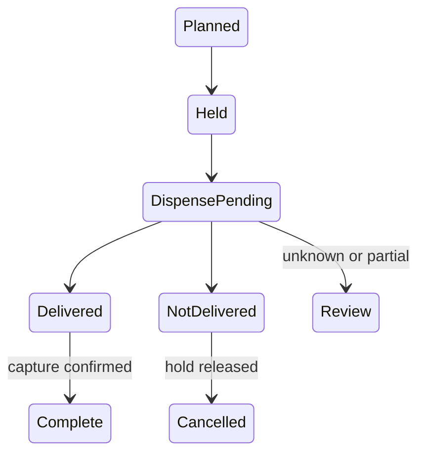

# Design an ATM Withdrawal Component

Coordinate authenticated withdrawals, exact note reservations, and bank settlement without guessing whether an uncertain cash dispense succeeded.

LLD stages: [Requirements](#requirements) → [Core entities](#core-entities) → [API or system interface](#api) → [High-level design](#high-level-design) → [Deep dives](#deep-dives).

## 1. Requirements
{: #requirements }

### Functional requirements

Withdraw through authenticated bank sessions, expose withdrawal status, and reconcile uncertain delivery through a privileged recovery operation. Amounts use integer minor units in one currency.

### Non-functional and execution constraints

One process accepts concurrent commands but permits one unresolved dispense. Durable transactions store intent, note reservations, and bank-operation IDs. Session expiry uses monotonic time; restart invalidates sessions.

Cash planning uses bounded dynamic programming over D denominations and amount A in the smallest cash unit. Enumerating each cassette's usable counts costs O(A × sum(count+1)) time and O(DA) memory. Configure maximum amounts and cassette counts.

### Out of scope

Exclude deposits, PIN verification, transfers, and bank-ledger implementation. Require bank-hold and hardware-outcome contracts. This is not certified mechanical control software.

## 2. Core entities
{: #core-entities }

`WithdrawalService` owns transitions. `CashInventory` owns cassette counts and reservations. `Withdrawal` owns customer/account references, amount, note plan, bank hold ID, and dispense ID. `Session` grants account authorization, never owns balances.

Reserved notes cannot exceed inventory. The plan's denomination sum equals the requested amount exactly. An ambiguous dispense blocks further withdrawals until reconciliation. A completed withdrawal requires both confirmed cash delivery and confirmed bank capture.

## 3. API or system interface
{: #api }

`withdraw(sessionId, requestId, amountMinor) -> WithdrawalStatus` requires an authenticated, unexpired session authorized for its account. Errors are `InvalidSession`, `InvalidAmount`, `CashUnavailable`, `InsufficientFunds`, or `Busy`. Request IDs are customer-scoped: identical retries return the withdrawal; changed payload returns `Conflict`.

`status(sessionId, withdrawalId)` requires a valid session for the owning customer and account, returning `WithdrawalStatus`, `InvalidSession`, or `NotFound` for missing/nonowned records. Authenticate and authorize before returning any withdrawal, including retries. `reconcile(recoveryCredential, withdrawalId, evidence)` requires separate recovery privileges.

Bank `hold`, `capture`, and `release` require stable keys and status lookup. Device `dispense(dispenseId, notePlan)` reports delivery, non-delivery, or uncertainty.

## 4. High-level design
{: #high-level-design }

`WithdrawalService` validates the session's authorization, currency, bounds, and idempotency before asking `CashInventory` for a feasible note plan. Compute that plan using a `(D+1) × (A+1)` table: each row tries permitted counts of its denomination and records a feasible predecessor. Backtrack the plan. Atomically reserve notes and persist `Planned`.

Request a bank hold outside the transaction. Definitive refusal releases notes. Persist `Held`, then dispense intent before invoking the device. Confirmed delivery atomically subtracts physical and reserved notes and records `Delivered`; then capture funds. Failed capture requires reconciliation, never another dispense.

For proven zero delivery, release the hold and reservations. Partial delivery or lost acknowledgement enters `Review`. Preserve evidence; an operator or trusted device journal must establish delivered notes before adjusting inventory and bank amounts.

## 5. Deep dives
{: #deep-dives }

### Trade-offs and extensions

One unresolved dispense reduces throughput but keeps uncertain cassette counts out of later plans. Authenticated balance queries can extend the component without sharing its actuator. Partial settlement requires an explicit bank contract.

### Concurrency and failure handling

Transactions serialize inventory and withdrawal transitions. External calls occur outside locks. Recovery queries bank and device journals with existing IDs. Never automatically refund or retry cash dispensing after a timeout: cash may already be in the customer's hands. If the device lacks durable deduplication and outcome lookup, require manual reconciliation. Holds must remain protected during uncertainty; expiry requires escalation and accounting resolution, not an assumption of non-delivery.

### Test cases

- Cash unit 1000; notes 5000×1, 2000×3; request 6000: three 2000 notes, 21 table cells, at most 42 count trials.
- Request 3000 with only 2000 notes: `CashUnavailable`, no bank hold.
- Two concurrent withdrawals: only one enters physical processing.
- Same request retried after delivery: same status, no additional cash.
- Device response lost after dispense: `Review`; neither capture nor release is guessed.
- Customer B queries customer A's withdrawal: `NotFound`; expired A session: `InvalidSession`, no financial state returned.

[Question catalog](../interview-guide.html) · [Article template](interview-template.html)
