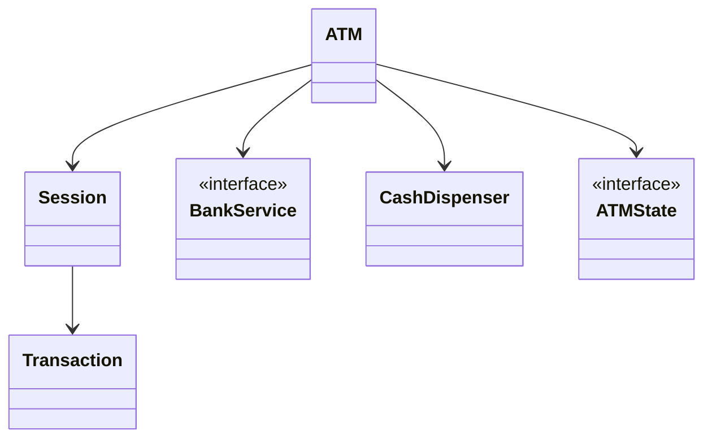
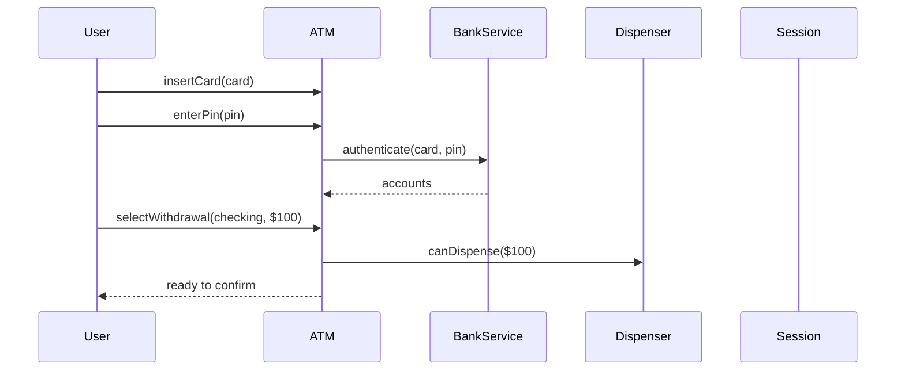
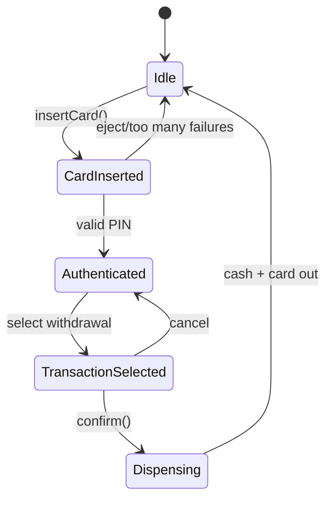

# LLD Walkthrough: Design an ATM Machine

> Self-contained walkthrough. It shows how to design an ATM as a controlled session state machine with bank and cash-dispenser seams, not as a full banking platform.

ATM is dangerous because the real world is huge: cards, PINs, banks, cash cassettes, reversals, fraud, receipts, networks, and regulations. In a 45-minute LLD interview, the pass is not "model banking." The pass is **a safe session flow for withdrawal, with clean seams for bank authorization and cash dispensing**.

---

## Minute 0-7: Clarify and fence the scope

Ask only what changes the model:

- **Primary flow?** → Card inserted, PIN authenticated, withdrawal selected, cash dispensed, receipt/eject.
- **Transactions?** → Withdrawal required. Balance inquiry and deposit can be sketched as extensions.
- **Bank integration?** → Use a `BankService` interface; do not design the core banking ledger.
- **Cash inventory?** → ATM has cassette counts by denomination; dispenser chooses notes.
- **Failure behavior?** → Invalid PIN, insufficient funds, insufficient ATM cash, dispenser failure.

Say the fence out loud:

> "In scope: one ATM, one user session, PIN auth, withdrawal, cash inventory, receipt, and failure cases. Out of scope: bank ledger internals, fraud systems, card network protocols, and hardware drivers. I'll make bank access and cash dispensing explicit interfaces."

This is the difference between designing an ATM and accidentally designing Visa.

---

## Minute 7-13: Core entities

Keep it tight. `CheckingAccount` and `SavingsAccount` usually do not need subclasses here; account type can be an enum unless behavior differs.

| Object | Responsibility (one line) |
|---|---|
| `ATM` | Public facade; owns devices, session, and current state. |
| `Session` | Tracks card, authenticated customer, selected account, and active transaction. |
| `Card` | Holds card identity/token and metadata needed for authentication. |
| `Account` | Bank account reference, type, and masked display data. |
| `BankService` | Authorizes PIN, checks balance, reserves/debits funds. |
| `CashDispenser` | Computes note mix and dispenses cash from cassettes. |
| `Transaction` | Represents a withdrawal/balance inquiry with status and amount. |
| `ReceiptPrinter` | Produces success/failure receipt summaries. |
| `ATMState` | State machine: Idle, CardInserted, Authenticated, TransactionSelected, Dispensing. |

Nine objects. Stop there.



Say this out loud:

> "The ATM is not the source of truth for account balance. It asks `BankService`. The ATM is the source of truth for its local cash inventory."

That one sentence prevents a major modeling mistake.

---

## Minute 13-20: The spine (API + varying interfaces)

Define the user/device-facing methods:

```text
Display insertCard(Card card)
Display enterPin(String pin)
Display selectWithdrawal(AccountId accountId, Money amount)
DispenseResult confirm()
void ejectCard()
ATMSnapshot getSnapshot()
```

Define the interfaces where real behavior varies:

```text
interface BankService {
  AuthResult authenticate(Card card, String pin)
  Balance getAvailableBalance(AccountId accountId)
  Authorization reserveWithdrawal(AccountId accountId, Money amount)
  void capture(Authorization auth)
  void release(Authorization auth)
}

interface CashSelectionStrategy {
  Optional<NoteBundle> selectNotes(Money amount, CashInventory inventory)
}
```

- `ATMState` → **State pattern**. It controls which user actions are legal.
- `BankService` → interface boundary to the real bank/network.
- `CashSelectionStrategy` → **Strategy pattern**. Greedy high-denomination notes today; smarter cassette balancing later.

The important design call:

> "For withdrawal I prefer reserve-then-dispense-then-capture. If dispense fails after reserve, release or reverse the authorization."

That is the kind of operational ordering interviewers listen for.

---

## Minute 20-33: Walk the happy path

Primary flow: user withdraws $100 from checking.



Then confirmation:

```text
confirm():
  auth = bank.reserveWithdrawal(accountId, amount)
  if auth.denied: transition Authenticated; return failure
  notes = dispenser.selectNotes(amount)
  if notes.empty:
    bank.release(auth)
    return insufficientCash
  dispenser.dispense(notes)
  bank.capture(auth)
  printer.print(transaction)
  ejectCard()
  transition Idle
```

Walk the state transitions explicitly:



State behavior:

```text
Idle.insertCard(card):
  session = new Session(card)
  transition CardInserted

CardInserted.enterPin(pin):
  result = bank.authenticate(card, pin)
  if result.ok: session.setCustomer(result.customer); transition Authenticated
  else increment attempts; eject after max attempts

Authenticated.selectWithdrawal(account, amount):
  validate account belongs to session
  transaction = Withdrawal(account, amount)
  transition TransactionSelected
```

Then say the operational ordering out loud:

- "I check local cash availability before asking the bank to reserve, to avoid pointless bank calls."
- "I still reserve with the bank before dispensing, because balance can change concurrently."
- "If cash dispense fails after bank reserve, I release/reverse the authorization and mark the transaction failed."
- "The card is ejected at the end or on cancel/failure threshold."

That turns a whiteboard model into a real system.

---

## Minute 33-42: Stretch and edges

Handle the predictable pushes with bounded answers:

- **"Insufficient funds."** `BankService.reserveWithdrawal` returns denied. The ATM stays `Authenticated`, shows a message, and lets the user choose a smaller amount or cancel. No cash inventory changes.

- **"Insufficient ATM cash."** `CashDispenser.selectNotes` returns empty before reserve, or after reserve if inventory changed. If reserve already happened, call `bank.release(auth)`.

- **"Concurrent withdrawals from the same account."** The ATM cannot solve this locally. The bank must make `reserveWithdrawal` atomic against account balance. Say it clearly: account balance concurrency belongs in `BankService`/ledger, not in the ATM object.

- **"Concurrent withdrawals from the same ATM cash cassette."** Guard `CashDispenser.selectNotes + dispense + decrementInventory` with a lock. In practice one ATM session is active at a time, but service operations may run concurrently, so protect cassette inventory anyway.

- **"Cash selection algorithm?"** Greedy largest notes first is fine for a first cut. Put it behind `CashSelectionStrategy` so operators can balance denominations later. Do not derive a perfect knapsack solution unless asked.

- **"Network timeout after cash dispensed."** Record transaction as pending reversal/capture reconciliation. The ATM should have durable audit logs in production. For interview scope, name it and keep the core flow reserve/dispense/capture.

- **"Too many invalid PIN attempts."** Track attempts in `Session`; after max attempts, eject or retain card depending on requirements. Do not design fraud policy.

- **"Balance inquiry and deposit."** Add transaction types. `Transaction` can use an enum plus behavior strategies if operations diverge. The state machine still applies.

Bounded edge list: expired card, unreadable card, unsupported account, cancel at every screen, receipt paper out, dispenser jam, partial dispense, power loss, and audit logging.

Concurrency summary:

```text
BankService.reserveWithdrawal(account, amount) must be atomic.
CashDispenser.dispense(notes) must atomically decrement local cassette counts.
ATM session actions are serialized per machine.
```

Three lines. Enough.

---

## Minute 42-45: Wrap up

> "Nine objects: `ATM` owns the session and state, `BankService` handles authentication and account authorization, and `CashDispenser` owns note selection and cassette inventory. The withdrawal flow is card → PIN → select withdrawal → reserve funds → dispense cash → capture → eject. The big seams are State for session transitions and Strategy for note selection. Account concurrency is handled by the bank; local cash concurrency is handled by the dispenser lock."

---

## What separated a pass from a fail here

- You scoped the ATM to a **withdrawal session**, not a whole banking ecosystem.
- You used a **State pattern** so invalid user actions are rejected cleanly.
- You made `BankService` the authority for funds and `CashDispenser` the authority for local cash.
- You explained reserve/dispense/capture ordering and failure recovery.
- You avoided algorithm obsession around note selection and kept it behind a Strategy.

The winning ATM design is safe at the boundaries: bank authorization, local cash inventory, session state, and failure handling.
