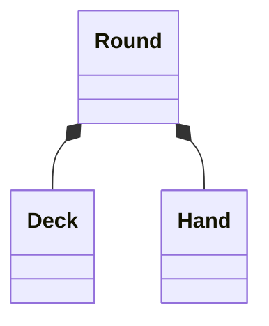

# Deck of Cards and Blackjack

Build a reusable deck and an atomic blackjack round with explicit ace scoring, natural wins, and dealer rules.

LLD stages: [Requirements](#requirements) → [Core entities](#core-entities) → [API or system interface](#api) → [High-level design](#high-level-design) → [Deep dives](#deep-dives).

## 1. Requirements
{: #requirements }

### Functional requirements

Provide a 52-card deck and a one-player blackjack round against a dealer. The player may hit or stand; the dealer stands on every 17, including soft 17. Recognize two-card naturals separately from later totals of 21.

### Non-functional and execution constraints

Concurrent calls are serialized per round in one process. Shuffling is O(52), drawing O(1), and scoring O(hand size).

### Out of scope

Exclude betting, payouts, splitting, doubling, insurance, surrender, and shared casino shoes. Outcomes are win, loss, or push, not monetary transfers. Each round gets a fresh deck. This is a training engine, not a real-money random-number implementation.

## 2. Core entities
{: #core-entities }

`Round` exclusively owns its deck, both hands, phase, outcome, and version. Cards are immutable `(suit, rank)` values. The deck owns a shuffled array and a next-card cursor; callers cannot shuffle after dealing starts.

Every card is in exactly one location: the undealt suffix or one hand. Phases are `PLAYER_TURN` and `SETTLED`; dealer play occurs atomically inside an operation. Settled rounds cannot draw again.

## 3. API or system interface
{: #api }

`start(randomSource) -> PlayerView` creates and deals a round. `hit(roundId, expectedVersion)` and `stand(roundId, expectedVersion)` return an updated view or `NotFound`, `StaleVersion`, `Settled`, or `DeckExhausted`. `get(roundId)` returns the view or `NotFound`. Hide the dealer's hole card until settlement. A repeated command using its original version fails as stale rather than drawing twice. Random-source failure makes `start` fail without publishing a round.

## 4. High-level design
{: #high-level-design }

`Round` creates its `Deck` with all 52 distinct cards. The deck shuffles using the supplied random source: Fisher–Yates iterates i from 51 down to 1 and swaps i with an independently uniform index in [0,i]. The round draws alternately into the player and dealer hands until each has two cards.

Score by counting aces as eleven, face cards as ten, and other ranks numerically. While the total exceeds 21 and an eleven-valued ace remains, subtract ten. Two-card 21 is a natural: two naturals push, one natural beats the other hand, and settlement is immediate.

For hit, lock and validate, then draw into candidate state. A bust loses immediately; a non-natural 21 automatically proceeds to dealer play. Stand also starts dealer play. Draw while the dealer total is below 17; dealer bust wins for the player, otherwise compare totals. Publish hands, deck cursor, outcome, and incremented version together.

## 5. Deep dives
{: #deep-dives }

### Trade-offs and extensions

A deck cursor avoids shifting array elements. Recomputing hand scores is simpler than caching multiple ace totals for these small hands. Splitting would require multiple player hands, an active-hand index, and separate settlement; it is not merely another button.

### Concurrency and failure handling

Validation and all dealer draws share the round lock. No callbacks run under it. Candidate state prevents partial dealer play if a deliberately shortened test deck exhausts. In-memory rounds do not survive a crash. Version checks protect live retries but provide no restart recovery.

### Test cases

A,A,9 scores 21; A,A,9,K also scores 21. Dealer A,6 stands. Player A,K beats dealer 7,7 immediately, without a dealer draw. Two naturals push. Hitting 10,8 with 5 loses immediately. An exhausted fixture deck leaves hands and cursor unchanged. Racing two hits at one version accepts one hit. Every shuffle preserves 52 unique cards and uses 51 swaps.

[Question catalog](../interview-guide.html) · [Article template](interview-template.html)
