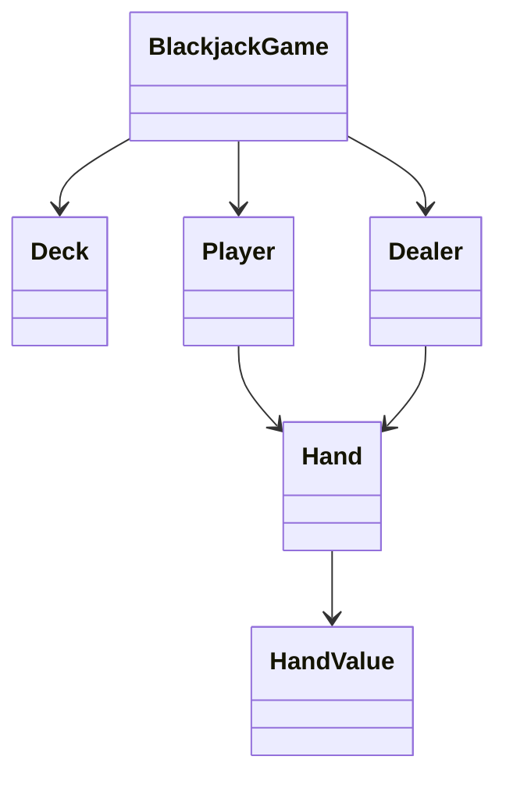
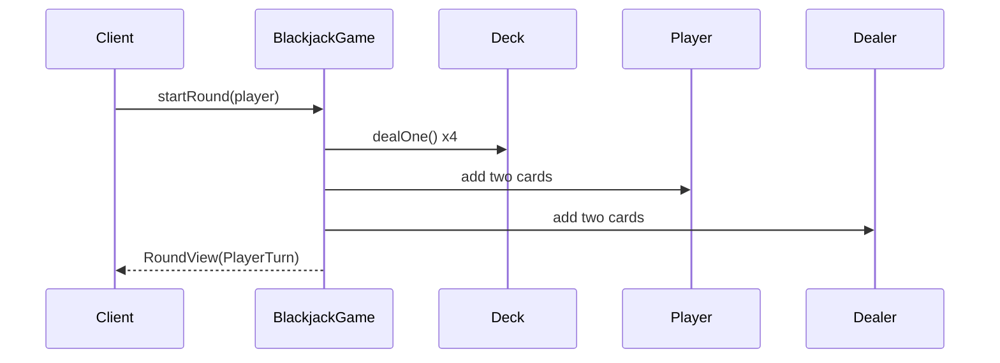
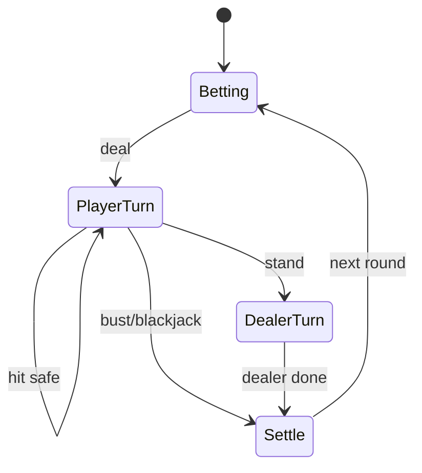
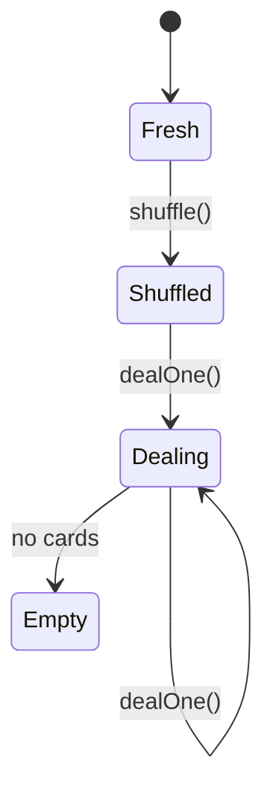

# LLD Walkthrough: Design a Deck of Cards and Blackjack
> Self-contained walkthrough. It shows how to design a reusable deck of cards first, then layer Blackjack rules on top without hard-coding the deck into one casino game.

Deck-of-cards prompts are dangerous because they invite two opposite failures. One candidate only builds `Card` and `Deck` and never reaches a game. Another builds a full casino with betting accounts, split hands, insurance, shoes, and table management before dealing two cards.

The pass is in the middle: make a generic deck reusable for poker, then implement the Blackjack round spine: deal, player hit/stand, dealer play, settle.

---

## Minute 0-7: Clarify and fence the scope

Ask what version of Blackjack the interviewer wants. Then pick a finishable default.

Good questions and reasonable default answers:
- **Deck scope?** → Standard 52-card deck with suit and rank enums.
- **Shuffling?** → Deck owns shuffle/deal; randomness injectable if needed.
- **Blackjack rules?** → One player vs dealer, hit/stand, bust, dealer stands on 17.
- **Aces?** → Hand value treats ace as 11 when safe, otherwise 1.
- **Betting?** → Model round state; skip real wallet/payment unless asked.
- **Advanced rules?** → Splits, double-down, insurance, surrender out of scope.
Say the fence out loud:
> "I'll design a generic reusable deck first: cards, shuffle, deal. Then I'll layer a one-player Blackjack round on top: initial deal, player hit/stand, dealer draws to 17, settle outcome. I will handle soft/hard ace values and busts, but I won't implement split, insurance, or table bankroll in the first 45 minutes."

That is the right scope. It is concrete, but not tiny.

The key separation:
> "`Deck` should not know Blackjack. `HandValue` and `BlackjackGame` know Blackjack."

If you violate that, your deck cannot be reused for poker, bridge, or war.

---

## Minute 7-13: Core entities

Start with the deck, then add game objects.
| Object | Responsibility (one line) |
|---|---|
| `Card` | Immutable suit + rank value object. |
| `Deck` | Owns remaining cards; shuffles and deals cards. |
| `Hand` | Owns cards held by a participant. |
| `HandValue` | Calculates Blackjack total, including soft/hard aces. |
| `Player` | Owns identity and current hand. |
| `Dealer` | Owns dealer hand and drawing policy. |
| `BlackjackGame` | Orchestrates round state and public actions. |
| `GameState` | Tracks Betting, PlayerTurn, DealerTurn, Settle, Finished. |
| `Outcome` | Captures win, lose, push, blackjack, or bust result. |
Nine objects. That is enough.

The generic deck:
```text
enum Suit { CLUBS, DIAMONDS, HEARTS, SPADES }
enum Rank { TWO, THREE, FOUR, FIVE, SIX, SEVEN, EIGHT, NINE, TEN, JACK, QUEEN, KING, ACE }

class Card {
  Suit suit
  Rank rank
}
```
Say this out loud:
> "Card is immutable. Deck mutates as cards are dealt. Hand mutates as cards are added. Blackjack value calculation is not stored on Card because ace value depends on the whole hand."

That last sentence matters. Ace value is contextual.

Avoid this anti-pattern:
```text
class Ace extends Card
class BlackjackDeck extends Deck
class DealerDeck extends BlackjackDeck
```
No. Rank and suit are data. Game rules sit above the deck.

---

## Minute 13-20: The spine (API + varying interfaces)

Define generic deck APIs first:
```text
Deck       standard52()
void       shuffle()
Card       dealOne()                 // throws EmptyDeckException
List<Card> deal(int count)
int        remaining()
```
Then Blackjack client actions:
```text
RoundView  startRound(Player player)
RoundView  hit(Player player)
RoundView  stand(Player player)
RoundView  getRound()
```
The varying interfaces:
```text
interface ShuffleStrategy {
  void shuffle(List<Card> cards)
}

interface DealerPolicy {
  boolean shouldHit(Hand dealerHand, Hand playerHand)
}
```
Patterns:
- `ShuffleStrategy` → **Strategy pattern**. Random shuffle in production, deterministic shuffle in tests.
- `DealerPolicy` → **Strategy pattern**. Stand on all 17s, hit soft 17, or house-specific rules.
Hand value API:
```text
class HandValue {
  int bestTotal(Hand hand)            // highest <= 21 if possible, else lowest bust total
  boolean isSoft(Hand hand)
  boolean isBust(Hand hand)
  boolean isBlackjack(Hand hand)      // exactly two cards totaling 21
}
```
Say this out loud:
> "The deck is reusable. Blackjack enters through `BlackjackGame`, `HandValue`, and policies. If tomorrow this were poker, I would keep `Card`, `Deck`, and `Hand`, then replace the game and evaluator."

That separation is the design.

---

## Minute 20-33: Walk the happy path

Walk one round. Keep participants few.

Initial deal:
```text
startRound(player):
  require state == BETTING or FINISHED
  deck.shuffleIfNeeded()
  player.hand.clear()
  dealer.hand.clear()

  player.hand.add(deck.dealOne())
  dealer.hand.add(deck.dealOne())
  player.hand.add(deck.dealOne())
  dealer.hand.add(deck.dealOne())

  if handValue.isBlackjack(player.hand) or handValue.isBlackjack(dealer.hand):
    state = SETTLE
    return settle()

  state = PLAYER_TURN
  return view()
```
Player hit:
```text
hit(player):
  require state == PLAYER_TURN
  player.hand.add(deck.dealOne())

  if handValue.isBust(player.hand):
    state = SETTLE
    return settle()

  return view()
```
Player stand:
```text
stand(player):
  require state == PLAYER_TURN
  state = DEALER_TURN

  while dealerPolicy.shouldHit(dealer.hand, player.hand):
    dealer.hand.add(deck.dealOne())

  state = SETTLE
  return settle()
```
State diagram:

Now explain ace calculation clearly.
```text
bestTotal(hand):
  total = sum non-ace values + numberOfAces
  for each ace:
    if total + 10 <= 21:
      total += 10
  return total
```
Why `+10`? Because every ace already counted as 1; upgrading one to 11 adds 10.

Examples:
```text
A + 7        = 18 soft
A + 7 + 9    = 17 hard
A + A + 9    = 21 soft-ish but best total 21
K + Q + 5    = 25 bust
```
Settlement:
```text
settle():
  if player bust: LOSE
  else if dealer bust: WIN
  else if player blackjack and !dealer blackjack: BLACKJACK_WIN
  else if dealer blackjack and !player blackjack: LOSE
  else compare best totals:
    player > dealer => WIN
    player < dealer => LOSE
    equal => PUSH
```
Say this out loud:
> "I compare hands only after normalizing ace values. I do not store a mutable `hand.total` because every new card can change whether an ace is soft or hard."

That prevents a common bug.

---

## Minute 33-42: Stretch and edges

Common curveballs and bounded answers:
- **"Dealer stands on soft 17 or hits soft 17?"** `DealerPolicy` handles it. Example: `StandOn17Policy` vs `HitSoft17Policy`.
- **"Multiple decks / shoe?"** `Deck` can be replaced by `Shoe` with N standard decks and the same `dealOne()` API.
- **"Deck runs out."** Reshuffle before round if remaining cards below threshold; do not reshuffle mid-hand unless house rules say so.
- **"Betting."** Add `Bet` and `Wallet`, but settlement already has `Outcome`; money movement belongs after outcome.
- **"Split pairs."** This creates multiple player hands and turn sequencing. Add later as `List<Hand>` per player, not in first cut.
- **"Double down."** Add action policy: one card then forced stand.
- **"Insurance."** Side bet triggered by dealer ace; out of scope unless explicitly requested.
- **"Concurrency."** Serialize actions per game/round. `hit` and `stand` must be mutually exclusive state transitions.
But keep the first cut simple:
> "I would not add split/double/insurance before the base round is correct. Those features multiply state, so I want the state machine stable first."

Small deck state:

Edge cases to name:
- dealing from empty deck
- starting a round while one is in progress
- hit after stand
- stand before deal
- player bust ends player turn immediately
- dealer bust wins for player
- simultaneous blackjack is push
- ace revaluation after every card
- dealer hidden card in `RoundView`
Testing list:
```text
standard deck has 52 unique cards
shuffle preserves card count and uniqueness
deal reduces remaining count
ace can be 11 when safe
ace becomes 1 to avoid bust
player bust settles as loss
dealer draws until 17
equal totals push
```
Do not let the interviewer pull you into writing a full casino. Keep each variant behind a policy.

---

## Minute 42-45: Wrap up
> "The reusable layer is `Card`, `Deck`, and `Hand`. Blackjack sits on top with `BlackjackGame`, `HandValue`, `DealerPolicy`, and a small round state machine. The happy path is start round, deal two cards each, let the player hit or stand, let the dealer draw to 17, then settle. Aces are calculated from the whole hand, not stored as fixed card values. Follow-ups like multiple decks, hit soft 17, splits, and payouts are policies or extensions, not rewrites."

If you have 20 seconds, emphasize the deck boundary:
> "`Deck` never asks whether a card is good for Blackjack. It only shuffles and deals."

---

## How real systems solve this

Card systems stay maintainable when the generic deck layer is boring: immutable `Card`, mutable `Deck` or `Shoe`, and a shuffle/deal API. Blackjack should not leak into `Deck`; the game layer owns hand valuation, dealer policy, round state, and settlement.

Shuffling is the first correctness trap. Use Fisher-Yates: walk from the end of the list toward the front and swap each position with a uniformly selected earlier-or-same position. Repeatedly swapping each card with a random index over the full deck looks plausible, but it is biased and should be called out in an interview.

Blackjack hand value is contextual because aces are soft or hard depending on the whole hand. Count every ace as 1 first, then upgrade aces by +10 while the total stays at or below 21. Blackjack itself is also not just total 21; it is an ace plus a ten-value card on the first two cards.

Dealer behavior belongs behind a policy. The default in this walkthrough is dealer stands on 17, but the same state machine can support a different house rule without rewriting `BlackjackGame`. The round transitions remain: deal, player turn, dealer turn, settle.

## Reference implementation

This snippet focuses on the core evaluator: best total, soft-hand detection, bust, and first-two-card blackjack. It keeps card modeling minimal so the ace rules are obvious.

```python
from dataclasses import dataclass
from enum import Enum

class Rank(Enum):
    TWO = 2; THREE = 3; FOUR = 4; FIVE = 5; SIX = 6; SEVEN = 7
    EIGHT = 8; NINE = 9; TEN = 10; JACK = 10; QUEEN = 10; KING = 10; ACE = 1

@dataclass(frozen=True)
class Card:
    rank: Rank
    suit: str

class HandValue:
    @staticmethod
    def total(cards: list[Card]) -> int:
        total = sum(card.rank.value for card in cards)
        aces = sum(1 for card in cards if card.rank is Rank.ACE)
        while aces and total + 10 <= 21:
            total += 10
            aces -= 1
        return total

    @staticmethod
    def is_soft(cards: list[Card]) -> bool:
        total = sum(card.rank.value for card in cards)
        aces = sum(1 for card in cards if card.rank is Rank.ACE)
        return aces > 0 and total + 10 <= 21

    @staticmethod
    def is_bust(cards: list[Card]) -> bool:
        return HandValue.total(cards) > 21

    @staticmethod
    def is_blackjack(cards: list[Card]) -> bool:
        if len(cards) != 2:
            return False
        ranks = {card.rank for card in cards}
        has_ace = Rank.ACE in ranks
        has_ten_value = any(card.rank.value == 10 for card in cards)
        return has_ace and has_ten_value
```

## Complexity and trade-offs

| Operation | Complexity | Notes |
|---|---:|---|
| Fisher-Yates shuffle | O(n) | Unbiased when each swap range is chosen correctly. |
| Deal one card | O(1) | Usually pop from end/top of deck. |
| Hand valuation | O(h) | `h` is cards in hand; ace upgrades are bounded by ace count. |
| Dealer turn | O(k · h) | `k` dealer draws; each check revalues the hand. |
| Round settlement | O(h) | Compare normalized totals after bust/blackjack checks. |

- Recomputing hand value is safer than storing mutable totals because each new card can change ace interpretation.
- A `Shoe` can replace `Deck` for multiple decks while preserving `dealOne()`.
- `DealerPolicy` keeps house rules local; it should not be hard-coded throughout the state machine.
- Betting, splits, double-down, and insurance multiply state. Add them after the base round is correct.

## Further reading

- [Fisher–Yates shuffle](https://en.wikipedia.org/wiki/Fisher%E2%80%93Yates_shuffle) — standard unbiased shuffle for an in-memory deck.
- [Strategy](https://refactoring.guru/design-patterns/strategy) — shuffle and dealer policies vary independently from game state.
- [State](https://refactoring.guru/design-patterns/state) — clean framing for Betting, PlayerTurn, DealerTurn, and Settle transitions.
- *Design Patterns* — GoF — canonical pattern reference for Strategy and State vocabulary.

## What separated a pass from a fail here
- You separated generic cards from Blackjack-specific rules.
- You made ace valuation explicit and correct.
- You used a state machine so illegal actions are easy to reject.
- You put dealer behavior and shuffle behavior behind small Strategy interfaces.
- You named advanced casino rules as bounded follow-ups instead of front-loading them.
That is the interview-ready answer: reusable deck, one complete game round, correct ace math, clear state, and no casino sprawl.
