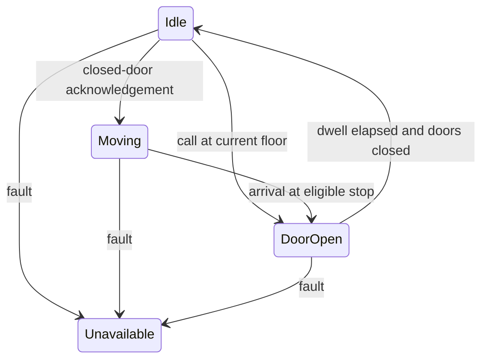

# Design an Elevator System

## 1. Requirements

Model hall calls, cabin destinations, car movement, doors, and unavailable cars in one process. Concurrent producers submit events to a single controller loop. This is a simulator, not a safety-certified lift controller. State is volatile; restart requires a fresh sensor snapshot. With E cars and F floors, dispatch costs O(E), and ordered stop insertion costs O(log F).

## 2. Out of scope

Exclude emergency braking, motor control, passenger identification, and optimal traffic prediction. Hardware safety interlocks belong to a separate certified controller. This component issues high-level commands and consumes acknowledgements; it must not pretend that issuing a command proves movement occurred.

## 3. Model and invariants

`Controller` owns all car states and the hall-call assignment map. Each `Car` owns current floor, travel direction, door state, ordered cabin stops, and assigned hall calls. A `DispatchPolicy` reads snapshots without mutating cars.

A hall call has at most one assigned car. Duplicate `(floor, direction)` calls coalesce until served. Movement is permitted only after doors report closed. Floors stay within the building range, and an unavailable car receives no new work.

## 4. Public contract

`call(floor, direction) -> CallId` validates floor and rejects impossible outward calls at terminal floors. Repeats return the active call ID. `select(carId, floor) -> Accepted` coalesces duplicate destinations; unknown or unavailable cars return `NotFound` or `Unavailable`.

`onEvent(carId, epoch, sequence, event) -> Applied|Ignored|InvalidEvent` accepts ordered sensor events; duplicate or older sequence numbers are ignored. `tick(monotonicNow) -> Commands` advances dwell timers without sleeping. `snapshot() -> BuildingState` returns an immutable copy. Invalid input never creates partial assignments.

## 5. Core flow

On a hall call, first find its existing active assignment. Otherwise choose the nearest available car already approaching in the requested direction; if none qualifies, choose the nearest available car, breaking ties by car ID.

An idle car heads toward its nearest assigned stop. A moving car follows a directional sweep, serving cabin stops and same-direction hall calls ahead before reversing. Opposite-direction calls remain assigned for the return sweep; if only opposite-direction work remains ahead, travel to the furthest such call before reversing. At an eligible stop, acknowledge arrival, request door opening, and mark calls served only after the door-open acknowledgement. Start dwell timing from that acknowledgement using a monotonic clock.

## 6. Trade-offs and extensions

Nearest-car dispatch is predictable but can produce poor tail waits. A bounded extension assigns priority to calls exceeding a wait threshold, while preserving car movement invariants. Stop sets bound stored work to O(EF); repeated button presses cannot grow memory indefinitely.

## 7. Concurrency and failure handling

The event loop serializes assignment and stop updates. Adapter calls run outside it; commands carry IDs and acknowledgements return as events. A fault requeues hall calls, but cabin destinations remain attached to the unavailable car for operator handling. Queue overflow returns `Busy`, never silent acceptance. Restart changes the epoch and reconciles physical state before movement; volatile requests are not claimed durable.

## 8. Test cases

- Cars at floors 1 and 8; upward call at 2: assign car at 1.
- 1,000 concurrent upward calls at 4: one active call ID and one assigned stop, not 1,000 queued stops.
- Downward call at floor 0 in a 0–9 building: `InvalidFloorDirection`.
- Door-close acknowledgement missing: no movement command.
- Assigned car faults: hall call becomes pending for reassignment.
- Duplicate arrival sequence: no duplicate door cycle or call completion.

[Question catalog](../interview-guide.html) · [Article template](interview-template.html)
