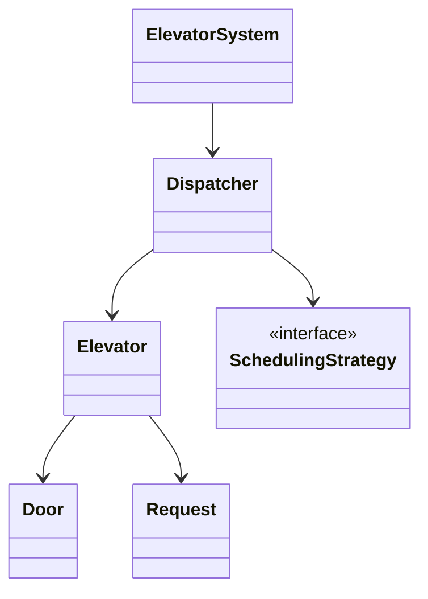
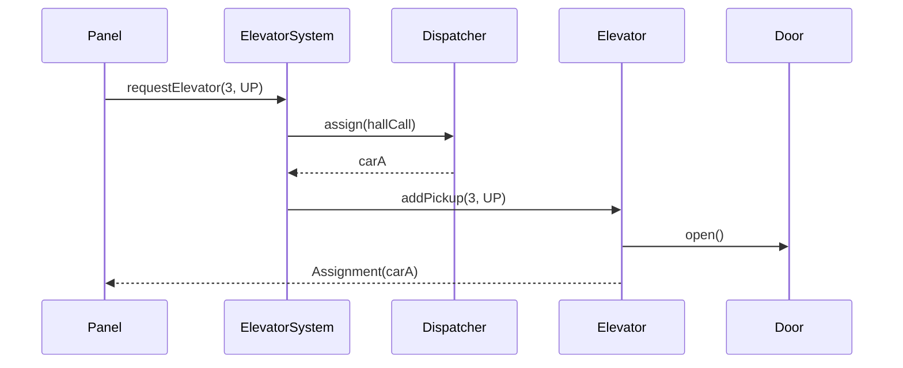
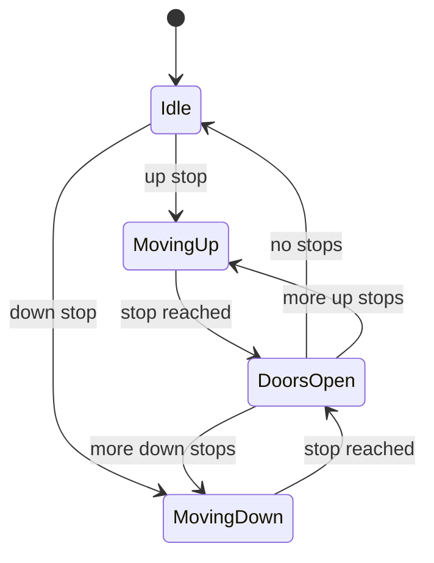

# LLD Walkthrough: Design an Elevator System

> Self-contained walkthrough. It shows how to design a multi-elevator building control system live, without turning the interview into a research project on optimal scheduling.

Elevator is a classic LLD trap because the algorithm looks more interesting than the object model. Do not take the bait. A strong answer says: **requests come in, a dispatcher assigns them, elevator cars run a state machine, and scheduling is replaceable**. Pick a reasonable policy, hide it behind a Strategy interface, and move on.

---

## Minute 0-7: Clarify and fence the scope

Start by shrinking the building. Good questions and reasonable defaults:

- **Building shape?** → Multiple floors, multiple elevator cars, one bank.
- **Primary flow?** → External hall call assigns a car; passenger enters; internal button takes them to a destination.
- **Control model?** → Single-process controller in memory. Mention that distributed hardware controllers would need messaging and health checks.
- **Scheduling depth?** → Use a simple nearest-car or SCAN-style strategy. Do not optimize live.
- **Door/safety?** → Model door open/close and blocked-door retry at a high level.

Say the fence out loud:

> "In scope: hall calls, car assignment, internal destination requests, car movement, doors, and basic concurrency around incoming requests. Out of scope: hardware sensors, fire-service mode, persistence, and mathematically optimal scheduling. I'll put scheduling behind a Strategy seam."

That sentence protects you from the classic fail: spending 35 minutes inventing an elevator algorithm and never designing an elevator.

---

## Minute 7-13: Core entities

Use responsibilities, not inheritance. `Elevator` is not a parent class for `PassengerElevator`, `FreightElevator`, `ExpressElevator`, and seven more boxes. Start with one car type and enums for state/direction.

| Object | Responsibility (one line) |
|---|---|
| `ElevatorSystem` | Public facade; accepts hall calls and car button requests. |
| `Dispatcher` | Chooses which elevator should handle an external request. |
| `Elevator` | Owns current floor, direction, stops, door, and state transitions. |
| `Request` | Represents either a hall call or an internal destination request. |
| `Door` | Opens, closes, and reports whether it is blocked. |
| `SchedulingStrategy` | Selects a car for a hall call. |
| `Floor` | Owns up/down hall buttons and display metadata. |
| `ElevatorState` | Enum/state machine: Idle, MovingUp, MovingDown, DoorsOpen. |

Eight objects. This is enough.

Composition is the point: the system **has** elevators; an elevator **has** a door and pending stops. You do not need a class for every physical button unless the interviewer asks.



Keep the diagram tiny. If the interviewer wants capacity, maintenance mode, or express floors, those are fields and policies, not a new universe.

---

## Minute 13-20: The spine (API + varying interfaces)

Define what clients call. The clients may be hall panels, car panels, or tests:

```text
Assignment requestElevator(int floor, Direction dir)
void       selectDestination(ElevatorId carId, int destinationFloor)
Snapshot   getElevatorStatus(ElevatorId carId)
void       step(ElevatorId carId)                 // advances one control tick in tests
```

Now define the seams where behavior varies:

```text
interface SchedulingStrategy {
  ElevatorId choose(Request hallCall, List<ElevatorSnapshot> cars)
}

interface MovementPolicy {
  OptionalInt nextStop(ElevatorSnapshot car)
}
```

- `SchedulingStrategy` → **Strategy pattern**. Nearest-car, SCAN, zone-based, or energy-saving assignment are swappable.
- `MovementPolicy` → another Strategy if the interviewer pushes on stop ordering. For a first pass, it can be inside `Elevator`.
- `ElevatorState` → **State pattern** conceptually: each state permits different transitions.

Say this out loud:

> "I am intentionally not solving optimal scheduling. I will start with nearest eligible car, maybe SCAN inside a car, and keep both behind interfaces so the model survives follow-ups."

That is the senior move. You acknowledge complexity without drowning in it.

---

## Minute 20-33: Walk the happy path

Pick one flow: passenger on floor 3 presses Up, car arrives, passenger selects floor 9.



Then narrate the mechanics:

```text
requestElevator(floor, dir):
  request = HallCall(floor, dir)
  carId = dispatcher.assign(request, elevators.snapshots())
  elevators[carId].addPickup(request)
  return Assignment(carId)
```

When the passenger enters:

```text
selectDestination(carId, destinationFloor):
  elevator = elevators[carId]
  elevator.addDestination(destinationFloor)
```

Inside `Elevator`, keep the data boring:

```text
currentFloor: int
direction: Direction
state: ElevatorState
upStops: SortedSet<int>
downStops: SortedSet<int>
door: Door
```

For `step()` or a control tick:

```text
if state == Idle and hasStops:
  choose direction
if state == MovingUp:
  currentFloor++
  if currentFloor in upStops: stopAndOpenDoor()
if state == MovingDown:
  currentFloor--
  if currentFloor in downStops: stopAndOpenDoor()
if state == DoorsOpen:
  close door if dwell time elapsed and not blocked
```

Do not over-engineer time. In interviews, a `step()` method is a clean way to show behavior deterministically.

The state machine is the heart of this problem:



Say the quiet part:

> "The dispatcher decides who gets the request. The elevator owns how it executes its stop queue. I do not want the dispatcher micromanaging door and floor transitions."

That separation prevents the common god-controller design.

---

## Minute 33-42: Stretch and edges

Bound the follow-ups. Elevator interviewers love infinite variants.

- **"What scheduling algorithm?"** Start with nearest eligible car: idle cars are best, cars moving toward the caller and able to stop are next, others are worse. If asked for more, mention SCAN: keep serving in current direction before reversing. Then stop. The algorithm is behind `SchedulingStrategy`.

- **"Concurrent hall calls arrive."** One contended area: assignment plus adding a stop. Use a lock around dispatcher assignment and `Elevator.addPickup`, or per-elevator locks after choosing a car. For a single-process first cut, a dispatcher-level lock is simple and correct; later optimize to per-car locks.

```text
synchronized requestElevator(floor, dir):
  carId = strategy.choose(call, snapshots)
  elevators[carId].addPickup(call)
```

- **"Two people press the same floor."** Stops are sets, not lists, so duplicates collapse. The request log can still count demand if needed.

- **"Door blocked."** `Door.close()` returns false or raises `DoorBlocked`; `Elevator` remains `DoorsOpen` and retries after a dwell interval. Do not build sensors.

- **"Capacity full."** Add `capacity` and `load`. `SchedulingStrategy` filters full cars from hall-call assignment. Internal requests still work for passengers already inside.

- **"Maintenance mode."** Add `ElevatorMode` enum: Normal, Maintenance, Emergency. Scheduling filters out unavailable cars.

- **"Express elevators."** Add service-floor constraints to `ElevatorSnapshot`; strategy only assigns cars that can serve pickup and likely destination if known.

Name deferred edges quickly: invalid floor, stuck car, power outage, emergency stop, starvation from a bad scheduler, and telemetry lag. Naming them shows awareness; implementing all of them live shows poor judgment.

---

## Minute 42-45: Wrap up

> "Eight core pieces: `ElevatorSystem` is the facade, `Dispatcher` assigns hall calls using a `SchedulingStrategy`, and each `Elevator` owns its stop sets, movement, door, and state machine. The happy path is hall call → assignment → pickup → destination → movement. Concurrency is guarded around assignment and stop mutation. If I had more time, I would add persistence/telemetry and richer emergency modes."

---

## What separated a pass from a fail here

- You did **not** chase optimal elevator scheduling. You chose a simple Strategy and moved on.
- You gave the elevator a real **state machine**, not just fields on a data class.
- You separated **dispatching** from **car execution**, so the model can evolve.
- You handled concurrency at the request/stop-mutation boundary in two sentences.
- You kept the diagrams small enough to draw live and still walked an end-to-end flow.

The winning answer is not the smartest scheduler. It is a small, executable model with clean seams and bounded answers.
