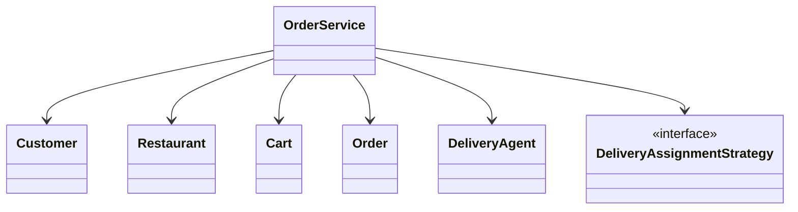
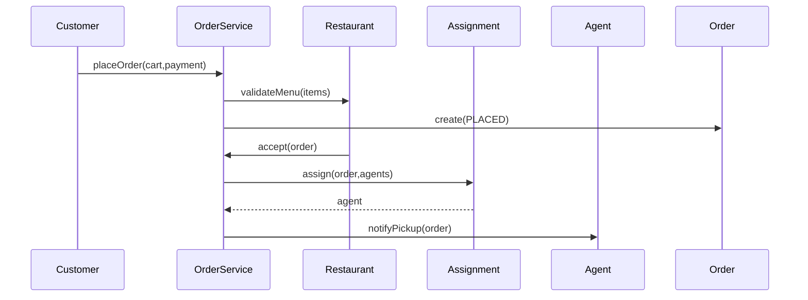
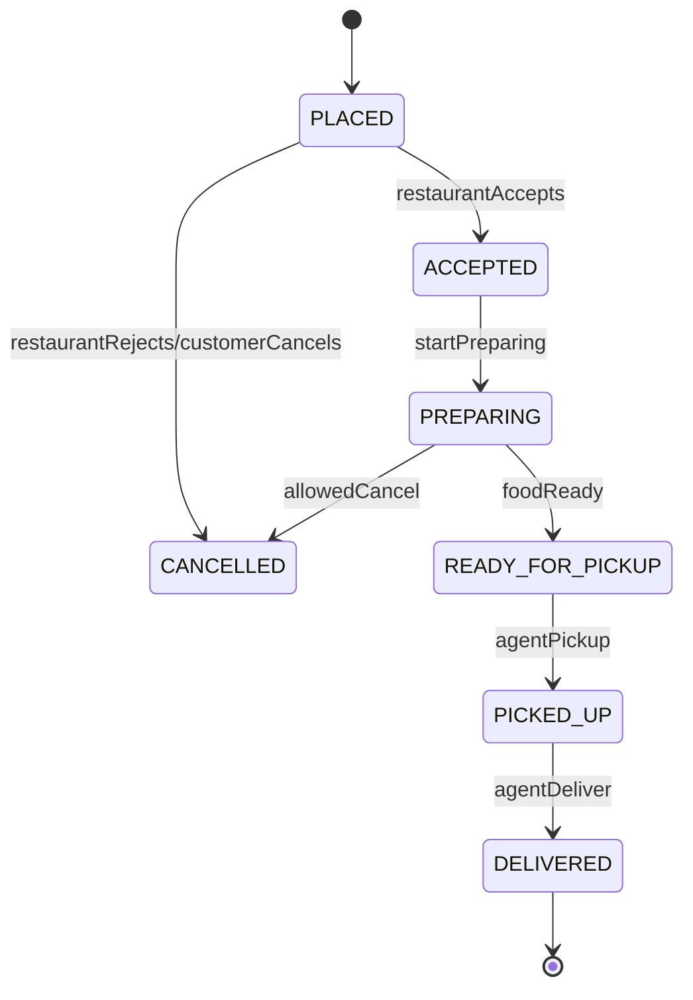

# LLD Walkthrough: Design a Food Delivery System
> Self-contained walkthrough. This is the LLD version of DoorDash or Swiggy: order objects, state transitions, cart pricing, restaurant acceptance, and agent assignment — not a dispatch-platform HLD.
Food delivery is another HLD trap. It tempts candidates into maps, Kafka, location streams, surge pricing, fraud detection, restaurant search, and ETA prediction.
For LLD, stay smaller:
- Customer builds a cart.
- Customer places an order.
- Restaurant accepts and prepares it.
- A delivery agent is assigned.
- Order moves through a clear state machine.
Say this out loud:
> "I will model the order lifecycle and assignment seam. I will not build a real geo-dispatch optimizer or a microservice architecture."
That keeps the interview grounded in objects.

---

## Minute 0-7: Clarify and fence the scope
Ask targeted questions:
- **Primary flow?** → "Customer orders from one restaurant, pays, restaurant accepts, agent delivers."
- **Multi-restaurant cart?** → No. One cart belongs to one restaurant.
- **Payment?** → Model payment status and failure; do not integrate a real gateway.
- **Agent assignment?** → Provide a pluggable strategy like nearest or round-robin, not route optimization.
- **Cancellation?** → Include simple cancellation windows based on order state.
Fence it:
> "In scope: customer, restaurant, menu item, cart, order, payment, restaurant acceptance, delivery-agent assignment, and order state transitions. Out of scope: search/ranking, coupons, batching, real maps, live tracking, fraud, and distributed systems."
One more high-signal sentence:
> "The order state machine is the spine. Most bugs here are illegal transitions, duplicate assignment, or cancellation after food is already prepared."
Now you have a design target.

---

## Minute 7-13: Core entities
Use a tight responsibility table. Composition first.

| Object | Responsibility (one line) |
|---|---|
| `Customer` | Owns delivery address and places orders. |
| `Restaurant` | Owns menu, availability, and acceptance decision. |
| `MenuItem` | Represents an orderable item with price and availability. |
| `Cart` | Holds selected items from one restaurant before checkout. |
| `Order` | Tracks items, amount, delivery address, and lifecycle state. |
| `Payment` | Captures payment attempt and status. |
| `DeliveryAgent` | Represents an assignable courier and current availability. |
| `OrderService` | Orchestrates checkout, acceptance, assignment, and transitions. |
| `DeliveryAssignmentStrategy` | Chooses an agent from available candidates. |
Nine objects. Do not add `GeoHashService`, `KafkaEvent`, `RestaurantShard`, or `EtaModel` in the base model.
Composition:
- `Restaurant` has `MenuItem`s.
- `Cart` has cart lines for one restaurant.
- `Order` is created from a `Cart`.
- `Order` has one `Payment`.
- `Order` may have one `DeliveryAgent`.
Tiny class diagram:



Say:
> "I will not subclass restaurants or agents. The behavior that varies is assignment; that gets an interface. Everything else starts as data plus clear state transitions."
That is exactly the right amount of pattern usage.

---

## Minute 13-20: The spine (API + varying interfaces)
Define methods the client calls:

```text
CartId createCart(CustomerId customerId, RestaurantId restaurantId)
void addItem(CartId cartId, MenuItemId itemId, int quantity)
OrderId placeOrder(CartId cartId, PaymentMethod paymentMethod)
void restaurantRespond(OrderId orderId, RestaurantId restaurantId, Decision decision)
void markReadyForPickup(OrderId orderId, RestaurantId restaurantId)
void pickupOrder(OrderId orderId, DeliveryAgentId agentId)
void deliverOrder(OrderId orderId, DeliveryAgentId agentId)
void cancelOrder(OrderId orderId, CustomerId customerId)
```

Variation seam:

```text
interface DeliveryAssignmentStrategy {
  Optional<DeliveryAgent> assign(Order order, List<DeliveryAgent> candidates)
}
```

Concrete strategies:
- `NearestAgentStrategy` → picks the closest available agent.
- `RoundRobinAgentStrategy` → rotates through available agents.
- `LeastLoadedAgentStrategy` → picks the agent with fewest active orders.
This is the **Strategy pattern**.
Say:
> "I am intentionally not implementing a real dispatch optimizer. The strategy seam lets product change assignment without changing the order workflow."
Payment can be a seam too, but do not over-pattern it unless asked:

```text
interface PaymentProcessor {
  AuthResult authorize(CustomerId customerId, Money amount, PaymentMethod method) // place a hold
  void       capture(AuthId authId)   // take the held money
  void       void(AuthId authId)      // release the hold; nothing captured
}
```

The state machine is the real spine:

```text
enum OrderStatus {
  PLACED,
  ACCEPTED,
  PREPARING,
  READY_FOR_PICKUP,
  PICKED_UP,
  DELIVERED,
  CANCELLED
}
```

Keep transitions controlled by methods on `Order`, not random setters.

---

## Minute 20-33: Walk the happy path
Happy path: customer checks out, restaurant accepts, agent picks up, agent delivers.
Small sequence diagram:



Narrate:
- "`Cart` is validated at checkout because menu price or availability may have changed."
- "An `Order` snapshot stores item names and prices at order time; it does not depend on future menu edits."
- "Payment is *authorized* (held) at checkout, creating a `PLACED` order; capture happens on acceptance."
- "Restaurant acceptance moves it to `ACCEPTED` and then `PREPARING`."
- "Assignment chooses an available agent through `DeliveryAssignmentStrategy`."
Pseudo-code:

```text
placeOrder(cartId, paymentMethod):
  cart = cartRepo.get(cartId)
  restaurant = restaurantRepo.get(cart.restaurantId)
  restaurant.validateOpen()
  restaurant.validateItemsAvailable(cart.items)
  amount = cart.calculateTotalFromCurrentMenu()
  auth = paymentProcessor.authorize(cart.customerId, amount, paymentMethod)  // hold, not charge
  if auth.failed:
    throw PaymentFailedException
  order = Order.fromCart(cart, amount, auth.id, PLACED)
  orderRepo.save(order)
  return order.id
```

Say the payment model out loud, because a naive "charge now, refund on rejection" is a real product-quality miss an interviewer will probe: **authorize at checkout (place a hold), capture only after the restaurant accepts.** If the restaurant rejects or times out, you *void the authorization* — no money ever moved, so there's nothing to refund and no customer-visible charge-then-refund churn. This is why `PaymentProcessor` should expose `authorize`, `capture`, and `void`, not a single `charge`.

Restaurant acceptance:

```text
restaurantRespond(orderId, restaurantId, decision):
  order = orderRepo.get(orderId)
  order.ensureRestaurant(restaurantId)
  if decision == REJECT:
    paymentProcessor.void(order.authId)   // release the hold; nothing was captured
    order.cancel("restaurant rejected")
    return
  paymentProcessor.capture(order.authId)   // now take the money
  order.accept()
  order.startPreparing()
  assignAgent(order)
```

Agent assignment:

```text
assignAgent(order):
  candidates = agentRepo.availableNear(order.restaurantLocation)
  agent = assignmentStrategy.assign(order, candidates)
  if agent is empty:
    order.markAcceptedWithoutAgent()
    raise NoAgentAvailableEvent
    return
  agent.reserveFor(order.id)
  order.assignAgent(agent.id)
```

Say:
> "No agent available is not the same as order failure. Depending on product, we can keep the order accepted and retry assignment, or cancel before preparation starts."
Order lifecycle:



This diagram is the design's backbone. Keep all state changes legal and named.

---

## Minute 33-42: Stretch and edges

### Restaurant rejects the order
Bounded transition:
- `PLACED -> CANCELLED`
- record rejection reason
- void the payment authorization (nothing was captured, so no refund is needed)
- do not assign an agent
Say:
> "A restaurant rejection is a normal business transition, not an exception that leaves the order half-created."

### No agents available
Do not invent a dispatch platform.
Options:
- keep order in `ACCEPTED` or `PREPARING` and retry assignment
- cancel before restaurant starts preparing
- escalate to manual dispatch
For the interview:
> "I will keep assignment pluggable and retry while the order is accepted. If the restaurant has not started preparing and timeout expires, I can cancel and refund."

### Agent double-assignment
This is the concurrency point if the interviewer pushes.
One contended resource:

```text
DeliveryAgent.currentOrderId / availability
```

Bounded answer:
- select candidates from available agents
- reserve one agent with compare-and-set on availability
- if reservation fails, retry another candidate
Say:
> "The strategy suggests an agent; the repository atomically reserves the agent. Strategy is not the correctness boundary."
That distinction is senior. The algorithm can be wrong and retried; the reservation must be correct.

### Cancellation windows
State-based policy:
- before restaurant accepts: allow cancellation
- while preparing: maybe allow with fee
- after pickup: disallow normal cancellation
If this varies by market, hide it behind a `CancellationPolicy` strategy; do not scatter checks through `OrderService`.

### Payment failure
Payment failure should stop before order creation, or create a clearly failed payment attempt without a live order.
Bounded rule:
- no successful payment → no `PLACED` order
- if payment is authorized then restaurant rejects → void/refund
- if payment capture is delayed → store payment state explicitly

### Menu changes after checkout
Cart is not truth forever.
At `placeOrder`:
- validate item availability
- snapshot item name, quantity, unit price
- reject if price changed and product requires exact price consent
Say:
> "The order stores a snapshot. Otherwise tomorrow's menu edit would mutate yesterday's receipt."

### Bounded follow-ups
Name and defer: batching, live GPS, ETA prediction, coupons, search/ranking, tipping, and support refunds.
> "Those are add-ons around the same `Order` lifecycle and assignment seam."

---

## Minute 42-45: Wrap up
> "The model has `Customer`, `Restaurant`, `MenuItem`, `Cart`, `Order`, `Payment`, `DeliveryAgent`, `OrderService`, and `DeliveryAssignmentStrategy`. `OrderService` owns checkout and transitions. The state machine prevents illegal moves like delivered-to-cancelled. Assignment is pluggable through Strategy, while actual agent reservation must be atomic. Edge cases like rejection, no agents, payment failure, and cancellation are all state transitions, not special-case chaos."
That is a strong final snapshot.

---

## What separated a pass from a fail here
- You kept the discussion LLD, not dispatch-platform HLD.
- You made the order state machine the spine.
- You used Strategy for assignment without pretending to solve routing optimization.
- You separated "strategy picks" from "repository atomically reserves."
- You treated restaurant rejection, payment failure, and cancellation as first-class transitions.
The pass is not "I can clone DoorDash." The pass is "I can move an order through a correct lifecycle with clean seams and bounded edge handling."
