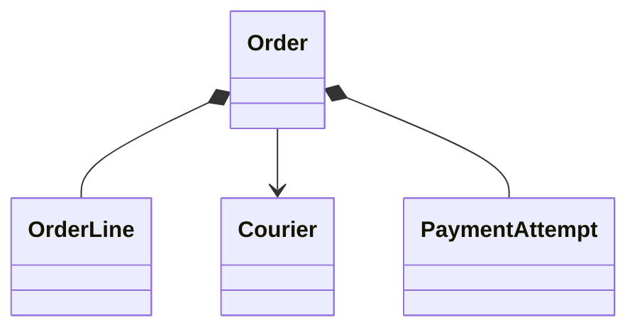

# Food Delivery

## 1. Requirements

Place, pay for, prepare, and deliver one-restaurant orders. Concurrent instances share transactional storage. Limit carts to 50 distinct items. Prices and fees use integer minor units in one currency; snapshot server prices at placement. Stock represents reservable portions.

## 2. Out of scope

Exclude routing, location tracking, coupons, multi-restaurant carts, and customer cancellation after acceptance. Gateway implementation is external; payment retries, refunds, and stock release remain required. Orders do not expire automatically.

## 3. Model and invariants

`OrderService` owns order transitions. `Order` owns immutable lines, total, customer, restaurant, and lifecycle state. `Stock` owns available portions. `Courier` owns its active assignment. Payment state is separate from fulfillment state.

The path is `PAYMENT_PENDING → PLACED → ACCEPTED → READY → PICKED_UP → DELIVERED`; rejection, payment failure, or permitted cancellation leads to `CANCELLED`. Stock cannot be negative, and one courier serves at most one active order.

## 4. Public contract

`place(customerId, restaurantId, items, key) -> Order` validates positive quantities and returns `InvalidCart`, `NotFound`, `OutOfStock`, or `KeyConflict`. Identical keys return the original order. `transition(orderId, actorId, action, expectedVersion) -> Order` supports accept, reject, ready, pickup, deliver, and cancel. Errors are `Forbidden`, `InvalidTransition`, `StaleVersion`, or `NotFound`. `assign(orderId, courierId, expectedVersion) -> Order` additionally returns `CourierBusy`. `paymentResult(attemptId, verifiedResult) -> PaymentStatus` rejects unknown or mismatched results and deduplicates terminal events.

## 5. Core flow

Placement combines duplicate quantities, locks sorted stock rows, verifies restaurant membership and availability, decrements portions, and atomically inserts the priced order, request key, payment attempt, and charge outbox entry. The worker charges outside the transaction using the attempt ID as provider key.

A verified success changes `PAYMENT_PENDING` to `PLACED`; definitive failure cancels and restores stock once. Cancellation is allowed for the customer before acceptance; restaurant rejection is allowed from `PLACED`. Both release reserved portions once and request refund when payment succeeded. A success arriving after cancellation also schedules refund.

Restaurant actors alone accept and mark ready. Assignment requires an unassigned order in `ACCEPTED` or `READY`; otherwise return `InvalidTransition`. Lock order then courier and claim a free courier. Only that courier can pick up a ready order or deliver a picked-up order. Delivery frees the courier atomically. Every accepted transition increments the order version.

## 6. Trade-offs and extensions

Reserving stock before payment avoids paid orders without food but ties up portions during uncertainty. A deadline extension needs expiry transitions plus the late-success refund path, not a timer that deletes orders.

## 7. Concurrency and failure handling

All existing-order mutations lock the order first; stock or courier locks follow. Competing assignments serialize on courier rows. Cancellation flags stock as released in the same transaction as restoration. Durable outbox entries survive crashes; workers retry with stable keys and reconcile ambiguous provider timeouts. Refunds remain pending until provider confirmation, never silently marked complete.

## 8. Test cases

Two orders competing for the final portion yield one placement. Quantity zero fails without a charge request. Total for two 450-minor-unit meals plus a 100 fee is 1000. Customer cancellation after acceptance fails. Duplicate payment success changes state once. Success after cancellation creates one refund intent. Two orders claiming one courier yield one assignment. A 51-item cart is rejected before stock locks.

[Question catalog](../interview-guide.html) · [Article template](interview-template.html)
