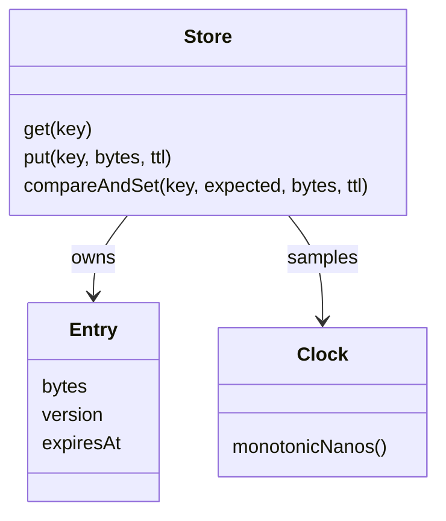

# Design an In-Memory Key-Value Store

Design a bounded in-memory key-value store with copied values, expiration, conditional updates, and atomic capacity accounting.

LLD stages: [Requirements](#requirements) → [Core entities](#core-entities) → [API or system interface](#api) → [High-level design](#high-level-design) → [Deep dives](#deep-dives).

## 1. Requirements
{: #requirements }

### Functional requirements

Store and retrieve immutable byte values with optional TTL, delete keys, and perform conditional single-key updates. Expired entries read as missing.

### Non-functional and execution constraints

Run in one concurrent process. Cap entry count, key length, and total key/value bytes. Reads and ordinary writes have expected O(1) metadata cost plus O(value bytes) for defensive copying; reclaiming expired entries under capacity pressure takes O(N). There is no durability: restart loses values and invalidates all version tokens.

### Out of scope

Exclude persistence, replication, range scans, multi-key transactions, and user-supplied callbacks. Conditional single-key replacement handles lost updates without introducing a transaction language. This store rejects writes when full rather than silently evicting unexpired application data.

## 2. Core entities
{: #core-entities }

`Store` owns the map, byte accounting, version sequence, clock, and mutex. `Entry` owns copied bytes, an opaque version, and an optional monotonic expiry deadline. A version combines a fresh process epoch with a strictly increasing counter; deleting and reinserting a key cannot reuse a token.

At time `t`, an entry is live exactly when it has no deadline or `t < expiresAt`. Expired entries behave as missing even before physical reclamation. Allocated entries, including expired ones not yet removed, remain included in memory accounting.

## 3. API or system interface
{: #api }

`get(key) -> Found{bytes, version}|Missing` returns a copy. `put(key, bytes, ttl?) -> version` unconditionally replaces a value. `compareAndSet(key, expectedVersion|Absent, bytes, ttl?) -> Updated(version)|Conflict` changes only the expected live state.

`delete(key) -> Deleted|Missing` is repeat-safe. Invalid sizes, nonpositive TTL, or deadline overflow return `InvalidArgument`; exhausted capacity returns `CapacityExceeded`. Missing TTL means no expiry, including on replacement. `sweep() -> removedCount` scans for expired entries in O(N).

Writes are not request-idempotent: repeating `put` creates a new version and resets TTL. After an uncertain conditional-write response, read and reconcile; blindly retrying with the old token returns `Conflict`.

## 4. High-level design
{: #high-level-design }

`Store` validates and copies input before acquiring its mutex. Under the lock, it samples the injected `Clock` once, removes an expired target `Entry`, and evaluates the expected-version condition if present. Compute projected entry count and bytes, subtracting the replaced entry's footprint.

If limits would be exceeded, reclaim expired entries using the same sampled time, then recompute. Reject without changing live values if capacity remains insufficient. Otherwise assign a fresh version and deadline, update the map and accounting atomically, and return the version. A failed write may reclaim expired data but never deletes a live value.

## 5. Deep dives
{: #deep-dives }

### Trade-offs and extensions

Lazy expiry avoids a timer per key but retains expired memory until a read, write, or sweep. Scans can cause latency spikes. An indexed expiry heap is an extension, provided overwrites update existing nodes instead of accumulating unbounded stale timers.

### Concurrency and failure handling

One mutex linearizes expiry checks, version comparisons, and accounting. A read that linearizes before expiry may finish afterward and still return the value. Monotonic deadlines ignore wall-clock corrections and are never serialized across restarts. No external effects run under the lock. Limit in-flight caller payloads separately if the process needs a bound beyond stored data.

### Test cases

- Put A with TTL 10 at time 0: found at 9, missing at 10.
- Two writers use version v1: exactly one conditional update succeeds.
- Delete A and recreate it: a comparison against old v1 conflicts.
- Replace a 4-byte value with 6 bytes: accounted payload rises by 2.
- Full store with only live keys: insertion returns `CapacityExceeded`.
- Full store with an expired key: insertion reclaims it and succeeds within limits.

[Question catalog](../interview-guide.html) · [Article template](interview-template.html)
