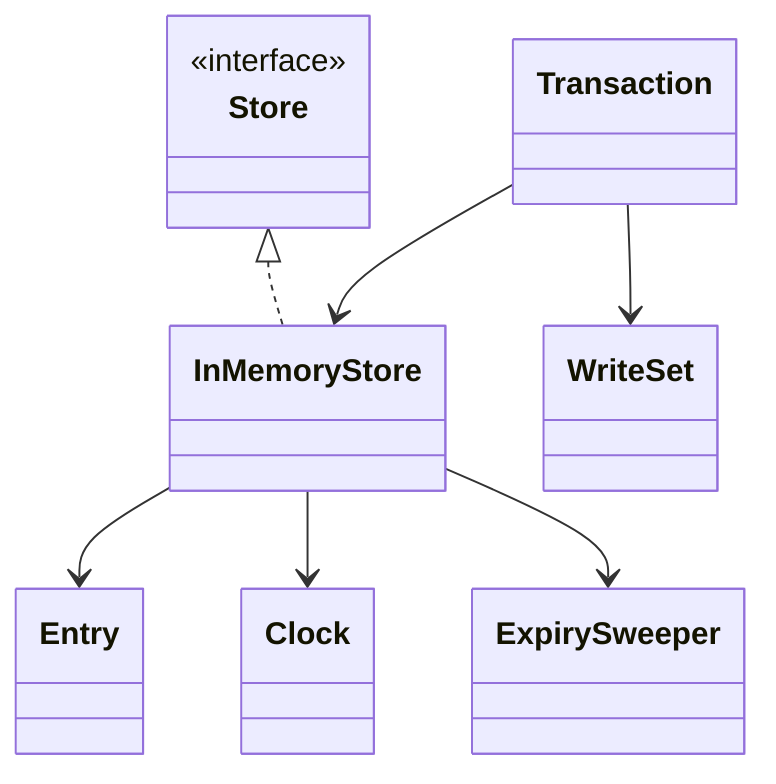
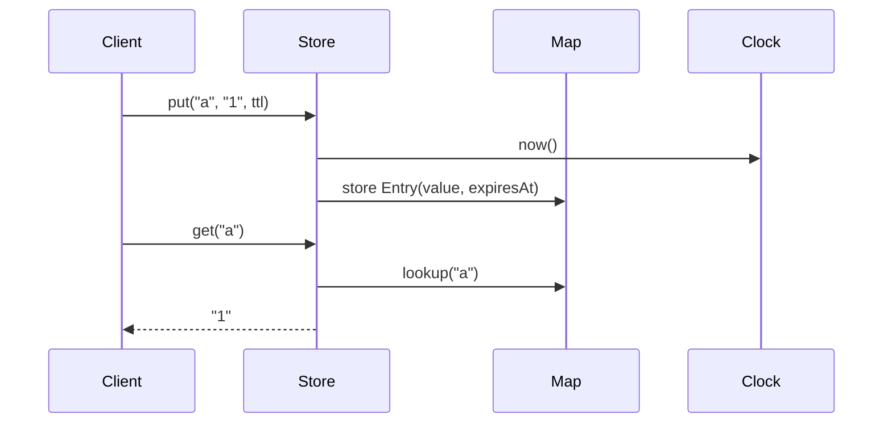
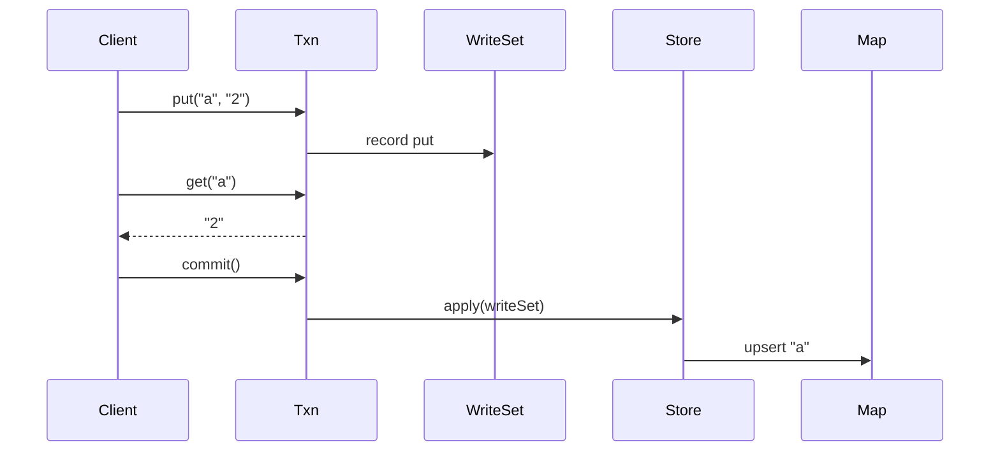
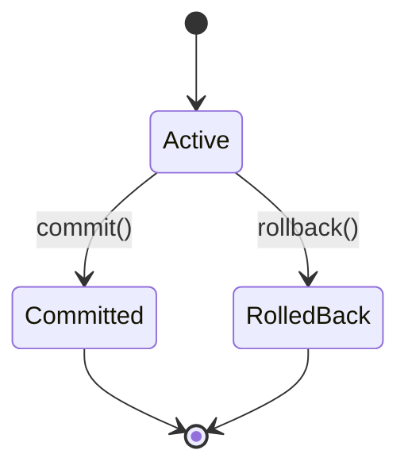

# LLD Walkthrough: Design an In-Memory Key-Value Store

> Self-contained walkthrough. It shows how to design an in-memory key-value store with TTL and simple transactions without accidentally designing a database kernel.

This prompt is dangerous because it sounds small and then invites every database topic: MVCC, WAL, compaction, snapshot isolation, distributed consensus, range indexes, replication. Do not take the bait.

Say this out loud:

> "I will build a single-process in-memory store with `get/put/delete`, TTL, and simple transactions over touched keys. I will name stronger database features as extensions, not implement them live."

That is the senior move: concrete core, bounded database vocabulary.

---

## Minute 0-7: Clarify and fence the scope

Ask questions that prevent database sprawl:

- **Data model?** → String keys, opaque values/bytes or generic values.
- **Operations?** → `get`, `put`, `delete`, `begin`, `commit`, `rollback`.
- **TTL?** → Optional TTL per key; expired keys behave as missing.
- **Transactions?** → Single-process, single-store transactions; no distributed transactions.
- **Isolation?** → Read-your-writes inside a transaction; simple committed view outside.
- **Persistence?** → Out of scope unless asked.
- **Concurrency?** → Concurrent clients possible; start with simple locking.

Say the fence out loud:

> "In scope: an in-memory map-backed store, optional TTL, lazy expiry on read, and simple transactions using a write-set or undo log. Out of scope: disk durability, replication, range scans, SQL, and full serializable MVCC."

Be explicit about transaction semantics:

> "A transaction buffers writes until commit. Reads inside the transaction see their own writes first, then the committed store."

That is understandable, testable, and not a dissertation.

---

## Minute 7-13: Core entities

List the objects. Keep it small. The map is the data structure; transactions are the behavior seam.

| Object | Responsibility (one line) |
|---|---|
| `Store<K,V>` | Public interface for key-value operations and transaction creation. |
| `InMemoryStore<K,V>` | Owns the committed map, lock, clock, and expiry behavior. |
| `Entry<V>` | Holds value plus optional expiry timestamp. |
| `Transaction<K,V>` | Buffers reads/writes and commits or rolls back as one unit. |
| `WriteSet<K,V>` | Tracks pending puts and deletes for a transaction. |
| `ExpiryPolicy` | Determines expiry timestamps and whether entries are expired. |
| `ExpirySweeper` | Optional background cleanup seam; correctness does not depend on it. |
| `Clock` | Supplies time for TTL and deterministic tests. |

Eight objects. No `Database`, `Table`, `Page`, `Segment`, or `QueryPlanner`. This is a key-value store.



State the main invariant:

> "The committed map only contains the latest committed value for a key; a transaction's write-set shadows that map until commit."

Then stop. Do not invent storage pages.

---

## Minute 13-20: The spine (API + varying interfaces)

Define the outside API:

```text
interface Store<K, V> {
  Optional<V> get(K key)
  void put(K key, V value)
  void put(K key, V value, Duration ttl)
  boolean delete(K key)
  Transaction<K,V> begin()
}
```

Transaction API:

```text
interface Transaction<K, V> {
  Optional<V> get(K key)
  void put(K key, V value)
  void put(K key, V value, Duration ttl)
  boolean delete(K key)
  void commit()
  void rollback()
}
```

Behavior that varies goes behind seams:

```text
interface ExpiryPolicy<V> {
  Instant expiresAt(Duration ttl, Clock clock)
  boolean isExpired(Entry<V> entry, Instant now)
}

interface ExpirySweeper {
  void start()
  void stop()
}
```

The expiry mechanism is deliberately boring:

- lazy expiry on `get` is required;
- background sweeping is optional;
- expired means "behaves as absent."

For transactions, keep the implementation simple:

```text
WriteSet:
  puts: Map<K, Entry<V>>
  deletes: Set<K>
```

This is copy-on-write for touched keys. You are not copying the whole store.

Say this out loud:

> "I am using a write-set transaction: reads check pending writes/deletes first, and commit applies the write-set under the store lock."

That is the whole transaction algorithm for this scope.

---

## Minute 20-33: Walk the happy path

First walk plain `put` and `get`.



Narrate it:

- "`put` computes expiry from `clock.now()` plus TTL."
- "The committed map stores an `Entry`, not the raw value."
- "`get` checks the map, then checks expiry."
- "If expired, it removes the key and returns empty."
- "If live, it returns the value."

Plain operation pseudocode:

```text
put(key, value, ttl):
  lock write
  map[key] = Entry(value, expiresAt(ttl))

get(key):
  lock read-or-write
  entry = map.get(key)
  if entry == null:
    return empty
  if entry.isExpired(clock.now()):
    remove key
    return empty
  return entry.value
```

For lazy expiry, a write lock may be needed during `get` if you physically remove expired entries. Or you can return empty and let a sweeper remove later. Pick one and state it.

Now walk a transaction:



Transaction read path:

```text
txn.get(key):
  if writeSet.deletes contains key:
    return empty
  if writeSet.puts contains key:
    return live value from writeSet
  return store.getCommitted(key)
```

Commit path:

```text
commit():
  lock store for write
  for key in deletes:
    map.remove(key)
  for (key, entry) in puts:
    if entry is not expired at commit time:
      map[key] = entry
  mark transaction closed
```

Rollback path:

```text
rollback():
  clear writeSet
  mark transaction closed
```

The important bounded transaction statement:

> "This gives read-your-writes and atomic commit for one in-process store. I am not claiming snapshot isolation or serializable MVCC unless we add version checks."

That honesty scores.

---

## Minute 33-42: Stretch and edges

Common curveballs and bounded answers:

- **"What isolation level is this?"** With a single write lock at commit and reads from committed state plus local write-set, call it read committed with read-your-writes inside a transaction. If we need repeatable reads, add versions and capture a transaction start version. Do not build full MVCC unless asked.

- **"What if two transactions write the same key?"** First cut: commits are serialized by the store write lock; last commit wins. If product needs conflict detection, store per-key versions and fail commit when a touched key changed since transaction start.

- **"How do TTL and transactions interact?"** TTL is evaluated using the transaction's entry expiry. A key written with TTL may expire before commit; on commit, skip expired writes or store them and let read treat them as absent. I would skip them at commit.

- **"Do we need a background sweeper?"** Not for correctness. Lazy expiry on read is enough. A sweeper is an optimization behind `ExpirySweeper` to reclaim memory for cold expired keys.

- **"How do you make it concurrent?"** Start with a read-write lock on the committed map and a single writer lock for commits. Transactions build write-sets without holding the store lock. For higher write throughput, move to per-key locks or versioned optimistic commit.

- **"Can transaction rollback use an undo log instead?"** Yes. For this design, a write-set is simpler because uncommitted changes never touch the committed map. Undo log is better if you apply changes eagerly, which I am not doing.

A tiny state diagram is natural for transaction lifecycle:



Name the edges: negative TTL, zero TTL, deleting a missing key, using a closed transaction, sweeper/get races, and large values when capacity is not part of the prompt.

Anti-patterns to call out:

- "I would not implement a WAL or replication unless persistence is in scope."
- "I would not call this serializable unless I add version checks."
- "I would not copy the entire map per transaction; I copy only touched keys into the write-set."

---

## Minute 42-45: Wrap up

> "The design has a `Store<K,V>` API, an `InMemoryStore` backed by a committed map of `Entry(value, expiry)`, lazy TTL expiry on read, and optional background sweeping behind a seam. Transactions are simple write-sets: reads check local writes/deletes first, commit applies touched keys under the store write lock, and rollback discards the write-set. Concurrency starts with a read-write lock and can evolve to per-key or versioned optimistic commits."

If there is time, name tests: put/get, delete, TTL expiry, read-your-writes, rollback, atomic commit, closed-transaction rejection, and the documented conflict behavior.

That is enough. You built a key-value store, not a pretend database product.

---

## What separated a pass from a fail here

- You fenced the problem before it turned into Redis, RocksDB, or Postgres.
- You modeled TTL as `Entry(value, expiry)` with lazy read cleanup, which is simple and correct.
- You kept transactions bounded with a write-set over touched keys, not a full MVCC engine.
- You named the isolation level honestly instead of overselling it.
- You made concurrency concrete: commits are serialized first, then optimized if needed.

The pass is not "can say MVCC." The pass is "can design the smallest transactional store that actually runs."
