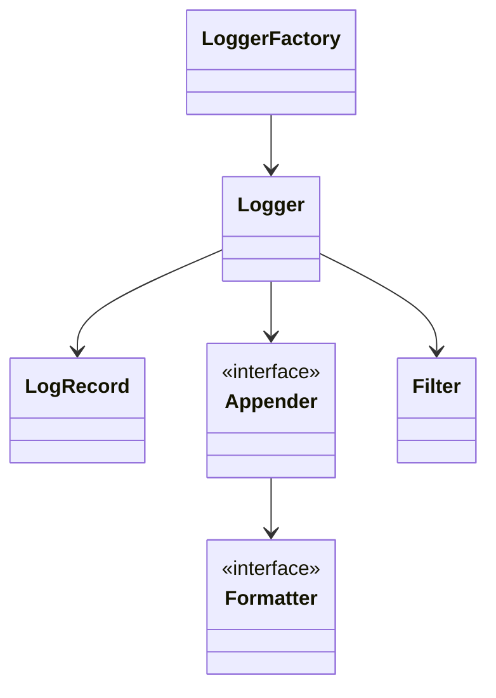
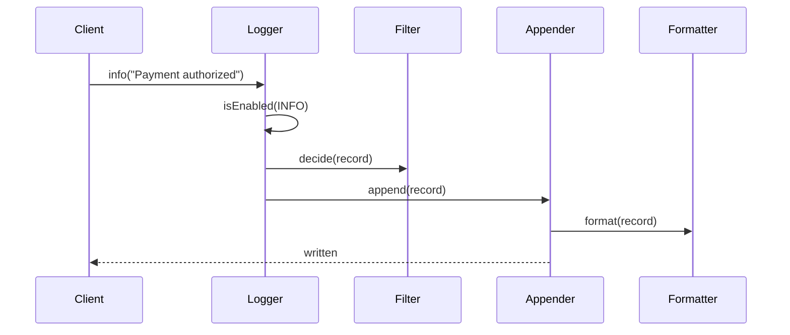
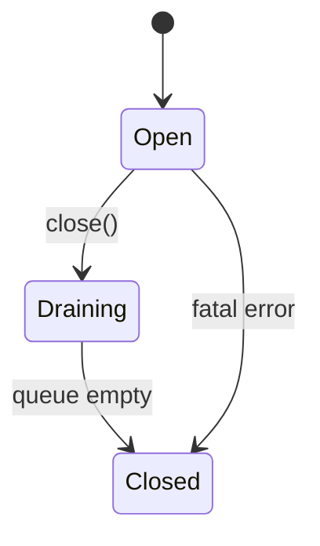

# LLD Walkthrough: Design a Logging Framework

> Self-contained walkthrough. This is how to design a logging library live without drowning in appenders, config formats, or production-grade rotation code.

A logging framework is a classic LLD prompt because the object model is small but the extension points are obvious. The candidate trap is to immediately clone Log4j: hierarchical configs, async queues, filters, MDC, rolling files, network appenders, JSON layouts, and plugins. That is too much. The core is smaller:

> A client gets a logger, calls `info/error/debug`, the logger checks level and filters, creates a log record, formats it, and sends it to one or more appenders.

Everything else is a variant behind an interface.

---

## Minute 0-7: Clarify and fence the scope

Ask questions that decide the shape of the model:

- **Library or service?** → Library used inside an application, not a centralized log backend.
- **Destinations?** → Console and file in scope; network as an appender variant.
- **Formatting?** → Plain text and JSON as formatter variants.
- **Levels?** → TRACE, DEBUG, INFO, WARN, ERROR.
- **Configuration?** → Programmatic config or simple config object, not a full parser.
- **Async?** → Name an async appender seam; implement synchronous flow first.

Say the fence out loud:

> "In scope: logger creation by name, level filtering, log records, formatters, console/file/network appenders, filters, and composition of multiple appenders. Out of scope: full config file parsing, distributed log aggregation, built-in rotation implementation, and MDC unless asked. I will leave async logging as an appender seam."

Also say the key design principle:

> "A logger should not know how to write files or JSON. It creates records and delegates formatting and output."

That is the whole design direction.

---

## Minute 7-13: Core entities

Use composition. A `Logger` has many `Appender`s. An `Appender` has a `Formatter`. Filters can sit on the logger or appender.

| Object | Responsibility (one line) |
|---|---|
| `Logger` | Client-facing object that accepts log calls and emits records. |
| `LogLevel` | Enum defining severity and ordering. |
| `LogRecord` | Immutable event: level, message, timestamp, logger name, error, context. |
| `Appender` | Destination interface that writes a formatted record. |
| `Formatter` | Converts a `LogRecord` into bytes or text. |
| `Filter` | Decides whether a record should be dropped. |
| `LoggerFactory` | Creates and caches loggers by name. |
| `LoggerConfig` | Holds level, appenders, filters, and propagation settings. |
| `AsyncAppender` | Optional wrapper that buffers records before delegating. |

Nine objects, but only four are central: `Logger`, `LogRecord`, `Appender`, `Formatter`. Do not start with inheritance. `ConsoleAppender`, `FileAppender`, and `NetworkAppender` are implementations of one interface.



Say this out loud:

> "The chain is: logger checks level, creates a record, filters it, then each appender formats and writes it. That is composition, not a class explosion."

This phrase prevents the common fail: `FileLogger`, `ConsoleLogger`, `ErrorFileLogger`, `JsonConsoleLogger`, and so on. Those combinations should be objects wired together, not subclasses.

---

## Minute 13-20: The spine (API + varying interfaces)

Client-facing API:

```text
Logger logger = LoggerFactory.getLogger("payments.checkout")

logger.debug("Creating payment", context)
logger.info("Payment authorized", context)
logger.warn("Provider latency high", context)
logger.error("Payment failed", exception, context)

logger.setLevel(LogLevel.INFO)          // optional programmatic override
```

Core methods:

```text
class Logger {
  void log(LogLevel level, String message)
  void log(LogLevel level, String message, Throwable error, Map<String, String> context)
  boolean isEnabled(LogLevel level)
}
```

Variation seam one: destinations.

```text
interface Appender {
  void append(LogRecord record)
  void close()
}

class ConsoleAppender implements Appender
class FileAppender implements Appender
class NetworkAppender implements Appender
```

That is the **Strategy pattern** for output destinations.

Variation seam two: formatting.

```text
interface Formatter {
  String format(LogRecord record)
}

class TextFormatter implements Formatter
class JsonFormatter implements Formatter
```

This is also Strategy. The appender owns a formatter, so `FileAppender + JsonFormatter` and `ConsoleAppender + TextFormatter` are just configuration combinations.

Filtering is a small chain:

```text
interface Filter {
  FilterDecision decide(LogRecord record)   // ACCEPT, DENY, NEUTRAL
}
```

If there are multiple filters, run them in order. That is a simple **Chain of Responsibility**. Do not over-explain it; just show where the chain lives.

Say this out loud:

> "The spine is `Logger.log`. Appender and Formatter are strategies. Filters form a small chain. Every follow-up like JSON logs, network logs, or PII redaction is a new implementation, not a rewrite."

---

## Minute 20-33: Walk the happy path

Use one call:

> "The application calls `logger.info('Payment authorized')`. The logger level is INFO, so the call is enabled. It creates a `LogRecord`, filters it, then sends the same record to console and file appenders. Each appender formats and writes independently."

Tiny sequence diagram:



Now narrate the method:

```text
log(level, message, error, context):
  if !isEnabled(level):
    return

  record = LogRecord(
    loggerName = this.name,
    level = level,
    message = message,
    timestamp = clock.now(),
    error = error,
    context = context
  )

  if filters.deny(record):
    return

  for appender in appenders:
    appender.append(record)
```

And one appender:

```text
FileAppender.append(record):
  line = formatter.format(record)
  lock file writer
  write line
  flush according to policy
```

Say the quiet parts out loud:

- "The same `LogRecord` is immutable and can go to multiple appenders safely."
- "Level filtering happens before string-heavy formatting work. If DEBUG is disabled, we return early."
- "An appender failure should not crash the application by default. I would route appender errors to an internal error handler."
- "Thread safety matters at appenders, especially file writes. The logger can be mostly stateless after config is loaded."

A small state diagram is natural for an async appender, not for the logger itself:



Keep async as a seam:

```text
AsyncAppender implements Appender:
  append(record): enqueue record into bounded ring buffer
  worker thread: dequeue and delegate.append(record)
```

Use the phrase "bounded ring buffer" if asked, but do not implement it live. The important design is that async wraps another appender, so it is composition again.

---

## Minute 33-42: Stretch and edges

Common curveballs and bounded answers:

- **"Thread-safe file logging?"** Put synchronization inside `FileAppender`, not in every `Logger`. Use a lock around writes or a single writer thread via `AsyncAppender`. Keep records immutable.
- **"Log rotation?"** Name it as a `RollingFileAppender` or `RotationPolicy` seam. Do not build date/size rotation live unless asked. The current `FileAppender` can be replaced by a rotating implementation.
- **"Logger hierarchy by name?"** `LoggerFactory` can treat `payments.checkout` as a child of `payments`. Effective level and appenders can inherit from the nearest configured ancestor. Add a `propagate` flag to avoid duplicate writes.
- **"Different formats per destination?"** Each appender has its own formatter. Console can be text; file can be JSON. No new logger class.
- **"PII redaction?"** Add a `Filter` or `Formatter` that masks fields. If the requirement is to drop records, use `Filter`; if it is to transform output, use `Formatter` or a `RecordProcessor` seam.
- **"Network appender fails."** `NetworkAppender` should timeout quickly and report failure to an internal error handler. For reliability, wrap it in `AsyncAppender` so application threads are not blocked.
- **"Dynamic config reload?"** `LoggerFactory` swaps immutable `LoggerConfig` references atomically. Existing loggers read the latest effective config.
- **"Performance of disabled logs?"** `isEnabled(level)` is cheap. In real APIs, support supplier/lambda messages to avoid constructing expensive strings when disabled.

The anti-pattern is subclass multiplication. Say it plainly:

> "I do not want `JsonFileLogger` and `TextConsoleLogger`. I want `Logger` plus `Appender` plus `Formatter`, because the combinations are configuration, not types."

Also keep the hierarchy answer bounded:

```text
getEffectiveConfig("payments.checkout"):
  check exact logger config
  then "payments"
  then root
```

That is enough. Do not reimplement Log4j in the interview.

---

## Minute 42-45: Wrap up

> "The model is a composition chain: `LoggerFactory` returns named `Logger`s; a `Logger` checks `LogLevel`, creates immutable `LogRecord`s, runs filters, and sends records to multiple `Appender`s. Each appender owns a `Formatter`. Console, file, network, JSON, filters, async buffering, and rotation are all new implementations or wrappers. Thread safety is concentrated in appenders, especially file and async. Next I would add config loading and tests for level filtering, formatter output, and appender failure behavior."

That is a complete logging framework answer without becoming a logging framework project.

---

## What separated a pass from a fail here

- You used **composition instead of subclass combinations**.
- You made destinations and layouts explicit **Strategy pattern** seams.
- You showed the actual `log()` flow, including level check before formatting.
- You put thread safety where it belongs: in appenders and async wrappers.
- You named hierarchy, rotation, and async buffering as bounded extensions instead of building them all.

The pass is not "I can clone Log4j." The pass is a small, extensible chain that logs one record correctly.
