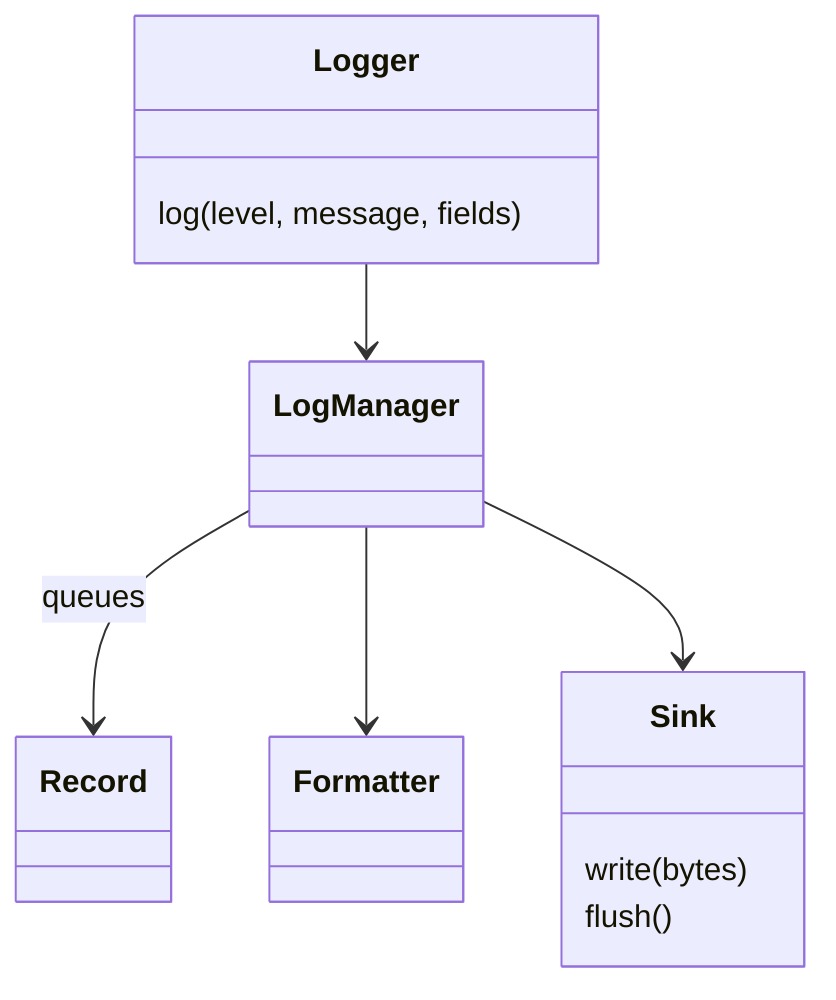

# Design a Bounded Logging Framework

Design asynchronous logging with severity filters, bounded queues, immutable configuration snapshots, and explicit flush and failure semantics.

LLD stages: [Requirements](#requirements) → [Core entities](#core-entities) → [API or system interface](#api) → [High-level design](#high-level-design) → [Deep dives](#deep-dives).

## 1. Requirements
{: #requirements }

### Functional requirements

Provide named loggers, severity filtering, immutable configuration snapshots, and asynchronous output to configured sinks. Support flushing accepted records and closing admission.

### Non-functional and execution constraints

Concurrent application threads share one process-local backend and a single consumer. Queue capacity Q and maximum encoded record size B bound queued payload memory to O(QB). Producer work is O(record bytes); dispatch is O(S × record bytes) for S bounded sinks.

Accepted records are volatile: crashes lose queued records. Flush means the sink's documented contract completed, not necessarily stable storage.

### Out of scope

Exclude remote collection, file rotation, logger inheritance, plugins, and exactly-once output. Logs are not an authoritative ledger. Callers must redact secrets before submission.

## 2. Core entities
{: #core-entities }

`LogManager` owns configuration, queue, sequence allocation, and consumer lifecycle. A lightweight `Logger` owns only its name and manager reference. Each `Record` owns copied message/context fields, severity, UTC timestamp, configuration version, and queue sequence.

Accepted records have increasing sequence numbers and one captured configuration version. Configuration changes never reinterpret queued records. The bounded queue preserves accepted enqueue order, not the order in which producer threads started calling `log`.

## 3. API or system interface
{: #api }

`getLogger(name) -> Logger` rejects oversized or empty names and need not retain loggers in an unbounded registry. `log(level, message, fields) -> Accepted(sequence)|Filtered|DroppedFull|RejectedTooLarge|Closed` accepts only bounded scalar fields and copies them before enqueue.

`configure(config) -> version|InvalidConfig` atomically replaces validated thresholds and formatting options. The sink set is fixed for the manager's lifetime. `flush(timeout) -> Flushed|SinkFailure|TimedOut` waits for all records accepted before its barrier and flushes sinks. `close(timeout)` stops admission, drains, flushes, and returns the same outcome variants. Repeating `close` is safe; repeated log calls intentionally produce repeated records.

## 4. High-level design
{: #high-level-design }

A `Logger` passes its name and call arguments to `LogManager`, which reads one configuration snapshot and filters by severity before copying fields. Validate record size and capture the UTC display timestamp. Under the queue lock, recheck lifecycle and capacity, then assign a sequence and enqueue the `Record` atomically. On saturation, drop the new record and increment a counter; never evict an already accepted record.

The consumer formats records in queue order with the captured configuration, enforcing output bound B, and attempts each sink once. Catch formatting and sink failures, increment counters, and continue. A flush inserts an ordered barrier, waiting for space within its timeout; the consumer flushes sinks at that barrier.

## 5. Deep dives
{: #deep-dives }

### Trade-offs and extensions

Dropping new records protects application latency but loses diagnostics during overload. A bounded blocking admission mode is an alternative, with explicit timeout and deadlock risks. Structured JSON formatting is a small extension that leaves queue ownership and delivery semantics unchanged.

### Concurrency and failure handling

Queue admission, sequence allocation, and shutdown share one lock. Sink calls run outside it, only on the consumer. UTC timestamps support display; monotonic deadlines govern timeouts. No automatic sink retries occur because a failed write may already have emitted partial bytes. Internal failures use counters rather than recursively logging. Flush reports a sticky failure if any preceding accepted record failed formatting or writing; it is not proof of complete delivery otherwise.

### Test cases

- Threshold WARN, input INFO: `Filtered`, no queue entry.
- Queue capacity 1 with consumer paused: second record returns `DroppedFull`.
- Two producers enqueue simultaneously: distinct sequences, output in sequence order.
- Change formatter after acceptance: queued record uses its captured version.
- One sink throws: other sinks still receive the record; flush reports failure.
- Log after close begins: `Closed`; repeated close creates no duplicate writes.

[Question catalog](../interview-guide.html) · [Article template](interview-template.html)
