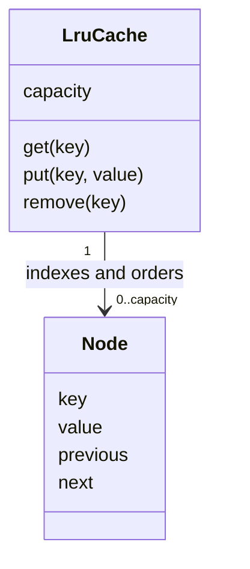

# Design an LRU Cache

Implement exact least-recently-used eviction using a synchronized hash map and linked list while preserving constant-time ordinary operations.

LLD stages: [Requirements](#requirements) → [Core entities](#core-entities) → [API or system interface](#api) → [High-level design](#high-level-design) → [Deep dives](#deep-dives).

## 1. Requirements
{: #requirements }

### Functional requirements

Provide a bounded cache with least-recently-used eviction. Support insertion, replacement, lookup with recency promotion, non-promoting lookup, and removal. Capacity counts entries, not bytes.

### Non-functional and execution constraints

Concurrent callers share one process. `get`, `put`, and `remove` take expected O(1) time, assuming constant-time hashing and equality. Cached values are immutable references; callers must not mutate keys after insertion. State is volatile, and restart produces an empty cache.

### Out of scope

Exclude TTL, persistence, loading functions, distributed coherence, and eviction callbacks. Eviction is purely a memory operation. The cache is not authoritative: any value may disappear under capacity pressure.

## 2. Core entities
{: #core-entities }

`LruCache` owns a hash map from key to `Node`, a doubly linked list, and one mutex. Dummy head and tail nodes avoid separate empty-list pointer rules. Head's next node is most recently used; tail's previous node is least recently used.

Every map entry has exactly one non-sentinel list node, and every such node has one map entry. Adjacent forward and backward links agree. Map size equals list size and never exceeds capacity. Updating a value must reuse its node rather than leave a stale duplicate in the list.

## 3. API or system interface
{: #api }

`Cache(capacity)` rejects negative capacity; zero is valid and stores nothing. `get(key) -> Hit(value)|Miss` promotes hits to most recent. `peek(key) -> Hit(value)|Miss` does not change order. Explicit result variants distinguish a cached null value from absence.

`put(key, value) -> {stored, evicted?}` inserts or replaces and reports an optional evicted key/value pair. Zero capacity returns `stored=false`. `remove(key) -> Removed(value)|Missing` changes no other recency. Null keys return `InvalidKey`; `size() -> integer` returns a synchronized snapshot.

Repeating `put` does not duplicate entries but does refresh recency. Consequently it is not strictly idempotent if other accesses occur between retries. Removing a missing key is a harmless no-op.

## 4. High-level design
{: #high-level-design }

`LruCache` coordinates its hash map and list under the same mutex; nodes never change links independently. For a hit, hold the mutex, find the node through the map, unlink it, and insert it immediately after the head. Return the stored reference after releasing the mutex.

For `put`, first check zero capacity and an existing map entry. Existing entries replace their value and move to the head. For a new entry, allocate the node before modifying structure. Insert it into the map and list; if capacity is exceeded, unlink the tail predecessor and remove its key from the map before unlocking. Return that victim to the caller. Never search the list for a key.

## 5. Deep dives
{: #deep-dives }

### Trade-offs and extensions

Exact LRU requires a write on every hit, so read-heavy traffic still contends on the mutex. Segmented approximate LRU trades eviction precision for parallelism. A byte-budget extension needs a bounded weight function, accounting on replacement, and possibly multiple evictions; insertion then costs O(number of victims), not always O(1).

### Concurrency and failure handling

The lock protects map and list together; independently thread-safe collections are insufficient. `peek` also locks because eviction can remove its node. No callbacks or I/O execute while locked. Require stable, non-reentrant key hashing and equality. This entry-count bound does not bound referenced object sizes; callers needing a hard memory limit must also restrict payload sizes.

### Test cases

- Capacity 2: put A, put B, get A, put C; B is evicted.
- Replace A's value: size unchanged, one node for A, A becomes most recent.
- Store null under A: `Hit(null)`; unknown B gives `Miss`.
- Capacity 0: put returns `stored=false`, subsequent get misses.
- Concurrent puts A and B at capacity 1: one surviving entry and consistent links.
- Capacity 2: put A, put B, peek A, put C; A is evicted.

[Question catalog](../interview-guide.html) · [Article template](interview-template.html)
