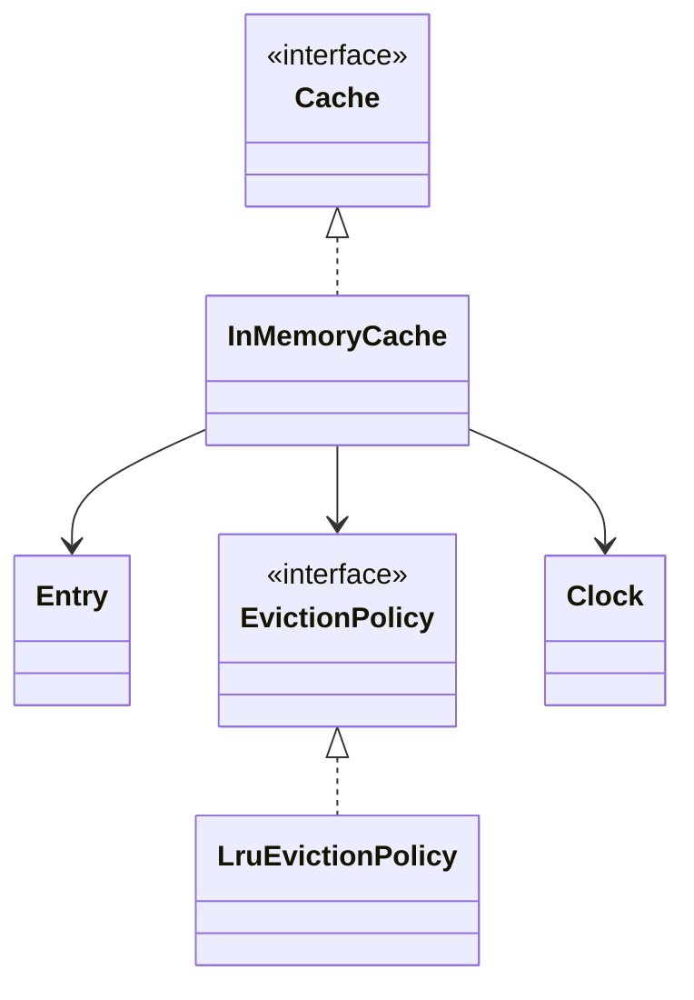
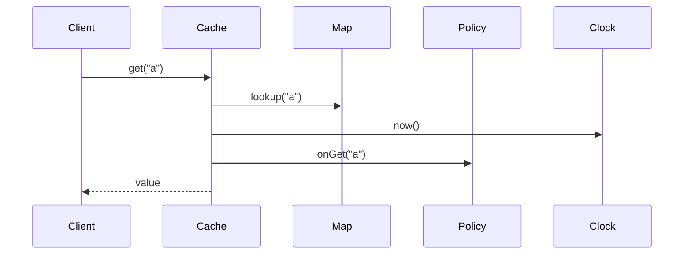
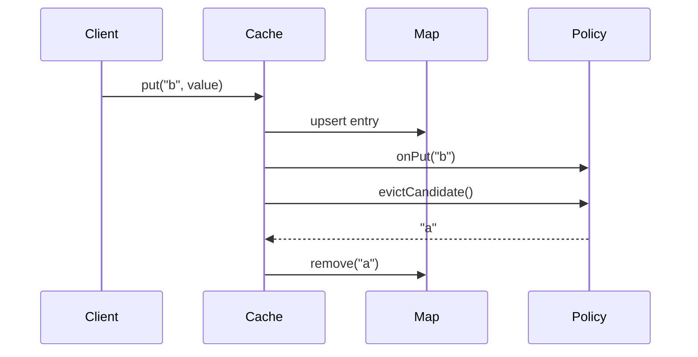
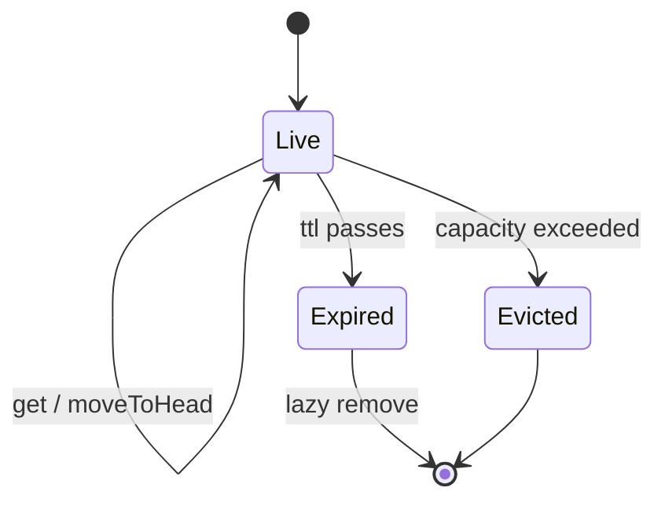

# LLD Walkthrough: Design an LRU Cache

> Self-contained walkthrough. It shows how to design a generic in-memory cache with eviction without spending the whole interview proving linked-list invariants.

An LRU cache is the classic trap: the interviewer does care about the data structure, but only up to the point where you can use it correctly.

The winning posture is:

> "For LRU I use a hashmap plus doubly linked list for O(1) `get`, `put`, move-to-front, and eviction. I will state the invariant, hide the pointer work inside the cache internals, and spend the rest of the time on API and edge behavior."

That is the line between senior and stuck.

---

## Minute 0-7: Clarify and fence the scope

Start by asking what kind of cache this is. Do not draw nodes yet.

Good questions and reasonable default answers:

- **Generic library or application-specific cache?** → Generic `Cache<K,V>`.
- **Operations?** → `get`, `put`, `delete`, maybe `contains`.
- **Capacity unit?** → Number of entries, not bytes, unless the interviewer says otherwise.
- **Eviction policy?** → LRU by default, but design for LFU/FIFO as variants.
- **TTL?** → Optional per-entry/default TTL; expiry checked on read.
- **Thread safety?** → Single process, concurrent callers possible.
- **Persistence?** → Out of scope; this is in-memory.

Say the fence out loud:

> "In scope: an in-memory generic cache with capacity-based eviction, LRU as the default policy, optional TTL, and thread-safe `get`/`put`. Out of scope: distributed cache, disk persistence, byte-accurate memory accounting, and cache stampede control."

One product decision to state:

> "On `get`, LRU treats the key as recently used. On expired read, I remove the entry and return empty."

That decision drives the happy path.

---

## Minute 7-13: Core entities

Use responsibilities first. The hashmap and list are internal implementation details, not top-level domain objects unless you need to explain the algorithm.

| Object | Responsibility (one line) |
|---|---|
| `Cache<K,V>` | Public interface for `get`, `put`, and `delete`. |
| `InMemoryCache<K,V>` | Owns storage, coordinates TTL checks and eviction policy updates. |
| `Entry<K,V>` | Holds key, value, expiry time, and policy metadata reference. |
| `Node<K>` | Doubly linked list node used by LRU to track recency. |
| `EvictionPolicy<K>` | Varying policy that records access and chooses a victim. |
| `LruEvictionPolicy<K>` | Maintains keys from most-recent to least-recent in O(1). |
| `Clock` | Supplies time for TTL and deterministic tests. |
| `CacheStats` | Optional counters for hits, misses, evictions, and expirations. |

Eight objects. Composition first:

- `InMemoryCache` has a map and an `EvictionPolicy`.
- `LruEvictionPolicy` has its own list and key-to-node map.
- `Entry` does not inherit from anything.



Say the data-structure invariant once:

> "The cache map and the LRU list stay in sync: every key in the map has exactly one node in the policy, and every policy node points to a live key."

Then move on. Do not prove it unless asked.

---

## Minute 13-20: The spine (API + varying interfaces)

Define the client-facing API:

```text
interface Cache<K, V> {
  Optional<V> get(K key)
  void put(K key, V value)
  void put(K key, V value, Duration ttl)
  boolean delete(K key)
  int size()
}
```

Keep return semantics explicit:

- `get` returns empty on absent or expired key;
- `put` updates existing values and marks them recently used;
- `delete` removes from both storage and policy;
- `size` counts live stored entries, after lazy cleanup where practical.

Now the varying behavior. This is the **Strategy pattern**:

```text
interface EvictionPolicy<K> {
  void onGet(K key)
  void onPut(K key)
  void onDelete(K key)
  Optional<K> evictCandidate()
}

final class LruEvictionPolicy<K> implements EvictionPolicy<K>
final class FifoEvictionPolicy<K> implements EvictionPolicy<K>
final class LfuEvictionPolicy<K> implements EvictionPolicy<K>
```

The cache should not know whether the policy uses a linked list, heap, counter map, or queue.

The LRU implementation detail is bounded:

```text
map: K -> Entry
lruPolicy:
  nodes: K -> Node
  list: head = most recent, tail = least recent
```

One O(1) sentence:

> "`get` is O(1) because the value is found in the hashmap and the recency node is moved to the list head using direct node references."

Then stop.

---

## Minute 20-33: Walk the happy path

Walk both `get` and `put`, because the interviewer is checking whether the map and list stay together.



Narrate the `get` happy path:

- "Look up key in the map."
- "If missing, return empty and record a miss."
- "If present, compare expiry with `clock.now()`."
- "If expired, remove it from map and policy, then return empty."
- "If live, call `policy.onGet(key)` so LRU moves it to the head."
- "Return the value."

Pseudocode:

```text
get(key):
  lock
  entry = map.get(key)
  if entry == null:
    stats.miss()
    return empty
  if entry.isExpired(clock.now()):
    removeInternal(key)
    stats.expired()
    return empty
  policy.onGet(key)
  stats.hit()
  return entry.value
```

Now walk `put`:



Narrate `put`:

- "If the key already exists, replace the value and expiry, then mark it recently used."
- "If it is new, insert map entry and policy node."
- "If size exceeds capacity, ask the policy for one victim."
- "Remove the victim from the map and policy together."

Pseudocode:

```text
put(key, value, ttl):
  lock
  if capacity == 0:
    return
  expiry = ttl == null ? never : clock.now() + ttl
  map[key] = Entry(key, value, expiry)
  policy.onPut(key)
  while map.size > capacity:
    victim = policy.evictCandidate()
    removeInternal(victim)
```

The internal LRU operations are simple:

```text
onGet(key): move node to head
onPut(existing key): move node to head
onPut(new key): add node at head
evictCandidate(): return tail key
```

Bound the pointer talk:

> "The list has sentinel head/tail nodes so add, remove, and move-to-head are constant time and do not need special-case null logic."

That is enough.

---

## Minute 33-42: Stretch and edges

Common curveballs and bounded answers:

- **"How do you make it thread-safe?"** Guard the map and eviction policy together with one lock for the first cut. The invariant crosses both structures, so separate locks can corrupt recency. If contention is high, shard the cache by key hash; each shard has its own map, policy, and lock.

- **"Capacity is zero."** `put` becomes a no-op and `get` always misses. Say it explicitly; it is a favorite edge case.

- **"TTL expiry on read."** Lazy expiry is enough: when `get` sees an expired entry, remove it from map and policy. Optionally add a background sweeper behind a seam later, but correctness should not depend on it.

- **"Change to LFU or FIFO."** New `EvictionPolicy` implementation. The cache API and entry storage do not change.

- **"Evict by bytes instead of count."** Replace `capacity` with a weight budget and add a `Weigher<K,V>` interface. Still ask policy for victims until under budget. Do not rewrite the cache.

- **"What if `get` should not update recency?"** That is a policy choice. Either expose `peek(key)` or configure a policy that ignores reads. Do not silently change `get` semantics.

A tiny state diagram is natural for an entry:



Name the edges you're deferring: null keys/values, eviction callback failure, clock jumps, `size()` with expired entries, and large values when byte capacity is out of scope.

Anti-patterns to call out:

- "I would not subclass `Cache` into `LruCache`, `FifoCache`, and `LfuCache`; eviction varies, not the whole cache."
- "I would not expose linked-list nodes to clients; pointer work is internal."
- "I would not split map and list locks in the first design because the invariant crosses both."

---

## Minute 42-45: Wrap up

> "The design has a generic `Cache<K,V>` API, an `InMemoryCache` that owns entries, and an `EvictionPolicy` strategy seam. LRU uses hashmap plus doubly linked list for O(1) `get`, `put`, move-to-head, and tail eviction. The one invariant is that the map and policy list stay in sync, so I guard them together. TTL is lazy on read, and alternate policies are new strategy implementations."

If you have time, name the tests:

- put then get returns value;
- get missing returns empty;
- capacity overflow evicts least recently used;
- get moves an entry to most recent;
- expired entry is removed on read;
- capacity zero stores nothing.

That is enough to show both correctness and judgment.

---

## How real systems solve this

The interview LRU is the clean textbook structure: a hashmap for lookup plus a doubly linked list for recency. That gives O(1) `get`, `put`, move-to-front, and tail eviction as long as the map and list mutate under the same invariant. Java's `LinkedHashMap` already packages that mechanism with `accessOrder=true` and `removeEldestEntry`.

Production caches usually do not stop at plain LRU. Workloads often have scans, one-hit wonders, and mixed hot/cold traffic that can pollute a pure recency list. Libraries such as Guava Cache and Caffeine add richer admission and eviction behavior; Caffeine's Window TinyLFU admission policy is designed to improve hit ratio over plain LRU on many real access patterns.

Redis is another useful reality check: it does not implement exact LRU for all keys. Its LRU policy is approximate, using random sampling controlled by `maxmemory-samples` with a default of 5 and a compact per-object LRU clock. Redis also offers LFU policies with an 8-bit logarithmic counter, probabilistic increment, and time decay. That is a deliberate production trade-off: less metadata and CPU for a good-enough victim choice.

The interview design should still start with true LRU because it proves the core invariant. The production discussion is that exactness, memory overhead, hit ratio, and latency are all knobs. `EvictionPolicy` is the seam that lets the cache move from LRU to LFU, random, TTL-aware, or Window TinyLFU-style admission without changing `Cache<K,V>`.

## Reference implementation

Java's `LinkedHashMap` can express the core LRU mechanism directly: access-order iteration plus an eldest-entry hook.

```java
import java.util.LinkedHashMap;
import java.util.Map;
import java.util.Optional;

final class LruCache<K, V> {
    private final int capacity;
    private final LinkedHashMap<K, V> map;

    LruCache(int capacity) {
        if (capacity < 0) throw new IllegalArgumentException("capacity must be non-negative");
        this.capacity = capacity;
        this.map = new LinkedHashMap<K, V>(16, 0.75f, true) {
            @Override
            protected boolean removeEldestEntry(Map.Entry<K, V> eldest) {
                return size() > LruCache.this.capacity;
            }
        };
    }

    public synchronized Optional<V> get(K key) {
        return Optional.ofNullable(map.get(key)); // accessOrder moves a hit to most-recent
    }

    public synchronized void put(K key, V value) {
        if (capacity == 0) return;
        map.put(key, value);
    }

    public synchronized boolean delete(K key) {
        return map.remove(key) != null;
    }

    public synchronized int size() {
        return map.size();
    }
}
```

## Complexity and trade-offs

| Operation | Time | Space | Notes |
|---|---:|---:|---|
| `get` hit | O(1) | O(1) extra | Hash lookup plus move-to-most-recent. |
| `get` miss | O(1) | O(1) | No policy update unless negative caching is added. |
| `put` existing | O(1) | O(1) extra | Replace value and mark recently used. |
| `put` new under capacity | O(1) | O(1) extra | Add map entry and recency node. |
| `put` new over capacity | O(1) | O(1) extra | Evict tail / eldest entry. |
| `delete` | O(1) | O(1) | Remove from both storage and policy. |

- Exact LRU is simple and deterministic, but it can be polluted by scans that touch many cold keys once.
- Approximate policies, like Redis sampling, trade perfect victim selection for lower metadata and CPU overhead.
- Admission policies, such as Caffeine's Window TinyLFU, can beat plain LRU hit ratio by rejecting low-value entries.
- One lock around the map and policy is the safe first cut; sharding improves throughput while preserving per-shard invariants.

## Further reading

- [Redis eviction policies](https://redis.io/docs/latest/develop/reference/eviction/) — Documents Redis approximate LRU, LFU counters, and configurable maxmemory policies.
- [Caffeine cache](https://github.com/ben-manes/caffeine) — Production Java cache using Window TinyLFU admission to improve hit ratios.
- [Strategy pattern](https://refactoring.guru/design-patterns/strategy) — The policy seam used for LRU, LFU, FIFO, and random eviction variants.
- *Effective Java* — Joshua Bloch — Useful for Java API design choices around generics, immutability, and collection wrappers.

---

## What separated a pass from a fail here

- You stated the required data structure immediately: hashmap + doubly linked list.
- You stated the O(1) property in one sentence and did not turn the interview into a pointer lecture.
- You put eviction behind an **EvictionPolicy Strategy**, so LRU was not hardcoded into the public API.
- You protected the real invariant: map and list mutate together.
- You handled TTL and capacity-zero edges without over-engineering.

The fail is not forgetting a pointer operation. The fail is letting the pointer operation replace the design.
