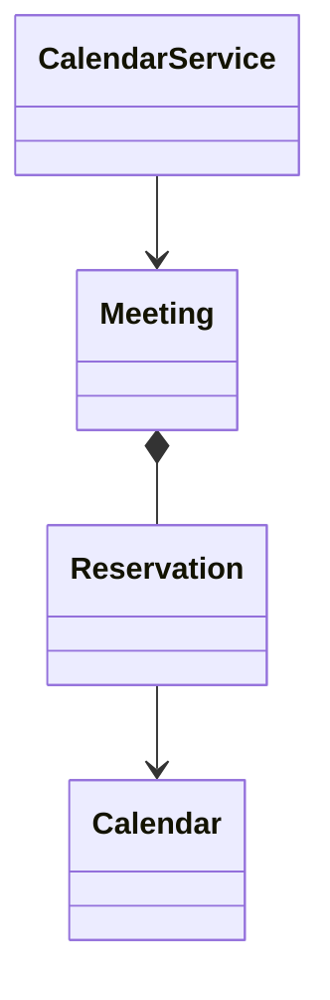

# Meeting Scheduler / Calendar

Find shared availability and atomically reserve attendee and room calendars using half-open intervals and retry-safe booking.

LLD stages: [Requirements](#requirements) → [Core entities](#core-entities) → [API or system interface](#api) → [High-level design](#high-level-design) → [Deep dives](#deep-dives).

## 1. Requirements
{: #requirements }

### Functional requirements

Find a common free slot, book attendees and an optional room, and cancel meetings. Use UTC instants at minute precision and half-open intervals [start,end); require start < end. Display timezone conversion occurs before this component receives input.

### Non-functional and execution constraints

Calendars are authoritative local records in shared transactional storage, with concurrent service callers. Search is bounded to 31 days and 100 calendars. Booking must reserve every required calendar atomically.

### Out of scope

Exclude invitations awaiting acceptance, recurring meetings, external calendar synchronization, email, and daylight-saving interpretation. A booking immediately blocks every listed attendee. Room capacity and attendee identity validation remain in scope. Authorization is checked by the caller-facing service.

## 2. Core entities
{: #core-entities }

`CalendarService` owns mutation. `Calendar` identifies an attendee or room; `Meeting` owns its immutable interval, organizer, participant set, optional room, and cancellation state. `Reservation` associates each meeting with its calendars.

No active reservations overlap within a calendar. A meeting's complete reservation set is created or removed atomically. Cancellation preserves meeting identity for retries and audit.

## 3. API or system interface
{: #api }

`findSlot(calendarIds, windowStart, windowEnd, durationMinutes) -> Interval?` returns the earliest fit or none; invalid ranges, duplicate IDs, oversized requests, or unknown calendars return `InvalidInput`/`NotFound`. `book(organizerId, attendeeIds, roomId?, start, end, key) -> Meeting` returns `Conflict`, `InsufficientCapacity`, `Forbidden`, `NotFound`, or `InvalidInput`. Include the organizer among attendees. Identical key and payload return the original meeting; changed payload returns `KeyConflict`. `cancel(meetingId, organizerId) -> Meeting` returns the cancelled record, including on retries, or `NotFound`/`Forbidden`.

## 4. High-level design
{: #high-level-design }

For search, `CalendarService` loads active `Reservation` intervals intersecting the window from the requested calendars in a consistent database snapshot. Clip to the window, sort by start, and merge overlapping or touching busy intervals. Starting at windowStart, inspect each gap for the requested duration, then inspect the final gap. Return the first fit. For B retrieved reservations this takes O(B log B) time and O(B) memory.

Search does not reserve anything. For book, validate participants and room capacity, then lock all relevant calendar rows in ascending identifier order. Re-read intersecting reservations. Two intervals overlap exactly when `a.start < b.end && b.start < a.end`. On any conflict, roll back. Otherwise insert the meeting, reservations, and idempotency record in one transaction.

Cancel reads the immutable calendar set, obtains the same sorted locks, checks ownership, and marks the meeting cancelled while deleting all reservations.

## 5. Deep dives
{: #deep-dives }

### Trade-offs and extensions

Calendar-row locks serialize unrelated bookings for one busy attendee, but avoid phantom-insert races without complex range-lock assumptions. A reschedule extension must lock the union of old and new calendars and replace all reservations in one transaction.

### Concurrency and failure handling

Every writer, including cancellation, uses the calendar locks; locking only existing reservations would miss empty-calendar races. Enforce uniqueness on organizer/key and recover duplicate-key races by loading the winning record. Committed meetings survive crashes. Notifications, if added, require an outbox rather than delivery inside the booking transaction.

### Test cases

Busy [09:00,10:00) permits a meeting beginning at 10:00. Searching [09:00,12:00) around busy [09:30,10:00) returns [10:00,11:00) for 60 minutes. A zero-duration meeting fails. Two overlapping room bookings yield one success. Cancelling twice leaves all calendars free. Reject 101 calendars before loading reservations; benchmark sorting with the maximum supported search window.

[Question catalog](../interview-guide.html) · [Article template](interview-template.html)
