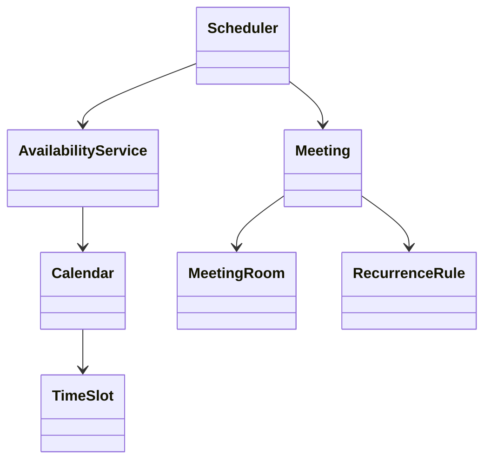
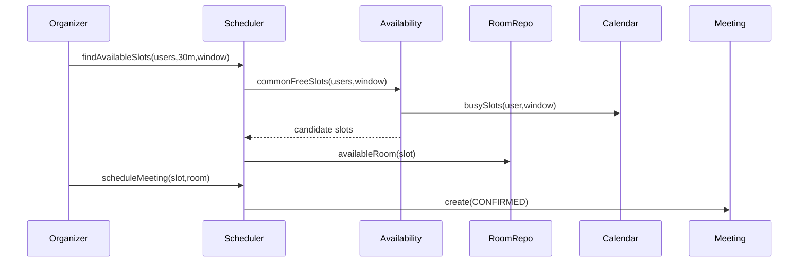
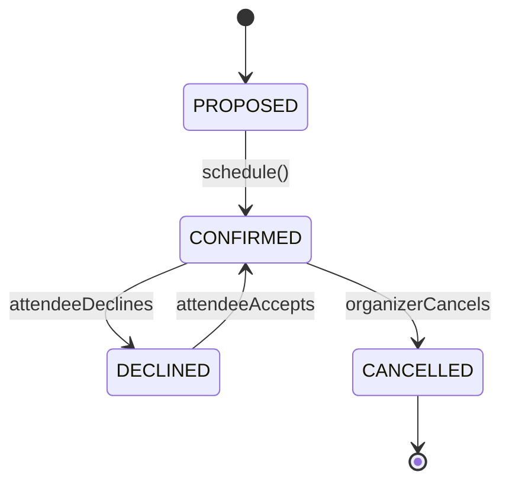

# LLD Walkthrough: Design a Meeting Scheduler / Calendar
> Self-contained walkthrough. This is the 45-minute LLD version of a calendar scheduler: enough domain model, enough interval logic, and one clear concurrency story — not a Google Calendar HLD.
Calendar prompts are deceptively broad. If you let them, they become timezones, recurring rules, notifications, permissions, conference links, room displays, and distributed sync.
In an LLD interview, the core is narrower:
- Find a common free slot for attendees.
- Reserve a meeting room.
- Create a meeting/event.
- Avoid double-booking the same room.
Say this out loud:
> "I will focus on scheduling one meeting with N attendees and optionally one room. I will model interval overlap simply, keep timezones explicit, and treat room booking as the concurrency point."
That statement turns a giant product into a finishable design.

---

## Minute 0-7: Clarify and fence the scope
Start with questions that collapse ambiguity:
- **Primary flow?** → "Find a common free slot for attendees and create the meeting."
- **Rooms?** → Include room booking because it creates a useful contention point.
- **Time granularity?** → Assume minute precision; no sub-second scheduling.
- **Calendar source?** → Assume we can read each user's busy intervals from their calendar.
- **Recurring meetings?** → Name a seam, but do not implement recurrence expansion unless asked.
Fence it out loud:
> "In scope: users, calendars, busy intervals, finding a common slot, booking a room, creating/declining a meeting. Out of scope: email delivery, external calendar sync, permissions, video links, and full recurring-meeting expansion."
One more sentence:
> "I will keep availability calculation straightforward: collect busy intervals, sort and merge them, then scan for a gap. That is O(n log n), and good enough for the interview."
This prevents algorithm rabbit-holing. The interviewer wanted design, not a segment tree.

---

## Minute 7-13: Core entities
Write responsibilities before methods. Keep the model boring and composable.

| Object | Responsibility (one line) |
|---|---|
| `User` | Represents an attendee or organizer. |
| `Calendar` | Owns events for one user and exposes busy intervals. |
| `Meeting` | Represents the scheduled event with attendees, time, and status. |
| `TimeSlot` | Value object for `[start, end)` interval logic. |
| `MeetingRoom` | Represents a bookable room with capacity and location. |
| `Scheduler` | Orchestrates finding slots and creating meetings. |
| `AvailabilityService` | Computes common free slots from calendars and room availability. |
| `RoomBooking` | Holds the room reservation for a meeting. |
| `RecurrenceRule` | Optional seam for recurring meetings; not expanded in the core flow. |
Nine objects, but only seven are central. `RecurrenceRule` is a seam, not a full subsystem.
Composition:
- `User` has a `Calendar`.
- `Calendar` has `Meeting`s or busy `TimeSlot`s.
- `Meeting` has attendees and one optional `RoomBooking`.
- `MeetingRoom` has room-specific reservations.
Tiny class diagram:



Say:
> "`TimeSlot` is a value object. Most bugs here are interval bugs, so I want methods like `overlaps` and `contains` centralized."
Use half-open intervals:

```text
[start, end)
```

This means a meeting ending at 10:00 does not conflict with one starting at 10:00.

---

## Minute 13-20: The spine (API + varying interfaces)
Define the client-facing calls:

```text
List<TimeSlot> findAvailableSlots(
  List<UserId> attendeeIds,
  Duration duration,
  TimeRange searchWindow,
  Optional<RoomFilter> roomFilter
)
MeetingId scheduleMeeting(
  UserId organizerId,
  List<UserId> attendeeIds,
  TimeSlot slot,
  Optional<RoomId> roomId,
  String title
)
void respondToMeeting(MeetingId meetingId, UserId attendeeId, Response response)
void cancelMeeting(MeetingId meetingId, UserId requesterId)
```

Now the variation seams:

```text
interface AvailabilityProvider {
  List<TimeSlot> busySlots(UserId userId, TimeRange window)
}
interface RoomSelectionStrategy {
  Optional<MeetingRoom> select(List<MeetingRoom> rooms, TimeSlot slot, int attendeeCount)
}
```

- `AvailabilityProvider` is an **Adapter pattern** seam if calendars come from internal storage, Google, Outlook, or another source.
- `RoomSelectionStrategy` is the **Strategy pattern**. Nearest room, smallest sufficient capacity, or preferred floor can vary.
Keep recurrence bounded:

```text
class RecurrenceRule {
  Frequency frequency
  Optional<LocalDate> until
}
```

Say:
> "For this interview, recurrence is a seam. The scheduling API can accept a rule later, but I will first make one concrete meeting correct."
That is senior judgment.

---

## Minute 20-33: Walk the happy path
Happy path: organizer schedules a 30-minute meeting for three people and a room.
Small sequence diagram:



Narrate the availability calculation:
- "For each attendee, fetch busy intervals in the search window."
- "Normalize everything to an instant-based representation internally."
- "Sort all busy intervals by start time and merge overlaps."
- "Scan the gaps in the search window and return gaps large enough for the duration."
- "That is O(n log n) because of sorting. I am not optimizing it further unless asked."
Pseudo-code:

```text
findAvailableSlots(attendees, duration, window, roomFilter):
  busy = []
  for attendee in attendees:
    busy.addAll(availabilityProvider.busySlots(attendee, window))
  mergedBusy = mergeOverlaps(sortByStart(busy))
  candidateSlots = gapsAtLeast(window, mergedBusy, duration)
  if roomFilter is absent:
    return candidateSlots
  return candidateSlots where some room matches roomFilter and is free
```

Scheduling:

```text
scheduleMeeting(organizer, attendees, slot, roomId, title):
  ensure organizer is allowed to schedule
  ensure no attendee has a conflict at slot
  if roomId present:
    reserveRoomOrThrow(roomId, slot)
  meeting = Meeting.create(title, organizer, attendees, slot, CONFIRMED)
  add meeting to attendee calendars
  return meeting.id
```

Say:
> "I re-check conflicts during `scheduleMeeting`. `findAvailableSlots` is advisory; the world may change between search and booking."
That sentence is critical. It shows you understand stale reads.
Meeting lifecycle:



Keep it small. Do not add 17 RSVP states.

---

## Minute 33-42: Stretch and edges

### The concurrency point: room double-booking
Two organizers can choose the same room and slot from stale search results.
One contended resource:

```text
(roomId, time interval)
```

Bounded answer:
- Use a transaction around room reservation.
- Check for overlapping `RoomBooking`s inside the transaction.
- Insert the booking only if no overlap exists.
- In a database, use an exclusion constraint or equivalent locking if available.
Say:
> "The room booking write is the correctness boundary. `findAvailableSlots` can be stale, but `scheduleMeeting` must atomically check and reserve the room."
If asked to choose a lock:
- coarse: lock the room row while checking intervals
- fine: constraint/index on room interval overlap
Pick simple:
> "For the first cut, I lock per room during check-and-insert. It is easy to reason about and contention is naturally partitioned by room."

### Attendee double-booking
Same idea, but be careful:
- Some calendars allow conflicts.
- Some organizations disallow them.
- Make it a policy decision, not a hidden assumption.
You can say:
> "I will reject attendee conflicts for this design, but I would keep that as a scheduling policy because real calendars often allow overlapping personal events."

### Timezones
Name it directly:
- Store internal times as `Instant`.
- Display in the user's timezone.
- Meeting creation should capture organizer timezone for recurring-rule interpretation.
Say:
> "Timezone is not a UI detail. It matters especially for recurrence, but for one-time meetings I convert to instants at the boundary."

### Recurring meetings
Do not implement a calendar engine live.
Bounded seam:

```text
interface RecurrenceExpander {
  List<TimeSlot> occurrences(RecurrenceRule rule, TimeRange window, ZoneId zone)
}
```

Say:
> "Recurring meetings become generated occurrences over a window. The same conflict checks apply to each occurrence; I would fail all-or-nothing unless product wants partial creation."

### Declines and conflicts
A decline does not necessarily cancel the meeting.
Model:
- `Meeting` has attendee responses.
- organizer can reschedule or keep the meeting.
- room booking stays unless meeting is cancelled or rescheduled.

### Bounded follow-ups
Name and defer:
- reminders and notifications
- external calendar sync
- permissions and delegation
- tentative holds
- working hours
- conference links
Close with:
> "All of those wrap around the same core: interval availability plus atomic room reservation."

---

## Minute 42-45: Wrap up
> "The design centers on `Scheduler`, `AvailabilityService`, `Calendar`, `TimeSlot`, `Meeting`, and `MeetingRoom`. Availability is computed by collecting busy intervals, sorting and merging them, then scanning for gaps. `findAvailableSlots` is advisory; `scheduleMeeting` re-checks and atomically reserves the room. Variation lives behind `AvailabilityProvider` and `RoomSelectionStrategy`, with recurrence kept as a clear seam."
That is the clean summary.

---


## How real systems solve this

The core algorithm is still interval overlap. Calendars expose busy intervals; the scheduler sorts them by start time, merges overlaps, and scans for a gap large enough for the meeting. For heavier query workloads, an interval tree can accelerate conflict checks, but the interview version should start with the sweep because it is correct and easy to explain.

Free/busy across attendees is just merging more intervals. Add the room's reservations as another busy calendar, merge everything, and then find open gaps inside the search window. Preventing double-booking is a write-time conflict check: before inserting the meeting or room reservation, verify that the target interval does not overlap an existing reservation.

Recurring events are where real calendars become tricky. RFC 5545 defines RRULE fields such as FREQ, INTERVAL, BYDAY, UNTIL, and COUNT. A production system stores the recurrence rule, expands it into instances for the query window, and applies exceptions such as EXDATE before doing overlap checks.

Time zones should be explicit. Store instants in UTC for comparison, and keep the IANA time-zone id for display and recurrence expansion so daylight-saving transitions are handled consistently. That is the difference between a demo scheduler and something that behaves like Google Calendar or Outlook.

## Reference implementation

This Python snippet finds the first common free slot by merging busy intervals. It uses half-open intervals `[start, end)` so back-to-back meetings do not conflict.

```python
from dataclasses import dataclass
from datetime import datetime, timedelta


@dataclass(frozen=True, order=True)
class Slot:
    start: datetime
    end: datetime

    def overlaps(self, other: "Slot") -> bool:
        return self.start < other.end and other.start < self.end


def merge_busy(intervals: list[Slot]) -> list[Slot]:
    merged: list[Slot] = []
    for slot in sorted(intervals):
        if not merged or merged[-1].end <= slot.start:
            merged.append(slot)
        else:
            last = merged[-1]
            merged[-1] = Slot(last.start, max(last.end, slot.end))
    return merged


def first_free_slot(
    busy_by_calendar: list[list[Slot]],
    window: Slot,
    duration: timedelta,
) -> Slot | None:
    busy = [slot for calendar in busy_by_calendar for slot in calendar]
    clipped = [
        Slot(max(slot.start, window.start), min(slot.end, window.end))
        for slot in busy
        if slot.overlaps(window)
    ]

    cursor = window.start
    for slot in merge_busy(clipped):
        if slot.start - cursor >= duration:
            return Slot(cursor, cursor + duration)
        cursor = max(cursor, slot.end)

    if window.end - cursor >= duration:
        return Slot(cursor, cursor + duration)
    return None
```

## Complexity and trade-offs

| Concern | Choice | Cost | Why it is acceptable |
|---|---|---:|---|
| Conflict detection | Sort + sweep | `O(n log n)` | Simple and correct for interview-scale free/busy. |
| Repeated queries | Interval tree | More complex writes | Useful when calendars are large and queried often. |
| Recurrence | RFC 5545 RRULE seam | Expansion cost | Keeps recurring logic separate from one-off event storage. |
| Time zones | UTC instant + IANA zone id | Extra field | Correct comparisons plus correct user-facing recurrence behavior. |

- Half-open intervals avoid false conflicts between a meeting ending at 10:00 and another starting at 10:00.
- Expanding recurrence only inside the query window prevents unbounded event generation.
- Room booking should be checked transactionally; availability shown to users can become stale.
- Interval trees help reads, but sorted sweeps are easier to implement and debug first.

## Further reading

- [RFC 5545](https://datatracker.ietf.org/doc/html/rfc5545) — defines iCalendar recurrence rules and exception concepts.
- *Designing Data-Intensive Applications* — Martin Kleppmann — useful background for consistency, concurrency, and distributed calendar writes.
- [Strategy](https://refactoring.guru/design-patterns/strategy) — useful for swapping availability and room-selection policies.
- *Effective Java* — Joshua Bloch — relevant to immutable value objects such as time slots.

## What separated a pass from a fail here
- You did not turn the problem into Google Calendar HLD.
- You made interval semantics explicit with `[start, end)`.
- You stated the simple O(n log n) availability algorithm and moved on.
- You identified the true concurrency point: room reservation, not search.
- You handled timezones and recurrence as named seams instead of ignoring them or drowning in them.
The pass is not a perfect calendar product. The pass is a small scheduler that finds a slot, books a room safely, and leaves obvious extension points.
