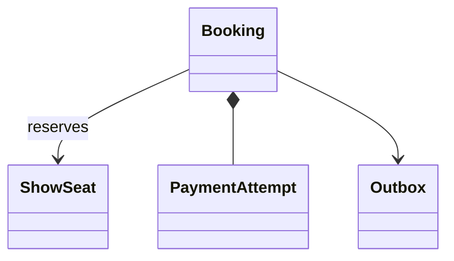

# Movie Ticket Booking

## 1. Requirements

Hold one to ten seats for five minutes, initiate payment, and confirm all selected seats together. Concurrent service instances use a transactional database. Store prices in integer minor units with one currency per booking. A hold is valid on the half-open interval [createdAt, expiresAt), using database time. Booking work locks only the requested seats.

## 2. Out of scope

Exclude search, coupons, customer cancellations after confirmation, and gateway implementation. Durable payment requests, ambiguous results, and compensating refunds remain required. Availability displays are advisory.

## 3. Model and invariants

`BookingService` owns transitions through transactions. `ShowSeat` identifies `(showId, seatId)` and holds either a booking owner or no owner. `Booking` stores selected seats, immutable quote, expiry, and status `HELD`, `CONFIRMED`, or `EXPIRED`. Payment attempts have independent settlement state.

A seat has at most one live owner. Confirmation requires successful payment for the exact amount and currency plus ownership of every unexpired seat. Expired bookings never become confirmed.

## 4. Public contract

`hold(customerId, showId, seatIds, requestKey) -> Booking` returns `InvalidSeats`, `NotFound`, `Unavailable`, or `KeyConflict`. Duplicate keys with identical payload return the original booking, even after expiry. `pay(bookingId, customerId, requestKey) -> PaymentAttempt` returns the existing attempt or `NotFound`, `Forbidden`, `Expired`, or `KeyConflict`; only one attempt is allowed per booking. `applyPayment(attemptId, providerEvent) -> BookingStatus` accepts authenticated, verified terminal results; unknown attempts or mismatched amounts return `InvalidPayment`. Duplicate terminal events are no-ops. `get(bookingId, customerId)` returns a snapshot or `NotFound`/`Forbidden`.

## 5. Core flow

For hold, deduplicate seat identifiers and lock requested seat rows in sorted order. Recheck show validity and occupancy. An expired hold owner is reclaimable; confirmed owners are not. Compute the quote from server prices, insert the booking, and assign all seats in one transaction.

For pay, lock the booking, check database time, and atomically persist the attempt and charge outbox entry. A worker calls the provider outside transactions using the attempt ID as its idempotency key.

On success, lock booking then all its seats in sorted order. Recheck expiry and ownership. Confirm only if every condition holds. Otherwise expire the booking, release only seats still owned by it, and enqueue an idempotent refund. A definitive payment failure expires and releases the booking. Timeout leaves payment pending for reconciliation.

## 6. Trade-offs and extensions

Row locks enforce multi-seat atomicity. A cancellation extension adds refund policies while keeping financial state separate from seat availability.

## 7. Concurrency and failure handling

Expiry cleanup locks booking then seats; hold acquisition never locks old bookings, avoiding reversed lock ordering. Confirmation and reclamation serialize on seat rows. Committed bookings, request keys, and outbox entries survive crashes. Workers may repeat external requests; provider idempotency and status lookup resolve a crash after payment but before acknowledgement. Late success always refunds rather than taking another customer's seat.

## 8. Test cases

Holding A1 and A2 when A2 is occupied reserves neither. At exactly expiresAt, confirmation fails and a successful charge schedules refund. Two customers racing for A1 produce one live hold. A repeated hold key returns the same ID; changed seats produce `KeyConflict`. Replaying payment success creates one confirmation or refund intent. Verify ten-seat requests acquire ten seat locks, not a whole-show lock.

[Question catalog](../interview-guide.html) · [Article template](interview-template.html)
