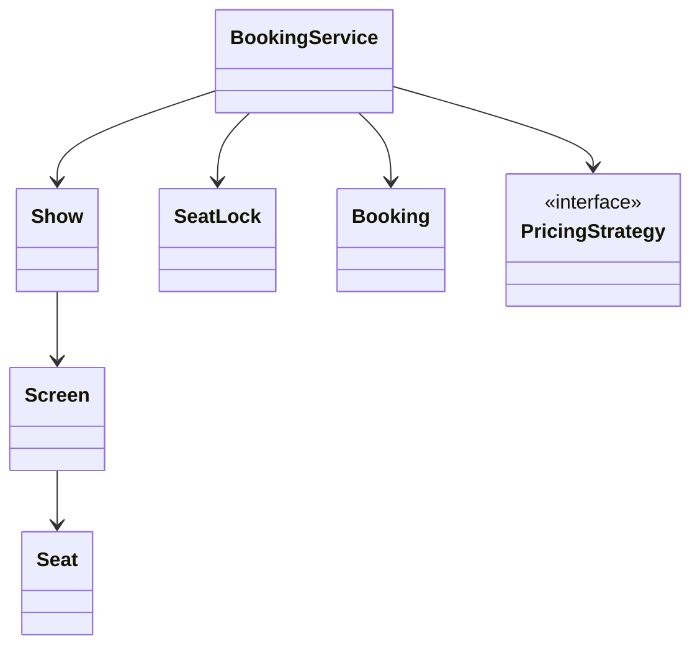
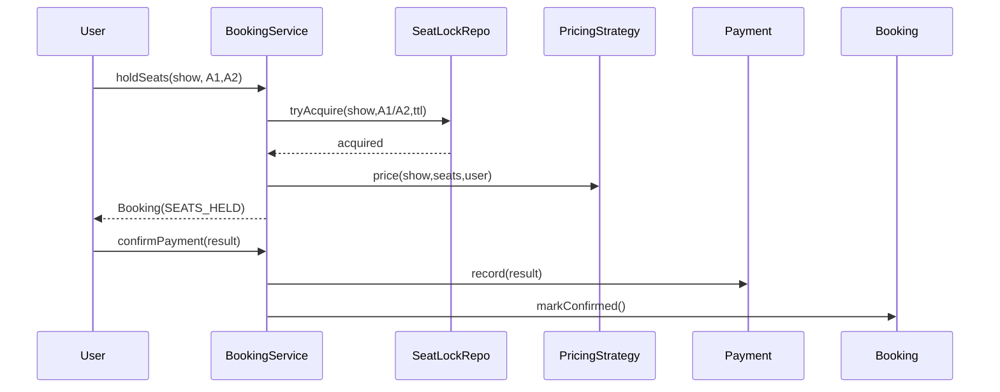
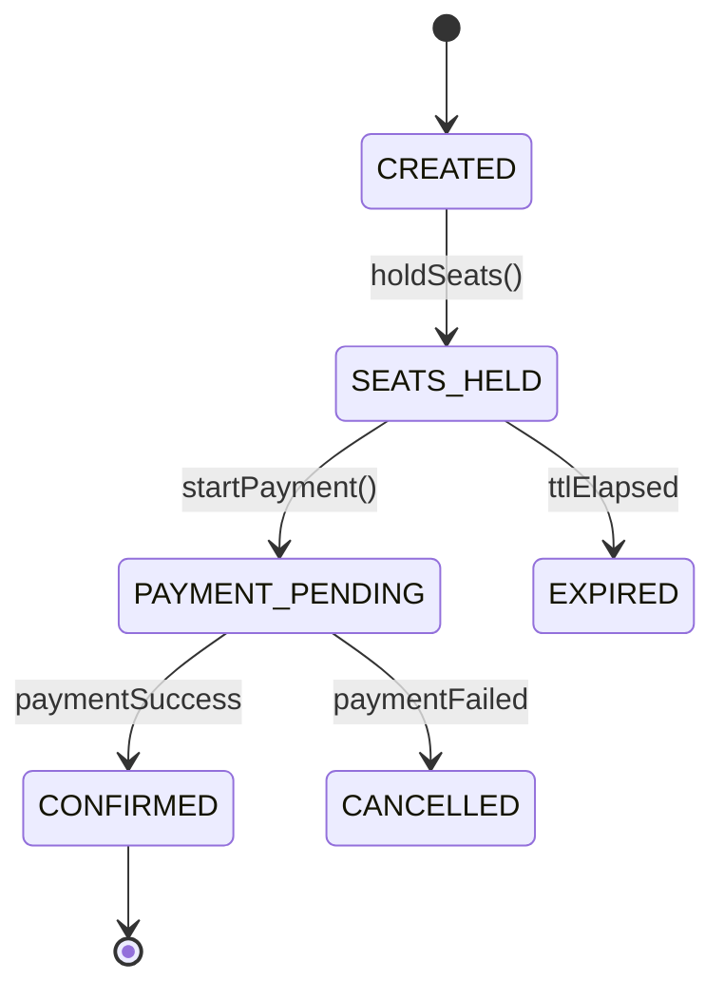

# LLD Walkthrough: Design a Movie Ticket Booking System
> Self-contained walkthrough. This is how to design the BookMyShow-style core in a 45-minute LLD interview without drifting into search clusters, microservices, recommendation engines, or payment-provider diagrams.
Movie booking looks like HLD bait. It has cities, cinemas, movies, shows, seats, coupons, payments, notifications, and traffic spikes. In an LLD round, most of that is noise.
The scoring center is much smaller:
- Model shows and seats cleanly.
- Hold selected seats safely.
- Confirm or release those seats based on payment.
- Explain the one hard race: two users trying to book the same seat.
Say this out loud early:
> "I will design the domain model and booking flow for a single booking system instance. The crux is seat locking with expiry. I will not design search ranking, microservices, CDN, or analytics."
That sentence keeps the interview in LLD territory.

---

## Minute 0-7: Clarify and fence the scope
Start by shrinking the prompt. Good questions and reasonable defaults:
- **Primary flow?** → "User selects a movie, show, seats, pays, and receives a confirmed booking."
- **Concurrency expectation?** → Yes. Two users may select the same seat at the same time.
- **Seat map complexity?** → Seat type and row/number are enough; no fancy theatre layout engine.
- **Payment?** → Model the payment result and callback, but do not implement a real gateway.
- **Pricing?** → Keep a `PricingStrategy` seam for weekend, seat-class, or surge pricing.
Fence it out loud:
> "In scope: movies, cinemas, screens, shows, seats, temporary seat holds, booking confirmation, payment failure, and hold expiry. Out of scope: recommendation, full-text search, refunds, coupons, real payment gateway, and distributed architecture."
This is the first senior signal. You are not refusing complexity; you are sequencing it.
One more sentence matters:
> "I will treat seat locking as the consistency boundary. Everything else can be eventually polished later."
That tells the interviewer you know where the bug will be.

---

## Minute 7-13: Core entities
Use responsibilities, not a 30-class theatre ontology. Prefer composition over inheritance.

| Object | Responsibility (one line) |
|---|---|
| `Movie` | Holds movie metadata like title, language, duration, and rating. |
| `Cinema` | Owns screens and address/city details. |
| `Screen` | Owns physical seats for one auditorium. |
| `Show` | Binds a movie to a screen and start time. |
| `Seat` | Represents one physical seat with row, number, and seat type. |
| `SeatLock` | Temporarily holds a seat for a user until an expiry time. |
| `Booking` | Tracks selected seats, amount, user, and booking state. |
| `Payment` | Captures payment attempt, status, and provider reference. |
| `BookingService` | Orchestrates hold, price, payment transition, and confirmation. |
Nine objects is enough. Do not add `CityService`, `SearchService`, `NotificationService`, `Wallet`, `CouponEngine`, and `TheatreManager` unless the interviewer specifically pivots there.
Composition is the model:
- `Cinema` has `Screen`s.
- `Screen` has `Seat`s.
- `Show` uses one `Screen`.
- `Booking` has selected `Seat`s.
- `SeatLock` protects one `Show` + `Seat` pair.
Tiny class diagram:



Say this while drawing:
> "The seat itself is physical. Availability is not stored on `Seat`; it is derived for a specific `Show` from bookings and active locks."
That distinction prevents a classic bug: marking seat A1 as unavailable for every show because it was booked for one show.

---

## Minute 13-20: The spine (API + varying interfaces)
Define the public methods the client calls. Keep them concrete.

```text
List<SeatView> getSeatMap(ShowId showId)
BookingId holdSeats(UserId userId, ShowId showId, List<SeatId> seats)
PaymentIntent startPayment(BookingId bookingId)
Booking confirmPayment(BookingId bookingId, PaymentResult result)
void cancelBooking(BookingId bookingId)
```

Now name the variation seams:

```text
interface PricingStrategy {
  Money price(Show show, List<Seat> seats, UserId userId)
}
interface SeatLockRepository {
  boolean tryAcquire(ShowId showId, SeatId seatId, UserId userId, Instant expiresAt)
  void release(ShowId showId, SeatId seatId)
  boolean isActive(ShowId showId, SeatId seatId, Instant now)
}
```

- `PricingStrategy` is the **Strategy pattern**. Morning show, premium recliner, weekend pricing, or member discount can vary without rewriting booking.
- `SeatLockRepository` is not a design-pattern trophy. It is a seam around the consistency mechanism: in-memory lock, database unique row, Redis-style TTL, or transactional store.
For a live interview, say:
> "I am not making payment a strategy unless asked. The interesting variation is pricing; the interesting consistency point is seat locking."
This avoids pattern theater.
Booking states should be explicit:

```text
enum BookingStatus {
  CREATED,
  SEATS_HELD,
  PAYMENT_PENDING,
  CONFIRMED,
  EXPIRED,
  CANCELLED
}
```

Do not encode this as booleans like `isPaid`, `isLocked`, `isCancelled`. That turns every transition into a bug farm.

---

## Minute 20-33: Walk the happy path
Pick one flow and run it end to end: select seats, hold seats, pay, confirm.
Small sequence diagram:



Narrate the important state changes:
- "`holdSeats` first checks the show exists and seats belong to that show's screen."
- "For each selected seat, I acquire a temporary lock for `(showId, seatId)`, not just `seatId`."
- "If any seat cannot be locked, I release the seats already acquired in this request and fail the hold."
- "After all locks are acquired, I compute the price and create a booking in `SEATS_HELD`."
- "Payment moves the booking to `PAYMENT_PENDING`, then `CONFIRMED` only on success."
Pseudo-code, not production code:

```text
holdSeats(userId, showId, seatIds):
  show = showRepo.get(showId)
  seats = screen.validateSeats(show.screenId, seatIds)
  expiresAt = now + HOLD_TTL
  acquired = []
  for seat in seats:
    if !lockRepo.tryAcquire(showId, seat.id, userId, expiresAt):
      lockRepo.releaseAll(showId, acquired)
      throw SeatUnavailableException
    acquired.add(seat.id)
  amount = pricingStrategy.price(show, seats, userId)
  booking = Booking.create(userId, showId, seatIds, amount, SEATS_HELD, expiresAt)
  return booking.id
```

Payment confirmation:

```text
confirmPayment(bookingId, result):
  booking = bookingRepo.get(bookingId)
  if booking.isExpired(now):
    booking.markExpired()
    releaseLocks(booking)
    throw BookingExpiredException
  payment = paymentRepo.record(bookingId, result)
  if payment.failed:
    booking.markCancelled()
    releaseLocks(booking)
    return booking
  booking.markConfirmed()
  persistConfirmedSeats(booking)
  releaseLocks(booking)       // confirmed booking now owns availability
  return booking
```

Say this out loud:
> "The happy path is not done when payment succeeds. It is done when the confirmed booking is persisted and the temporary lock is no longer the source of truth."
Booking lifecycle:



That state diagram is small, but it does a lot of work. It makes illegal transitions visible.

---

## Minute 33-42: Stretch and edges
This is where the interviewer tests whether your design survives reality.

### Two users grab the same seat
One contended resource: `(showId, seatId)` availability.
Bounded answer:
- **Pessimistic approach:** create a lock row for `(showId, seatId)` with a unique constraint and expiry. First writer wins; second fails fast.
- **Optimistic approach:** insert confirmed booking seats with a unique constraint and retry/fail at confirmation time.
- **Pick for interview:** pessimistic temporary hold, because users expect selected seats to stay held during payment.
Say:
> "I prefer a short-lived pessimistic hold here. It matches user expectation: once the UI says A1 is held, I should not lose it while typing card details. The TTL prevents abandoned holds from blocking inventory forever."
Do not drift into distributed locks unless asked. If asked, keep it short:
> "In a distributed setup, I still want the storage layer to enforce uniqueness for `(showId, seatId)`; app locks are an optimization, not the correctness source."

### Hold expiry
Model it explicitly:
- `SeatLock.expiresAt`
- `Booking.expiresAt`
- `isActive(now)` ignores expired locks.
- A sweeper can clean old rows, but correctness must not depend on the sweeper running exactly on time.
Say:
> "Expired locks are treated as absent during acquisition. Cleanup is housekeeping, not correctness."

### Payment failure
Payment failure is not an exception that leaves a half-booking.
Bounded transition:
- `PAYMENT_PENDING -> CANCELLED`
- release active locks
- confirmed seats are never created
- user can retry by creating a new hold

### Partial seat lock
If locking A1 succeeds and A2 fails:
- release A1 immediately
- return `SeatUnavailableException`
- do not create a booking
This small rollback is the kind of detail interviewers notice.

### Seat map freshness
`getSeatMap(showId)` should combine:
- all screen seats
- confirmed bookings for the show
- active, non-expired locks for the show
Return statuses:

```text
AVAILABLE, HELD, BOOKED
```

Avoid storing a mutable `Seat.available` flag. Availability is contextual.

### Bounded follow-ups
Name these, do not build them:
- Refunds and cancellation windows.
- Coupons and loyalty points.
- Multi-city search.
- Notification after confirmation.
- Accessibility seats.
- Admin show creation.
Close each with:
> "That is additive around the same booking state machine; it does not change seat-lock correctness."

---

## Minute 42-45: Wrap up
> "The design has nine core objects. `BookingService` orchestrates the flow, `PricingStrategy` is the clean variation seam, and the correctness boundary is a temporary `SeatLock` on `(showId, seatId)` with TTL. The booking state machine prevents ambiguous half-paid or half-held bookings. Payment failure and expiry release seats; payment success persists confirmed seats."
That is the snapshot you want in the interviewer's notes.

---

## What separated a pass from a fail here
- You kept the problem LLD, not HLD: no microservice map, no search infra, no queue topology.
- You modeled availability per `Show`, not per physical `Seat`.
- You made booking state explicit instead of scattering booleans.
- You spent real time on the one hard concurrency point: seat locking with expiry.
- You gave bounded follow-ups that extend the model without rewriting it.
The pass is not "I know BookMyShow." The pass is "I can protect a scarce seat through a clean object model and a small state machine."
