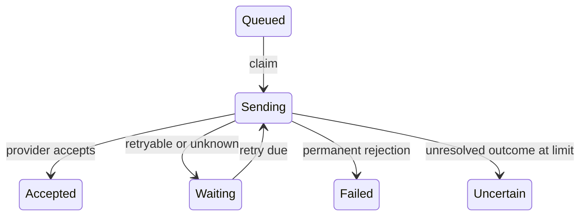

# Design a Notification Component

## 1. Requirements

Accept a recipient, template version, parameters, and requested channels; dispatch one delivery per permitted channel. One process runs concurrent producers and a bounded worker pool over a durable job repository. Submission costs O(C + message bytes) for C bounded channels; claiming the next indexed due job costs O(log N). Bound active jobs, payload sizes, workers, and attempts.

## 2. Out of scope

Exclude campaigns, recipient databases, provider infrastructure, and exactly-once device delivery. Provider acknowledgement means acceptance, not recipient readership. Preferences are snapshotted at submission; later changes do not cancel accepted work.

## 3. Model and invariants

`NotificationService` owns submission and deduplication. `Notification` owns immutable rendered channel payloads and the preference snapshot. Each `Delivery` owns status, attempt count, retry deadline, provider key, and worker lease. Channel adapters translate payloads and classify outcomes.

There is one delivery per `(notificationId, channel)`. Only the current claim token may commit a result. Accepted deliveries are never rescheduled. Retry attempts always retain the original rendered payload and provider idempotency key.

## 4. Public contract

`submit(requestId, recipientId, templateVersion, parameters, channels) -> NotificationId|Suppressed` returns `InvalidRecipient`, `InvalidTemplate`, `PayloadTooLarge`, `Busy`, or `Conflict`. Identical request retries return the original ID or suppressed result; changed payload returns `Conflict`.

`status(notificationId) -> channelStatusMap|NotFound` exposes partial success. `Adapter.send(deliveryId, idempotencyKey, payload) -> Accepted(providerId)|PermanentFailure|RetryableFailure|Unknown` distinguishes a rejection from a timeout after possible acceptance.

Request deduplication is guaranteed for seven days. IDs contain a validated creation time, and requests older than that window return `ExpiredRequest` rather than becoming new work after record cleanup.

## 5. Core flow

Check for an existing request ID first. Otherwise validate identity, resolve preferences and the pinned template, and render bounded payloads. Atomically insert the request record, notification, and jobs after rechecking deduplication and capacity. With no permitted channels, persist the suppressed result.

A worker transaction claims a due delivery with a unique fencing token, increments its attempt count, and stores a lease deadline. The worker sends outside the transaction, then conditionally records the outcome using that token. Accepted results are terminal. Permanent failures terminate immediately.

Retryable and unknown outcomes use capped exponential backoff with jitter and at most five attempts. Every claim, including expired-lease recovery, checks the persisted count first: an unresolved fifth attempt becomes `Uncertain`, never a sixth send. Persist UTC retry deadlines; use monotonic timers while running. Exhausted definite failures become `Failed`.

## 6. Trade-offs and extensions

Durable jobs make accepted submissions recoverable, while a bounded queue introduces explicit backpressure. Separate channel jobs isolate email failure from successful SMS. A useful extension is per-provider concurrency limits; it does not require introducing a distributed broker into the object model.

## 7. Concurrency and failure handling

Lease recovery can overlap slow sends. Fencing blocks stale state updates, not external duplicates. Durable provider idempotency deduplicates keys; without it, retries may duplicate delivery. Clock adjustments may delay or accelerate retry eligibility; monitor UTC skew. Archive terminal jobs and expire dedup records while retaining unresolved jobs within the active capacity bound.

## 8. Test cases

- Email allowed, SMS disabled: create only the email job.
- Concurrent identical submissions: one notification and one job per channel.
- Same request ID with changed parameters: `Conflict`.
- Email accepted, SMS permanently rejected: report distinct channel outcomes.
- Provider accepts then times out: retry uses the same key/payload. Crash after attempt five, then lease expiry: `Uncertain`, no sixth send.
- Active capacity 2, two pending jobs: new submission returns `Busy`; count stays 2, with no partial jobs.

[Question catalog](../interview-guide.html) · [Article template](interview-template.html)
