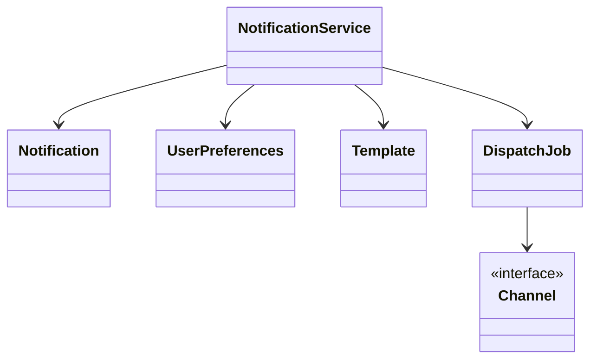
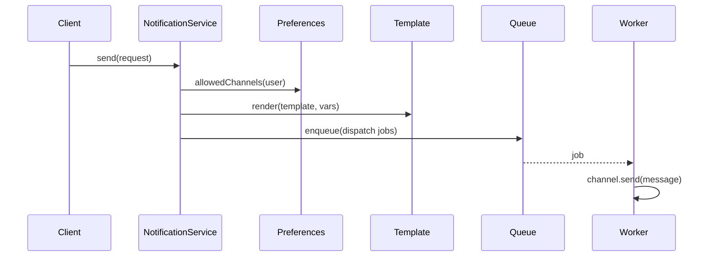
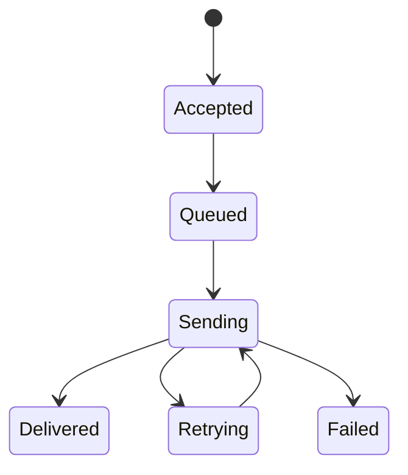

# LLD Walkthrough: Design a Notification Service

> Self-contained walkthrough. This is the version you can produce live: clear scope, small objects, async seam, and channel-specific behavior behind interfaces.

Notification service prompts are deceptively broad. If you are not careful, you will design Gmail, Twilio, APNs, a workflow engine, a template language, and Kafka in one answer. That fails because nothing actually works. The interview wants to see whether you can send one notification correctly, then extend it to email, SMS, and push without rewriting the core.

The core sentence is simple:

> A client submits a notification; the service resolves the recipient's allowed channels, renders the message, dispatches per channel, and retries transient failures.

Everything else is a seam.

---

## Minute 0-7: Clarify and fence the scope

Start by turning the product into one flow.

Good questions and reasonable defaults:

- **Primary flow?** → "Send a notification to one or many recipients across email/SMS/push."
- **Sync or async?** → Accept synchronously, dispatch asynchronously through a queue seam.
- **Templates?** → Basic template id + variables, rendered before dispatch.
- **Preferences?** → Per-user opt-in/opt-out and preferred channels are in scope.
- **Reliability?** → Retry transient provider failures with backoff; dedup by request id.
- **Providers?** → Model provider calls behind channel interfaces. Do not implement real SMTP/Twilio/APNs.

Say the fence out loud:

> "In scope: accept a notification, resolve channels from user preferences, render a template, enqueue dispatch work, send through email/SMS/push strategies, retry transient failures, and avoid duplicate sends. Out of scope: real provider SDKs, campaign analytics, WYSIWYG templates, billing, and distributed queue internals."

Also say the async decision explicitly:

> "I will make `send` return an id after validation/enqueue. Actual delivery is best-effort and happens in workers. If you want synchronous send, that is a different API on top of the same channel strategies."

That is a senior fence. It avoids pretending a network call to three providers is a clean blocking method.

---

## Minute 7-13: Core entities

Name responsibilities before methods. Do not create one subclass per notification type; channel behavior varies, so channel gets the interface.

| Object | Responsibility (one line) |
|---|---|
| `NotificationService` | Public entry point; validates requests and creates dispatch jobs. |
| `Notification` | Request record: recipients, template, variables, priority, idempotency key. |
| `Recipient` | Addressable user target with contact fields. |
| `UserPreferences` | Stores allowed channels, opt-outs, and quiet-hour rules. |
| `Template` | Holds channel-aware message structure and variables. |
| `Channel` | Sends a rendered message through one medium. |
| `RetryPolicy` | Decides whether and when to retry a failed dispatch. |
| `RateLimiter` | Throttles sends per user, channel, or provider. |
| `DispatchJob` | Unit of async work for one recipient-channel pair. |

Nine objects is the upper bound. It is enough. Avoid adding `EmailNotification`, `SmsNotification`, `PushNotification` as separate domain roots. That usually duplicates state and spreads behavior.



Say this out loud:

> "The notification is channel-agnostic. The channel implementation knows provider details. The service orchestrates; it does not know how SMTP, SMS, or push tokens work."

This is the design in one sentence.

---

## Minute 13-20: The spine (API + varying interfaces)

Define the client-facing methods first:

```text
NotificationId send(NotificationRequest request)
DeliveryStatus getStatus(NotificationId notificationId)
void cancel(NotificationId notificationId)          // best effort, before dispatch
```

A concrete request:

```text
NotificationRequest {
  String idempotencyKey
  List<UserId> recipients
  TemplateId templateId
  Map<String, Object> variables
  Priority priority
  Optional<List<ChannelType>> requestedChannels
}
```

Now the variation seams:

```text
interface Channel {
  ChannelType type()
  DeliveryResult send(RenderedMessage message, Recipient recipient)
}

class EmailChannel implements Channel
class SmsChannel implements Channel
class PushChannel implements Channel
```

That is the **Strategy pattern**. Each channel handles address validation, provider payload shape, and provider-specific errors. Adding WhatsApp later is a new `Channel` class plus preference support, not a rewrite.

The other seam is retry/rate limiting:

```text
interface RetryPolicy {
  Optional<Duration> nextDelay(DispatchAttempt attempt)
}

interface RateLimiter {
  boolean allow(UserId userId, ChannelType channelType)
}
```

If the interviewer asks about subscribers or audit hooks, name the optional pattern but do not overbuild it:

```text
interface NotificationObserver {
  void onAccepted(Notification n)
  void onDelivered(DispatchJob job)
  void onFailed(DispatchJob job)
}
```

That is the **Observer pattern**, optional for analytics or audit. Keep it out of the happy path unless asked.

Say this out loud:

> "The spine is `send`, then one job per recipient-channel. Channel is Strategy. Retry and rate limiting are seams. A queue decouples accepting a notification from slow provider calls."

Now every follow-up has a place to go.

---

## Minute 20-33: Walk the happy path

Use a concrete example.

> "Product code sends `PASSWORD_RESET` to Bob. Bob allows email and push, has opted out of SMS. The service renders the template, creates two dispatch jobs, and workers send each through the proper channel."

Tiny sequence diagram:



Narrate the accept path:

```text
send(request):
  if idempotencyKey already seen:
    return existing notificationId

  notification = Notification.from(request)
  for recipient in request.recipients:
    prefs = preferencesRepository.get(recipient)
    channels = resolve(request.requestedChannels, prefs)
    rendered = templateRenderer.render(request.templateId, request.variables)

    for channelType in channels:
      job = DispatchJob(notification.id, recipient, channelType, rendered)
      queue.enqueue(job)

  mark notification ACCEPTED
  return notification.id
```

Then narrate the worker path:

```text
process(job):
  if job already delivered:
    return
  if !rateLimiter.allow(job.userId, job.channelType):
    reschedule(job)
    return

  channel = channelRegistry.get(job.channelType)
  result = channel.send(job.message, job.recipient)

  if result.success:
    mark DELIVERED
  else if retryPolicy.nextDelay(job.attempt).present:
    reschedule with delay
  else:
    mark FAILED
```

Say the quiet parts out loud:

- "The queue is a seam. In-memory queue for LLD, Kafka/SQS later. The domain model does not care."
- "`NotificationStatus` is aggregate status; each `DispatchJob` has its own status. One email failure should not hide one push success."
- "Idempotency is on request acceptance and on job delivery. That prevents duplicate sends when clients retry or workers crash."

A tiny state diagram is useful here:



Keep it small. Do not model every provider-specific bounce state unless asked.

---

## Minute 33-42: Stretch and edges

Common curveballs and bounded answers:

- **"What if provider is down?"** `Channel.send` returns a typed failure. `RetryPolicy` retries transient failures with exponential backoff and jitter. Permanent failures, like invalid phone number, go straight to failed. Do not retry forever.
- **"How do you avoid duplicate notifications?"** Store `idempotencyKey -> notificationId` for accepted requests. Store a delivery record per `(notificationId, userId, channelType)` so a retried job can no-op if already delivered.
- **"Per-user opt-out?"** `UserPreferences` is checked before job creation. If a user opted out of SMS, no SMS job exists. Emergency/transactional overrides can be a policy class, not an `if` spread everywhere.
- **"Fan-out to a million users?"** `send` creates a campaign/batch id and streams recipient jobs into the queue. The same `DispatchJob` model holds. Add pagination and backpressure; do not put one million users in memory.
- **"Rate limits?"** `RateLimiter` sits in the worker before `Channel.send`. It can be per provider, per user, or per tenant. If denied, reschedule instead of failing.
- **"Quiet hours?"** Preferences can return "allowed later" with a next delivery time. The queue supports delayed jobs. Again, no rewrite.
- **"Templates differ per channel."** `Template` can hold channel-specific bodies: email subject/html, SMS text, push title/body. Rendering is still before dispatch.
- **"Need observers for analytics."** Add `NotificationObserver` implementations for metrics/audit. That is Observer pattern, and it should not block sending.

The anti-pattern is provider obsession. You do not need to know Twilio's exact API to design the object model. Hide it behind `SmsChannel` and keep the flow moving.

Also name the consistency boundary:

> "In a real implementation I would persist the notification and jobs before enqueue, ideally with an outbox pattern. For this LLD, I call that a persistence seam and keep the in-memory queue simple."

That gives a strong distributed-systems signal without turning the answer into HLD.

---

## Minute 42-45: Wrap up

> "The model has `NotificationService` accepting requests, `UserPreferences` resolving allowed channels, `Template` rendering content, a queue creating one `DispatchJob` per recipient-channel, and `Channel` strategies for email/SMS/push. Retry, rate limiting, and observers are explicit seams. The core flow is async so slow providers do not block clients. Next I would add durable outbox persistence and tests for idempotency, opt-out, and retry behavior."

That summary leaves the interviewer with a working system in their notes.

---

## What separated a pass from a fail here

- You **fenced the scope** before designing a marketing platform.
- You put email/SMS/push behind the **Strategy pattern**, so channel changes are new classes.
- You introduced a **queue seam** without spending the round designing Kafka.
- You handled retries, dedup, opt-out, and fan-out as bounded extensions.
- You kept provider details out of `NotificationService`, so orchestration and delivery stayed separate.

The pass is not "I know every notification provider." The pass is clean dispatch flow, explicit seams, and bounded reliability answers.
