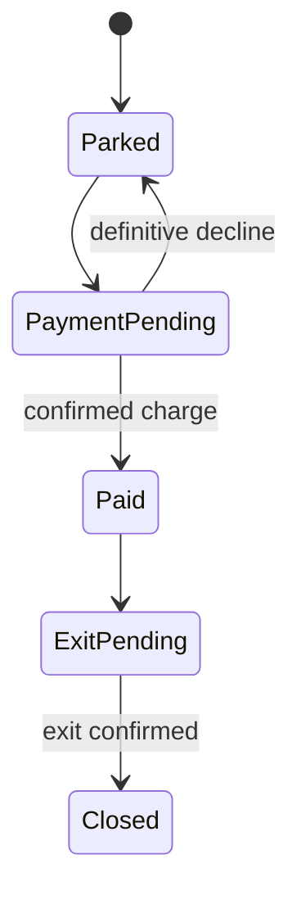

# Design a Parking Lot

## 1. Requirements

Support vehicle entry, fee quotation, payment, and exit confirmation. One process accepts concurrent requests; tickets and payment attempts use a durable transactional repository. Allocate a compatible space using per-size free sets in expected O(1), assuming a fixed number of sizes. Store fees as integer minor units in one currency.

## 2. Out of scope

Exclude reservations, license-plate recognition, subscriptions, and optimal space placement. A payment adapter and gate adapter remain because charging and releasing a vehicle are observable effects, not ordinary field assignments.

## 3. Model and invariants

`ParkingService` owns allocation transactions. A `Ticket` owns its immutable vehicle, space, entry timestamp, and tariff version. A payment attempt owns a frozen amount and provider key. Each occupied space has exactly one active ticket; a vehicle has at most one active ticket. Payment never releases a space: confirmed physical exit does.

## 4. Public contract

`enter(requestId, vehicleId, size) -> Ticket` returns `Full`, `AlreadyParked`, or `InvalidSize`. A repeated request ID with the same payload returns the original ticket; changed payload returns `Conflict`.

`quote(ticketId) -> {amountMinor, tariffVersion}` is informational. `pay(ticketId, requestId) -> PaymentStatus` freezes the current quote and returns `Pending`, `Paid`, or `Declined`; only one unresolved attempt may exist. `requestExit(ticketId) -> ExitStatus` requires `Paid`. `confirmExit(ticketId, sensorEventId) -> Closed` is idempotent. Unknown identifiers return `NotFound`; illegal transitions return `InvalidState`.

## 5. Core flow

Entry atomically checks the request record and vehicle index, removes the smallest compatible free space, creates a ticket, and records the response.

Payment samples an injected UTC clock, calculates started billing intervals using `max(0, now-entryTime)`, and persists the amount and provider idempotency key before calling the provider. This explicitly accepts wall-clock adjustments; tariff rounding and clock anomalies are auditable. A confirmed payment freezes the fee permanently.

Exit first persists `ExitPending`, then sends a repeat-safe gate command outside the transaction. Only an authenticated exit event closes the ticket, clears the vehicle index, and returns the space to its free set atomically.

## 6. Trade-offs and extensions

Holding the space until exit confirmation sacrifices capacity when sensors fail but prevents double allocation. A supervised reconciliation operation can resolve stuck exits using evidence. Grace periods after payment are a bounded extension, but require a specified supplementary-charge policy.

## 7. Concurrency and failure handling

Transactions protect ticket, vehicle index, and free-set changes together. Unique request IDs and space constraints defend against races. A payment timeout stays pending: reconcile by provider key rather than charging with a new key. Durable intent survives a crash; recovery queries unresolved effects before retrying. Provider deduplication and repeat-safe gate commands are adapter requirements, not guarantees supplied by a mutex. Retain request records for a documented retry window.

## 8. Test cases

- One compact space, two concurrent entries: one ticket, one `Full`; with three size classes, allocation probes at most three free sets.
- Entry ID `e1` repeated: identical ticket, no second allocation.
- Tariff 100 per started hour, elapsed 61 minutes: quote 200.
- Charge succeeds but response times out: retry resolves the same charge.
- Paid ticket before exit confirmation: space remains unavailable; duplicate confirmation releases it once.
- Exit requested for an unpaid ticket: `InvalidState`, no gate command.

[Question catalog](../interview-guide.html) · [Article template](interview-template.html)
