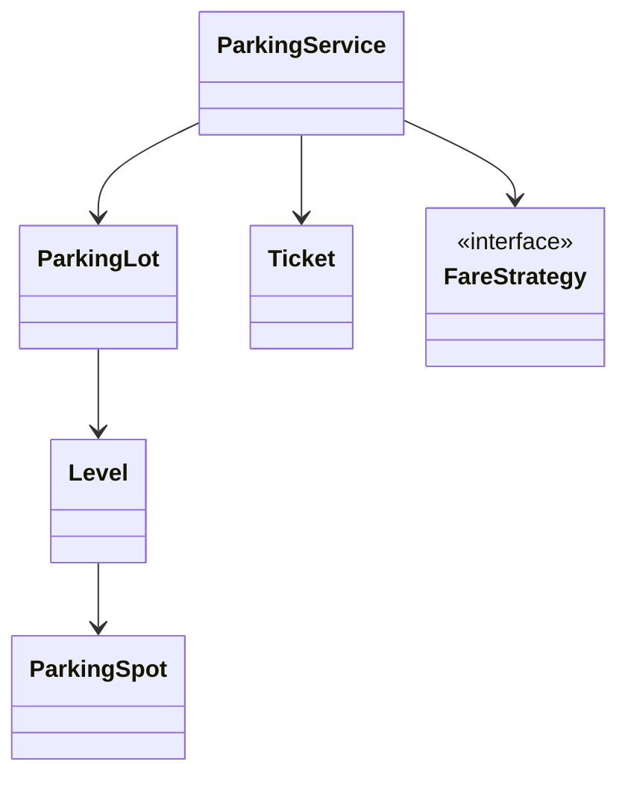
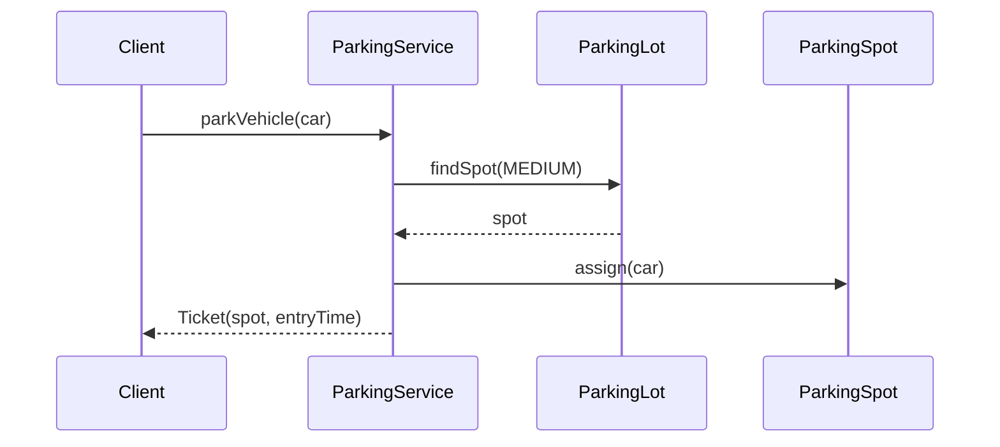
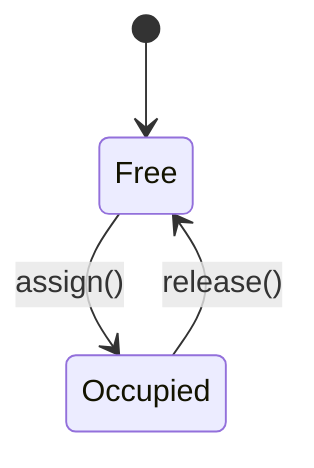

# LLD Walkthrough: Design a Parking Lot

> Self-contained walkthrough. It shows how a strong candidate actually *talks and thinks* through the classic parking-lot LLD in ~45 minutes — not a polished 30-class UML dump you could never produce live.

The parking lot is the "hello world" of LLD, which makes it dangerous: interviewers have seen 500 versions, so a memorized class diagram scores nothing. What scores is **judgment, a clean spine, and a working flow**. Here is how to earn the pass.

---

## Minute 0–7: Clarify and fence the scope

Do not start modeling. Shrink the problem first. Good questions and reasonable default answers:

- **Primary flow?** → "Park a vehicle, issue a ticket; on exit compute fare and free the spot."
- **Single process or distributed?** → Assume single process; call out where a distributed version would differ.
- **Spot/vehicle types?** → Motorcycle / car / truck mapped to Small / Medium / Large spots. Keep it to three.
- **Payment?** → Model a pluggable fare + payment seam, don't implement a real gateway.

Say the fence out loud:

> "In scope: park, unpark, fare calculation, handling a full lot. Out of scope: real payment, reservations, persistence. I'll make fare and spot-selection pluggable. OK?"

That sentence is worth more than any diagram. It proves you scope before you build.

---

## Minute 7–13: Core entities (responsibilities, not hierarchy)

Underline nouns, assign one responsibility each. Resist the urge to build a `Vehicle` inheritance tree — a `type` enum is faster to reason about live and just as extensible here.

| Object | Responsibility (one line) |
|---|---|
| `ParkingLot` | Owns levels; finds and frees spots. |
| `Level` | Owns a set of spots of various sizes. |
| `ParkingSpot` | Holds at most one vehicle; knows its size + occupancy. |
| `Vehicle` | Plate + size (enum). |
| `Ticket` | Issued at entry; holds spot ref + entry time. |
| `FareStrategy` | Computes the amount owed for a ticket. |
| `ParkingService` | Orchestrates park/unpark; the public entry point. |

Seven objects. Composition, not inheritance: `ParkingLot` **has** `Level`s, a `Level` **has** `ParkingSpot`s.



Keep the diagram this small on the whiteboard. You can always add a box; you can rarely erase 20.

---

## Minute 13–20: The spine (API + varying interfaces)

Define the entry points the client calls:

```text
Ticket   parkVehicle(Vehicle v)          // throws LotFullException
Receipt  exitVehicle(Ticket t)           // computes fare, frees spot
```

Then the seams where behavior legitimately varies — this is where patterns *earn* their place:

```text
interface FareStrategy       { Money calculate(Ticket t) }
interface SpotAssignment     { Optional<ParkingSpot> pick(Level lvl, VehicleSize s) }
```

- `FareStrategy` → **Strategy pattern**. Flat, hourly, weekend, or dynamic pricing are new classes, zero edits elsewhere.
- `SpotAssignment` → also Strategy. "Nearest to exit," "first fit," "balance levels" become swappable.

Now you have a spine and two obvious extension points. When the interviewer pushes on pricing later, you already have the answer.

---

## Minute 20–33: Walk the happy path (this is where points live)

Narrate the objects collaborating. Keep the sequence diagram to ~5 participants.



Say the quiet parts out loud:

- "`findSpot` returns the first free spot big enough. If none, I throw `LotFullException` — that's the full-lot case handled."
- "Assigning the spot flips its state to occupied. That state change is the thing I must protect under concurrency."
- "The `Ticket` captures entry time now; fare is computed on exit so pricing stays in one place."

Then walk the second flow, because two working flows is a clear pass:

```text
exitVehicle(ticket):
  fare = fareStrategy.calculate(ticket)     // uses entry time -> now
  ticket.spot.release()                     // spot free again
  return Receipt(fare)
```

---

## Minute 33–42: Stretch and edges

Common curveballs and **bounded** answers:

- **"Two cars race for the last spot."** One contended resource: the spot's occupied flag. Options: a per-`Level` lock around find+assign (simple, slightly coarse), or an atomic compare-and-set on each spot's state (finer, more code). State the trade-off, pick the per-level lock for a first cut, note you'd shard the lock if contention shows up. Do **not** design a lock-free allocator live.



- **"Add EV charging spots."** New `VehicleSize`/`SpotFeature` flag + a `SpotAssignment` that prefers charger spots for EVs. No structural change.
- **"Weekend pricing."** New `FareStrategy`. Done.
- **Name the edges you're deferring:** lost ticket (charge max-day fare), oversized vehicle, clock skew on fare, spot freed twice (idempotent `release`). Naming them fast scores nearly as well as coding them.

---

## Minute 42–45: Wrap up

> "Seven objects, `ParkingService` orchestrates, variation lives behind `FareStrategy` and `SpotAssignment`, and the one concurrency point is spot assignment, guarded per level. Extensions like EV spots or weekend pricing are new strategy classes, not rewrites. Next I'd add persistence for tickets and a real payment step."

---


## How real systems solve this

Production parking systems are not just a `List<Spot>`. They have entry and exit gates, ground sensors or loop detectors, ANPR cameras for plate capture, dynamic signage, and a payment-gateway seam. The LLD still starts with the same ticket and spot model, but real devices become adapters around the core service instead of being mixed into `ParkingSpot`.

Availability is usually centralized. Each level can maintain occupancy counters, while a central availability service aggregates counts for signs, mobile views, and gate decisions. In a multi-level or multi-lot design, the in-memory map becomes a distributed availability store; the design pressure shifts from class modeling to consistency and stale-availability handling.

The two policies that should remain replaceable are fare calculation and spot assignment. A mall, airport, office garage, and event venue can all use the same `ParkingService` while swapping `FareStrategy` and `SpotAssignmentStrategy`. That is the Strategy pattern doing useful work, not pattern theater.

The concurrency bug to call out is double assignment. Two gates can see the same free spot unless assignment is atomic. A per-level lock is easy to explain; a compare-and-set flag on each spot is tighter and scales better when many entries scan the same level.

## Reference implementation

The core mechanism is atomic spot claiming. The service may scan many candidates, but a spot becomes occupied only through one successful compare-and-set.

```java
import java.util.*;
import java.util.concurrent.atomic.AtomicBoolean;

enum SpotSize { SMALL, MEDIUM, LARGE }

final class ParkingSpot {
    private final String id;
    private final SpotSize size;
    private final AtomicBoolean occupied = new AtomicBoolean(false);

    ParkingSpot(String id, SpotSize size) {
        this.id = id;
        this.size = size;
    }

    boolean canFit(SpotSize required) {
        return size.ordinal() >= required.ordinal();
    }

    boolean tryOccupy() {
        return occupied.compareAndSet(false, true);
    }

    void release() {
        occupied.set(false);
    }

    String id() { return id; }
}

final class Level {
    private final List<ParkingSpot> spots;

    Level(List<ParkingSpot> spots) {
        this.spots = List.copyOf(spots);
    }

    Optional<ParkingSpot> assignSpot(SpotSize required) {
        for (ParkingSpot spot : spots) {
            if (spot.canFit(required) && spot.tryOccupy()) {
                return Optional.of(spot);
            }
        }
        return Optional.empty();
    }
}
```

## Complexity and trade-offs

| Concern | Choice | Cost | Why it is acceptable |
|---|---|---:|---|
| Spot search | Linear scan per level | `O(spots)` | Simple, deterministic, good for interview scope. |
| Atomic claim | CAS per candidate | `O(1)` | Prevents duplicate assignment without coarse global locking. |
| Availability | Per-level counters + central service | Extra synchronization | Enables signs, gates, and multi-level visibility. |
| Pricing | `FareStrategy` | One interface | Keeps business rules out of parking flow. |

- CAS avoids a global lock, but it can scan more failed candidates under heavy contention.
- A per-level lock is easier to reason about; CAS is better when many gates assign independently.
- Central availability may be slightly stale in a distributed lot, so the final spot claim must still be authoritative.
- Dynamic signage should display availability hints, not become the source of truth.

## Further reading

- [Strategy](https://refactoring.guru/design-patterns/strategy) — useful for fare calculation and spot-assignment policies.
- [Factory Method](https://refactoring.guru/design-patterns/factory-method) — relevant when creating tickets, receipts, or gateway adapters without binding callers to concrete classes.
- *Effective Java* — Joshua Bloch — practical guidance for immutability, concurrency, and small interfaces.
- *Designing Data-Intensive Applications* — Martin Kleppmann — useful background for distributed availability and consistency trade-offs.

## What separated a pass from a fail here

- You **fenced scope in minute 7**, so you never rabbit-holed into 12 vehicle types.
- You spent your time on **objects doing things** (two working flows), not on a static diagram.
- You put variation behind **two small interfaces**, so every follow-up was "a new class," which reads as senior.
- You made the **concurrency call in two sentences** instead of thirty minutes.

That is the whole game: small model, working flow, clean seams, bounded answers, on the clock.
