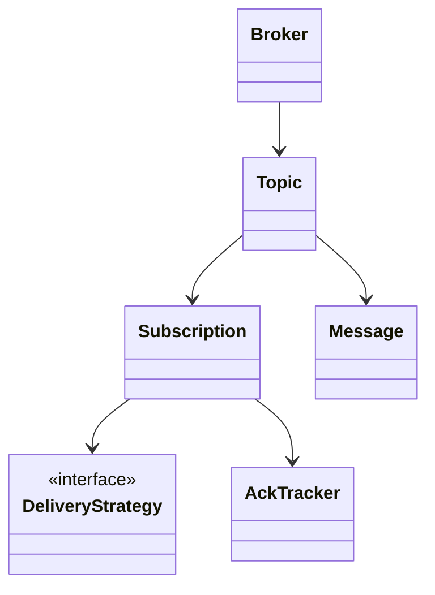
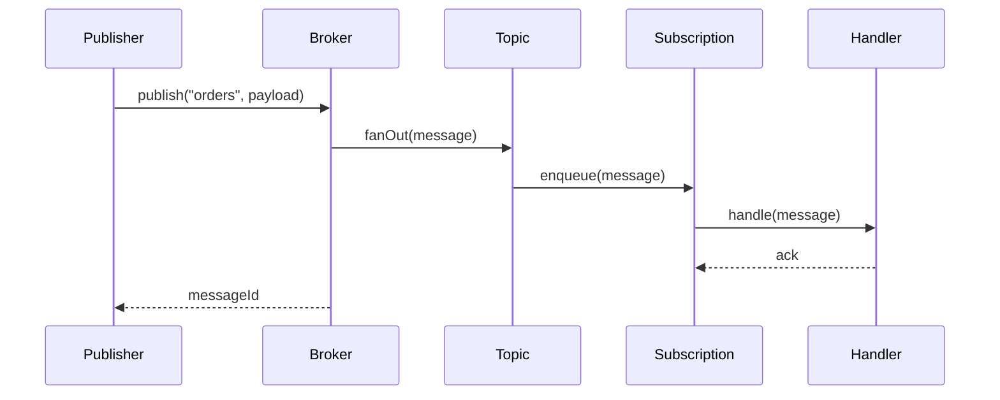
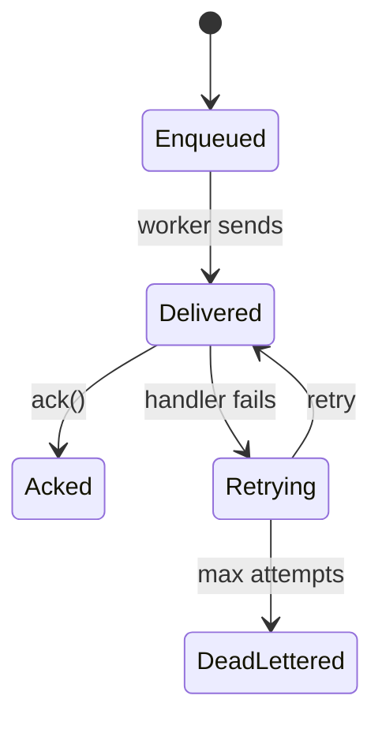

# LLD Walkthrough: Design an In-Process Pub-Sub Message Queue

> Self-contained walkthrough. It designs a single-process pub-sub broker with enough concurrency detail to sound senior, without pretending we are rebuilding Kafka on a whiteboard.

This prompt is a trap because it sounds distributed. If you jump into partitions, replication, leader election, and consumer groups, you have already lost the LLD interview. The interviewer wants to see whether you can model **publish, subscribe, delivery, acknowledgement, and slow consumers** with clean object boundaries.

The winning move is to say the boundary out loud, build a small broker, and put delivery policy behind an interface. That gives you Observer where it belongs, Strategy where it belongs, and a bounded answer for every scary queue follow-up.

---

## Minute 0-7: Clarify and fence the scope

Do not start with partitions. Start by shrinking the problem:

- **Process boundary?** → In-process broker, multiple threads, no network protocol.
- **Primary flow?** → `publish(topic, message)` fans out to current subscribers.
- **Subscription style?** → `subscribe(topic, handler)` registers a handler and returns a subscription handle.
- **Delivery guarantee?** → First cut supports at-least-once with ack/retry; at-most-once is a pluggable policy.
- **Ordering?** → Preserve ordering per topic per subscriber, not global ordering across all topics.

Say the fence out loud:

> "In scope: topic registration, publish fan-out, subscription handlers, per-subscriber queues, ack/retry, and slow-consumer backpressure. Out of scope: distributed brokers, persistence across process restart, partitions, and consumer-group rebalancing. I'll keep the delivery mechanism swappable. OK?"

That sentence prevents the classic failure: spending the interview designing Kafka badly instead of designing one correct in-process broker well.

A good follow-up sentence is:

> "I'll treat concurrency as central because publishers and subscribers may be called from different threads. The subscriber registry and each subscriber queue need explicit ownership."

Now you have a finishable design.

---

## Minute 7-13: Core entities

Pick the smallest set of objects that make publish and subscribe work. Prefer composition over inheritance; the only interfaces should be where behavior actually varies.

| Object | Responsibility (one line) |
|---|---|
| `Broker` | Public entry point; owns topics and coordinates publish/subscribe. |
| `Topic` | Owns the subscriber registry and fans messages out under thread safety. |
| `Message` | Immutable payload plus id, timestamp, headers, and delivery metadata. |
| `Publisher` | Client-facing role that calls `Broker.publish`. |
| `Subscriber` | Client-facing role with a handler invoked for delivered messages. |
| `Subscription` | Binds one subscriber to one topic and owns its per-subscriber queue. |
| `DeliveryStrategy` | Varies sync vs async delivery and retry behavior. |
| `AckTracker` | Tracks delivered message attempts, ack, retry, and dead-letter decisions. |

Eight objects. No `KafkaPartitionLeaderReplicaControllerFactory`. This is the whiteboard version you can actually finish.



Keep the diagram this small. The interview points come from making the objects collaborate, not from drawing a distributed-systems poster.

---

## Minute 13-20: The spine (API + varying interfaces)

Define the methods the outside world calls first:

```text
MessageId      publish(String topicName, Payload payload)
SubscriptionId subscribe(String topicName, MessageHandler handler)
void           unsubscribe(SubscriptionId id)
void           ack(SubscriptionId id, MessageId messageId)
```

Then define the seams where behavior varies:

```text
interface MessageHandler {
  void handle(Message message) throws HandlerException
}

interface DeliveryStrategy {
  void deliver(Subscription subscription, Message message)
}
```

Name the patterns explicitly:

- `MessageHandler` registration is the **Observer pattern**. A topic is the subject; subscriptions are the observers receiving events.
- `DeliveryStrategy` is the **Strategy pattern**. `SynchronousDelivery`, `AsyncWorkerDelivery`, `AtMostOnceDelivery`, and `RetryingDelivery` can be swapped without rewriting `Broker`.

A concrete sketch:

```text
class Broker {
  MessageId publish(String topic, Payload payload)
  SubscriptionId subscribe(String topic, MessageHandler handler)
  void unsubscribe(SubscriptionId id)
}

class Topic {
  void add(Subscription s)
  void remove(SubscriptionId id)
  void fanOut(Message m)
}

class Subscription {
  void enqueue(Message m)
  void ack(MessageId id)
}
```

Say this out loud:

> "The broker API is intentionally boring. The interesting variation is hidden behind handler and delivery interfaces. That keeps follow-ups local."

That is the spine.

---

## Minute 20-33: Walk the happy path

Walk one publish end to end. Use only the objects that matter.



Narrate the quiet parts:

- "`Message` is immutable once created, so fan-out shares references safely."
- "`Topic` holds a thread-safe subscriber registry; publish takes a snapshot of current subscriptions before fan-out."
- "Each `Subscription` has its own queue, so one slow subscriber does not block every other subscriber by default."
- "The worker drains one subscription queue in FIFO order, so ordering is preserved per subscriber for that topic."

The core publish flow:

```text
publish(topicName, payload):
  topic = topics.getOrCreate(topicName)
  message = Message.new(payload, now)
  topic.fanOut(message)
  return message.id
```

The fan-out flow:

```text
Topic.fanOut(message):
  subscribers = registry.snapshot()
  for subscription in subscribers:
    deliveryStrategy.deliver(subscription, message)
```

For async delivery:

```text
Subscription.enqueue(message):
  queue.offer(message)              // bounded queue, may reject
  worker.wakeUp()

worker loop:
  message = queue.take()
  ackTracker.markDelivered(message)
  handler.handle(message)
  ackTracker.ack(message.id)
```

Do not overcomplicate the first cut. If the handler throws, the delivery strategy decides retry vs dead-letter. `Broker` does not know handler policy.

A tiny lifecycle diagram helps because messages have real delivery state:



Now say the important concurrency sentence:

> "The two contended things are the topic's subscriber registry and each subscription queue. I use a concurrent map or read-write lock for the registry, and a bounded blocking queue per subscription. I do not hold the registry lock while running subscriber code."

That sentence is the difference between a toy observer implementation and a production-aware one.

---

## Minute 33-42: Stretch and edges

Common curveballs and bounded answers:

- **"What if a subscriber is slow?"** Use a bounded per-subscriber queue. When full, pick a backpressure policy: block publisher, drop newest, drop oldest, or route to dead-letter. Make it a `BackpressurePolicy` if the interviewer wants variation. Do not let a slow handler run under the topic lock.

- **"At-least-once or at-most-once?"** At-most-once means mark delivered before calling the handler and never retry; it may lose messages on handler failure. At-least-once means retry until ack or max attempts, so handlers must be idempotent. Say that trade-off plainly. **Be honest about the limit:** in an *in-process, non-persistent* broker, "at-least-once" only holds while the process is alive — a crash loses un-acked in-memory messages. True crash-safe at-least-once needs a durable log/outbox behind a `MessageStore` seam; call that out as the boundary between this LLD and a real durable queue.

```text
interface AckPolicy {
  void beforeDeliver(Message m)
  DeliveryDecision afterFailure(Message m, Exception e)
  void ack(MessageId id)
}
```

- **"Ordering?"** Preserve FIFO per topic per subscription by having one queue and one worker per subscription. If you add multiple workers per subscription, you must either give up ordering or shard by key. Do not design partition assignment live unless asked.

- **"Retries and dead-letter?"** Track attempt count in `AckTracker`. After `maxAttempts`, move the message to a dead-letter topic or `DeadLetterQueue`. Name it and keep moving.

- **"Subscribe while publish is running?"** Snapshot the registry at fan-out time. A new subscriber receives future messages, not the already-snapshot message. That is deterministic and easy to explain.

- **"Unsubscribe with queued messages?"** Mark subscription inactive, stop accepting new messages, then either drain or discard queued messages based on policy. First cut discards after graceful shutdown timeout.

- **"Publisher should wait for all subscribers?"** That is a delivery strategy choice. `SynchronousDelivery` can block until handlers finish; `AsyncWorkerDelivery` returns once messages are enqueued.

The anti-pattern to call out:

> "I am not building a real distributed queue here. Partitions, replication, durable logs, and consumer-group rebalancing are HLD topics. In this LLD, I keep those behind storage and delivery interfaces if we need them later."

That is a senior boundary.

---

## Minute 42-45: Wrap up

> "The model is small: `Broker` owns topics, `Topic` owns a thread-safe subscriber registry, `Subscription` owns a per-subscriber queue and worker, and `MessageHandler` is the observer callback. Sync versus async, at-most-once versus at-least-once, and retry/dead-letter behavior sit behind strategy interfaces. The main concurrency rule is: never hold the registry lock while invoking subscriber code."

If there is one minute left, mention tests:

```text
- publish fans out to all current subscribers
- one slow subscriber does not block another in async mode
- retry happens on handler failure until maxAttempts
- unsubscribe prevents future deliveries
- ordering is preserved per subscription
```

Do not add more classes. End with the crisp model.

---

## How real systems solve this

Kafka is the production reference point for the queue-shaped version of this prompt. A topic is split into partitions, and each partition is an ordered, immutable, append-only log. Every message in a partition gets a monotonic offset, and ordering is guaranteed only within that partition. Related messages use a key so they land on the same partition.

Consumer groups add the scaling rule the interview design intentionally avoids: within one group, each partition is consumed by exactly one consumer, so parallelism is bounded by partition count. Default delivery is at-least-once when the consumer commits offsets after processing; if it crashes after processing but before commit, the message can be redelivered. Exactly-once requires idempotent producers and transactions.

Durability and retention change the broker from callback fan-out into a replayable log. Kafka replication plus producer `acks` determine how strongly a write is acknowledged, while retention lets consumers rewind offsets and replay old messages. That decouples producer lifetime from consumer lifetime in a way an in-process, non-persistent broker cannot.

Other systems choose different trade-offs. RabbitMQ emphasizes exchanges and bindings for broker-side routing. SQS uses visibility timeout semantics rather than consumer-owned offsets. All of them need poison-message handling with a dead-letter queue and some form of backpressure so slow consumers do not silently exhaust memory.

## Reference implementation

This Python core models the Kafka-like essentials: partitioned append-only logs, key-based partitioning, and per-consumer-group offsets.

```python
from __future__ import annotations

from dataclasses import dataclass
from threading import Lock
from typing import Any

@dataclass(frozen=True)
class Record:
    offset: int
    key: str
    value: Any

class Topic:
    def __init__(self, partitions: int) -> None:
        if partitions <= 0:
            raise ValueError("partitions must be positive")
        self._logs: list[list[Record]] = [[] for _ in range(partitions)]
        self._offsets: dict[tuple[str, int], int] = {}
        self._lock = Lock()

    def publish(self, key: str, value: Any) -> tuple[int, int]:
        partition = hash(key) % len(self._logs)
        with self._lock:
            log = self._logs[partition]
            record = Record(len(log), key, value)
            log.append(record)
            return partition, record.offset

    def poll(self, group: str, partition: int, max_records: int) -> list[Record]:
        with self._lock:
            next_offset = self._offsets.get((group, partition), 0)
            log = self._logs[partition]
            return log[next_offset: next_offset + max_records]

    def commit(self, group: str, partition: int, offset: int) -> None:
        with self._lock:
            current = self._offsets.get((group, partition), 0)
            self._offsets[(group, partition)] = max(current, offset + 1)
```

## Complexity and trade-offs

| Operation | Time | Space | Notes |
|---|---:|---:|---|
| Publish with key | O(1) average | O(1) per record | Hash key chooses partition; append assigns next offset. |
| Poll batch | O(k) | O(k) returned | Reads k records from the group's committed offset. |
| Commit offset | O(1) | O(1) per group-partition | Commit after processing gives at-least-once behavior. |
| Fan-out to s subscribers | O(s) | O(s) references | In-process pub-sub copies/enqueues per subscriber. |
| Replay from old offset | O(k) | O(k) returned | Requires retained records; not possible after deletion. |

- More partitions increase consumer-group parallelism, but ordering remains only within each partition.
- At-least-once delivery requires idempotent handlers because redelivery after a crash can duplicate work.
- Retention decouples producers and consumers, but it turns memory/disk usage into a policy decision.
- Backpressure must be explicit: block, drop, retry later, or route poison messages to a DLQ.

## Further reading

- [Apache Kafka documentation](https://kafka.apache.org/documentation/) — Authoritative reference for topics, partitions, offsets, consumer groups, replication, and transactions.
- [Observer pattern](https://refactoring.guru/design-patterns/observer) — The in-process subscription model is a direct observer relationship.
- [Strategy pattern](https://refactoring.guru/design-patterns/strategy) — Delivery, retry, and backpressure policies belong behind strategy interfaces.
- *Designing Data-Intensive Applications* — Martin Kleppmann — Broader context for logs, replication, partitions, and stream processing trade-offs.

---

## What separated a pass from a fail here

- You fenced the problem as **in-process** instead of wandering into Kafka internals.
- You used **Observer** for subscription and **Strategy** for delivery policy, not pattern soup.
- You made concurrency concrete: thread-safe registry, snapshot fan-out, per-subscriber bounded queues, no handler under a lock.
- You gave bounded answers for slow consumers, ack semantics, retries, dead-letter, and ordering.
- You kept the happy path runnable in five objects.

That is the whole game: tiny broker, clear ownership, safe fan-out, swappable delivery, and no distributed rabbit hole.
