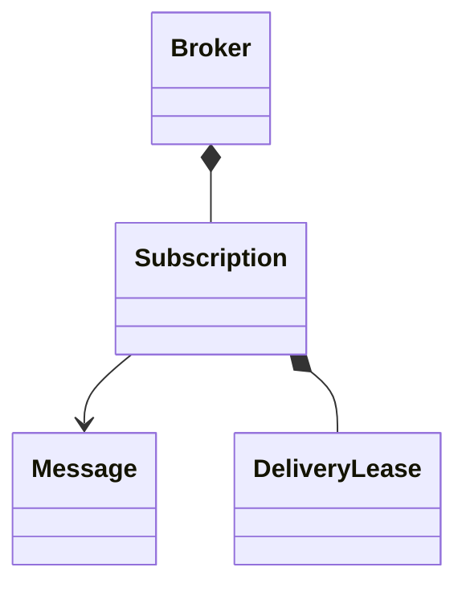

# In-Process Pub-Sub Message Queue

## 1. Requirements

Publish immutable messages to current subscribers, deliver independently, acknowledge, and retry timed-out delivery. Multiple threads share one in-memory broker. Preserve FIFO acceptance order per subscription, including retries. Limit subscriptions to 1000, each queue to 100 messages including its in-flight head, and payloads to 64 KiB. Publishing must either enqueue for every current subscriber or none.

## 2. Out of scope

Exclude persistence, network transport, partitions, consumer groups, and exactly-once effects. Subscribers joining later receive no history. Delivery is at-least-once only while the process and subscription remain alive and handlers eventually acknowledge. Unsubscribing explicitly discards pending deliveries.

## 3. Model and invariants

`Broker` owns topic membership and bounded subscription queues. Each `Subscription` owns one FIFO and at most one current delivery lease. `Message` contains broker-generated identity and immutable bytes; delivery attempts have separate tokens.

Only the head may be leased. Acknowledging a stale token cannot remove a newer attempt. No subscriber queue exceeds capacity, including messages awaiting acknowledgement.

## 4. Public contract

`subscribe(topic, handler) -> subscriptionId` returns `InvalidTopic` or `SubscriptionLimit` on failure. `publish(topic, bytes) -> messageId` returns `InvalidTopic`, `PayloadTooLarge`, or `Backpressure`. Publishing to a topic with no subscribers succeeds with no retained copy. Each publish call is distinct; retrying after an uncertain response may duplicate the logical event.

`ack(subscriptionId, messageId, token) -> bool` returns true only when the current head lease is removed; duplicate, stale, or unknown acknowledgements return false. `unsubscribe(subscriptionId) -> bool` reports whether an active subscription was removed. Handlers receive `(message, token, ackHandle)` and must tolerate duplicates.

## 5. Core flow

Under one broker mutex, snapshot topic membership, check every target's queue capacity, allocate the message and queue nodes, then append to all targets. Reserve allocations before modifying queues so allocation failure does not produce partial fan-out. Release the mutex and signal workers.

A worker leases an unleased head, assigns an increasing token and monotonic deadline, then invokes the handler outside the mutex. Exceptions leave the message queued. At deadline, invalidate the lease and make the same head retryable after bounded backoff; later messages remain blocked. A valid acknowledgement removes the head atomically and wakes delivery of its successor.

## 6. Trade-offs and extensions

Atomic fan-out makes one slow subscriber backpressure the publisher. Independent dropping queues improve isolation but change acceptance semantics. A dead-letter extension needs an explicit terminal failure result because silently dropping after N attempts weakens the delivery guarantee.

## 7. Concurrency and failure handling

The mutex protects membership, capacity checks, enqueue, leases, and acknowledgement. Timed-out callbacks may still run alongside retries; tokens fence broker state, not external side effects. A fixed worker pool bounds thread count; permanently blocked handlers can exhaust it, so prompt handler completion is an API requirement. Unsubscribe cannot stop a callback already executing. Process failure loses every queue and acknowledgement.

## 8. Test cases

Publishing M1 then M2 delivers M1 first to each subscriber. Without M1 acknowledgement, M2 stays queued. An old token after retry returns false. One full subscriber makes publish reject without adding to any queue. A throwing handler causes retry, not message loss. Concurrent publish calls establish one mutex-defined order. Verify the 101st queued message is rejected and oversized payloads allocate no queue entries.

[Question catalog](../interview-guide.html) · [Article template](interview-template.html)
