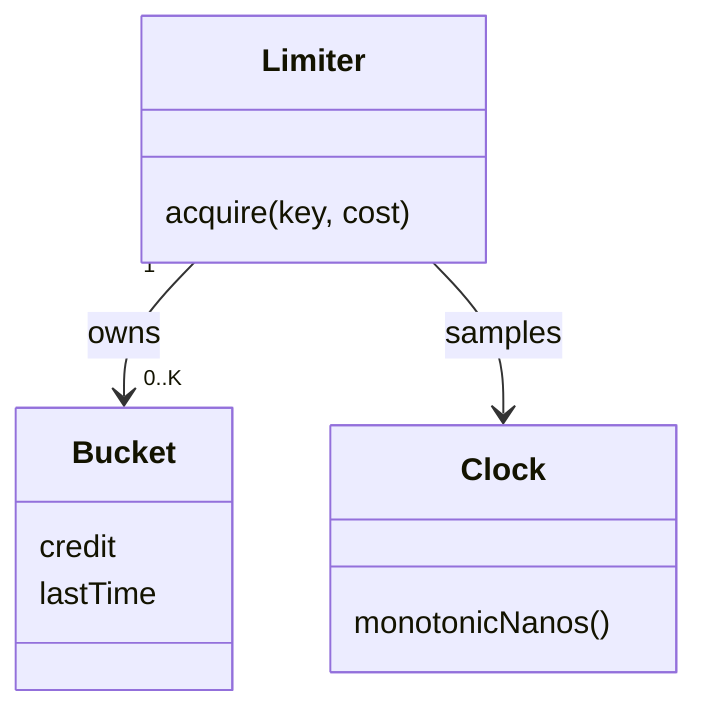

# Design an In-Process Rate Limiter

Enforce per-key token-bucket admission with monotonic refill, atomic consumption, and bounded key tracking.

LLD stages: [Requirements](#requirements) → [Core entities](#core-entities) → [API or system interface](#api) → [High-level design](#high-level-design) → [Deep dives](#deep-dives).

## 1. Requirements
{: #requirements }

### Functional requirements

Allow callers to consume tokens from per-key buckets. Configure capacity C and refill rate R tokens per second. Return admission, a quota retry delay, or capacity exhaustion without executing the caller's work.

### Non-functional and execution constraints

Concurrent callers share one process with at most K tracked keys. State is volatile: restart restores fresh capacity and therefore does not preserve a long-term quota. Normal acquisition is expected O(1); a full-map reclamation scan costs O(K).

### Out of scope

Exclude distributed quotas, billing limits, HTTP parsing, and request execution. The limiter decides admission only; it cannot guarantee fairness or cancel work already admitted. Request retry deduplication belongs to the application, not an unbounded cache inside the limiter.

## 2. Core entities
{: #core-entities }

`Limiter` owns the bounded key map, configuration, and synchronization. Each `Bucket` owns its token credit and last sampled monotonic timestamp. An injected `Clock` makes elapsed time deterministic in tests.

Credit stays between zero and capacity. Each successful acquisition deducts exactly its cost atomically with refill. A rejected request consumes nothing. The map never exceeds K entries, and eviction must not restore tokens that have not yet refilled.

## 3. API or system interface
{: #api }

`acquire(key, cost=1) -> Allowed{remaining}|Denied{retryAfterNanos}|CapacityExceeded` requires a bounded nonempty key and integer cost in `[1,C]`. Invalid keys, zero cost, or cost above capacity return `InvalidArgument`, not an infinite retry delay. Construction requires positive C, R, and K within arithmetic limits.

`remove(key)` is deliberately absent: deleting a depleted bucket would bypass the policy. Calls are not idempotent; two invocations represent two admission attempts, even if an upstream request ID matches.

## 4. High-level design
{: #high-level-design }

`Limiter.acquire` validates its arguments, then holds the limiter mutex, samples `Clock`, and locates the key's `Bucket`. Represent credit in token-nanoseconds: capacity is `C × 1_000_000_000`, refill adds `elapsedNanos × R`, and a cost deducts `cost × 1_000_000_000`. Use checked wide arithmetic and saturate refill before multiplication can overflow.

Clamp backward clock readings to the bucket's previous timestamp. Cap refilled credit at capacity and advance its timestamp. If credit covers the cost, deduct and return allowed; otherwise return the ceiling of missing credit divided by R as the wait in nanoseconds.

For a new key when the map is full, scan for a bucket whose effective credit has completely refilled. Remove one such bucket and initialize the new key at full capacity. If none qualifies, return `CapacityExceeded`. This is overload, not a quota denial with a promised retry time.

## 5. Deep dives
{: #deep-dives }

### Trade-offs and extensions

A global mutex simplifies the refill-and-consume invariant but serializes callers. Fixed sharding can increase throughput, provided each shard has a bounded capacity budget. Conservative full-bucket eviction preserves quota semantics; ordinary LRU eviction would let high-cardinality callers repeatedly reset depleted buckets.

### Concurrency and failure handling

Refill, eviction, and consumption share the same lock. No external work runs inside it. Memory is O(K), including bounded key lengths. A periodic sweep is optional, not required for correctness. Wall-clock changes never affect refill. Multi-process use multiplies the effective allowance; durable shared enforcement requires a different owner and atomic storage operations.

### Test cases

- C=2, R=1, time 0: first two cost-1 calls allowed, third denied for 1 second.
- Advance 0.5 seconds: next denial reports 0.5 seconds.
- Cost 3 with C=2: `InvalidArgument`, credit unchanged.
- Two threads race for one token: exactly one allowed.
- K=1 with a depleted key: a new key returns `CapacityExceeded`.
- Once the old bucket fully refills, a new key replaces it; map size stays 1.

[Question catalog](../interview-guide.html) · [Article template](interview-template.html)
