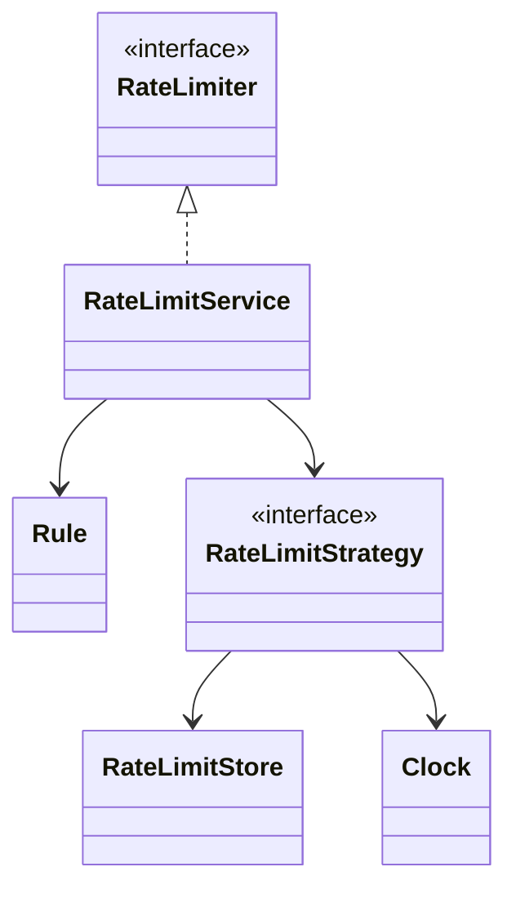
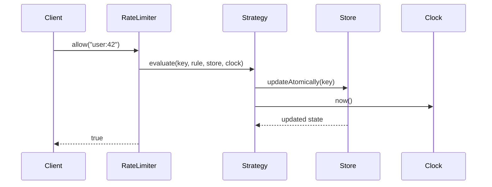
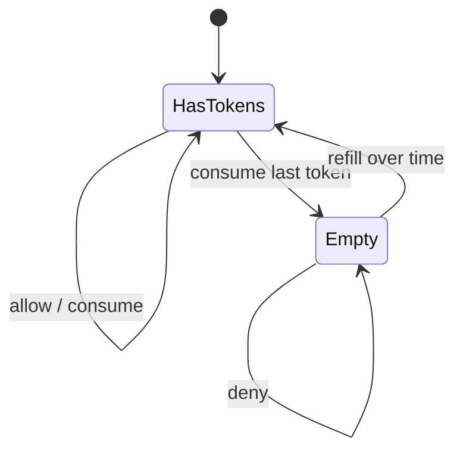

# LLD Walkthrough: Design a Rate Limiter

> Self-contained walkthrough. It shows how to design an in-process API rate limiter library in a live LLD interview without getting trapped in algorithm theater.

A rate limiter is where strong candidates accidentally fail by knowing too much. Token buckets, sliding logs, fixed windows, Redis Lua scripts, distributed clocks — all of that is real, and most of it is not the interview's first scoring axis.

The scoring axis is simpler: **clean API, swappable algorithms, correct per-key state update, bounded edge answers**.

Say this out loud early:

> "The data structure matters here, but I will state the O(1) property, hide it behind a strategy/store seam, and move on to the object flow."

That sentence tells the interviewer you can handle the algorithm without letting it own the room.

---

## Minute 0-7: Clarify and fence the scope

Do not start with token math. First shrink the product.

Good questions and reasonable default answers:

- **Where does this run?** → In-process library used by one API service instance.
- **What is the client call?** → `allow(key)` returns true/false before serving a request.
- **What is the key?** → Caller supplies it: user id, API key, IP, route, or composite key.
- **Multiple policies?** → Yes, rules can vary by key or route.
- **Distributed?** → Name it, but keep it out of scope for the first design.
- **Exactness?** → Good enough for API throttling; not a financial ledger.

Say the fence out loud:

> "In scope: a single-process rate limiter library, `allow(key)` as the public API, configurable rules, token bucket as the default strategy, and testable time. Out of scope: Redis-backed distributed limiting, admin UI, and long-term analytics."

That fence prevents three common failures:

- building a distributed system when asked for LLD;
- arguing sliding-window accuracy for 15 minutes;
- mixing HTTP middleware concerns into the limiter core.

The interviewer may ask "what about per-endpoint limits?" Keep the answer bounded:

> "The key can be `userId:route`, and rule lookup can use that key. I don't need a new class hierarchy."

---

## Minute 7-13: Core entities

List responsibilities, not inheritance. Prefer composition. The algorithm variants are strategies, not subclasses of the whole service.

| Object | Responsibility (one line) |
|---|---|
| `RateLimiter` | Public interface the client calls to decide whether a request is allowed. |
| `RateLimitService` | Orchestrates rule lookup, strategy execution, and result recording. |
| `Rule` | Holds limit, refill/window duration, burst capacity, and optional key matcher. |
| `RateLimitStrategy` | Varying algorithm that evaluates and updates state for one key. |
| `TokenBucket` | Default strategy; refills tokens over time and consumes one per allowed request. |
| `RateLimitStore` | Abstracts per-key mutable counters, buckets, or timestamp logs. |
| `Clock` | Supplies time so tests do not sleep and production does not hardcode system time. |
| `Decision` | Carries allowed/denied plus optional retry-after metadata. |

Eight objects. That is enough.

Do **not** draw `UserRateLimiter`, `IpRateLimiter`, `RouteRateLimiter`, and `PremiumUserRateLimiter`. The key and rule decide that. The object model stays small.



Keep this diagram tiny. The interviewer does not need to see the internal fields of a bucket yet.

The one data-structure sentence:

> "For token bucket, each key stores token count and last-refill timestamp; `allow` is O(1) because it reads, refills, maybe decrements, and writes exactly one record."

Then stop. You can derive the math later if asked.

---

## Minute 13-20: The spine (API + varying interfaces)

Define the client-facing API first:

```text
interface RateLimiter {
  boolean allow(String key)
  Decision check(String key)        // optional richer API: retryAfter, remaining
}
```

For a library, I like both:

- `allow(key)` for the simple middleware path;
- `check(key)` when the caller wants headers like `Retry-After` or `X-RateLimit-Remaining`.

Now the seams where behavior varies. This is the **Strategy pattern**:

```text
interface RateLimitStrategy {
  Decision evaluate(String key, Rule rule, RateLimitStore store, Clock clock)
}

final class TokenBucket implements RateLimitStrategy
final class SlidingWindowLog implements RateLimitStrategy
final class FixedWindowCounter implements RateLimitStrategy
```

And the store seam:

```text
interface RateLimitStore {
  BucketState getBucket(String key)
  void putBucket(String key, BucketState state)
  <T> T updateAtomically(String key, Function<StateView, T> mutation)
}
```

Say this out loud:

> "`RateLimiter` is the stable API. `RateLimitStrategy` is the swappable algorithm. `RateLimitStore` is where I hide whether state is an in-memory map today or Redis later."

Token bucket in four lines:

```text
elapsed = now - lastRefill
tokens = min(capacity, tokens + elapsed * refillRate)
if tokens >= 1: tokens-- and allow
else deny with retryAfter based on missing tokens
```

That is all the algorithm detail you need before the happy path.

For rule lookup, keep it boring:

```text
Rule ruleFor(String key)
```

It can be a map, prefix matcher, or caller-provided resolver. Do not build a policy engine unless asked.

---

## Minute 20-33: Walk the happy path

Walk one request through the objects. This is where points live.



Narrate the happy path:

- "The client asks `allow(user:42)` before doing work."
- "`RateLimitService` resolves the rule for that key."
- "The strategy performs one atomic read-modify-write for that key."
- "If there is at least one token after refill, it consumes one and returns allowed."
- "The service returns a boolean; the caller decides whether to serve or reject."

Now show the actual flow in pseudocode:

```text
allow(key):
  return check(key).allowed

check(key):
  rule = rules.ruleFor(key)
  return strategy.evaluate(key, rule, store, clock)
```

Inside token bucket:

```text
evaluate(key, rule, store, clock):
  return store.updateAtomically(key, state -> {
    now = clock.now()
    refill state.tokens using now - state.lastRefill
    if state.tokens >= 1:
      state.tokens -= 1
      return Decision.allowed(remaining = state.tokens)
    return Decision.denied(retryAfter = timeUntilNextToken)
  })
```

The important invariant:

> "For a single key, refill and consume happen in one atomic update, so two racing requests cannot both spend the same token."

If the interviewer asks about other algorithms, give bounded comparisons:

| Strategy | State per key | Why use it |
|---|---|---|
| `TokenBucket` | token count + last refill time | Allows controlled bursts and O(1) updates. |
| `FixedWindowCounter` | window id + count | Very simple, but has boundary bursts. |
| `SlidingWindowLog` | timestamps deque/list | More accurate, but can grow with request count. |

Then move back to the design:

> "All three implement `RateLimitStrategy`, so the service does not change."

---

## Minute 33-42: Stretch and edges

Common curveballs and bounded answers:

- **"Two requests for the same key arrive concurrently."** The contended resource is that key's state. Use per-key atomic update. In an in-memory implementation, use lock striping keyed by hash or a concurrent map with atomic compute. Do not put a global lock around all traffic unless this is a toy.

- **"What about many keys?"** Store state in a map keyed by limiter key. Expire idle entries after a few windows so the map does not grow forever. That is a store concern, not a strategy rewrite.

- **"What about bursts?"** Token bucket explicitly supports bursts up to capacity. If the product wants no bursts, use fixed window or set capacity close to the steady limit.

- **"What about clock skew?"** In-process uses one monotonic clock. Distributed versions need server-side time, Redis time, or another consistent time source. Name it as distributed-out-of-scope.

- **"What about a distributed limiter?"** Keep the same `RateLimiter` and `RateLimitStrategy` shape, but `RateLimitStore` becomes Redis or another centralized store with atomic operations, often Lua/scripted compare-and-update. That is a deployment change plus stronger failure-mode handling, not a new public API.

The natural state diagram is tiny:



Name the edges fast:

- missing rule → default deny or default rule; choose explicitly;
- negative or zero limit → configuration error;
- retry-after rounding → round up so callers do not hammer;
- hot key → lock striping still serializes that key, which is correct;
- process restart → in-memory state resets, acceptable for scoped design.

Anti-patterns to call out:

- "I would not code three algorithms live unless asked; I would implement token bucket and leave the other two behind the interface."
- "I would not prove token bucket invariants for 20 minutes; I would state the O(1) update and run the flow."
- "I would not make key type hierarchy. A string or value object key is enough."

---

## Minute 42-45: Wrap up

> "The design has a stable `RateLimiter` API, a `RateLimitService` that resolves rules, a `RateLimitStrategy` seam for token bucket versus sliding or fixed windows, and a `RateLimitStore` seam for atomic per-key updates. Token bucket is O(1) per request. Concurrency is handled at the per-key state update via atomic compute or lock striping. A distributed version would swap the store, not the caller API."

If you have ten extra seconds, say what you would test:

- first request allowed;
- limit + 1 request denied;
- refill after clock advances;
- two concurrent requests cannot overspend one token;
- missing rule behavior.

That is a senior ending: model, seam, invariant, concurrency, tests.

---

## How real systems solve this

Production limiters usually keep the same shape as the interview design: a stable `allow/check` API, a policy, and a small piece of mutable state per key. The difference is where the state lives and how precise the algorithm must be. Token bucket stores only capacity, current tokens, and last-refill time, so it is the usual default when the product wants bursts up to `b` and O(1) per-key work.

Fixed windows are attractive because they are trivial to store with `INCR` and expiry, but they can allow roughly a double burst around a boundary. Sliding-window logs are exact, but storing every request timestamp makes memory and CPU grow with request volume per key. Sliding-window counters split the difference by weighting the previous and current windows; Cloudflare describes using that style at edge scale where the state must stay small across millions of domains.

Stripe's production write-up is a useful reminder that distributed rate limiting is mostly about atomicity and failure modes, not just math. Their design uses a GCRA/leaky-bucket variant and token buckets with Redis. In a web API, the denial path should return HTTP `429` and a `Retry-After` value computed from the same atomic state update.

For a distributed version, keep the public API and strategy interface. Swap the in-memory `RateLimitStore` for Redis, and make the state transition a single atomic operation, commonly a Lua script or an equivalent `INCR`/`EXPIRE` pattern when the algorithm is simple enough. Server-side time matters because client clocks are not a safe source of truth.

## Reference implementation

The core mechanism is the atomic token-bucket transition: refill from elapsed time, then consume at most one token under the key's lock.

```java
import java.time.Clock;
import java.util.concurrent.ConcurrentHashMap;

final class TokenBucketLimiter {
    private final int capacity;
    private final double refillPerSecond;
    private final Clock clock;
    private final ConcurrentHashMap<String, Bucket> buckets = new ConcurrentHashMap<>();

    TokenBucketLimiter(int capacity, double refillPerSecond, Clock clock) {
        if (capacity <= 0 || refillPerSecond <= 0) throw new IllegalArgumentException();
        this.capacity = capacity;
        this.refillPerSecond = refillPerSecond;
        this.clock = clock;
    }

    Decision check(String key) {
        long nowMillis = clock.millis();
        Bucket bucket = buckets.computeIfAbsent(key, k -> new Bucket(capacity, nowMillis));
        synchronized (bucket) {
            double elapsedSeconds = Math.max(0, nowMillis - bucket.lastRefillMillis) / 1000.0;
            bucket.tokens = Math.min(capacity, bucket.tokens + elapsedSeconds * refillPerSecond);
            bucket.lastRefillMillis = nowMillis;

            if (bucket.tokens >= 1.0) {
                bucket.tokens -= 1.0;
                return new Decision(true, 0, (int) bucket.tokens);
            }
            long retryMillis = (long) Math.ceil((1.0 - bucket.tokens) / refillPerSecond * 1000.0);
            return new Decision(false, retryMillis, 0);
        }
    }

    private static final class Bucket {
        double tokens;
        long lastRefillMillis;
        Bucket(double tokens, long lastRefillMillis) {
            this.tokens = tokens;
            this.lastRefillMillis = lastRefillMillis;
        }
    }

    record Decision(boolean allowed, long retryAfterMillis, int remaining) {}
}
```

## Complexity and trade-offs

| Operation / strategy | Time | Space per key | Notes |
|---|---:|---:|---|
| Token bucket `check` | O(1) | O(1) | Stores token count and last-refill timestamp; allows bursts up to capacity. |
| GCRA `check` | O(1) | O(1) | Stores one theoretical arrival time; compact and precise for a leaky-bucket style policy. |
| Fixed-window counter | O(1) | O(1) | Simplest, but boundary bursts can be close to twice the intended limit. |
| Sliding-window log | O(n) | O(n) | Exact, but stores every request timestamp for the window. |
| Sliding-window counter | O(1) | O(1) | Low-memory weighted estimate with small edge error. |
| Redis-backed update | O(1) network round trip | O(1) | Correctness depends on one atomic state transition. |

- Token bucket is usually the best interview default: clear burst semantics, tiny state, and easy retry-after math.
- Sliding-window log buys exactness at the cost of memory proportional to hot-key traffic.
- Distributed limiters need atomic state and a consistent time source more than they need a larger object model.
- A hot key still serializes on one state record; that is correct, but it can become the throughput ceiling.

## Further reading

- [Stripe: Scaling your API with rate limiters](https://stripe.com/blog/rate-limiters) — Practical discussion of GCRA/leaky-bucket variants, token buckets, and Redis-backed limiting.
- [Cloudflare: Counting things, a lot of different things](https://blog.cloudflare.com/counting-things-a-lot-of-different-things/) — Edge-scale sliding-window counter motivation and trade-offs.
- [Redis eviction policies](https://redis.io/docs/latest/develop/reference/eviction/) — Useful contrast for how Redis manages memory and expiry-adjacent policy decisions.
- [Strategy pattern](https://refactoring.guru/design-patterns/strategy) — The exact seam used to swap limiter algorithms without changing callers.

---

## What separated a pass from a fail here

- You kept the public API tiny: `allow(key)` and optional `check(key)`.
- You used **Strategy** for algorithms instead of hardcoding token bucket everywhere.
- You stated the real data-structure property once: token bucket is O(1) per key update.
- You hid storage behind a seam, so distributed limiting became a follow-up, not a rewrite.
- You made concurrency precise: one atomic update per key, not hand-wavy "thread safe."

The pass is not "knows every limiter algorithm." The pass is "can pick one cleanly, encapsulate it, and keep designing."
