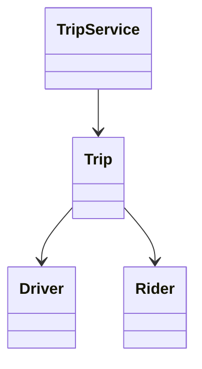

# Ride-Hailing

Manage ride requests, exclusive driver assignments, and trip transitions with checked fare arithmetic and durable request identity.

LLD stages: [Requirements](#requirements) → [Core entities](#core-entities) → [API or system interface](#api) → [High-level design](#high-level-design) → [Deep dives](#deep-dives).

## 1. Requirements
{: #requirements }

### Functional requirements

Create ride requests, assign a nearby available driver, start and complete trips, and allow pre-start cancellation. Locations include a recorded UTC timestamp; dispatch ignores updates older than 30 seconds. Fare amounts use integer minor units and one currency.

### Non-functional and execution constraints

Concurrent service instances share a transactional database. Search considers at most 20 candidates per attempt. Driver assignment and trip ownership must commit together.

### Out of scope

Exclude navigation, real payment collection, driver-offer negotiation, surge prediction, and cancellation fees. Assignment here is immediate, not a pending offer. Fare computation uses supplied, validated distance and duration rather than reconstructing a GPS route. A completed trip does not imply payment.

## 2. Core entities
{: #core-entities }

`TripService` owns trip transitions. `Trip` owns rider, pickup, destination, assigned driver, rate snapshot, state, version, and final fare. `Driver` owns availability and active trip; a rider record similarly identifies its active trip.

States are `REQUESTED → ASSIGNED → IN_PROGRESS → COMPLETED`, with cancellation from requested or assigned. Each driver and rider has at most one active trip. Assignment updates both sides of the relationship atomically.

## 3. API or system interface
{: #api }

`request(riderId, pickup, destination, key) -> Trip` returns `NotFound`, `InvalidLocation`, `RiderBusy`, or `KeyConflict`; identical key/payload returns the original trip. `match(tripId) -> Trip` returns `NoDriver`, `NotFound`, or `InvalidState`; an already-assigned trip returns its assignment.

`start(tripId, driverId, expectedVersion)`, `complete(tripId, driverId, meters, seconds, expectedVersion)`, and `cancel(tripId, riderId, expectedVersion)` return `Trip` or `Forbidden`, `StaleVersion`, `InvalidState`, `InvalidMetrics`, or `NotFound`. `get(tripId)` returns a snapshot. Mutation retries use get after a stale-version response rather than repeating side effects.

## 4. High-level design
{: #high-level-design }

`TripService.request` locks the `Rider` record and atomically creates a requested `Trip` plus active-trip pointer and idempotency record. The service's matching operation obtains nearby `Driver` candidates, sorted by distance then identifier, without holding database locks.

For each candidate, start a transaction, lock the trip then driver, and recheck requested state, freshness, and driver availability. Claim the driver, attach it to the trip, increment version, and commit. A busy candidate causes retry with the next candidate; an empty or exhausted list leaves the trip requested.

Start verifies assigned-driver identity. Complete validates nonnegative metrics, then calculates `base + ceil(meters × ratePerKm / 1000) + ceil(seconds × ratePerMinute / 60)` using checked integer arithmetic. Store that fare and completion state while clearing rider and driver pointers atomically. Cancellation clears the same pointers without a fare.

## 5. Deep dives
{: #deep-dives }

### Trade-offs and extensions

Bounding candidate search controls latency but can return `NoDriver` while more distant drivers exist. Offer-based dispatch is an extension requiring expiring reservations and driver acceptance, not merely a new notification.

### Concurrency and failure handling

Existing-trip mutations lock trip, then rider when needed, then driver; no operation locks another trip while holding these rows. Database uniqueness constraints backstop active-trip ownership. Two matches cannot claim one driver. Committed assignments and fares survive crashes. Notifications use an outbox if introduced; payment would need a separate idempotent settlement workflow.

### Test cases

Two trips competing for driver D yield one assignment. Starting with another driver returns `Forbidden`. Cancelling an in-progress trip fails. At base 200, rate 100/km, and 60/minute, 1500 meters and 120 seconds cost 470 minor units. A 31-second-old location is ignored. Duplicate request keys return one trip. Twenty busy candidates return `NoDriver` without scanning the entire fleet.

[Question catalog](../interview-guide.html) · [Article template](interview-template.html)
