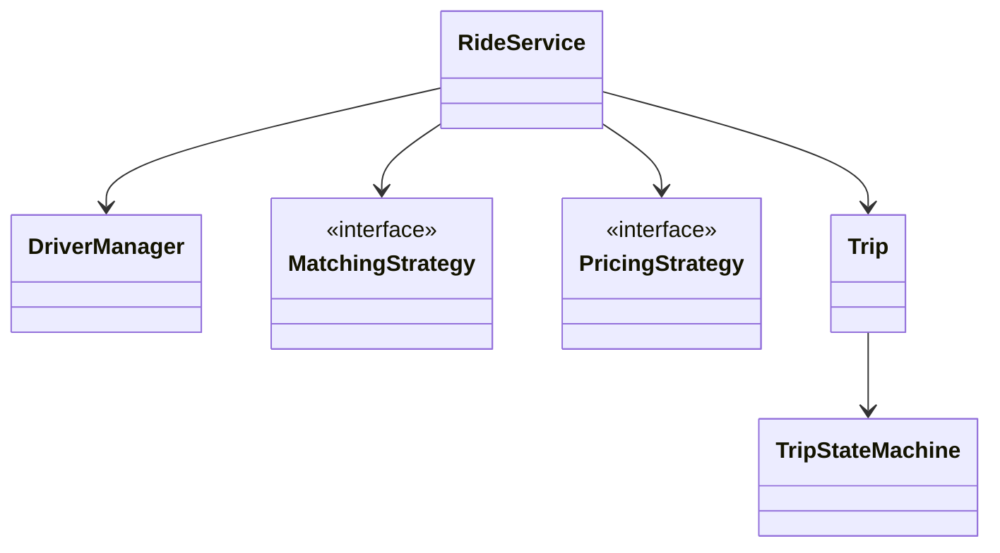
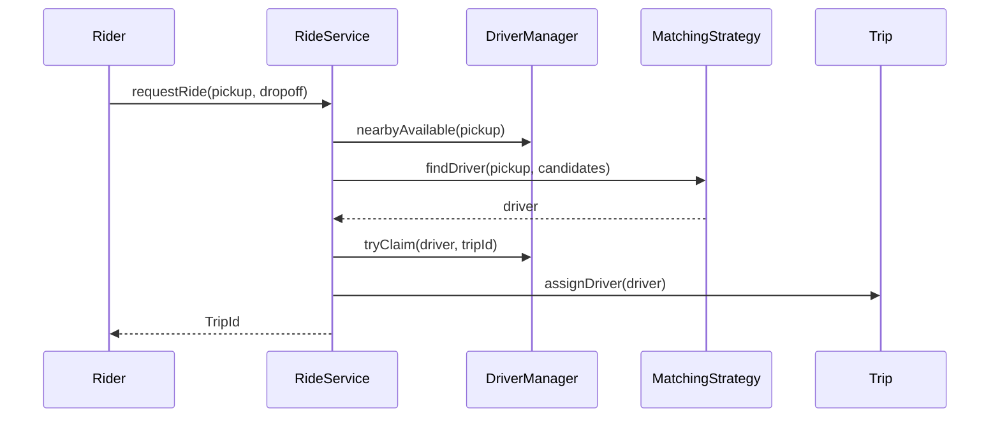
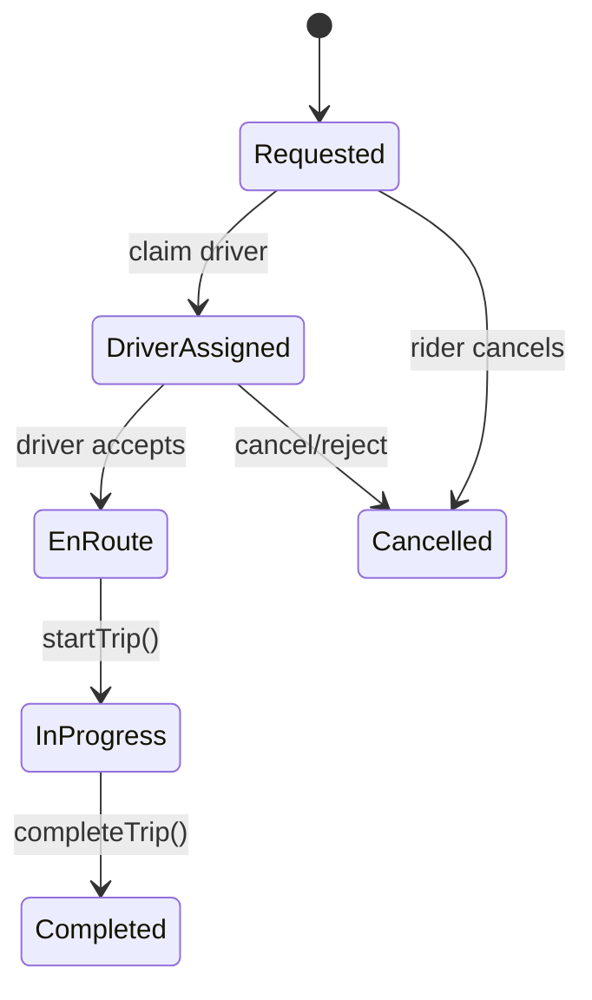

# LLD Walkthrough: Design a Ride-Hailing System Like Uber

> Self-contained walkthrough. It designs the LLD core of a ride-hailing app: riders request trips, drivers are matched safely, pricing is pluggable, and trip state transitions are explicit.

This prompt is dangerous because everyone wants to design real Uber. Do not. A full ride-hailing platform has dispatch, maps, fraud, payments, driver incentives, marketplace balancing, and global scale. In an LLD interview, the scoring center is much smaller: **model a trip, match one driver, prevent double assignment, and drive the trip through a state machine**.

The winning answer is not a geospatial lecture. It is a clean trip lifecycle with a pluggable matching strategy and a hard concurrency statement around claiming drivers.

---

## Minute 0-7: Clarify and fence the scope

Start by cutting the platform down to a finishable slice:

- **Primary flow?** → Rider requests a ride, system finds a driver, trip progresses to completion.
- **Process boundary?** → Single service/process for LLD; storage and network are abstracted.
- **Matching?** → Nearest available driver first; geospatial index is abstracted behind an interface.
- **Pricing?** → Estimate fare with a pluggable strategy; surge is a strategy, not a hard-coded formula.
- **Payments?** → Out of scope except returning final fare.

Say the fence out loud:

> "In scope: rider request, driver matching, driver claim, trip lifecycle, cancellation, and fare estimation. Out of scope: real maps, payments, notifications, fraud, and distributed scaling. I'll make matching and pricing strategies pluggable, and I'll model trip state transitions explicitly. OK?"

Then add the concurrency promise:

> "The key race is two riders being matched to the same driver. I'll handle that with an atomic driver claim or a lock inside `DriverManager`."

That is the problem's center of gravity.

---

## Minute 7-13: Core entities

Keep the object list small and behavior-focused.

| Object | Responsibility (one line) |
|---|---|
| `Rider` | User requesting a trip from pickup to dropoff. |
| `Driver` | Supply-side user with location, availability, and current trip state. |
| `Location` | Latitude/longitude value object used by matching and pricing. |
| `Trip` | Owns rider, driver, route endpoints, fare estimate, and lifecycle state. |
| `RideService` | Public entry point that orchestrates request, match, accept, cancel, and complete. |
| `DriverManager` | Owns available drivers and atomically claims/releases them. |
| `MatchingStrategy` | Selects candidate drivers, e.g. nearest available driver. |
| `PricingStrategy` | Calculates estimate/final fare, including surge variants. |
| `TripStateMachine` | Validates and applies legal trip state transitions. |

Nine objects is the upper edge; do not add `City`, `VehiclePhoto`, `Coupon`, or `ChatMessage` unless the interviewer asks.



This diagram says the important thing: orchestration in one service, variability behind strategies, lifecycle behind a state machine.

---

## Minute 13-20: The spine (API + varying interfaces)

Define the methods the client calls:

```text
TripId requestRide(RiderId riderId, Location pickup, Location dropoff)
void   acceptTrip(DriverId driverId, TripId tripId)
void   driverArrived(DriverId driverId, TripId tripId)
void   startTrip(DriverId driverId, TripId tripId)
Receipt completeTrip(DriverId driverId, TripId tripId)
void   cancelTrip(UserId userId, TripId tripId)
```

Now the varying interfaces:

```text
interface MatchingStrategy {
  Optional<Driver> findDriver(Location pickup, List<Driver> candidates)
}

interface PricingStrategy {
  Money estimate(Location pickup, Location dropoff, PricingContext ctx)
  Money finalize(Trip trip, PricingContext ctx)
}
```

Name the patterns:

- `MatchingStrategy` is the **Strategy pattern**. Start with nearest driver; later use rating, vehicle type, ETA, or acceptance probability.
- `PricingStrategy` is also **Strategy**. Flat, distance-time, surge, promo-aware, or city-specific pricing are swappable.
- `TripStateMachine` is a **State Machine**. It prevents illegal jumps like `Requested -> Completed`.

Concrete service sketch:

```text
class RideService {
  TripId requestRide(RiderId rider, Location pickup, Location dropoff)
  void acceptTrip(DriverId driver, TripId trip)
  void driverArrived(DriverId driver, TripId trip)
  void startTrip(DriverId driver, TripId trip)
  Receipt completeTrip(DriverId driver, TripId trip)
  void cancelTrip(UserId user, TripId trip)
}
```

Driver manager owns the race:

```text
class DriverManager {
  List<Driver> nearbyAvailable(Location pickup)
  boolean tryClaim(DriverId driverId, TripId tripId)
  void release(DriverId driverId)
}
```

Say this out loud:

> "`MatchingStrategy` suggests a driver; `DriverManager.tryClaim` is the authority that makes the assignment real. That split prevents two requests from both believing they own the same driver."

That is the spine.

---

## Minute 20-33: Walk the happy path

Walk request through driver assignment. Keep the participants few.



Narrate the quiet parts:

- "The matching strategy returns a candidate, not a committed assignment."
- "The atomic claim is the commit point. If claim fails, I try the next candidate."
- "The trip starts in `Requested`, moves to `DriverAssigned` after claim, and owns the chosen driver id."
- "Pricing estimate is calculated at request time, final fare at completion."

The request flow:

```text
requestRide(rider, pickup, dropoff):
  trip = Trip.requested(rider, pickup, dropoff)
  fareEstimate = pricing.estimate(pickup, dropoff, context)
  trip.setEstimate(fareEstimate)

  candidates = driverManager.nearbyAvailable(pickup)
  for driver in matching.rank(pickup, candidates):
    if driverManager.tryClaim(driver.id, trip.id):
      trip.assignDriver(driver.id)
      store.save(trip)
      return trip.id

  trip.markNoDriverAvailable()
  throw NoDriverAvailableException
```

Trip state is the heart of the design:



Then walk completion:

```text
completeTrip(driverId, tripId):
  trip = trips.get(tripId)
  trip.requireDriver(driverId)
  stateMachine.transition(trip, Completed)
  fare = pricing.finalize(trip, context)
  driverManager.release(driverId)
  return Receipt(tripId, fare)
```

Say the key ownership line:

> "`Trip` owns lifecycle facts; `DriverManager` owns driver availability. I do not let `Trip.assignDriver` directly flip global driver availability because then two objects would own the same truth."

That line reads senior because it separates domain state from resource claims.

---

## Minute 33-42: Stretch and edges

Common curveballs and bounded answers:

- **"Two riders get the same driver."** `MatchingStrategy` can race because it only reads candidates. `DriverManager.tryClaim` must be atomic: lock the driver row/object, compare status is `AVAILABLE`, set to `CLAIMED`, attach trip id, then release. If it fails, retry with the next candidate. Do not make matching itself responsible for locking the world.

```text
tryClaim(driverId, tripId):
  synchronized(driverLock(driverId)):
    driver = drivers.get(driverId)
    if driver.status != AVAILABLE: return false
    driver.status = CLAIMED
    driver.currentTripId = tripId
    return true
```

- **"Driver rejects the ride."** Transition `DriverAssigned -> Cancelled` for that assignment or back to `Requested` if you want rematching. Release the driver, record rejection, and run matching again with that driver excluded.

- **"Rider cancels."** Cancellation is state-dependent. Before assignment, just cancel. After assignment but before pickup, release driver and maybe apply a fee. During `InProgress`, cancellation may not be allowed; complete or support a special aborted state only if asked.

- **"Surge pricing?"** New `PricingStrategy` or a composed `SurgePricingStrategy(baseStrategy, surgeProvider)`. The service does not change.

```text
class SurgePricingStrategy implements PricingStrategy {
  Money estimate(pickup, dropoff, ctx):
    return base.estimate(pickup, dropoff, ctx) * surgeProvider.multiplier(pickup)
}
```

- **"Nearest driver efficiently?"** Use a geospatial index such as geohash, S2 cells, or a quadtree behind `DriverManager.nearbyAvailable`. Do not build it live. For LLD, the interface boundary is the point.

- **"Driver location updates?"** `DriverManager.updateLocation(driverId, location)` updates the driver's current location and the index. If the driver is on-trip, the trip can record route progress separately.

- **"Driver accepts versus system assigns?"** If acceptance is required, split `DriverAssigned` into `Offered` and `DriverAssigned`. For the first cut, `DriverAssigned` can mean claimed and offered, and `acceptTrip` moves to `EnRoute`.

- **"Payment failure?"** Keep payment out of core trip state unless asked. You can add `PaymentStrategy` or a post-completion payment workflow, but do not derail the trip lifecycle.

The anti-pattern to call out:

> "I am not going to implement a quadtree or real ETA model in the interview. I will name the index, put it behind `DriverManager`, and spend time on the claim semantics and trip state machine because those are the LLD correctness points."

That is the bounded senior answer.

---

## Minute 42-45: Wrap up

> "The design has `RideService` orchestrating, `DriverManager` owning availability and atomic claims, `MatchingStrategy` choosing candidates, `PricingStrategy` estimating and finalizing fares, and `TripStateMachine` enforcing Requested, DriverAssigned, EnRoute, InProgress, Completed, and Cancelled. The key race is double-assigning a driver, handled by `tryClaim`. Surge and smarter matching are new strategies, not rewrites."

If there is one minute left, list tests:

```text
- request creates trip and claims one available driver
- two concurrent requests cannot claim the same driver
- driver reject releases driver and rematches or cancels
- illegal state transition is rejected
- surge pricing changes fare through strategy only
```

Stop there. More marketplace design will dilute the answer.

---

## What separated a pass from a fail here

- You resisted designing all of Uber and fenced the problem to one trip lifecycle.
- You made **driver claim** the concurrency commit point, not a hand-wave.
- You used **Strategy** for matching and pricing, where variation is real.
- You modeled the trip as a **state machine**, so cancellation and completion rules are explicit.
- You named geospatial indexing without rabbit-holing into implementing it.

That is the whole game: one rider, one driver, one trip, one safe claim, clear states, clean extension seams.
