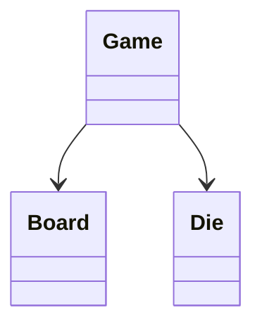

# Snake and Ladder

Model atomic turns on a validated board with single jumps, exact winning landings, and an injectable die.

LLD stages: [Requirements](#requirements) → [Core entities](#core-entities) → [API or system interface](#api) → [High-level design](#high-level-design) → [Deep dives](#deep-dives).

## 1. Requirements
{: #requirements }

### Functional requirements

Support two to eight players on numbered cells 1 through N, initially at position 0. A six-sided die advances the active player. Winning requires an exact landing on N; overshooting leaves the token unchanged but consumes the turn. Six grants no extra turn.

### Non-functional and execution constraints

Concurrent callers share one in-memory engine. Each turn takes O(1) time after board validation. Invalid input or a failed die sample must leave the game unchanged.

### Out of scope

Exclude multiplayer transport, saved games, betting, and animation. Multiple tokens may occupy one cell. There is no collision penalty or chained jumping: landing on a jump follows that single edge. To avoid surprising boards, reject configurations where any jump destination is another jump source.

## 2. Core entities
{: #core-entities }

`Game` owns player order, token positions, active index, version, and winner. `Board` is immutable and owns N and the source-to-destination jump map. `Die` supplies randomness but never mutates the game.

Positions always lie in [0,N]. Jump endpoints lie in [1,N−1], sources are unique, and self-jumps are invalid. Only the active player's token changes during a turn. A winner prevents all subsequent turns.

## 3. API or system interface
{: #api }

`create(playerIds, size, jumps) -> GameSnapshot` rejects duplicate players, invalid counts, size below two, and invalid jump maps with `InvalidConfiguration`. `roll(gameId, playerId, expectedVersion) -> TurnResult` returns the die value, starting position, final position, next player, winner, and new version. Errors are `NotFound`, `WrongTurn`, `StaleVersion`, `Finished`, and `DieFailure`. `get(gameId) -> GameSnapshot` returns a defensive snapshot or `NotFound`. Retrying an already committed version returns `StaleVersion`; callers read the snapshot instead of rolling again blindly.

## 4. High-level design
{: #high-level-design }

`Game` acquires its lock and checks version, terminal status, and active player before consulting `Die`. Require a result from 1 through 6; exceptions or invalid values produce `DieFailure` without consuming the turn. Compute `candidate = position + roll` against `Board` size. On overshoot, keep the old position and do not activate any jump there. Otherwise look up the candidate in the board's jump map and replace it with its destination when present.

Build the complete turn result before publishing mutations. Store the new position, set the winner if it equals N, otherwise rotate the active index modulo player count. Increment the version and release the lock. Board construction scans endpoints and source membership once, so movement never needs a loop over jumps.

## 5. Deep dives
{: #deep-dives }

### Trade-offs and extensions

A map of jumps avoids separate snake and ladder classes because both have identical movement behavior. An optional extra-turn-on-six rule belongs in turn selection, not in the die or board. It must specify whether a winning six ends immediately.

### Concurrency and failure handling

The lock includes die sampling and state publication; use only a local, fast die implementation there. Concurrent same-version requests cannot consume two turns. A die exception may consume randomness but not game state. All games disappear after process failure; deterministic replay would require persisted rolls as well as positions.

### Test cases

On N=20 with jump 3→12, rolling 3 from 0 ends at 12. Rolling 4 from 18 stays at 18 and rotates the turn; rolling 2 wins. Reject jumps 3→8 and 8→15 together. An injected value 7 leaves every field unchanged. Racing identical-version requests yields one accepted turn. A large board with many valid jumps still performs one map lookup per non-overshooting turn.

[Question catalog](../interview-guide.html) · [Article template](interview-template.html)
