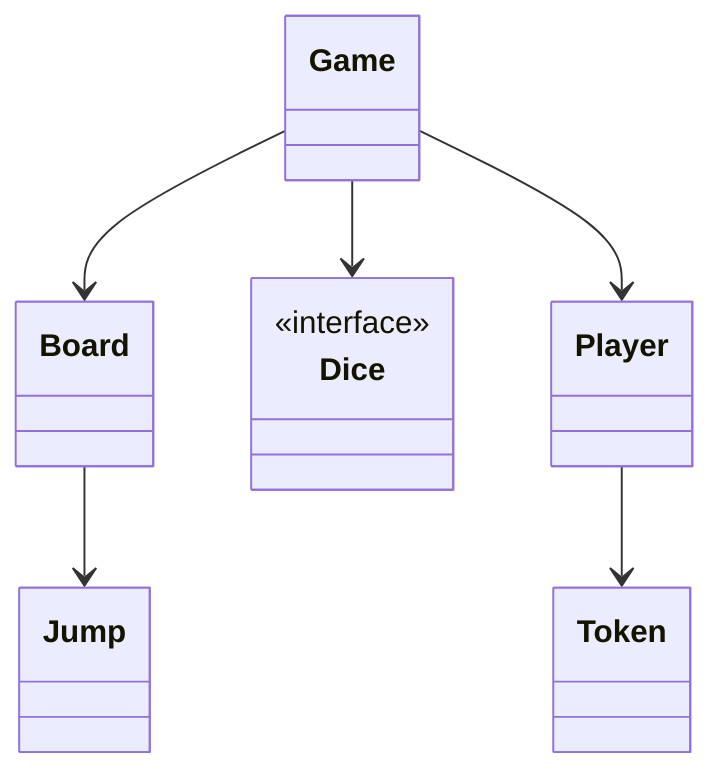
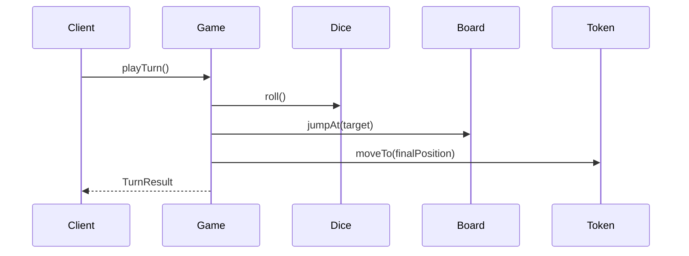
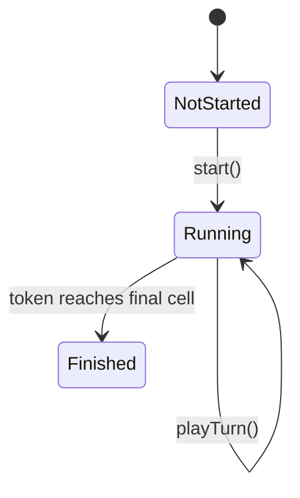
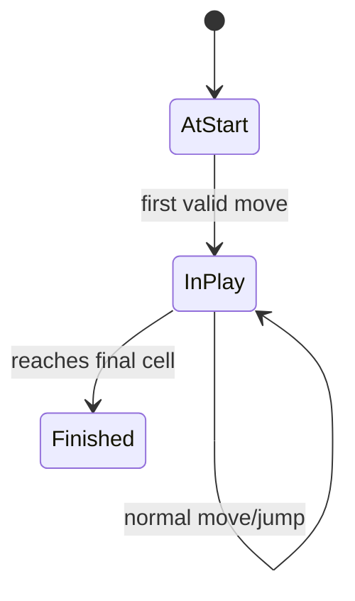

# LLD Walkthrough: Design Snake and Ladder
> Self-contained walkthrough. It shows how to design Snake and Ladder in a 45-minute LLD interview by focusing on the board, dice, token movement, jump handling, and win condition — not a decorative class diagram.

Snake and Ladder looks simple, so candidates overcompensate. They create separate `SnakeCell`, `LadderCell`, `SnakeMoveService`, `LadderMoveService`, and a dozen abstractions before the first player can roll. That is backwards.

The clean design is: roll dice, move token, apply a jump if present, check win, advance turn. Everything else is a follow-up.

---

## Minute 0-7: Clarify and fence the scope

Start by defining the game rules you will implement.

Good questions and reasonable default answers:
- **Board size?** → Classic 1 to 100 cells, but model as configurable `Board(size)`.
- **Players?** → Multiple players, each with one token.
- **Dice?** → One six-sided die by default, but keep dice injectable for tests.
- **Snakes and ladders?** → Model both as a single `Jump(from, to)`.
- **Winning rule?** → Require exact roll to land on final cell.
- **Persistence/UI/network?** → Out of scope; in-memory engine.
Say the fence out loud:
> "I'll design an in-memory multiplayer Snake and Ladder game. In scope: dice roll, token movement, snake/ladder jumps, exact-roll win, and turn rotation. Out of scope: UI animations, persistence, matchmaking, and custom board editors unless asked."

The important modeling choice:
> "Snakes and ladders are the same shape: land on one cell, move to another. I'll model them uniformly as `Jump(from, to)` to avoid duplicate code."

That sentence saves you from half the bloat.

Do not start with:
- `Snake extends Cell`
- `Ladder extends Cell`
- `SnakeService` and `LadderService`
- strategy objects for every square
The board does not need to know why a jump exists. It just returns a jump for a landing cell.

---

## Minute 7-13: Core entities

Keep the responsibility table tight.
| Object | Responsibility (one line) |
|---|---|
| `Game` | Orchestrates turns, dice rolls, movement, jumps, and winner detection. |
| `Board` | Owns the final cell and the jump mapping by start cell. |
| `Cell` | Represents a numbered square on the board. |
| `Jump` | Moves a token from one cell to another; covers both snakes and ladders. |
| `Dice` | Produces roll values; injectable for deterministic tests. |
| `Player` | Owns identity and a token. |
| `Token` | Tracks a player's current cell. |
| `TurnManager` | Chooses current player and advances to the next active player. |
| `GameState` | Captures whether the game is running or finished. |
Nine objects, no inheritance tree. If you need fewer, merge `TurnManager` into `Game`; if you need clearer tests, keep it separate.

Notice what is missing: separate snake and ladder subclasses. You can store `JumpType.SNAKE` or `JumpType.LADDER` for display, but movement logic should not branch into two services.

Concrete model:
```text
class Jump {
  int from
  int to
  JumpType type        // optional: SNAKE or LADDER for UI/explanation
}
```
Rules:
- Snake: `from > to`
- Ladder: `from < to`
- No two jumps should start at the same cell.
- Usually no jump starts on cell 1 or final cell.
Say this out loud:
> "The invariant I care about is one jump per start cell. Once the token lands, the game asks the board for a jump and applies it without caring whether it was a snake or ladder."

That reads as senior because it removes duplicate behavior.

---

## Minute 13-20: The spine (API + varying interfaces)

Define the public methods the client calls.
```text
Game       start(List<Player> players, BoardConfig config)
TurnResult playTurn()                         // roll, move, jump, maybe win
GameState  getState()
BoardView  getBoard()
```
If the client supplies dice rolls, use this variant:
```text
TurnResult playTurn(int roll)                 // useful for tests or replay
```
The key interface:
```text
interface Dice {
  int roll()
}
```
Pattern:
- `Dice` → **Strategy pattern**. `RandomDice` for production, `SeededDice` or `FixedDice` for tests.
Optional extension seam:
```text
interface WinRule {
  MoveDecision decide(int current, int roll, int finalCell)
}
```
Pattern:
- `WinRule` → **Strategy pattern** if the interviewer asks about exact roll vs bounce-back vs allow overshoot.
But do not add it prematurely if exact roll is fixed.

Core method signatures:
```text
class Board {
  int finalCell()
  Optional<Jump> jumpAt(int cellNumber)
  boolean isFinalCell(int cellNumber)
}

class Token {
  int position()
  void moveTo(int cellNumber)
}
```
Say this out loud:
> "`Game.playTurn()` is the spine. It gets the current player, rolls dice, computes tentative position, applies jump if any, checks win, and rotates the turn. If that method is clear, the design is clear."

---

## Minute 20-33: Walk the happy path

Use one player's turn. Keep the sequence diagram small.

Narrate it like code:
- "`Game` asks `TurnManager` for the current player."
- "`Dice` returns a number, usually 1 through 6."
- "`Game` computes `candidate = token.position + roll`."
- "If `candidate` overshoots the final cell and exact roll is required, the token stays put."
- "Otherwise move to candidate, then ask `Board.jumpAt(candidate)`."
- "If there is a jump, move again to `jump.to`."
- "If final position is the last cell, mark winner; else advance turn."
Pseudocode:
```text
playTurn():
  if state == FINISHED: throw GameAlreadyOver

  player = turnManager.current()
  roll = dice.roll()
  start = player.token.position()
  candidate = start + roll

  if candidate > board.finalCell():
    result = TurnResult(player, roll, start, start, "overshoot")
    turnManager.advance()
    return result

  landing = candidate
  jump = board.jumpAt(landing)
  finalPos = jump.map(j -> j.to).orElse(landing)

  player.token.moveTo(finalPos)

  if board.isFinalCell(finalPos):
    state = FINISHED
    winner = player
  else:
    turnManager.advance()

  return TurnResult(player, roll, start, finalPos, jump)
```
Tiny state model:

This is enough. Do not design animations or scoreboards until asked.

Board construction validation:
```text
Board(size, jumps):
  require size > 1
  require every jump.from between 2 and size-1
  require every jump.to between 1 and size
  require no duplicate jump.from
  require jump.from != jump.to
```
You can add:
```text
require snake.from > snake.to
require ladder.from < ladder.to
```
Only if you store the type. Movement does not need the distinction.

Example turn:
```text
Alice at 14
roll = 3
candidate = 17
jumpAt(17) = Jump(17, 7, SNAKE)
Alice moves to 7
next player
```
Say this out loud:
> "The token only mutates after I know the final position. That keeps the turn result easy to log and avoids half-applied moves."

That is a small but meaningful design point.

---

## Minute 33-42: Stretch and edges

Common curveballs and bounded answers:
- **"Need exact roll to win."** Already handled: if `position + roll > finalCell`, token stays. Turn still advances.
- **"What if overshoot should bounce back?"** Add `WinRule` or `MoveRule`; do not rewrite `Game`.
- **"Multiple dice?"** `Dice.roll()` can return the sum; or `CompositeDice` owns several dice.
- **"Roll a six gets another turn?"** Add `TurnPolicy` to decide whether to advance.
- **"Can chains happen: ladder into snake?"** Decide rule. Classic versions usually apply one jump. If asked, loop with a visited set to prevent cycles.
- **"Board has cycles."** Validate jump graph or cap jump application. For first cut, reject cycles at board creation.
- **"Player quits."** `TurnManager` removes inactive players; if one remains, they can be winner or game can continue by rule.
- **"Concurrency?"** In a single in-memory game, serialize `playTurn()` per game instance. The contended resource is the game state.
Optional turn policy:
```text
interface TurnPolicy {
  Player next(Player current, List<Player> players, TurnResult lastTurn)
}
```
Pattern:
- `TurnPolicy` → **Strategy pattern** for "extra turn on six" or "skip player" variants.
But say the boundary:
> "I would introduce `TurnPolicy` only when a second turn rule appears. Until then, modulo index rotation is simpler."

Small state for token:

Edge cases to name quickly:
- dice roll outside allowed range from a custom dice
- jump starts beyond board size
- jump points to itself
- duplicate players
- zero players or one player
- attempt to play after winner exists
- exact-roll overshoot
- jump to final cell wins immediately
Testing list:
```text
fixed dice roll moves token
snake moves token downward
ladder moves token upward
overshoot leaves token in place
exact final cell wins
turn advances after non-winning move
turn does not advance after finished game
```
Do not over-index on algorithms. This game is about state transitions and invariants.

---

## Minute 42-45: Wrap up
> "The design has `Game` as the orchestrator, `Board` as the owner of cells and jumps, `Token` as player position, and `Dice` as the pluggable randomness seam. Snakes and ladders are both `Jump(from, to)`, so movement code is unified. The happy path is roll, move, apply jump, check win, advance turn. Follow-ups like extra turn on six or bounce-back overshoot become small policies."

If you have a few seconds, call out the one lock:
> "If this were served over an API, I would serialize `playTurn()` per game ID so two clients cannot advance the same game concurrently."

---

## How real systems solve this

A production version still starts with the same turn loop: pick current player, roll dice, compute a candidate cell, apply at most the configured jump behavior, decide whether the game finished, then rotate turn. The key is keeping each rule explicit. Exact-roll win, bounce-back overshoot, extra turn on six, and chained jumps should be policies, not hidden branches scattered through `Game`.

The board should treat snakes and ladders uniformly as a jump map. A map from start cell to destination gives O(1) jump lookup and enforces the useful invariant: at most one jump starts from a cell. Whether a jump goes upward or downward is metadata for validation and display; movement only needs `from -> to`.

`Dice` is a Strategy seam for both testing and variants. A fair die, seeded die, fixed die, or loaded die can all implement the same `roll()` method. That keeps deterministic tests from reaching into random state and keeps the game loop honest.

The deeper analytical follow-up is that the board induces a Markov process. If each non-final cell is a transient state and the final cell is absorbing, expected moves can be computed from the absorbing Markov chain using the fundamental matrix `N = (I - Q)^-1`. You do not need that machinery for the LLD implementation, but naming it shows you understand how to analyze board design beyond simulation.

## Reference implementation

This focused Python snippet implements one complete turn: exact-roll overshoot, jump lookup, winner detection, and turn rotation. Randomness is injected through `dice`.

```python
from dataclasses import dataclass

@dataclass
class Player:
    name: str
    position: int = 1

class SnakeLadderGame:
    def __init__(self, size: int, players: list[Player], jumps: dict[int, int], dice):
        if size <= 1 or not players:
            raise ValueError("game needs a board and players")
        for start, end in jumps.items():
            if not (1 < start < size and 1 <= end <= size) or start == end:
                raise ValueError("invalid jump")
        self.size = size
        self.players = players
        self.jumps = jumps
        self.dice = dice
        self.turn = 0
        self.winner: Player | None = None

    def play_turn(self) -> dict:
        if self.winner:
            raise ValueError("game already finished")
        player = self.players[self.turn]
        start = player.position
        roll = self.dice.roll()
        if roll < 1:
            raise ValueError("dice roll must be positive")

        candidate = start + roll
        jump_from = None
        if candidate <= self.size:
            jump_from = candidate if candidate in self.jumps else None
            player.position = self.jumps.get(candidate, candidate)
        final = player.position

        if final == self.size:
            self.winner = player
        else:
            self.turn = (self.turn + 1) % len(self.players)
        return {"player": player.name, "roll": roll, "from": start,
                "to": final, "jump_from": jump_from,
                "winner": self.winner.name if self.winner else None}
```

## Complexity and trade-offs

| Operation | Complexity | Notes |
|---|---:|---|
| Dice roll | O(1) | Strategy decides fairness or determinism. |
| Candidate movement | O(1) | Single arithmetic step. |
| Jump lookup | O(1) average | Map keyed by landing cell. |
| Turn rotation | O(1) | Modulo index when all players remain active. |
| Expected-move analysis | Matrix operation | Uses absorbing Markov chain math, not the live turn loop. |

- A jump map is simpler than `SnakeCell`/`LadderCell` subclasses and makes validation centralized.
- Applying one jump keeps the turn easy to reason about; chained jumps need a visited set or cycle rejection.
- Exact-roll overshoot is a rule choice. Keep it explicit so bounce-back or allow-overshoot variants can replace it.
- Markov analysis is valuable for board balancing, but it should remain offline from the interactive game engine.

## Further reading

- [Strategy](https://refactoring.guru/design-patterns/strategy) — dice, win rules, and turn policies are clean Strategy seams.
- [State](https://refactoring.guru/design-patterns/state) — useful vocabulary for NotStarted, Running, and Finished transitions.
- [Absorbing Markov chain](https://en.wikipedia.org/wiki/Absorbing_Markov_chain) — mathematical basis for expected moves to finish.
- *Head First Design Patterns* — Freeman & Robson — approachable treatment of Strategy for interview explanations.

## What separated a pass from a fail here
- You modeled snakes and ladders uniformly as `Jump`, avoiding duplicate code.
- You made `playTurn()` the spine and walked it end to end.
- You used `Dice` as a Strategy seam, which makes tests deterministic.
- You handled exact-roll overshoot without inventing a rules framework too early.
- You named bounded follow-ups instead of turning a simple game into a platform.
That is the whole design: one turn loop, one board invariant, one randomness seam, and no ceremony.
