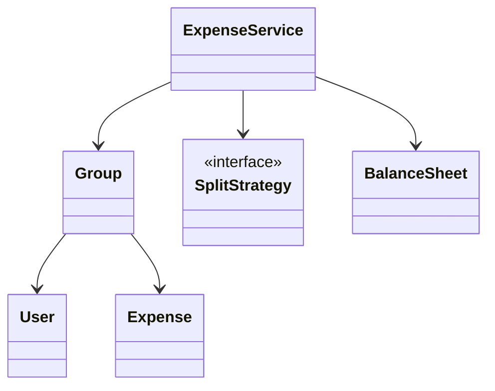
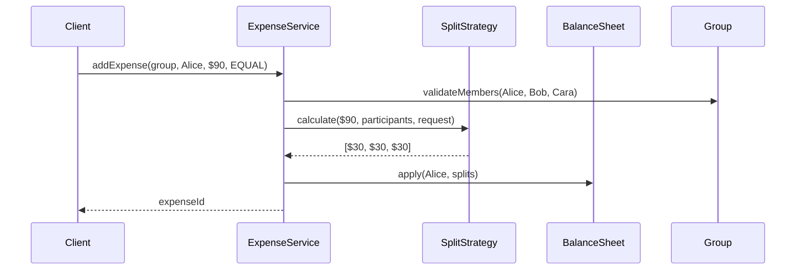
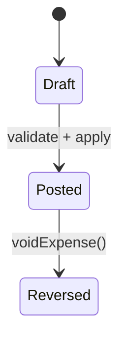

# LLD Walkthrough: Design Splitwise / Expense Sharing

> Self-contained walkthrough. This is how to talk through an expense-sharing LLD without disappearing into graph theory, payment rails, or a 30-table accounting schema.

Splitwise looks like a money problem, but the interview is usually an object-collaboration problem. The trap is to spend the whole round proving a minimum-cash-flow algorithm. That is a nice follow-up, not the core product. The core product is: someone records an expense, the system validates splits, updates balances, and can answer "who owes whom?"

Keep saying that out loud. If an object does not help add an expense or read balances, it probably does not belong in the first model.

---

## Minute 0-7: Clarify and fence the scope

Do not start with "we need a graph." Start by shrinking the product.

Good questions and reasonable defaults:

- **Primary flow?** → "A user adds an expense to a group; the app updates what each person owes."
- **Split types?** → Equal, exact amount, and percentage. Keep them behind one split interface.
- **Settlement?** → Show balances and optionally suggest simplified settlements. Do not implement real payments.
- **Currency?** → Single currency for the interview. Mention multi-currency as out of scope.
- **Persistence/distribution?** → Assume single process/domain model unless asked otherwise.

Say the fence out loud:

> "In scope: users, groups, adding expenses, equal/exact/percent splits, pairwise balances, and reading who owes whom. Out of scope: bank transfers, multi-currency FX, recurring bills, notifications, and full audit/accounting compliance. I will make split calculation pluggable and treat debt simplification as a nice-to-have follow-up."

That last sentence matters. It stops the classic rabbit hole: building a perfect settlement optimizer before you have even added one expense.

A senior answer also states the invariant early:

> "For every expense, the split amounts must sum to the paid amount after rounding. If they do not, I reject or adjust deterministically before touching the ledger."

That is the domain in one sentence.

---

## Minute 7-13: Core entities

Underline nouns, then assign one responsibility each. Prefer composition over inheritance. A `Group` has users and expenses. An `Expense` has splits. A `SplitStrategy` computes shares.

| Object | Responsibility (one line) |
|---|---|
| `User` | Identity for a participant who can pay, owe, and belong to groups. |
| `Group` | Owns members and groups related expenses together. |
| `Expense` | Immutable record of payer, amount, description, and computed splits. |
| `SplitStrategy` | Converts split input into validated per-user amounts. |
| `Split` | One user's owed share for one expense. |
| `BalanceSheet` | Maintains pairwise net balances between users. |
| `ExpenseService` | Orchestrates expense creation, validation, and ledger update. |
| `SettlementService` | Optionally suggests simplified payments from current balances. |

Eight objects is enough. Do not add `ReceiptImage`, `Comment`, `Like`, `ActivityFeed`, `FriendRequest`, or `PaymentGateway` unless the interviewer asks. They are product features, not the LLD spine.



Keep the diagram small. The point is not to prove every relationship. The point is to show that `ExpenseService` coordinates, `SplitStrategy` varies, and `BalanceSheet` owns balances.

Say this out loud:

> "I am intentionally not creating subclasses for `EqualExpense`, `PercentExpense`, and `ExactExpense`. The expense is the same record; only split calculation varies. That variation belongs behind a strategy."

That is the kind of judgment interviewers notice.

---

## Minute 13-20: The spine (API + varying interfaces)

Start with the methods the client or controller calls. Keep them concrete.

```text
ExpenseId addExpense(
    GroupId groupId,
    UserId paidBy,
    Money total,
    String description,
    SplitRequest splitRequest
)

List<Balance> getBalances(GroupId groupId)
List<Debt>    getDebtsForUser(UserId userId)
List<PaymentSuggestion> simplifyDebts(GroupId groupId)   // optional follow-up
```

Then define the seam where behavior varies:

```text
interface SplitStrategy {
  List<Split> calculate(Money total, List<UserId> participants, SplitRequest request)
}

class EqualSplitStrategy implements SplitStrategy
class ExactSplitStrategy implements SplitStrategy
class PercentSplitStrategy implements SplitStrategy
```

That is the **Strategy pattern**. Equal, exact, and percent are new classes with the same contract. The service does not care which one it receives.

A minimal request shape:

```text
SplitRequest {
  SplitType type              // EQUAL, EXACT, PERCENT
  List<UserId> participants
  Map<UserId, Money> amounts  // exact only
  Map<UserId, Decimal> percents // percent only
}
```

And the ledger-facing model:

```text
Split {
  UserId userId
  Money amountOwed
}

Balance {
  UserId from
  UserId to
  Money amount              // from owes to
}
```

Say this out loud:

> "The public spine is `addExpense` and `getBalances`. The only polymorphism I need up front is split calculation. Debt simplification is a separate read-side service so I do not mix optional graph logic into the core write path."

This prevents algorithm obsession. You have a place for the graph follow-up, but it is not allowed to hijack the model.

---

## Minute 20-33: Walk the happy path

Walk one concrete example. Make the money visible.

> "Alice pays $90 for Alice, Bob, and Cara, equal split. The strategy returns three $30 splits. Alice paid the merchant, so Bob owes Alice $30 and Cara owes Alice $30. Alice's own share does not create a self-debt."

Tiny sequence diagram, five participants:



Now narrate the write path precisely:

```text
addExpense(groupId, paidBy, total, description, request):
  group = groupRepository.get(groupId)
  assert paidBy is a group member
  assert every participant is a group member

  strategy = splitStrategyFactory.forType(request.type)
  splits = strategy.calculate(total, request.participants, request)
  validate sum(splits.amountOwed) == total

  expense = Expense(paidBy, total, description, splits)
  group.addExpense(expense)
  balanceSheet.applyExpense(expense)
  return expense.id
```

The interesting method is `applyExpense`:

```text
applyExpense(expense):
  for split in expense.splits:
    if split.userId == expense.paidBy:
      continue
    increaseDebt(from = split.userId, to = expense.paidBy, amount = split.amountOwed)
```

Pairwise netting keeps reads simple. If Bob already owed Alice $10 and Alice later owes Bob $4, store the net as Bob owes Alice $6. You can implement that with a normalized key `(minUser, maxUser)` plus signed amount, or with a map from debtor to creditor. State one and move on.

Say this out loud:

> "The balance sheet is the source of truth for current net debts. Expenses are audit records; balances are derived state updated on each expense. If I needed stronger audit guarantees, I would rebuild balances from expenses, but for the interview I keep both and update atomically."

That is a staff-level answer: you name the trade-off without redesigning the system.

For reading balances:

```text
getBalances(groupId):
  return balanceSheet.listNonZeroBalances(groupId)
```

Example output:

```text
Bob  owes Alice $30
Cara owes Alice $30
```

Keep it boring. Boring is correct.

---

## Minute 33-42: Stretch and edges

Common curveballs and bounded answers:

- **"Simplify debts."** Treat current balances as a graph. Compute each user's net amount, put debtors in one list and creditors in another, then greedily match the smallest remaining absolute amount. This gives good payment suggestions. It is optional and separate from `addExpense`; do not derail into minimum-cash-flow proofs.

```text
simplifyDebts(group):
  net[user] = incoming[user] - outgoing[user]
  debtors = users with net < 0
  creditors = users with net > 0
  while both lists non-empty:
    amount = min(abs(debtor.net), creditor.net)
    emit debtor pays creditor amount
    adjust both nets
```

- **"Equal split has rounding leftovers."** Use integer minor units, not floating point. For $100.00 split three ways, assign 3334 cents to one deterministic user and 3333 to the others. The invariant is still that splits sum exactly to the total.
- **"Self-payment?"** If the payer is the only participant, create the expense record but no debt edges. If the payer is also in a multi-person split, skip only the payer's own share when updating debts.
- **"Exact split does not add up."** Reject before creating the expense. Do not "fix" user-entered exact amounts silently.
- **"Percent split totals 99.999 due to decimals."** Accept only basis points or decimal percentages that normalize to 100%, then convert to cents with deterministic rounding.
- **"Can someone outside the group be in a split?"** No for this scoped design. If required later, add guests explicitly as group members with limited identity.
- **"Concurrent expenses."** The contended resource is the `BalanceSheet` rows for a group/user pair. Use a per-group lock or transactional update with row-level locks. Pick the per-group lock for a single-process LLD and move on.

A tiny state diagram is natural for the expense lifecycle:



Notice what we did not do: no payment gateway, no social feed, no minimum-settlement proof, no 15 ledger tables. Every follow-up either becomes a new strategy or a small service next to the spine.

---

## Minute 42-45: Wrap up

> "The model has eight core objects. `ExpenseService` is the public entry point, `SplitStrategy` handles equal/exact/percent variation, and `BalanceSheet` owns current pairwise debts. Adding an expense validates members, computes splits that sum exactly to the total, stores an expense, and updates net balances. Debt simplification is an optional read-side service using a greedy debtor/creditor match. Next I would add persistence transactions and tests for rounding."

That is the ending you want: small model, working write path, clean seam, named edges.

---

## What separated a pass from a fail here

- You **did not turn Splitwise into a graph-theory interview**. Simplification stayed optional.
- You made the split variants explicit with the **Strategy pattern**, so every new split type is a new class.
- You protected the money invariant: **all splits sum to the total** using integer cents and deterministic rounding.
- You handled self-payment and exact-split validation in the core flow, not as afterthoughts.
- You kept balances as a focused responsibility, so `ExpenseService` orchestrates instead of becoming a god object.

The pass is not a clever algorithm. The pass is a reliable expense write path with clean variation points.
