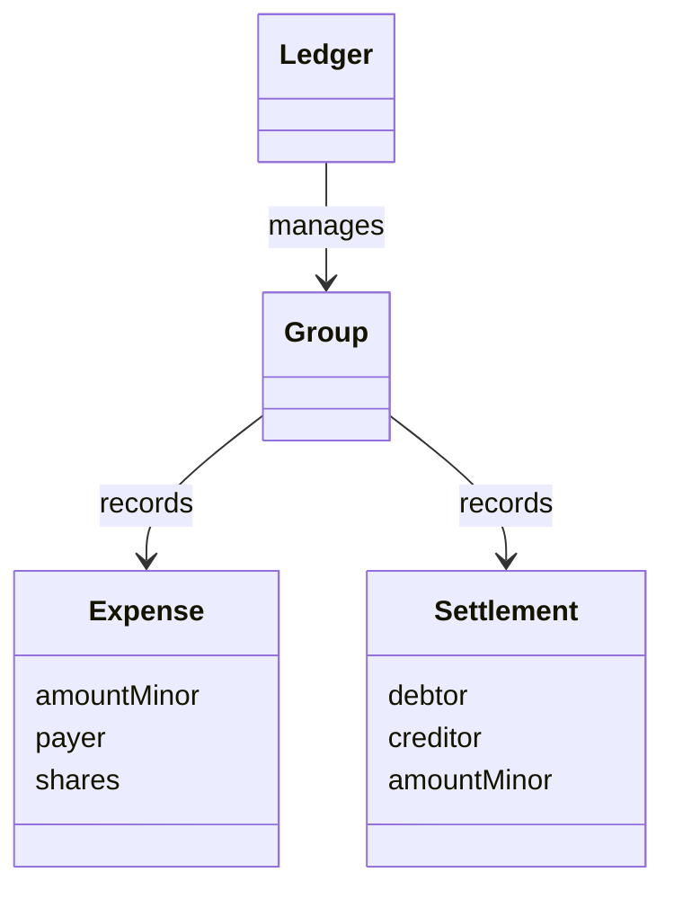

# Design an Expense-Sharing Ledger

Record exact expense splits and settlements in a durable ledger whose member balances always sum to zero.

LLD stages: [Requirements](#requirements) → [Core entities](#core-entities) → [API or system interface](#api) → [High-level design](#high-level-design) → [Deep dives](#deep-dives).

## 1. Requirements
{: #requirements }

### Functional requirements

Record expenses, equal or exact splits, net balances, and settlements. Each group uses one currency; amounts are checked integer minor units, never floating-point values.

### Non-functional and execution constraints

One process handles concurrent requests through a durable transactional repository. An expense with P participants costs O(P), apart from deterministic sorting at O(P log P). Append records and update their balance projection atomically.

### Out of scope

Exclude currency conversion, bank transfers, editable history, and optimal settlement counts. Recording a settlement asserts that money moved elsewhere; it does not mutate a wallet.

## 2. Core entities
{: #core-entities }

`Ledger` owns group transactions. `Group` owns membership and currency. Immutable `Expense` records the payer and participant shares; immutable `Settlement` records debtor, creditor, and amount. A per-member balance projection is updated with each record.

Positive balance means the group owes the member; negative means the member owes the group. Every expense's shares sum exactly to its amount. Every group balance sum remains zero. Record insertion, idempotency bookkeeping, and projection updates commit together.

## 3. API or system interface
{: #api }

`addExpense(groupId, requestId, payerId, currency, amountMinor, split) -> Expense` accepts `Equal(memberIds)` or `Exact(memberId -> shareMinor)`. Require positive amount, matching currency, nonnegative shares, nonempty unique participants, and existing group members. Return `NotFound`, `InvalidCurrency`, `InvalidSplit`, or `Overflow` without mutation.

`recordSettlement(groupId, requestId, debtorId, creditorId, amountMinor) -> Settlement` requires `amountMinor > 0`, distinct members, a negative debtor balance, a positive creditor balance, and an amount no larger than either outstanding magnitude. Otherwise return `InvalidSettlement`.

`balances(groupId) -> memberBalanceMap` returns a consistent snapshot. Request IDs are unique within a group across operation types. Identical payload retries return the original record; reused IDs with different payloads return `Conflict`.

## 4. High-level design
{: #high-level-design }

`Ledger` opens the group's transaction and checks the normalized request ID before current balances or membership, so retries return their original result after state changes. For new work, it validates against `Group` membership and currency before constructing an immutable `Expense` or `Settlement` and its balance deltas.

For equal splits, sort member IDs, assign `amount / P` to each, then give one additional minor unit to the first `amount % P` members. For exact splits, verify the sum with checked arithmetic.

Within the group transaction, add the full amount to the payer's balance and subtract each participant's share from that participant. The payer may also be a participant. Append the expense and persist the request result. For settlement, increase the debtor's balance and decrease the creditor's balance by the same amount, then append the settlement.

## 5. Deep dives
{: #deep-dives }

### Trade-offs and extensions

Net settlement suggestions may ask a member to pay someone who never purchased anything for them. Preserve immutable records for explanation. An extension greedily matches sorted debtors and creditors in O(M log M) for M members without claiming a minimal transfer count.

### Concurrency and failure handling

Serialize writes per group, not merely per expense. Concurrent settlements must recheck both balances inside the transaction to prevent overpayment. Durable request records make retries safe after lost responses. No external payment happens inside the lock. If wallet integration is added, use wallet minor-unit amounts and durable idempotent transfer intent; a provider timeout cannot be recorded as either definite success or failure without reconciliation.

### Test cases

- A pays 100 for A, B, C: shares 34, 33, 33; balances 66, −33, −33.
- Exact shares 40 and 50 against amount 100: `InvalidSplit`, no record.
- B settles 33 with A: balances become A=33, B=0, C=−33. Amount −1 instead: `InvalidSettlement`, balances unchanged.
- Retry the original expense ID: balances unchanged, same expense returned.
- Two concurrent settlements of B's full debt: one succeeds, one `InvalidSettlement`.
- USD group, EUR expense: `InvalidCurrency`, no balance changes.

[Question catalog](../interview-guide.html) · [Article template](interview-template.html)
