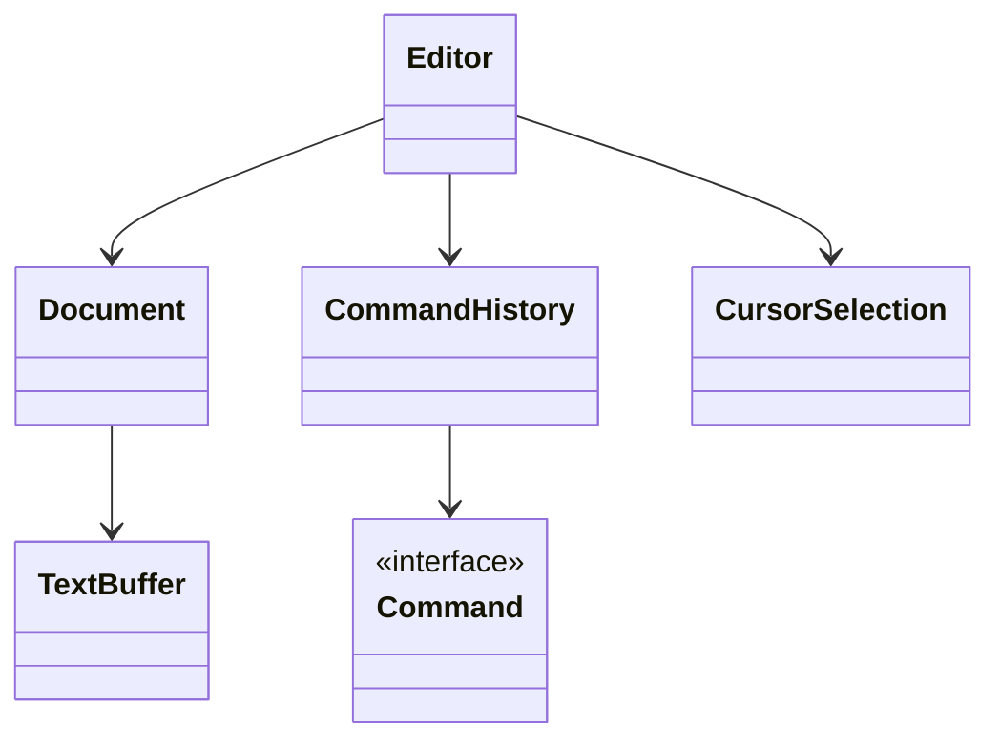
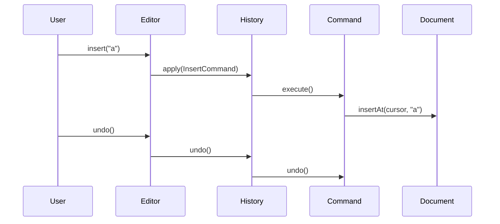
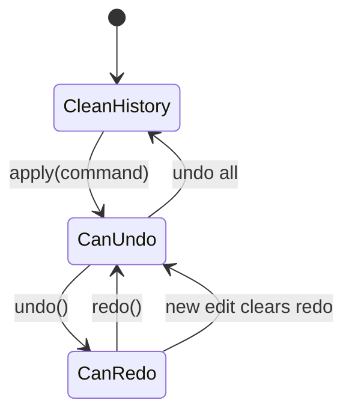

# LLD Walkthrough: Design a Text Editor with Undo and Redo

> Self-contained walkthrough. It designs the undo/redo core of a text editor the way you should in an interview: commands, two stacks, clear mutation ownership, and no detour into building VS Code.

This is a pattern-recognition problem, but not in the shallow sense. The point is not to say "Command pattern" and stop. The point is to make every edit a reversible object, route all document mutations through the editor, and show exactly how redo is invalidated when a new edit arrives.

The trap is the text buffer. Candidates get pulled into gap buffers, ropes, piece tables, Unicode grapheme clusters, and cursor rendering. Name the buffer choice in one line, hide it behind `TextBuffer`, and spend your time on undo/redo behavior.

---

## Minute 0-7: Clarify and fence the scope

Shrink the editor before modeling it:

- **Primary flow?** → Insert text, delete text, undo, redo.
- **Scope of document?** → Single document in memory, no collaborative editing.
- **Selection?** → Support cursor plus optional selection range; formatting is out of scope.
- **Persistence?** → Saving to disk is out of scope; the design focuses on editing state.
- **Buffer implementation?** → Treat it as a `TextBuffer`; mention gap buffer or rope, do not implement it live.

Say the fence out loud:

> "In scope: a single in-memory document, insert/delete edits, cursor/selection updates, undo and redo. Out of scope: rendering, file I/O, syntax highlighting, collaboration, and full Unicode layout. I'll use the Command pattern so every edit knows how to execute and undo itself. OK?"

That scope is small enough to finish and rich enough to show design skill.

Add the senior caveat:

> "The buffer representation matters in a real editor, but it is not the interview's core. I'll hide gap-buffer or rope details behind `TextBuffer` and keep the undo model independent of that choice."

Now you are solving the right problem.

---

## Minute 7-13: Core entities

Start from responsibilities, not from UI widgets.

| Object | Responsibility (one line) |
|---|---|
| `Editor` | Public entry point; converts user actions into commands and updates cursor state. |
| `Document` | Owns the text buffer and document-level metadata. |
| `TextBuffer` | Performs low-level insert/delete operations at positions. |
| `Command` | Reversible edit with `execute()` and `undo()`. |
| `InsertCommand` | Inserts text and can remove exactly what it inserted. |
| `DeleteCommand` | Deletes a range and stores deleted text for undo. |
| `CommandHistory` | Owns undo and redo stacks and enforces redo invalidation. |
| `CursorSelection` | Tracks cursor position and optional selected range. |

Eight objects. Composition, not inheritance: `Editor` has a `Document`, `Document` has a `TextBuffer`, `CommandHistory` has command stacks.



Keep `InsertCommand` and `DeleteCommand` off the first diagram if space is tight. Say them verbally. The interface matters more than drawing every concrete command.

---

## Minute 13-20: The spine (API + varying interfaces)

Define the client-facing editor methods:

```text
void insert(String text)
void deleteSelectionOrPreviousChar()
void deleteRange(int start, int end)
void undo()
void redo()
String getText()
```

Now the core interface:

```text
interface Command {
  void execute()
  void undo()
  boolean canMergeWith(Command next)
  Command merge(Command next)
}
```

Name the pattern:

- `Command` is the **Command pattern**. Each edit is an object that knows how to apply and reverse itself.
- `CommandHistory` is not a pattern trophy; it is the owner of two stacks.

Concrete commands:

```text
class InsertCommand implements Command {
  Document doc
  int position
  String text
  CursorSelection before
  CursorSelection after
  execute(): doc.buffer.insert(position, text)
  undo():    doc.buffer.delete(position, position + text.length)
}

class DeleteCommand implements Command {
  Document doc
  int start
  int end
  String deletedText
  CursorSelection before
  CursorSelection after
  execute(): deletedText = doc.buffer.delete(start, end)
  undo():    doc.buffer.insert(start, deletedText)
}
```

`CommandHistory` spine:

```text
class CommandHistory {
  void apply(Command c)   // execute, push undo, clear redo
  void undo()             // pop undo, undo, push redo
  void redo()             // pop redo, execute, push undo
}
```

Say this out loud:

> "All mutations go through commands. If someone edits the buffer directly, undo becomes dishonest, so `TextBuffer` should be package-private or only reachable through `Document` methods used by commands."

That is a staff-level ownership statement.

---

## Minute 20-33: Walk the happy path

Use a tiny sequence diagram for typing one character and undoing it.



Narrate the exact state transitions:

- "Before executing, `InsertCommand` records the cursor/selection state."
- "After executing, it stores the new cursor position so redo can restore the same user-visible state."
- "`CommandHistory.apply` pushes the command onto the undo stack and clears the redo stack."
- "Undo pops from undo, calls `undo()`, and pushes the same command onto redo."

The apply flow:

```text
CommandHistory.apply(command):
  if undoStack.peek().canMergeWith(command):
    merged = undoStack.pop().merge(command)
    undoStack.push(merged)
  else:
    command.execute()
    undoStack.push(command)
  redoStack.clear()
```

In a first cut, you can skip merging and say it comes in stretch. If you include it, be careful: the new command must execute before merging or the merged command must represent both already-applied edits.

The simpler live version is:

```text
apply(command):
  command.execute()
  undoStack.push(command)
  redoStack.clear()
```

Undo/redo:

```text
undo():
  if undoStack.empty(): return
  command = undoStack.pop()
  command.undo()
  redoStack.push(command)

redo():
  if redoStack.empty(): return
  command = redoStack.pop()
  command.execute()
  undoStack.push(command)
```

A state diagram makes redo invalidation obvious:



Walk one concrete delete:

```text
deleteRange(1, 3) on "cats"
  stores deletedText="at"
  execute -> "cs"
  undo -> insert "at" at 1 -> "cats"
```

Say the quiet part:

> "Delete must store the deleted text at execution time. Otherwise undo cannot reconstruct the document after the range is gone."

That sentence usually lands.

---

## Minute 33-42: Stretch and edges

Common curveballs and bounded answers:

- **"Typing every character creates too many undo steps."** Coalesce adjacent `InsertCommand`s typed close together into one undo unit. Use a time window, adjacent positions, and same edit mode. Do not merge across cursor jumps, selection changes, or paste operations.

```text
canMergeWith(next):
  return both inserts
     and this.position + this.text.length == next.position
     and next.timestamp - this.timestamp < 1000ms
```

- **"Redo after a new edit?"** Clear redo on any new command applied after undo. Redo represents an abandoned future; once the user branches, that future is invalid.

- **"Command versus Memento?"** Command stores the inverse operation; memory-cheap for small edits and expressive for operations like delete, paste, replace. **Memento pattern** stores snapshots; simpler and safer for tiny documents or complex operations, but expensive for large documents unless snapshots are incremental.

```text
interface SnapshotStore {
  Snapshot capture(Document d)
  void restore(Document d, Snapshot s)
}
```

- **"Large document?"** Use a rope, piece table, or gap buffer behind `TextBuffer`. The undo model should not care. For huge deletes, `DeleteCommand` storing deleted text is expected; for huge operations, use chunking or snapshots.

- **"Selection delete?"** Convert it to `DeleteCommand(start, end)` and store `CursorSelection before/after`. The command should restore both text and cursor state on undo.

- **"Replace text?"** Either compose `DeleteCommand` + `InsertCommand` into a `CompositeCommand`, or create `ReplaceCommand` that stores old and new text. Composition is cleaner live.

- **"Undo after save?"** Saving is not an undo boundary. Track `lastSavedCommandId` if you need dirty-state detection.

- **"Thread safety?"** Most desktop editors serialize edits on the UI thread. If background tools mutate text, route them through the same command queue. Do not sprinkle locks through commands unless the prompt explicitly asks for concurrent editing.

The anti-pattern to name:

> "I am not going to optimize the rope or handle grapheme clusters live. Those are real editor concerns, but they sit below `TextBuffer`. The LLD signal here is reversible commands and history ownership."

That keeps you out of the rabbit hole.

---

## Minute 42-45: Wrap up

> "The editor has a document with a hidden text buffer, an editor facade that turns user actions into commands, and a `CommandHistory` with undo and redo stacks. Insert and delete are reversible commands. Applying a new command executes it, pushes undo, and clears redo. Undo and redo move the same command between stacks. Coalescing and snapshot alternatives are extensions, not rewrites."

If there is time, name the tests:

```text
- insert then undo restores text and cursor
- delete then undo restores deleted text
- redo reapplies the exact command
- new edit after undo clears redo
- adjacent typing can coalesce into one undo unit
```

End there. More buffer talk will usually make the answer worse.

---

## What separated a pass from a fail here

- You identified the **Command pattern** as the core, then actually used it with `execute()` and `undo()`.
- You kept history honest with **two stacks** and explicit redo invalidation.
- You stored enough inverse data: inserted range, deleted text, and cursor/selection state.
- You mentioned **Memento** as an alternative with a clear trade-off, not as a competing rewrite.
- You avoided the buffer rabbit hole by hiding gap buffer, rope, or piece table behind `TextBuffer`.

That is the whole game: reversible edits, owned mutation, two stacks, bounded buffer talk.
