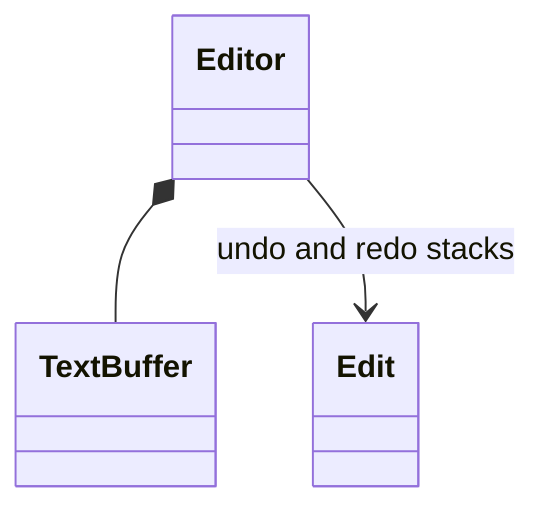

# Text Editor with Undo and Redo

Implement reversible text replacement with explicit Unicode indexing, selection restoration, and bounded undo and redo history.

LLD stages: [Requirements](#requirements) → [Core entities](#core-entities) → [API or system interface](#api) → [High-level design](#high-level-design) → [Deep dives](#deep-dives).

## 1. Requirements
{: #requirements }

### Functional requirements

Edit one document, move a cursor or selection, undo, and redo. Positions count Unicode scalar values, not bytes or grapheme clusters. Selections use half-open ranges [start,end).

### Non-functional and execution constraints

A single event-loop thread executes all operations; other threads submit work to that loop. Limit text to one million scalars and retained history payload to eight MiB of UTF-8 bytes.

### Out of scope

Exclude rendering, persistence, collaboration, formatting, grapheme-aware movement, and command grouping. Combining characters may be selected separately. Cursor-only movement is not undoable.

## 2. Core entities
{: #core-entities }

`Editor` exclusively owns the scalar buffer, current selection, version, undo stack, and redo stack. An immutable `Edit` stores replacement offset, removed text, inserted text, and selections before and after editing.

Selection endpoints always lie in [0,length]. Undo and redo entries describe the exact current history branch. Moving an entry between stacks does not duplicate its stored text. Only the editor can mutate the buffer.

## 3. API or system interface
{: #api }

`replace(start, end, text, expectedVersion) -> Snapshot` inserts when start=end and deletes when text is empty. Errors are `InvalidRange`, `InvalidUnicode`, `DocumentLimit`, `HistoryLimit`, or `StaleVersion`. A zero-length replacement of empty text is a no-op preserving history and version.

`select(start, end, expectedVersion) -> Snapshot` validates the range and increments version when selection changes. `undo(expectedVersion)` and `redo(expectedVersion)` return snapshots or `EmptyHistory`/`StaleVersion`. `snapshot()` returns immutable text, selection, and version. Repeating a committed mutation with the old version fails; versions increase even when undo restores earlier text.

## 4. High-level design
{: #high-level-design }

On the event loop, `Editor` validates version, range, Unicode, resulting length, and the proposed edit's retained byte cost before mutating `TextBuffer`. Reject an edit larger than the entire history budget rather than silently making it irreversible. Capture removed scalars and the old selection in an `Edit`; its new selection is a cursor immediately after inserted text.

Allocate candidate text and the edit record. On commit, replace the range, clear redo, evict oldest undo records until the new record fits, push it, and increment version. Eviction establishes the oldest reachable undo boundary.

Undo replaces the inserted range with removed text, restores the prior selection, and transfers the record to redo. Redo performs the forward replacement and restores the recorded post-edit selection. Allocate candidate text before moving either stack entry so failure leaves the editor unchanged.

## 5. Deep dives
{: #deep-dives }

### Trade-offs and extensions

A scalar array makes indexing unambiguous but replacement costs O(document length) through copying and shifting. A piece table can reduce copying later while preserving the replacement contract. Typing coalescence should merge only adjacent compatible edits and preserve the first pre-edit selection.

### Concurrency and failure handling

Event-loop confinement protects text and both history stacks together. Expected versions reject queued stale operations. Allocation errors leave state unchanged. The document and history vanish on process failure; adding save support does not automatically make undo history durable.

### Test cases

Starting with `cat`, replace [1,2) by `oo` to obtain `coot`; undo restores `cat`, redo restores `coot`. After undo, inserting `!` clears redo. Deleting [3,3) changes nothing. In `A😀B`, deleting [1,2) yields `AB`. An invalid range preserves both stacks. An over-budget edit is rejected before text changes. Verify retained payload never exceeds eight MiB after repeated edits and undo/redo.

[Question catalog](../interview-guide.html) · [Article template](interview-template.html)
