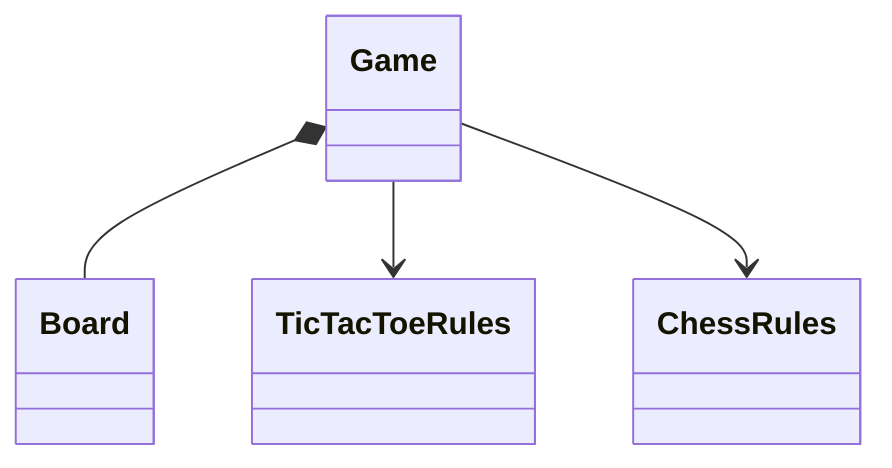

# Tic-Tac-Toe and Chess

Separate board ownership from game rules to validate atomic moves in tic-tac-toe and a precisely scoped chess variant.

LLD stages: [Requirements](#requirements) → [Core entities](#core-entities) → [API or system interface](#api) → [High-level design](#high-level-design) → [Deep dives](#deep-dives).

## 1. Requirements
{: #requirements }

### Functional requirements

Implement a complete two-player, 3×3 tic-tac-toe game and a separate 8×8 chess variant. Enforce turn order, legal moves, and terminal outcomes. Moves return immutable snapshots; invalid moves never change state.

### Non-functional and execution constraints

Both run in one process with concurrent callers serialized per game. Tic-tac-toe validation uses constant work. Chess may enumerate candidate moves rather than optimize search.

### Out of scope

Exclude AI, clocks, networking, and persistence. The chess variant excludes castling, en passant, repetition, fifty-move claims, and dead-position adjudication; it is not tournament-complete chess. Ordinary movement, capture, promotion, king safety, checkmate, and stalemate remain required. Standard-chess support would need the excluded rules and additional history.

## 2. Core entities
{: #core-entities }

`Game` owns the board, active color, status, and monotonically increasing version. Immutable pieces contain color and kind. Separate rule objects inspect positions without mutating live state.

Tic-tac-toe places exactly one mark per accepted turn. Chess preserves exactly one king per color: kings are never captured. Terminal games reject further moves.

## 3. API or system interface
{: #api }

`create(kind) -> Snapshot` creates the standard starting position. `place(gameId, player, row, column, expectedVersion) -> Snapshot` is tic-tac-toe-only. `move(gameId, player, from, to, promotion?, expectedVersion) -> Snapshot` is chess-only. Errors are `NotFound`, `WrongGame`, `StaleVersion`, `WrongTurn`, `IllegalMove`, or `Finished`. Promotion requires queen, rook, bishop, or knight on the last rank; elsewhere it must be absent. `get(gameId)` returns a snapshot or `NotFound`. Repeating a successful command with its old version returns `StaleVersion`, not another move.

## 4. High-level design
{: #high-level-design }

`Game` locks and checks identity, version, turn, and status, then delegates position checks to the rule object for its kind. `TicTacToeRules` checks bounds and vacancy; the game creates a candidate board with the new mark, and the rules check eight winning lines followed by board fullness.

`ChessRules` first checks coordinates, source ownership, destination occupancy, and piece-specific geometry. Sliding pieces require clear paths. Pawns require direction, initial-rank double-step clearance, diagonal enemy captures, and promotion. Reject friendly captures and king captures. Then simulate the move and reject positions exposing the moving king to attack. Attack detection uses pawn diagonals, king adjacency, and piece attack geometry, not recursive legal-move generation. Check detection alone does not validate movement.

Enumerate the opponent's legal moves using those same checks. No legal move means checkmate when its king is attacked, otherwise stalemate. Commit the candidate board, next turn, result, and incremented version together.

## 5. Deep dives
{: #deep-dives }

### Trade-offs and extensions

Copying a small board simplifies rollback and king-safety checks. Add castling only with explicit king/rook movement rights and checks for attacked transit squares; a generic board abstraction cannot supply those rules.

### Concurrency and failure handling

The game lock covers validation through commit, including terminal detection. Two commands with the same version cannot both succeed. Snapshots cannot expose mutable arrays. Process failure loses games; reconnect recovery is not promised.

### Test cases

Tic-tac-toe placements X(0,0), O(1,0), X(0,1), O(1,1), X(0,2) produce X's win. Occupied squares leave the version unchanged. Chess rejects a rook jumping a pawn, a pinned piece exposing its king, and adjacent kings. Promotion without a kind fails. A no-check position with no legal moves is stalemate. Concurrent same-version moves yield one success. Verify fixed board sizes and bounded candidate enumeration.

[Question catalog](../interview-guide.html) · [Article template](interview-template.html)
