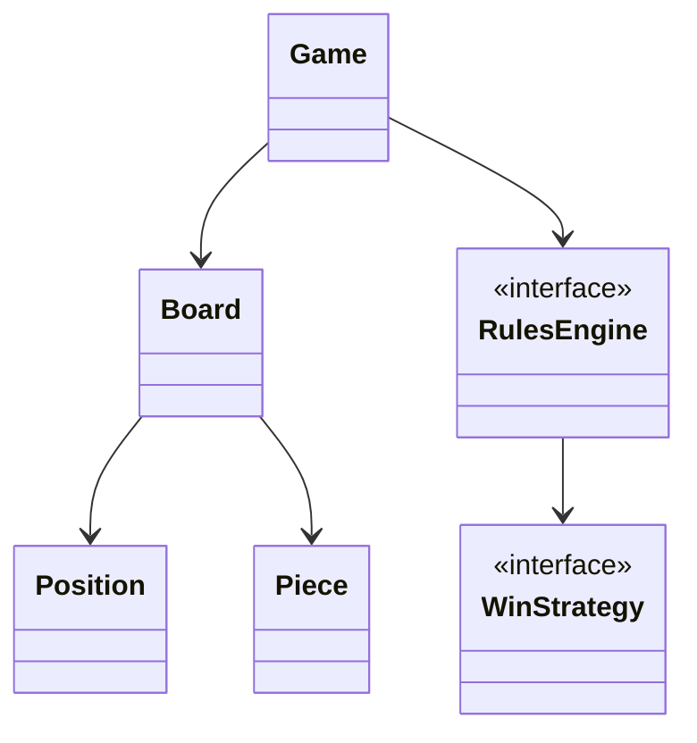
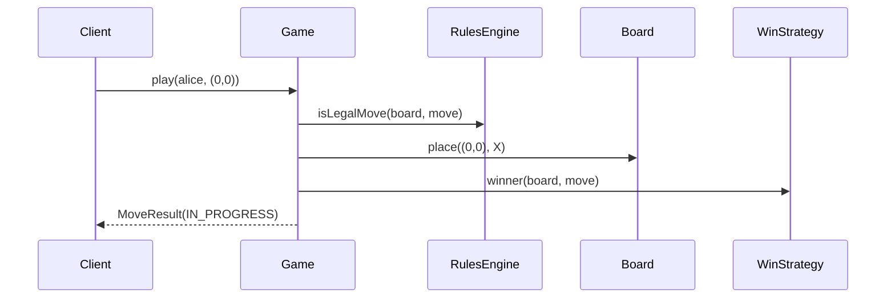
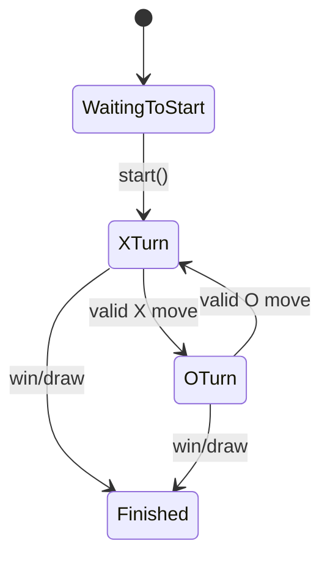

# LLD Walkthrough: Design Tic-Tac-Toe and Chess Board Modeling
> Self-contained walkthrough. It shows how to design a small board-game engine under interview pressure: finish Tic-Tac-Toe end to end, then generalize the modeling shape toward Chess without pretending you can implement all chess rules live.

Board games are a trap because they look like pure object modeling and quietly turn into an algorithm contest. A strong candidate does **not** draw every chess piece, every rule, and a minimax engine. A strong candidate says: model the **board**, the **turn loop**, and the **win/rules seam**. Then stop when the scope stops.

The senior move is to make Tic-Tac-Toe work completely, then show how the same skeleton becomes Chess board modeling with a `MoveValidator` seam.

---

## Minute 0-7: Clarify and fence the scope

Do not start with `King extends Piece`. Start by shrinking the problem.

Good questions and reasonable default answers:
- **Primary game?** → Implement Tic-Tac-Toe fully: place marks, alternate turns, detect win/draw.
- **Chess expectation?** → Generalize board and piece modeling only; show one piece move validation seam.
- **AI/minimax?** → Out of scope. This is LLD, not game theory.
- **Persistence/networking/UI?** → Out of scope. Assume in-memory game engine.
- **Move legality depth?** → For Tic-Tac-Toe, complete. For Chess, one validator example, not full rules.
Say the fence out loud:
> "I'll fully design Tic-Tac-Toe: board, players, moves, turn loop, row/column/diagonal win checks. Then I'll show how the same model generalizes to an 8x8 Chess board using composition-based movement strategies. I will not implement castling, en passant, check/checkmate, or AI search in 45 minutes."

That last sentence is the pass signal. It proves you know what **not** to build.

Anti-pattern to avoid:
- Do not build a 30-class chess hierarchy.
- Do not implement minimax.
- Do not model every historical chess edge case.
- Do not let "generic board game framework" swallow the concrete game.
The spine is simple:

1. Board owns cells.
2. Game owns turn order and state.
3. Rules decide whether a move is legal and whether the game is over.

---

## Minute 7-13: Core entities

Use responsibilities, not inheritance, as the first cut.
| Object | Responsibility (one line) |
|---|---|
| `Game` | Orchestrates turns, accepts moves, and transitions game state. |
| `Board` | Owns a grid of cells and reads/writes pieces or marks by position. |
| `Position` | Immutable row/column coordinate. |
| `Cell` | Holds zero or one piece/mark at a position. |
| `Player` | Owns identity and assigned mark/color. |
| `Move` | Describes a player's attempted action from/to or position. |
| `Piece` | Represents a mark or chess piece with owner and type. |
| `RulesEngine` | Validates moves and detects terminal states. |
| `WinStrategy` | Checks Tic-Tac-Toe win conditions. |
Nine objects is already enough. If you add `Diagonal`, `Row`, `Column`, `Square`, `BoardPrinter`, and `GameHistory` before the happy path works, you are over-modeling.

Keep the diagram small. The interviewer wants to see the collaboration, not a taxonomy.

For Tic-Tac-Toe, `Piece` can be an enum-like mark:
```text
enum Mark { X, O }
```
For Chess, `Piece` becomes data plus behavior seam:
```text
class Piece {
  PieceType type
  Color color
  MovementStrategy movement
}
```
Say this out loud:
> "I prefer composition here. A rook is not interesting because it inherits from `Piece`; it is interesting because it has a movement rule. Movement varies, so I put that behind a strategy."

That prevents the classic `Pawn extends Piece` inheritance trap where every special case turns into overrides and duplicated board logic.

---

## Minute 13-20: The spine (API + varying interfaces)

Define the client-facing methods first.

For Tic-Tac-Toe:
```text
Game       start(Player x, Player o)
MoveResult play(Player p, Position pos)      // place mark, advance state
GameState  getState()
BoardView  getBoard()
```
The important interfaces:
```text
interface RulesEngine {
  boolean isLegalMove(Board board, Move move, GameState state)
  GameOutcome evaluate(Board board, Move lastMove)
}

interface WinStrategy {
  Optional<Player> winner(Board board, Move lastMove)
}
```
Patterns:
- `WinStrategy` → **Strategy pattern**. A 3x3 rule, 4-in-a-row rule, or Gomoku-style rule can swap in.
- `RulesEngine` → **Strategy pattern** too. Tic-Tac-Toe rules and Chess rules share the same entry point but not the same logic.
For Chess modeling, add one more seam:
```text
interface MoveValidator {
  boolean canMove(Board board, Position from, Position to, Piece piece)
}

interface MovementStrategy {
  List<Position> candidateMoves(Board board, Position from, Piece piece)
}
```
Say this out loud:
> "The API is intentionally boring. The game asks rules whether a move is legal, applies it to the board, then asks rules whether the game ended. That is the turn loop. Everything else hangs off that."

**If the interviewer specifically wants Chess (not the generic skeleton),** don't let "I'll only show one piece" sound evasive. Name the full *legal-move pipeline* even while implementing only part of it: (1) `MovementStrategy` generates geometric candidate moves per piece; (2) `MoveValidator` filters for path-blocking and capture rules; (3) a **king-safety** check rejects any move that leaves your own king in check (simulate the move, ask "is my king attacked?", undo). Special rules — castling, en passant, promotion — are extra validators keyed on board history. Then scope explicitly: "I'll implement `MovementStrategy` for the rook and the king-safety filter to show the pipeline; the rest are more validators in the same shape." That frames the deferral as *architecture*, not avoidance.

Do not add:
```text
calculateBestMove()
undoMoveTree()
detectThreefoldRepetition()
```
Those are real features, but not the 45-minute spine.

---

## Minute 20-33: Walk the happy path

Start with Tic-Tac-Toe because it is complete and demonstrable.

Narrate the state changes:
- "`Game` checks it is Alice's turn."
- "`RulesEngine` checks the target cell is empty and the game is not already over."
- "`Board` mutates exactly one cell."
- "`WinStrategy` checks only lines affected by the last move."
- "`Game` either declares a winner/draw or advances `currentPlayer`."
Simple Tic-Tac-Toe flow:
```text
play(player, pos):
  if state != IN_PROGRESS: throw GameAlreadyOver
  if player != currentPlayer: throw NotYourTurn

  move = Move(player, pos)
  if !rules.isLegalMove(board, move, state): throw IllegalMove

  board.place(pos, player.mark)
  outcome = rules.evaluate(board, move)

  if outcome.isTerminal(): state = outcome.state
  else currentPlayer = next(currentPlayer)

  return MoveResult(board.view(), state, currentPlayer)
```
Win check should be boring:
```text
winner(board, lastMove):
  r = lastMove.pos.row
  c = lastMove.pos.col
  mark = board.get(r, c)

  if all cells in row r are mark: return player
  if all cells in col c are mark: return player
  if r == c and main diagonal is mark: return player
  if r + c == n - 1 and anti diagonal is mark: return player
  return empty
```
That is enough. You do not need a clever counter map unless the interviewer asks for scaling.

Add the turn state only after the happy path is clear:

Now generalize to Chess carefully.

Chess board shape:
```text
Board(8, 8)
Cell(Position fileRank, Optional<Piece>)
Piece(type=KNIGHT, color=WHITE, movement=KnightMovement)
Move(from=e2, to=e4, player=white)
```
One piece validator example:
```text
KnightMovement.candidateMoves(board, from, knight):
  deltas = [(2,1),(2,-1),(-2,1),(-2,-1),(1,2),(1,-2),(-1,2),(-1,-2)]
  return positions inside board where target is empty or occupied by opponent
```
Say this out loud:
> "For Chess, I am showing the modeling seam, not the complete rule engine. Full legal chess includes check detection, pins, castling, en passant, promotion, draw rules, and history-aware validation. That is too much for a 45-minute LLD unless the interviewer explicitly narrows to chess rules."

That is not weakness. That is engineering judgment.

---

## Minute 33-42: Stretch and edges

Common curveballs and bounded answers:
- **"Make Tic-Tac-Toe N x N."** `Board` already has dimensions. Replace fixed 3 with `n`; win strategy checks row/col/diagonal for the last move.
- **"Make it Connect Four."** New `RulesEngine` and gravity-aware `playColumn()` API. Do not mutate the Tic-Tac-Toe method until the interviewer asks.
- **"Add undo."** Store a stack of applied `Move`s; `Board.remove(pos)` and restore `currentPlayer`. Mention it, do not rebuild.
- **"Add Chess."** Keep `Board`, `Position`, `Piece`, `Move`; swap `RulesEngine` and `MovementStrategy`.
- **"Validate checkmate."** Out of scope for first cut. It needs king safety simulation and legal-response enumeration.
- **"Add AI."** Separate service, not part of the domain spine. `MoveSelector` can consume legal moves later.
For Tic-Tac-Toe edge handling:
```text
Illegal if:
  position outside board
  cell already occupied
  wrong player's turn
  game already finished
Draw if:
  board is full and no winner
```
For Chess follow-ups, use small seams:
```text
interface CheckPolicy {
  boolean leavesKingInCheck(Board board, Move move)
}

interface PromotionPolicy {
  Piece promote(Player player, Position at)
}
```
But say the boundary:
> "I would add these as policies only if the interviewer wants deeper Chess. I would not front-load them before the basic move pipeline runs."

The anti-pattern is turning an LLD prompt into a chess engine.

Inheritance trap:
```text
abstract class Piece
  Rook extends Piece
  Bishop extends Piece
  Queen extends Piece
  Pawn extends Piece
```
This looks clean until pawn direction, first move, capture direction, en passant, promotion, and check constraints all leak into subclasses. Prefer:
```text
Piece(type=PAWN, movement=PawnMovement, specialRules=[PromotionPolicy])
```
Composition lets behavior vary without forcing every piece into a deep inheritance hierarchy.

---

## Minute 42-45: Wrap up
> "The model is small: `Game` owns the turn loop, `Board` owns cells, `Move` describes intent, and `RulesEngine`/`WinStrategy` decide legality and terminal state. Tic-Tac-Toe is complete with row, column, and diagonal checks. Chess reuses the board model but swaps in movement strategies and validators. I would explicitly defer full chess rules and AI unless asked."

If you have 30 extra seconds, summarize testing:
- place on empty cell succeeds
- occupied cell fails
- wrong turn fails
- row/column/diagonal wins
- full board draw
- chess knight candidate moves stay inside board
---

## How real systems solve this

Production board-game code usually splits the problem into two layers: a small game-state layer (`Board`, `Move`, `Player`, `GameState`) and a rules layer that answers "is this move legal?" and "did this position end the game?" That is exactly why the interview model should not bury rules inside UI cells. The board stores state; strategies and validators interpret it.

For Tic-Tac-Toe, real correctness does not require scanning the whole board after every move. Maintain running row, column, and diagonal counters per mark. A move at `(r, c)` updates one row counter, one column counter, and maybe one or two diagonal counters; if any absolute counter reaches `n`, that player has won. The turn loop stays simple and win detection becomes O(1) per move.

Chess is the opposite: the visible board is simple, but legal move generation is deep. Engines commonly represent positions with bitboards — 64-bit words keyed by piece type or color — because move generation is dominated by set operations over squares. Human-readable position exchange uses FEN. Search, when added, sits outside the LLD spine: minimax with alpha-beta pruning and transposition tables consumes legal moves; it should not be tangled into `Board.place()`.

The practical chess pipeline is staged: generate candidate moves using per-piece movement strategy, filter illegal captures/path blocks, reject moves that leave the king in check, then apply history-aware rules such as castling, en passant, and promotion. That is why `MovementStrategy` is the right seam even if the live interview only implements one piece.

## Reference implementation

Below is the core Tic-Tac-Toe mechanism: constant-time win detection through counters. It deliberately leaves UI, persistence, and replay outside the class.

```python
class TicTacToe:
    def __init__(self, size: int = 3):
        if size < 3:
            raise ValueError("size must be at least 3")
        self.n = size
        self.board = [[None for _ in range(size)] for _ in range(size)]
        self.rows = {"X": [0] * size, "O": [0] * size}
        self.cols = {"X": [0] * size, "O": [0] * size}
        self.diag = {"X": 0, "O": 0}
        self.anti = {"X": 0, "O": 0}
        self.moves = 0
        self.turn = "X"
        self.winner = None

    def play(self, row: int, col: int) -> dict:
        if self.winner:
            raise ValueError("game already finished")
        if not (0 <= row < self.n and 0 <= col < self.n):
            raise ValueError("position outside board")
        if self.board[row][col] is not None:
            raise ValueError("cell already occupied")

        mark = self.turn
        self.board[row][col] = mark
        self.moves += 1
        self.rows[mark][row] += 1
        self.cols[mark][col] += 1
        if row == col:
            self.diag[mark] += 1
        if row + col == self.n - 1:
            self.anti[mark] += 1

        won = (self.rows[mark][row] == self.n or self.cols[mark][col] == self.n
               or self.diag[mark] == self.n or self.anti[mark] == self.n)
        if won:
            self.winner = mark
        elif self.moves < self.n * self.n:
            self.turn = "O" if mark == "X" else "X"
        return {"winner": self.winner, "draw": not self.winner and self.moves == self.n * self.n}
```

## Complexity and trade-offs

| Operation | Simple scan design | Counter/strategy design |
|---|---:|---:|
| Tic-Tac-Toe move validation | O(1) | O(1) |
| Tic-Tac-Toe win check | O(n) row/column/diagonal scan | O(1) counter update |
| Chess candidate generation | Depends on piece and board scan | Fast with piece strategies; engine-grade bitboards optimize further |
| Memory | Board only | Board plus counters or move metadata |

- Counters make Tic-Tac-Toe faster and easier to test, but they must be updated atomically with the board mutation.
- Composition-based movement strategies avoid a brittle chess inheritance tree, but special rules still need history-aware validators.
- Bitboards are excellent for engines, but they are usually too low-level for the first interview sketch unless performance is explicitly requested.
- FEN is useful at system boundaries: tests, debugging, storage, and engine interop.

## Further reading

- [Strategy](https://refactoring.guru/design-patterns/strategy) — movement rules and win rules vary behind stable game APIs.
- [Factory Method](https://refactoring.guru/design-patterns/factory-method) — useful when constructing piece sets without coupling clients to concrete piece creation.
- [Chess Programming Wiki](https://www.chessprogramming.org/Main_Page) — practical background on bitboards, move generation, minimax, alpha-beta, and transposition tables.
- [Forsyth–Edwards Notation](https://en.wikipedia.org/wiki/Forsyth%E2%80%93Edwards_Notation) — standard textual representation of chess positions.
- *Design Patterns* — GoF — canonical source for Strategy and Factory Method vocabulary.

## What separated a pass from a fail here
- You finished one game end to end instead of half-designing ten games.
- You made the turn loop the spine, not the class hierarchy.
- You used `WinStrategy`, `RulesEngine`, and `MovementStrategy` only where behavior actually varies.
- You called out that full Chess is history-aware and too large for a live LLD unless narrowed.
- You avoided minimax and algorithm theater.
That is the board-game answer interviewers trust: small model, working flow, clear seams, bounded ambition.
